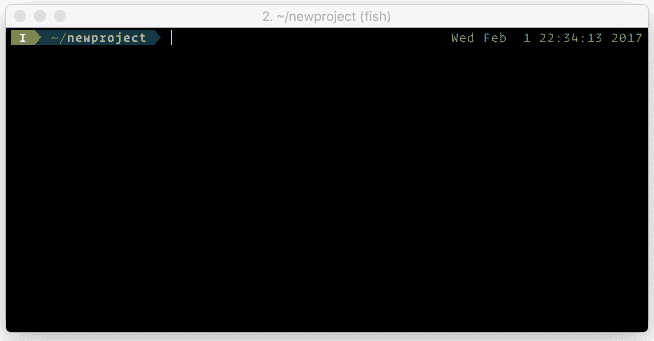
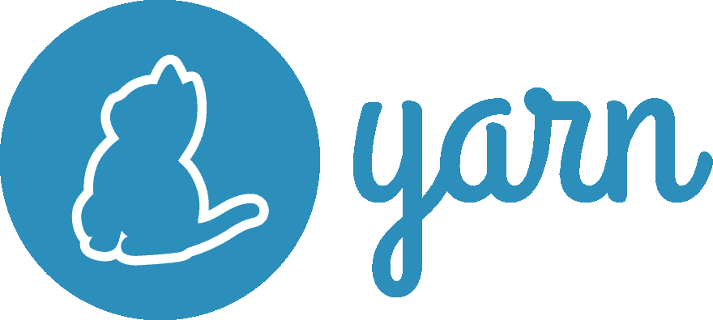

# 2019 年的依赖性管理:综述

> 原文：<https://dev.to/elabftw/dependencies-management-in-2019-a-review-33nn>

[](https://res.cloudinary.com/practicaldev/image/fetch/s--nemFGoXu--/c_limit%2Cf_auto%2Cfl_progressive%2Cq_auto%2Cw_880/https://thepracticaldev.s3.amazonaws.com/i/yjhbf76ednfulqhb6pjk.jpg)

大家好，

这篇文章的目的是，当你编写代码并希望像老板一样管理你对不同语言的依赖时，为你提供一个(大部分)完整和准确的不同解决方案的视图。我们将看到不同的语言有不同的依赖管理方法。

我将会写这 9 种语言:

*   服务器端编程语言（Professional Hypertext Preprocessor 的缩写）
*   计算机编程语言
*   锈
*   去
*   java 描述语言
*   长生不老药
*   偷
*   C#
*   红宝石

# 先说个简单的: **PHP**

## 作曲家

##  [作曲](https://github.com/composer) / [作曲](https://github.com/composer/composer)

### PHP 依赖管理器

<article class="markdown-body entry-content container-lg" itemprop="text">

# PHP 的依赖于编写器的管理

Composer 帮助您声明、管理和安装 PHP 项目的依赖项。

更多信息和文档请参见[https://getcomposer.org/](https://getcomposer.org/)。

[](https://github.com/composer/composer/actions)

## 安装/使用

按照[官方说明](https://getcomposer.org/download/)下载并安装 Composer。

有关用法，请参见文档。

## 包装

在[包装商](https://packagist.org)上找到包装。

## 社区

IRC 频道在 IRC . freenode . org:# composer for users 和#composer-dev for development。

为了提供支持，Stack Overflow 还提供了一个与 [Composer 相关的问题](https://stackoverflow.com/questions/tagged/composer-php)的集合。

请注意，本项目发布时附有[贡献者行为准则](https://www.contributor-covenant.org/version/1/4/code-of-conduct/)，参与本项目及其社区，您同意遵守这些条款。

## 要求

PHP 5.3.2 或更高版本(至少推荐 5.3.4 以避免潜在的错误)

## 作者

*   nils ader Mann |[GitHub](https://github.com/naderman)|[Twitter](https://twitter.com/naderman)|[Nader man @ Nader man . de](https://raw.githubusercontent.com/composer/composer/master/mailto:naderman@naderman.de)|[Nader man . de](https://naderman.de)
*   乔迪·博贾诺| [GitHub](https://github.com/Seldaek) | [推特](https://twitter.com/seldaek) | [j .博贾诺@seld.be](https://raw.githubusercontent.com/composer/composer/master/mailto:j.boggiano@seld.be) | [seld.be](https://seld.be)

另请参见参与该项目的[贡献者](https://github.com/composer/composer/contributors)的列表。

…</article>

[View on GitHub](https://github.com/composer/composer)

Composer 是 PHP 中依赖关系管理的事实上的标准。没有它，今天很难用 PHP 做任何事情。如果你想了解更多关于 composer 的局限性和解决方法(比如使用 PHARs ),我推荐阅读 [Théo Fidry](https://medium.com/@tfidry) 的[这篇文章](https://medium.com/@tfidry/managing-your-dependencies-in-php-321d584441ab)。

## 梨子

##  [梨](https://github.com/pear) / [梨核](https://github.com/pear/pear-core)

### 这是 PEAR 核心文件的权威来源。

<article class="markdown-body entry-content container-lg" itemprop="text">

# PEAR-PEAR 安装程序

[](https://travis-ci.org/pear/pear-core)

## 什么是 PEAR 安装程序？什么是梨？

PEAR 是 PHP 扩展和应用程序库，位于 http://pear.php.net 的。

**PEAR 安装程序**就是这个软件，它包含可执行文件和 PHP 代码，用于从 pear.php.net**下载并安装** PEAR 代码。

PEAR 包含有用的**软件库和应用程序**，如 MDB2(数据库抽象)、HTML_QuickForm (HTML 表单管理)、PhpDocumentor(自动文档生成器)、DB_DataObject(数据访问抽象)，还有数百个在 http://pear.php.net 的[浏览所有可用的包，列表在不断增长和更新，以反映 PHP 语言的改进。](http://pear.php.net)

警告

不要在没有安装 PEAR 的情况下运行它——如果您手动下载了这个 tarball，您必须安装它。使用前请阅读安装说明。

## 证明文件

梨的文件可以在 http://pear.php.net/manual/找到。可以在这个 tarball 中包含的安装文件中找到安装文档。

## 试验

运行…

</article>

[View on GitHub](https://github.com/pear/pear-core)

这是老派球员。它将依赖项安装到系统中。仅当您的发行版没有将扩展打包时才使用它。请注意，您可以使用 composer 来安装 PEAR 包，更多信息请参见 phptherightway 的[这一部分](https://phptherightway.com/#pear)。

PHP 到此为止。我很确定没有其他的 PHP 依赖管理应用程序，但是如果我错了，请在评论区告诉我。

# 第二语言: **Python**

## 皮普

##  [皮帕](https://github.com/pypa) / [皮普](https://github.com/pypa/pip)

### Python 包安装程序

<article class="markdown-body entry-content container-lg" itemprop="text">

# pip——Python 包安装程序

[ ](https://pypi.org/project/pip/) [](https://pip.pypa.io/en/latest)

pip 是 Python 的[包安装程序](https://packaging.python.org/guides/tool-recommendations/)。您可以使用 pip 从 [Python 包索引](https://pypi.org)和其他索引中安装包。

请查看我们的文档，了解如何安装和使用 pip:

*   [安装](https://pip.pypa.io/en/stable/installing.html)
*   [用途](https://pip.pypa.io/en/stable/)

我们定期发布更新，每 3 个月发布一个新版本。在我们的文档中找到更多详细信息:

*   [发行说明](https://pip.pypa.io/en/stable/news.html)
*   [发布流程](https://pip.pypa.io/en/latest/development/release-process/)

2020 年，我们致力于改进 pip 的核心。请[了解更多信息并参加我们的调查](https://pyfound.blogspot.com/2020/03/new-pip-resolver-to-roll-out-this-year.html)来帮助我们做好这件事。

如果您发现了 bug，需要帮助，或者想与开发人员交流，请使用我们的邮件列表或聊天室:

*   [问题跟踪](https://github.com/pypa/pip/issues)
*   [话语通道](https://discuss.python.org/c/packaging)
*   [用户 IRC](https://webchat.freenode.net/?channels=%23pypa)

如果你想去 GitHub 获取源代码，可以看看我们的开发文档，也可以随意进入开发者邮件列表和聊天室:

*   GitHub …

</article>

[View on GitHub](https://github.com/pypa/pip)

pip 是 python 的 goto 包管理器，它有缺点，但却是一个非常流行的安装 Python 依赖项的工具。顺便说一下，你应该[停止使用 sudo pip 安装](https://dev.to/elabftw/stop-using-sudo-pip-install-52mn)。适度使用 pip(和`--user`标志！).

## Venv

管理虚拟环境中项目依赖关系的官方模块，因此不会污染操作系统的其他部分。

## Virtualenv

## [pypa](https://github.com/pypa)/[virtualenv](https://github.com/pypa/virtualenv)

### 虚拟 Python 环境构建器

<article class="markdown-body entry-content container-lg" itemprop="text">

# virtualenv(虚拟环境)

[](https://pypi.org/project/virtualenv)[](https://pypi.org/project/virtualenv)[](https://pypi.org/project/virtualenv)[](http://virtualenv.pypa.io)[](https://gitter.im/pypa/virtualenv)[](https://pypistats.org/packages/virtualenv)[](https://opensource.org/licenses/MIT)[](https://github.com/pypa/virtualenv/actions?query=workflow%3Acheck)[](https://codecov.io/gh/pypa/virtualenv)[](https://github.com/psf/black)

创建隔离的`virtual` python 环境的工具。

*   [安装](https://virtualenv.pypa.io/en/latest/installation.html)
*   [文档](https://virtualenv.pypa.io)
*   [变更日志](https://virtualenv.pypa.io/en/latest/changelog.html)
*   [问题](https://github.com/pypa/virtualenv/issues)
*   [黑桃](https://pypi.org/project/virtualenv)
*   [Github](https://github.com/pypa/virtualenv)

## 行动守则

在 virtualenv 项目的代码库、问题跟踪器、聊天室和邮件列表中互动的每个人都应该遵守 [PSF 行为准则](https://github.com/pypa/.github/blob/main/CODE_OF_CONDUCT.md)。

</article>

[View on GitHub](https://github.com/pypa/virtualenv)

这个项目始于 2011 年，对于隔离项目的依赖关系非常有用。这个项目的一部分现在`venv`在标准 python 库中。所以你可以把`virtualvenv`想象成一个功能更完整的`venv`。

## Pipenv

##  [ pypa ](https://github.com/pypa) / [ pipenv](https://github.com/pypa/pipenv)

### 面向人类的 Python 开发工作流。

<article class="markdown-body entry-content container-lg" itemprop="text">

# Pipenv:面向人类的 Python 开发工作流

[](https://python.org/pypi/pipenv)[](https://python.org/pypi/pipenv)[](https://dev.azure.com/pypa/pipenv/_build/latest?definitionId=16&branchName=master)[T11】](https://python.org/pypi/pipenv)

* * *

[[~ pyup . io 的依赖扫描~ ]](https://pyup.io)

**Pipenv** 是一款工具，旨在将所有包装领域(捆扎机、作曲家、npm、货物、纱线等)的精华带给客户。)到 Python 世界 *Windows 是一等公民，在我们的世界。*

它会自动为您的项目创建和管理一个 virtualenv，并在您安装/卸载软件包时从您的`Pipfile`中添加/删除软件包。它还生成非常重要的`Pipfile.lock`，用于产生确定性的构建。

[](https://gist.githubusercontent.com/jlusk/855d611bbcfa2b159839db73d07f6ce9/raw/7f5743401809f7e630ee8ff458faa980e19924a0/pipenv.gif)

Pipenv 寻求解决的问题是多方面的:

*   不再需要单独使用`pip`和`virtualenv`。他们一起工作。
*   管理一个`requirements.txt`文件[可能会有问题](https://www.kennethreitz.org/essays/a-better-pip-workflow)，所以 Pipenv 使用即将到来的`Pipfile`和`Pipfile.lock`来代替，这对基本用例来说更好。
*   哈希总是无处不在。安全。自动暴露安全漏洞。
*   让你深入了解你的依赖图(例如`$ pipenv graph`)。
*   …

</article>

[View on GitHub](https://github.com/pypa/pipenv)

Pipenv 始于 2017 年初，非常迅速地流行起来。这也是我最喜欢的。它的工作方式非常类似于带有锁文件的`composer`,所有的依赖项都安装在一个特殊的文件夹中。要在环境中运行脚本，您需要在前面加上`pipenv run`。见[我之前的帖子](https://dev.to/elabftw/stop-using-sudo-pip-install-52mn)。注意[官方 Python 文档](https://packaging.python.org/tutorials/managing-dependencies/)推荐使用`pipenv`来管理依赖关系。

有趣的是，上面提到的所有项目都托管在[github.com/pypa](https://github.com/pypa)命名空间、 [Python 包管理机构](https://www.pypa.io/en/latest/)中，这是一个致力于维护 Python 打包者的组织。我觉得在 Python 中有这种改善生态系统的“权威”挺好的。

# 我们要讲的第三种语言是:**铁锈**

## 货物

嗯，这里是一个 nobrainer，因为(AFAIK)只有一个解决方案，就是`Cargo`。

##  [锈-朗](https://github.com/rust-lang) / [货](https://github.com/rust-lang/cargo)

### Rust 包管理器

<article class="markdown-body entry-content container-lg" itemprop="text">

# 货物

Cargo 下载 Rust 项目的依赖项并编译您的项目。

在 https://doc.rust-lang.org/cargo/了解更多信息

## 代码状态

[](https://dev.azure.com/rust-lang/cargo/_build?definitionId=18)

代码文档:[https://docs.rs/cargo/](https://docs.rs/cargo/)

## 安装货物

默认情况下，货物是和 Rust 一起分发的，所以如果你在本地安装了`rustc`,你可能也在本地安装了`cargo`。

## 从源代码编译

Cargo 需要以下工具和软件包来构建:

*   `git`
*   `curl`(在 Unix 上)
*   `pkg-config`(在 Unix 上，用于计算`libssl`头文件/库)
*   OpenSSL 头(仅适用于 Unix，这是 ubuntu 上的`libssl-dev`包)
*   `cargo`和`rustc`

首先，您需要签出这个存储库

```
git clone https://github.com/rust-lang/cargo
cd cargo 
```

已经安装了`cargo`，您可以简单地运行:

```
cargo build --release 
```

## 向 Cargo 添加新的子命令

Cargo 被设计成可以用新的子命令扩展，而不必修改 Cargo 本身。查看 Wiki 页面了解更多详细信息和已知社区开发的子命令列表。

## 放

货物释放与铁锈释放高度一致…

</article>

[View on GitHub](https://github.com/rust-lang/cargo)

货物很棒。货物是狗屎。YMMV。老实说，拥有一个官方的依赖管理工具是非常酷的，至少它节省了你选择一个工具所花费的时间！它为每个项目安装依赖项，但也可以用于系统范围的包。有趣的是，它对配置文件使用了 [TOML](https://github.com/toml-lang/toml) 语法，而其他项目选择了 YAML 或 JSON。

# 让我们继续第四种语言: **Go**

`go get` is 是在 Go 中安装依赖项的方式。但是问题是它将被安装在系统范围内(在$GOPATH 中)。向冲突和重大变更问好，因为你只能有一个版本的库…

这导致了其他方法，如 git 子模块或特定于项目的$GOPATH，许多开发人员对 Go 感到愤怒。

但是，到了 1.11 版本(2018 年 8 月发布)，现在有了一个叫`modules`的东西。查看维基页面，了解更多关于围棋模块的信息。我相信这将是 Go 依赖管理的未来，因为去他妈的全系统依赖。

# 我看到了什么？那是第五种语言吗？是的: **Javascript**

Aaaaahhh，javascript 和依赖项，多么美妙的世界！:)

[](https://res.cloudinary.com/practicaldev/image/fetch/s--OOsH6KGB--/c_limit%2Cf_auto%2Cfl_progressive%2Cq_auto%2Cw_880/https://i.imgur.com/8VCIQhG.png)

## Npm

##  [ npm ](https://github.com/npm) / [ cli](https://github.com/npm/cli)

### JavaScript 的包管理器

<article class="markdown-body entry-content container-lg" itemprop="text">

# npm(1) -一个 JavaScript 包管理器

[](https://travis-ci.org/npm/cli)

## 摘要

这些信息足以让您开始运行。

一旦安装完毕，更多信息将通过`npm help`获得。

## 重要的

您需要版本 6 或更高版本的节点来运行此程序。

要安装在节点 v5 和更早版本上工作的 npm 的旧的**和不支持的**版本，克隆 git repo 并挖掘旧的标签和分支。

默认情况下，npm 被配置为使用 npm，Inc .在[https://registry.npmjs.org](https://registry.npmjs.org)的公共注册中心。国家预防机制公共注册处的使用受 https://www.npmjs.com/policies/terms[的使用条款限制](https://www.npmjs.com/policies/terms)。

您可以配置 npm 使用您喜欢的任何兼容的注册表，甚至可以运行您自己的注册表。在注册表上查看[文档。](https://docs.npmjs.com/misc/registry)

## 超级容易安装

npm 与[节点](https://nodejs.org/en/download/)捆绑在一起。

### Windows 计算机

[获取 MSI](https://nodejs.org/en/download/) 。npm 在里面。

### 苹果麦金塔电脑

[获取 pkg](https://nodejs.org/en/download/) 。npm 是…

</article>

[View on GitHub](https://github.com/npm/cli)

大家都知道`npm`。你在一个`package.json`中定义你的依赖项，并把它们安装在`node_modules`文件夹中。从版本 5 开始，有一个`package-lock.json`允许你有可重复的构建。

## 纱线

##  [ yarnpkg ](https://github.com/yarnpkg) / [纱](https://github.com/yarnpkg/yarn)

### 📦🐈快速、可靠、安全的依赖关系管理。

<article class="markdown-body entry-content container-lg" itemprop="text">

[](https://yarnpkg.com/)

快速、可靠、安全的依赖关系管理

[](https://circleci.com/gh/yarnpkg/yarn)[](https://ci.appveyor.com/project/kittens/yarn/branch/master)[](https://dev.azure.com/yarnpkg/yarn/_build)[](https://discord.gg/yarnpkg)[](http://commitizen.github.io/cz-cli/)

* * *

**快:** Yarn 缓存了它下载过的每一个包，所以它再也不需要下载同一个包了。它几乎可以同时执行所有操作，以最大限度地提高资源利用率。这意味着安装速度更快。

**可靠:**Yarn 使用详细而简洁的锁文件格式和安装操作的确定性算法，能够保证在一个系统上工作的任何安装在另一个系统上都完全一样。

安全: Yarn 在执行代码之前使用校验和来验证每个已安装的包的完整性。

## 特征

*   **离线模式。**如果您之前已经安装了一个软件包，那么您可以在没有互联网连接的情况下再次安装它。
*   **确定性。**无论安装顺序如何，相同的依赖项将以完全相同的方式安装在任何机器上。
*   **网络性能。** Yarn 高效地对请求进行排队，避免请求瀑布，以最大化网络利用率。
*   **网络弹性。**单个…

</article>

[View on GitHub](https://github.com/yarnpkg/yarn)

在`npm`之前，纱线具有可再生的结构。它也不会受到 npm 项目领导有时做出的糟糕决策的影响。它速度快，效果好。这是我选择的工具。

## 凉亭

现在就来吧！我们在题目里说了 2019！忘了`bower`吧。

我不会谈论[包裹](https://parceljs.org/)或[网络包](https://webpack.js.org/)，因为这些是打包员，而不是包裹管理员。

请注意，您可以将`yarn`或`npm`与完全相同的`package.json`一起使用！

关于 javascript 中的包，需要注意的一点是，它已经变得完全疯狂，微库或多或少由一行代码组成，被成千上万的其他包使用。有趣的是，进入一个 Javascript 项目并尝试以下命令:

`ls node_modules | grep '^is*'`

拥有`is-obj`、`is-object`、`is-plain-obj`、`is-plain-object`或类似`isarray`的东西，还有`is-arrayish` …我们真的需要一个包`is-windows`吗，当它所做的只是:

`return process && (process.platform === 'win32' || /^(msys|cygwin)$/.test(process.env.OSTYPE));`？

如果你想为你的项目查看所有这些库的代码，祝你好运。这导致了[左侧面板混乱](https://www.theregister.co.uk/2016/03/23/npm_left_pad_chaos/)。

所以我在这里建议是，在安装一个 javascript 依赖项之前要好好想想，因为它可能会附带数百个这样的小库，总有一天，其中一个会变得恶意(参见 npmjs.com 上的[恶意包)。](https://www.npmjs.com/advisories)

你可以使用 [Depcheck](https://github.com/depcheck/depcheck) 来尝试清理一点你的依赖。

# 我们来说一个更刺激的语言，比如:**仙丹**

谈到依赖管理，Elixir 有点像 Rust:一个完成工作的官方工具: [Mix](https://elixir-lang.org/getting-started/mix-otp/introduction-to-mix.html) (或者对于 Erlang 来说是 [Hex](https://hex.pm) )。这里没什么可说的了，它足够好，让你专注于其他事情。

好吧，那我们还剩下什么？**尼姆**？

Nim 是一种很新很酷的语言，包管理器的名字很可爱< 3: [Nimble](https://github.com/nim-lang/nimble) 。这让我想起了这个人:

[](https://res.cloudinary.com/practicaldev/image/fetch/s--8F6LjZjQ--/c_limit%2Cf_auto%2Cfl_progressive%2Cq_auto%2Cw_880/https://i.imgur.com/Jyn7TSM.png)

这里没有什么可看的，只是使用提供的一个并获得编码！

# 接下来的语言是 **C#**

## Nuget

##  [ NuGet ](https://github.com/NuGet) / [ NuGet。客户](https://github.com/NuGet/NuGet.Client)

### NuGet 的客户端工具——包括 Visual Studio 扩展、命令行工具和 msbuild 支持。(关于 https://github.com/nuget/home/issues 的未决问题)

<article class="markdown-body entry-content container-lg" itemprop="text">

[](https://raw.githubusercontent.com/NuGet/Home/dev/resources/nuget.png)

* * *

# 获取客户端工具

该回购包含以下客户:

*   NuGet CLI
*   [获取 Visual Studio 的包管理器](https://docs.microsoft.com/nuget/tools/package-manager-ui)
*   [PowerShell cmdlet](https://docs.microsoft.com/nuget/tools/powershell-reference)
*   [获取 dotnet.exe 的功能](https://docs.microsoft.com/en-us/dotnet/core/tools/dotnet)

## 开源行为准则

该项目采用了[微软开源行为准则](https://opensource.microsoft.com/codeofconduct/)。欲了解更多信息，请参见[行为准则常见问题解答](https://opensource.microsoft.com/codeofconduct/faq/)或联系[opencode@microsoft.com](https://raw.githubusercontent.com/NuGet/NuGet.Client/dev/mailto:opencode@microsoft.com)了解更多问题或意见。

## 入门指南

关于如何参与此回购，请遵循[参与文档](https://raw.githubusercontent.com/NuGet/NuGet.Client/dev/CONTRIBUTING.md)。

## NuGet/Home 回购

[NuGet/Home](https://github.com/nuget/Home) repo 是一切 NuGet 的起点。它有关于所有 NuGet 的[问题跟踪器](https://github.com/nuget/home/issues)和[基本信息](https://github.com/nuget/home)。在开始您的 NuGet 代码之旅之前，请务必查阅它。

## 反馈

文件编号。 [NuGet/Home](https://github.com/nuget/home/issues) 中的客户端 bug。

## 许可证

除非另有明确说明，否则此存储库中的所有文件都根据根存储库中的许可证进行许可

</article>

[View on GitHub](https://github.com/NuGet/NuGet.Client)

这是 Visual Studio 附带的标准包管理器。它存在于 2010 年，由。NET 基础。我没有太多要说的，因为它真的是 windowsy，当涉及到任何与计算模糊相关的东西时，这显然不是我的选择。

# 最后一点:**红宝石**

## Rubygem

## [rubygems](https://github.com/rubygems)/[rubygems](https://github.com/rubygems/rubygems)

### Ruby 的库打包和分发。

<article class="markdown-body entry-content container-lg" itemprop="text">

# RubyGems [](https://codeclimate.com/github/rubygems/rubygems/maintainability)

RubyGems 是 Ruby 的一个包管理框架。

一个包(也称为库)包含一组可以由 Ruby 程序调用的功能，例如读取和解析 XML 文件。我们将这些包称为“gems ”, Ruby gems 是一个在 Ruby 环境中安装、创建、管理和加载这些包的工具。

RubyGems 也是[RubyGems.org](https://rubygems.org)的客户端，这是一个 Gems 的公共存储库，允许你发布一个 Gem，其他开发者可以共享和使用。在 guides.rubygems.org 的[看我们的宝石发布指南](https://guides.rubygems.org/publishing/)

## 入门指南

安装和管理 Gem 是通过`gem`命令完成的。要安装像 [Nokogiri](https://github.com/sparklemotion/nokogiri) 这样的 Gem，让您可以用 Ruby 读取和解析 XML:

```
$ gem install nokogiri 
```

RubyGems 将从 RubyGems.org 下载 Nokogiri Gem 并安装到您的 Ruby 环境中。

最后，在你的 Ruby 程序中…

</article>

[View on GitHub](https://github.com/rubygems/rubygems)

这是获取 ruby 项目依赖关系的标准方式。它可以被看作是 ruby 的`pip`,因为它在系统范围内安装软件包。您可以用`--user-install`标志为您的用户安装它们(更好的方法是:将`gem: --user-install`添加到`~/.gemrc`中，以便总是在您的家中安装 gems)。

那么你会问，如何管理每个项目的依赖关系呢？

## 捆绑器:一个用来捆绑宝石的宝石

## [ruby gems](https://github.com/rubygems)/[bunder](https://github.com/rubygems/bundler)

### 管理您的 Ruby 应用程序的 gem 依赖项

<article class="markdown-body entry-content container-lg" itemprop="text">

**Bundler 现在维护在 [rubygems/rubygems](https://github.com/rubygems/rubygems) 库中。**

* * *

[](https://rubygems.org/gems/bundler)[](https://inch-ci.org/github/rubygems/bundler)[](https://bundler-slackin.herokuapp.com)

# 捆绑宝石:捆绑宝石的宝石

Bundler 确保 Ruby 应用程序在每台机器上运行相同的代码。

它通过管理应用程序所依赖的 gem 来做到这一点。给定一个 gem 列表，它可以自动下载并安装这些 gem，以及列出的 gem 所需的任何其他 gem。在安装 gems 之前，它会检查每个 gem 的版本，以确保它们是兼容的，并且可以同时加载。安装完 gems 后，Bundler 可以在有新版本时帮助您更新其中的一部分或全部。最后，它记录已经安装的确切版本，以便其他人可以安装完全相同的 gems。

### 安装和使用

要安装(或更新到最新版本):

```
gem install bundler 
```

要安装预发行版本(如果…

</article>

[View on GitHub](https://github.com/rubygems/bundler)

您得到了一个`Gemfile`和`Gemfile.lock`文件，并且您确信该项目可以在任何地方使用相同版本的 gems 运行。

但是 ruby 生态系统有一点很有趣:在不同 ruby 版本(chruby、rbenv、rvm、uru)之间切换的项目比安装依赖项的项目多得多。

# 结论

正如你所看到的，有些语言已经为你想好了一切(rust，nim)，而对于其他语言，你需要做出选择(python，javascript)，对于一些语言，你有系统范围和项目范围的解决方案(python，ruby)。我不太明白为什么 Go 这种“最近”的语言没有在依赖管理方面做得更好。但这很符合“围棋被创造出来就像我们还在 70 年代”的观点。

# 带回家的消息

*   用可复制的构建(锁定包的版本)安装每个项目的依赖项，以避免意外并获得可移植的东西。

*   尽量避免安装太多依赖项(javascript，我看着你呢！).

*   不要将依赖项与项目一起发布，而是发布锁定文件；)

这就是所有的乡亲，请留下评论，如果你认为我忘记了一些重要的事情，或者如果我有什么不对的地方；)

祝编码愉快！