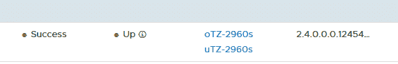
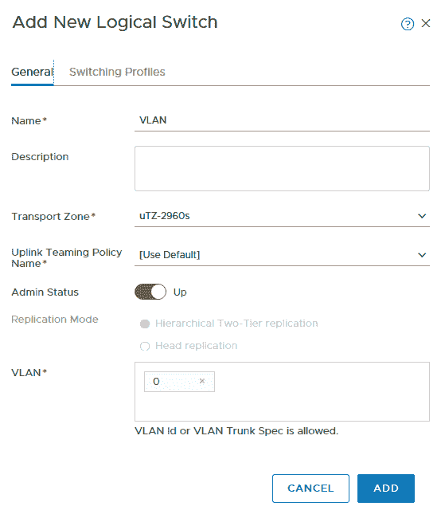

# NSX-T 2.4 的问题

> 原文：<https://dev.to/ngschmidt/gotchas-with-nsx-t-24-np1>

NSX-T 2.4 是一次重大的软件升级，具有许多新功能，在此列出:[https://docs . VMware . com/en/VMware-NSX-T-数据中心/2 . 4 . 0/rn/VMware-NSX-T-数据中心-240-Release-Notes.html](https://docs.vmware.com/en/VMware-NSX-T-Data-Center/2.4.0/rn/VMware-NSX-T-Data-Center-240-Release-Notes.html)

这个版本的文档不是很成熟，所以我收集了一些在安装 NSX-T 2.4 时发现的问题，如下所示:

*   确保在配置主机传输节点(如 ESXi)时，**您需要的所有传输区域**都已在主机上调配！节点概要应至少有**两个**运输区，一个用于底层，一个用于顶层: 
*   **别忘了你的上行 VLAN！**上行 VLAN 必须在【高级组网&安全】- >组网- >交换下配置，并且要参与你的底层传输区域: 
*   NSX 的控制者已经不存在了。该功能被合并到 NSX 管理器中，后者现在支持集群。出于这些原因，您还需要为经理配置一个 vIP。
*   NSX 经理需要更多内存。如果您的主机少于 64 台，VMWare 建议每个管理器使用 24GB 内存——我在 16 台主机和 1 台主机上运行稳定，因此考虑 24GB 最低内存。