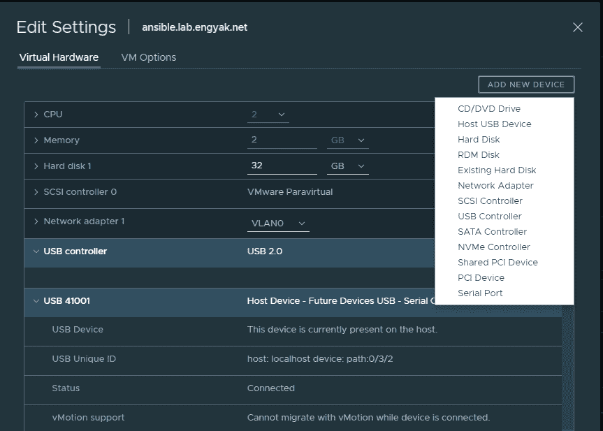

# 通过 ESXi 运行串行控制台服务器

> 原文：<https://dev.to/ngschmidt/running-a-serial-console-server-over-esxi-94k>

由于我正在构建一个混合系统/网络实验室，我需要的一个关键特性是一个串行控制台服务器来管理实验室交换机。这里有几个选项:

*   找到一个旧的思科路由器和一些异步八进制电缆(罕见，占用机架空间)
*   购买串行控制台服务器，如 MRV，佩尔，互联网看门狗等(美元美元)
*   构建 RPi 作为控制台服务器(当前解决方案，消耗 1 个插座)
*   **构建虚拟机，连接 USB 转串口适配器**

最后一个很有意思，原因如下。我有一个 ansible 服务器，我打算用它来完成大多数修补/管理任务，并尝试网络自动化的某些方面，ansible 列出了一个非常有趣的特性，代理:

[https://docs . ansi ble . com/ansi ble/latest/user _ guide/playbooks _ environment . html](https://docs.ansible.com/ansible/latest/user_guide/playbooks_environment.html)

我可以将 ansible VM 的回送地址作为代理列出，允许我在没有网络连接的情况下使用它来自动化早期阶段的网络供应。我知道想要实现自动化是一件小事，但是网络设备供应的这一特定方面非常繁琐，您必须:

1.  升级到您的基线代码版本
2.  配置基本网络
3.  下载基线配置，然后定制它
4.  重新启动到新配置

# 1 是一个相当慢的任务，我想自动化它——让 ansible 在交换机供应时照看它们，而不是一直在那里构建它，这将是一件很棒的事情。对于大多数路由交换平台来说，这些都是非常简单的任务——通常只需要一个二进制副本和一两次重启。

无论如何，让我们开始配置基础。我从 vCenter 6.7 GUI 执行此操作，因此用户界面上的 YMMV。您只需插入 USB 转串行适配器，然后将其作为“主机 USB 设备”添加到虚拟机中。我推荐 FTDI 类型的适配器，它们通常不需要安装任何驱动程序就可以在 ESXi 或 Linux 上工作。

[](https://4.bp.blogspot.com/-PVZJ_AuURhE/XHwNDTuQK1I/AAAAAAAAAhc/r74pi7Rlazg6hxtyejPDvR5WQFtPoEYKwCLcBGAs/s1600/hostusb.PNG)

现在，让我们看看他们是否会出现:

```
ansible:~ # ls /dev/ttyU*/dev/ttyUSB0 /dev/ttyUSB1 /dev/ttyUSB2 /dev/ttyUSB3 
```

我们都准备好了！我通常使用 screen 作为直接的控制台模拟器，但它们或多或少都做同样的事情。在这一点上，我们真的只是试图测试控制台端口，看看他们是否工作:

```
ansible:~ # screen /dev/ttyUSB0 --- System Configuration Dialog ---Would you like to enter the initial configuration dialog? [yes/no]:ansible:~ # screen /dev/ttyUSB1User Access VerificationUsername:ansible:~ # screen /dev/ttyUSB2Would you like to terminate autoinstall? [yes]: yesansible:~ # screen /dev/ttyUSB3Switch>ansible:~ # killall screen 
```

看起来我们在所有串行端口上都完全正常工作——我有 3 个未配置的 WS-C3560-24-TS-E 供将来实验室使用。最后一个命令是确保代理软件不必与 screen 竞争串行设备的所有权。

接下来我们将安装 ser 2 net——它只支持 telnet，但是您可以在 prod 环境中建立 SSH 隧道。老实说，如果您希望在您的工作环境中使用这种服务器，使用专用控制台服务器会好得多- 48 个端口比戴尔 R430 少，并且可以连接到电话线。它们是值得的。

```
ansible:~ # zypper in ser2netLoading repository data...Reading installed packages...Resolving package dependencies...The following NEW package is going to be installed: ser2net1 new package to install.Overall download size: 92.3 KiB. Already cached: 0 B. After the operation, additional 200.1 KiB will be used.Continue? [y/n/...? shows all options] (y): yRetrieving package ser2net-3.5-2.2.x86_64 (1/1), 92.3 KiB (200.1 KiB unpacked)Retrieving: ser2net-3.5-2.2.x86_64.rpm ...........................................................................[done]Checking for file conflicts: ----------------------------------------------------------------------------------------[done](1/1) Installing: ser2net-3.5-2.2.x86_64 ----------------------------------------------------------------------------[done] 
```

然后我们创建一个配置文件:

```
# ::::10000:telnet:3600:/dev/ttyUSB0:960010001:telnet:3600:/dev/ttyUSB1:960010002:telnet:3600:/dev/ttyUSB2:960010003:telnet:3600:/dev/ttyUSB3:9600BANNER:banner:SERIAL EMULATED PORT \p\r\nBANNER:banner1:TCP port \p device \d\r\nBANNER:banner2:TCP port \p device \d\r\nBANNER:banner3:TCP port \p device \d serial parms \s\r\nTRACEFILE:tw1:/tmp/tw-\p-\Y-\M-\D-\H:\i:\s.\UTRACEFILE:tr1:/tmp/tr-\p-\Y-\M-\D-\H:\i:\s.\UOPENSTR:open1:Open str\r\nCLOSEON:closehtml: 
```

# 默认值设置。给定的值是默认值。对于非

# 布尔值上面给出了可能的值。

# **串行设备和 SOL **

# 速度:如上图所示的标准速度

# 默认:速度:9600

# 数据位数:5，6，7，8

# 默认:无中断:假

# **仅串行设备**

# 默认:数据位数:8

# 停止位:1，2

# 默认值:停止位:1

# 奇偶性:无，偶，奇

# 默认:奇偶校验:无

# 默认值:xonxoff:false

# 默认:本地:假

# 默认值:hangup_when_done:false

# 默认值:kickolduser:false

我们准备好了！Systemd 会自动用 VM 启动 ser2net。