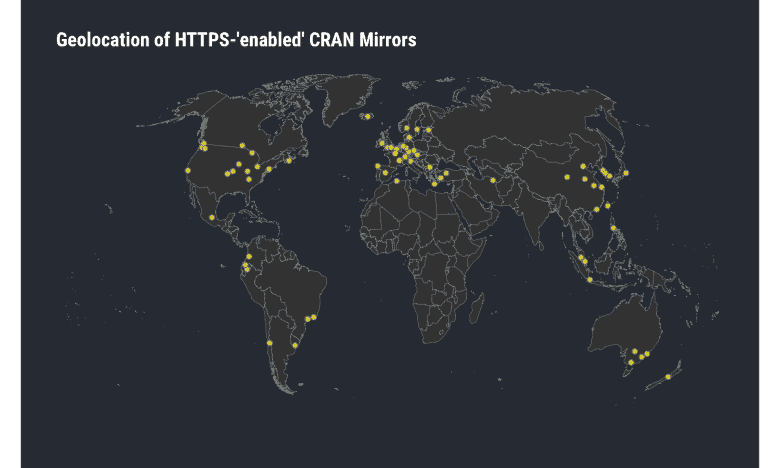
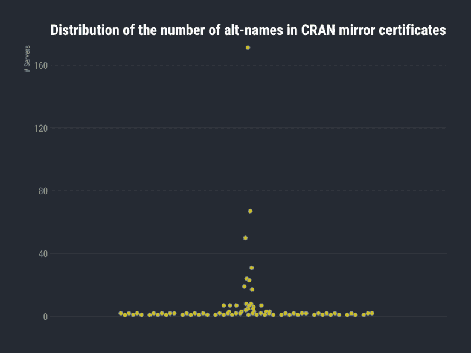
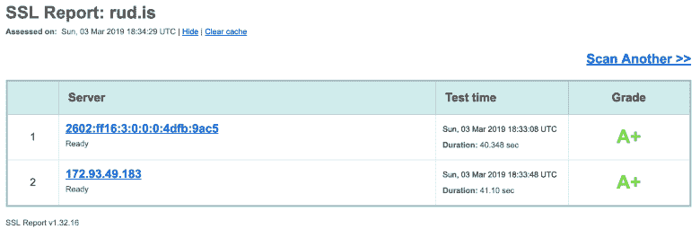
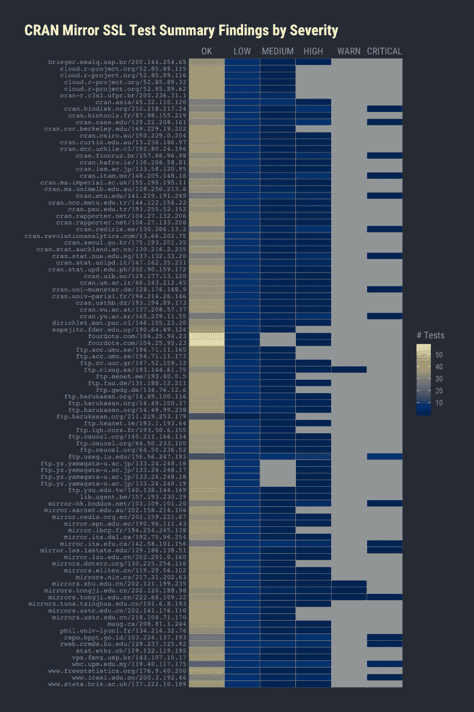
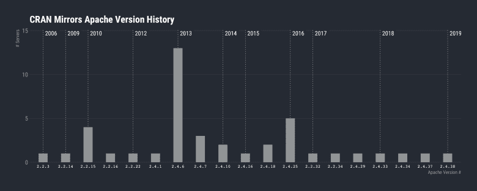
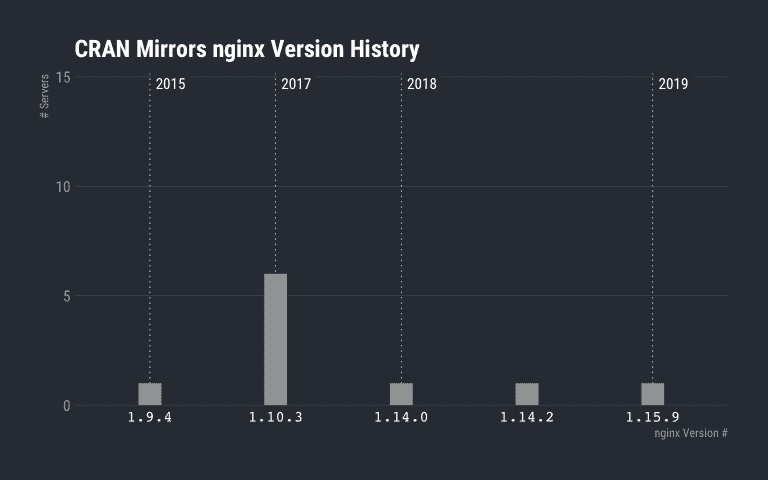
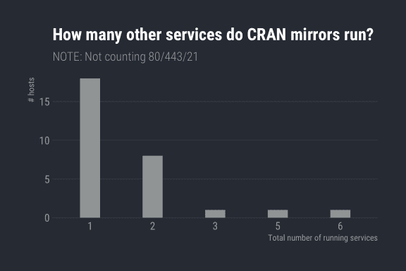

# 克兰镜“安全”

> 原文：<https://dev.to/hrbrmstr/cran-mirror-security-53po>

在最新一期 R Journal(2018 年 12 月第 10/2 卷)的“CRAN 的变化”部分，有一篇题为“CRAN mirror security”的简短广告:

> 目前，有 100 个官方 CRAN 镜像，其中 68 个通过“https”提供安全下载，并使用来自 CRAN master 的安全镜像(通过`rsync`到`ssh`隧道)。从 R 3.4.0 版本开始，`chooseCRANmirror()`优先提供这些镜像，而其他镜像还没有完全安全。

我本来可以链接到上面引用的 R Journal 部分，但是*我不能*，因为我被阻止从我的企业级互联网连接访问 IP 地址为`cran.r-project.org`的所有资源，可能是因为我有一个个人 CRAN mirror(这是遵循规则的，我也无法链接到它，因为我无法访问该网站)。

这个词——“安全”——是现代许多语境中最容易被误解和误用的术语之一。这里的使用背景是网络安全，由于 CRAN(以及 R 社区中的其他人)似乎将传输层的超级混淆与实际的安全性/安全性等同起来，我认为对于 R 用户来说，获得这些所谓的“安全”主机的更完整的图片将是有用的。我这样做也是因为我必须找出另一种方法来继续拥有 CRAN 镜像，并且需要验证哪些节点既支持又允许镜像，并且至少在某种程度上是可信的。

除非在给定的部分中有一些真正令人震惊的东西，否则我将只提供带有一些评论的数据(我不喜欢 abt 被屏蔽，所以一些评论具有异常尖锐的边缘),并避免声明“X 是”👍|👎“因为目标是真正帮助**你**自己做出使用哪面镜子的最佳决定。

支持这篇文章片段的完整 Rproj(包括文章收集的数据)可以在我的新博客项目中找到。

我们将需要一些支持包，所以让我们先把它们放在一边:

```
library(xml2)
library(httr)
library(curl)
library(stringi)
library(urltools)
library(ipinfo) # install.packages("ipinfo", repos = "https://cinc.rud.is/")
library(openssl)
library(furrr)
library(vershist) # install.packages("vershist", repos = "https://cinc.rud.is/")
library(ggalt)
library(ggbeeswarm)
library(hrbrthemes)
library(tidyverse) 
```

### 什么是“安全”？

如上所述，CRAN 的人似乎认为 encryption == security，因为在 R Journal 中提出这一观点的标准是传输层加密，用于从 CRAN 到下游镜像的`rsync`(通过`ssh`)镜像，下游镜像提供`https`传输，用于将包二进制文件和源代码从所述镜像转移到您的本地系统。我发现这个`https`给你带来的让我们加密阴谋集团的花言巧语同样可爱:

*   *理论上*防止中间人攻击，否则中间人会在运输过程中篡改包裹
*   保护你的组织或 ISP 知道你拿的是什么特定的包裹；注意**除非你已经设置了 DNS 请求加密**，控制你的传输层*的实体确实知道你要去哪里*。

还有……大概就是这样了。

很快就要消失的、以前在大多数浏览器中是绿色的锁形图标单独告诉你*没有任何关于你正在连接和使用的任何站点的配置的信息*没有提供关于 CRAN 镜像服务器上还有什么、还有什么正在使用镜像服务器、有多少管理员/用户对那些系统有 shell 访问权以及关于那些系统的网络卫生的任何其他信息的保证。

因此，我们将查看(不一定按照这个顺序，因为这不是一个渗透测试，并且只执行了轻量级的内省):

*   给定的镜像 URL 涉及多少服务器
*   SSL 证书信息，包括颁发者、强度以及有多少其他域可以使用该证书
*   实际的服务器 SSL 传输配置，以查看有多少 CRAN 镜像有高或严重的 SSL 配置问题
*   使用(或不使用)HTTP“安全”头(我的意思是，服务器应该是“安全的”，对吗？)
*   在一个给定的 CRAN mirror 上有多少其他“垃圾”正在运行(运行的服务越多，攻击面就越大)

我们也将使用 R 来表示大部分的 T1(我可能永远不会用 R 来重写长期的 SSL 测试程序)。

让我们开始吃吧。

### 获取大部分元数据

运行一些数据收集步骤可能需要一点时间，以便项目报告包括已经收集的数据。但是，我们将展示侦察的第一步工作，包括:

*   在每个 CRAN 镜像入口中从第一个服务器获取 SSL 证书(同样，我不能链接到镜像页面，因为我再也看不到 CRAN 或主 R 站点了)
*   执行完整 CRAN 镜像 URL 的`HTTP` `HEAD`请求(以最小化服务器带宽& CPU 使用率)(我们必须这样做，因为负载平衡器或代理可能会将我们重新路由到完全不同的服务器)
*   获取每个 CRAN 镜像的 IP 地址
*   获取关于该 IP 地址的元数据

这一切都在下面完成:

```
if (!file.exists(here::here("data/mir-dat.rds"))) {
  mdoc <- xml2::read_xml(here::here("data/mirrors.html"), as_html = TRUE)

  xml_find_all(mdoc, ".//td/a[contains(@href, 'https')]") %>%
    xml_attr("href") %>%
    unique() -> ssl_mirrors

  plan(multiprocess)

  # safety first
  dl_cert <- possibly(openssl::download_ssl_cert, NULL)
  HEAD_ <- possibly(httr::HEAD, NULL)
  dig <- possibly(curl::nslookup, NULL)
  query_ip_ <- possibly(ipinfo::query_ip, NULL)

  ssl_mirrors %>%
    future_map(~{
      host <- domain(.x)
      ip <- dig(host, TRUE)
      ip_info <- if (length(ip)) query_ip_(ip) else NULL
      list(
        host = host,
        cert = dl_cert(host),
        head = HEAD_(.x),
        ip = ip,
        ip_info = ip_info
      )
    }) -> mir_dat

  saveRDS(mir_dat, here::here("data/mir-dat.rds"))
} else {
  mir_dat <- readRDS(here::here("data/mir-dat.rds"))
}

# take a look

str(mir_dat[1], 3)
## List of 1
## $ :List of 5
## ..$ host : chr "cloud.r-project.org"
## ..$ cert :List of 4
## .. ..$ :List of 8
## .. ..$ :List of 8
## .. ..$ :List of 8
## .. ..$ :List of 8
## ..$ head :List of 10
## .. ..$ url : chr "https://cloud.r-project.org/"
## .. ..$ status_code: int 200
## .. ..$ headers :List of 13
## .. .. ..- attr(*, "class")= chr [1:2] "insensitive" "list"
## .. ..$ all_headers:List of 1
## .. ..$ cookies :'data.frame': 0 obs. of 7 variables:
## .. ..$ content : raw(0) 
## .. ..$ date : POSIXct[1:1], format: "2018-11-29 09:41:27"
## .. ..$ times : Named num [1:6] 0 0.0507 0.0512 0.0666 0.0796 ...
## .. .. ..- attr(*, "names")= chr [1:6] "redirect" "namelookup" "connect" "pretransfer" ...
## .. ..$ request :List of 7
## .. .. ..- attr(*, "class")= chr "request"
## .. ..$ handle :Class 'curl_handle' <externalptr> 
## .. ..- attr(*, "class")= chr "response"
## ..$ ip : chr "52.85.89.62"
## ..$ ip_info:List of 8
## .. ..$ ip : chr "52.85.89.62"
## .. ..$ hostname: chr "server-52-85-89-62.jfk6.r.cloudfront.net"
## .. ..$ city : chr "Seattle"
## .. ..$ region : chr "Washington"
## .. ..$ country : chr "US"
## .. ..$ loc : chr "47.6348,-122.3450"
## .. ..$ postal : chr "98109"
## .. ..$ org : chr "AS16509 Amazon.com, Inc." 
```

请注意，两个站点没有响应，因此它们被排除在所有分析之外。

### “安全”CRAN 服务器的免费地图

既然 ipinfo.io 的 API 返回纬度/液化天然气的地理位置信息，为什么不从地图开始呢(因为这将是本文最友好的部分):

```
maps::map("world", ".", exact = FALSE, plot = FALSE, fill = TRUE) %>%
  fortify() %>%
  filter(region != "Antarctica") -> world

map_chr(mir_dat, ~.x$ip_info$loc) %>%
  stri_split_fixed(pattern = ",", n = 2, simplify = TRUE) %>%
  as.data.frame(stringsAsFactors = FALSE) %>%
  as_tibble() %>%
  mutate_all(list(as.numeric)) -> wheres_cran

ggplot() +
  ggalt::geom_cartogram(
    data = world, map = world, aes(long, lat, map_id=region),
    color = ft_cols$gray, size = 0.125
  ) +
  geom_point(
    data = wheres_cran, aes(V2, V1), size = 2,
    color = ft_cols$slate, fill = alpha(ft_cols$yellow, 3/4), shape = 21
  ) +
  ggalt::coord_proj("+proj=wintri") +
  labs(
    x = NULL, y = NULL,
    title = "Geolocation of HTTPS-'enabled' CRAN Mirrors"
  ) +
  theme_ft_rc(grid="") +
  theme(axis.text = element_blank()) 
```

[](https://i0.wp.com/rud.is/b/wp-content/uploads/2019/03/cran-map-1.png?ssl=1)

### 莎士比亚的安全

*名字里有什么？我们称之为安全的站点。使用几十个其他的名字闻起来一点都不安全？*—哈克梅约& Pwndmeyet(二，二，1-2)

普通的互联网用户可能不知道一个 SSL 证书可以面对无数的网站。我说的不仅仅是一个通配符证书(例如，对所有的`rud.is`子域名使用`*.rud.is`，出于多种原因，我尽量不这么做)，我说的是几十个[主题别名](https://tools.ietf.org/html/rfc5280#section-4.2.1.6)。让我们检查一些数据，因为一个例子比废话更好:

```
# extract some of the gathered metadata into a data frame
map_df(mir_dat, ~{
  tibble(
    host = .x$host,
    s_issuer = .x$cert[[1]]$issuer %||% NA_character_,
    i_issuer = .x$cert[[2]]$issuer %||% NA_character_,
    algo = .x$cert[[1]]$algorithm %||% NA_character_,
    names = .x$cert[[1]]$alt_names %||% NA_character_,
    nm_ct = length(.x$cert[[1]]$alt_names),
    key_size = .x$cert[[1]]$pubkey$size %||% NA_integer_
  )
}) -> certs

certs <- filter(certs, complete.cases(certs))

count(certs, host, sort=TRUE) %>%
  ggplot() +
  geom_quasirandom(
    aes("", n), size = 2,
    color = ft_cols$slate, fill = alpha(ft_cols$yellow, 3/4), shape = 21
  ) +
  scale_y_comma() +
  labs(
    x = NULL, y = "# Servers",
    title = "Distribution of the number of alt-names in CRAN mirror certificates"
  ) +
  theme_ft_rc(grid="Y") 
```

[](https://i0.wp.com/rud.is/b/wp-content/uploads/2019/03/alt-names-ct-1.png?ssl=1)

*大部分*只有前面几个但是也有一些带着*疯狂*的域名量。我们可以看一段`cran.cnr.berkeley.edu`:

```
filter(certs, host == "cran.cnr.berkeley.edu") %>%
  select(names) %>%
  head(20) 
```

| 名称 |
| --- |
| nature.berkeley.edu |
| ag-labor.cnr.berkeley.edu |
| agro-laboral.cnr.berkeley.edu |
| agroecology.berkeley.edu |
| anthoff.erg.berkeley.edu |
| are-dev.cnr.berkeley.edu |
| are-prod.cnr.berkeley.edu |
| are-qa.cnr.berkeley.edu |
| are.berkeley.edu |
| arebeta.berkeley.edu |
| areweb.berkeley.edu |
| atkins-dev.cnr.berkeley.edu |
| atkins-prod.cnr.berkeley.edu |
| atkins-qa.cnr.berkeley.edu |
| atkins.berkeley.edu |
| bakerlab-dev.cnr.berkeley.edu |
| bakerlab-prod.cnr.berkeley.edu |
| bakerlab-qa.cnr.berkeley.edu |
| bamg.cnr.berkeley.edu |
| beahrselp-dev.cnr.berkeley.edu |

项目回购有更多的例子，你可以尽可能多的检查。

对于一些 CRAN mirrors，该证书在托管组织中到处使用。这本身并不坏，但组织通常在保护与证书生成相关的秘密方面很糟糕(只要看看每月有多少谷歌/苹果应用商店应用程序被发现使用企业证书)，因为每台具有这些超级证书的服务器都有公共和私有位的副本，用户最好希望恶意的 neer-do-wells 不会获得它们的副本(这使得假冒其中任何一个更容易，特别是如果攻击者控制 DNS)。

这个 Berkeley uber-cert 也有点可爱，因为它在许多不同的应用程序/项目中混合了开发、生产和质量保证系统的别名(开发系统在几乎每个组织中维护不当是出了名的)。

使用通配符证书和利用 San 有合法的理由和环境。你可以检查一下其他的克兰镜子是怎么做的，然后自己判断哪一个做得还可以。

### 大小(和算法)很重要

令人惊喜的是，当涉及到用于证书的算法和密钥大小时，大多数镜像看起来都没问题:

```
distinct(certs, host, algo, key_size) %>%
  count(algo, key_size, sort=TRUE) 
```

| algo | 密钥大小 | n |
| --- | --- | --- |
| sha256WithRSAEncryption | Two thousand and forty-eight | Fifty-nine |
| sha256WithRSAEncryption | Four thousand and ninety-six | Thirteen |
| 带 SHA256 的 ecdsa | Two hundred and fifty-six | Two |
| sha256WithRSAEncryption | Two hundred and fifty-six | one |
| sha256WithRSAEncryption | Three hundred and eighty-four | one |
| sha512WithRSAEncryption | Two thousand and forty-eight | one |
| sha512WithRSAEncryption | Four thousand and ninety-six | one |

你可以进入镜像列表，点击 [SSL 实验室互动服务器测试](https://www.ssllabs.com/ssltest/)(它有很多“镜像”的链接)或者使用 [`ssllabs`](https://git.rud.is/hrbrmstr/ssllabs) R 包来获得每个站点的等级。我在下面深入研究了配置和传输问题的状态，但是如果你想要一个通用的、快速的指导，我会建议你坚持使用 ecdsa 证书或 sha256 或更高数字的站点。

### 他们从哪里得到这些~~美妙的~~证书？

证书来自某个地方。您可以自己生成游戏证书，建立自己内部/合法的证书颁发机构并增加信任链，或者去真正的证书颁发机构获取证书。

你的浏览器和操作系统有一套他们信任的内置认证机构，你可以使用 [`ssllabs::get_root_certs()`](https://git.rud.is/hrbrmstr/ssllabs/src/branch/master/R/root.r) 查看 Mozilla、Apple、Android、Java & Windows 的最新认证机构列表。在“让我们加密”的时代，证书几乎没有货币价值，事实上也没有完整性价值，所以它们来自哪里不再像过去那样*和*重要，但不管怎样，戳戳它还是挺有趣的:

```
distinct(certs, host, i_issuer) %>%
  count(i_issuer, sort = TRUE) %>%
  head(28) 
```

| I _ 发行人 | n |
| --- | --- |
| CN=DST 根 CA X3，O =数字签名信托公司 | Twenty |
| CN=COMODO RSA 认证机构，O=COMODO CA 有限公司，L =索尔福德，ST =大曼彻斯特，C=GB | seven |
| CN=DigiCert Assured ID Root CA，OU= [www.digicert.com，O=DigiCert](http://www.digicert.com,O=DigiCert) Inc，C=US | seven |
| CN=DigiCert 全球根 CA，OU= [www.digicert.com，O=DigiCert](http://www.digicert.com,O=DigiCert) Inc，C=US | six |
| CN = DigiCert High Assurance EV Root CA，OU= [www.digicert.com，O=DigiCert](http://www.digicert.com,O=DigiCert) Inc，C=US | six |
| CN=QuoVadis Root CA 2 G3，O=QuoVadis Limited，C=BM | five |
| CN =用户信任 RSA 认证机构，O =用户信任网络，L =泽西城，ST =新泽西，C =美国 | five |
| CN=GlobalSign 根 CA，OU =根 CA，O=GlobalSign nv-sa，C=BE | four |
| CN =可信根 CA SHA256 G2，O=GlobalSign nv-sa，OU =可信根，C=BE | three |
| CN=COMODO ECC 认证机构，O=COMODO CA 有限公司，L =索尔福德，ST =大曼彻斯特，C=GB | Two |
| CN = DFN-Verein PCA Global–G01，OU=DFN-PKI，O=DFN-Verein，C=DE | Two |
| OU =安全通信根 CA2，O=SECOM Trust Systems 有限公司，C=JP | Two |
| CN=AddTrust 外部 CA 根，OU=AddTrust 外部 TTP 网络，O=AddTrust AB，C=SE | one |
| CN =亚马逊根 CA 1，O =亚马逊，C =美国 | one |
| CN =巴尔的摩网络信任根，OU =网络信任，O =巴尔的摩，C=IE | one |
| CN=Certum 可信网络 CA，OU=Certum 证书颁发机构，O=Unizeto Technologies S.A .，C=PL | one |
| CN=DFN 协会认证机构 2，OU=DFN-PKI，o =德国研究网络绿化协会 e。页:1 | one |
| CN=Go Daddy 根证书颁发机构–G2，O=GoDaddy.com\，Inc .，L=Scottsdale，ST=Arizona，C=US | one |
| CN=InCommon RSA 服务器 CA，OU=InCommon，O=Internet2，L=Ann Arbor，ST=MI，C=US | one |
| CN=QuoVadis Root CA 2，O=QuoVadis Limited，C=BM | one |
| CN=QuoVadis 根证书颁发机构，OU =根证书颁发机构，O=QuoVadis 有限公司，C=BM | one |

第一个是让我们加密，这并不意外，因为它们是免费的，而且非常容易设置/维护(特别是对于网络钓鱼活动)。

一个“有趣”的做法可能是在谷歌/DDG 搜索与这些 ca 相关的历史妥协(如果你在家处理数据，也可以查看主题)，看看他们有什么问题。

你可能也想对这整个“无聊”的 CA 保持更多的关注，因为一些信任商店正在考虑信任监控公司的想法，你永远不知道微软或谷歌会做什么来安抚专制政权并允许进入他们的信任商店。

在练习的这一点上

*   一个证书有多少个域
*   证书强度
*   证书出生地

当你决定使用什么样的镜子时，可以使用它。

但是，如上所述，证书育种是不够的。让我们深入下一个领域。

### 关键在于你使用它的方式

你不能只看证书来评估网站的安全性。当然，你可以花 4 天时间，使用前述的`ssllabs`包来获得每个证书的评级(如果它们已经被缓存，那么 API 调用就不是评估，所以你可以在一天内用 4 个其他人启动缓存，然后其他人都可以使用缓存的值，而不会烧毁速率限制)或者在 SSL 实验室测试站点中逐个进行，但是我们也可以使用类似 [`testssl.sh`](https://github.com/drwetter/testssl.sh) 的工具，通过交互式协议检查来收集技术数据。

我在这篇文章中有点苛刻，所以公平是公平的，这里是[我自己运行`rud.is`](https://rud.is/dl/rud.is-testssl.sh.txt) 的`testssl.sh`以及来自 Qualys 的[的明文结果:](https://www.ssllabs.com/ssltest/analyze.html?d=rud.is&latest)

[](https://i2.wp.com/rud.is/b/wp-content/uploads/2019/03/rud.is-ssllabs.png?ssl=1)

正如您在详细页面中看到的，我与我的`.is`域名的提供商有问题(对 DNS 记录数量和类型的严格限制),所以我没有通过 CAA 检查，因为我不能为它添加条目，也不能使用不同的名称服务器。我鼓励你对 tho 吹毛求疵，因为这应该会提供足够的动力来花两周的 IRL 时间和一些美元来完成它的转移(耶。国际。域。提供商。)

repo 项目拥有 CRAN mirrors 上周末运行的所有结果。没有为运行选择特殊选项。

```
list.files(here::here("data/ssl"), "json$", full.names = TRUE) %>%
  map_df(jsonlite::fromJSON) %>%
  as_tibble() -> ssl_tests

# filter only fields we want to show and get them in order
sev <- c("OK", "LOW", "MEDIUM", "HIGH", "WARN", "CRITICAL")

group_by(ip) %>%
  count(severity) %>%
  ungroup() %>%
  complete(ip = unique(ip), severity = sev) %>%
  mutate(severity = factor(severity, levels = sev)) %>% # order left->right by severity
  arrange(ip) %>%
  mutate(ip = factor(ip, levels = rev(unique(ip)))) %>% # order alpha by mirror name so it's easier to ref
  ggplot(aes(severity, ip, fill=n)) +
  geom_tile(color = "#b2b2b2", size = 0.125) +
  scale_x_discrete(name = NULL, expand = c(0,0.1), position = "top") +
  scale_y_discrete(name = NULL, expand = c(0,0)) +
  viridis::scale_fill_viridis(
    name = "# Tests", option = "cividis", na.value = ft_cols$gray
  ) +
  labs(
    title = "CRAN Mirror SSL Test Summary Findings by Severity"
  ) +
  theme_ft_rc(grid="") +
  theme(axis.text.y = element_text(size = 8, family = "mono")) -> gg

# We're going to move the title vs have too wide of a plot

gb <- ggplot2::ggplotGrob(gg)
gb$layout$l[gb$layout$name %in% "title"] <- 2

grid::grid.newpage()
grid::grid.draw(gb) 
```

[](https://i1.wp.com/rud.is/b/wp-content/uploads/2019/03/testssl-1.png?ssl=1)

幸运的是，大多数 SSL 检查都没有问题。不幸的是，许多人没有:

```
filter(ssl_tests,severity == "HIGH") %>% 
  count(id, sort = TRUE) 
```

| 身份证明（identification） | n |
| --- | --- |
| 违背 | forty-two |
| 密码列表 _3DES_IDEA | Thirty-seven |
| 密码 _ 订单 | Thirty-four |
| RC4 | Sixteen |
| 密码 _ 协商 | Ten |
| 僵局-普通质数 | nine |
| 狮子狗 _SSL | six |
| SSLv3 | six |
| 证书到期状态 | one |
| cert_notAfter | one |
| 回退 _SCSV | one |
| 僵局 | one |
| 安全客户端 renego | one |

```
filter(ssl_tests,severity == "CRITICAL") %>% 
  count(id, sort = TRUE) 
```

| 身份证明（identification） | n |
| --- | --- |
| 密码列表 _ 低 | Sixteen |
| TLS1_1 | five |
| CCS | Two |
| 信任证书链 | one |
| 密码列表 _aNULL | one |
| 密码列表 _ 导出 | one |
| 淹没 | one |
| 奇异的 | one |
| 机器人 | one |
| SSLv2 | one |

一些 CRAN 镜像站点管理员没有跟上安全 SSL 配置。如果你不熟悉一些首字母缩写，这里有一些(相当通俗易懂的)链接:

*   [违反](https://en.wikipedia.org/wiki/BREACH)
*   [淹死](https://en.wikipedia.org/wiki/DROWN_attack)
*   [怪胎](https://en.wikipedia.org/wiki/FREAK)
*   [僵局](https://en.wikipedia.org/wiki/Logjam_(computer_security))–[狮子狗](https://en.wikipedia.org/wiki/POODLE)
*   [机器人](https://robotattack.org/)

你很难让我说这些的存在是世界末日(我的意思是，你信任随机服务器为你提供包，这些包可以在生产代码上的安全飞地中运行，所以这真的有多重要？)但我也不会把“安全”这个词与任何具有高度或严重 SSL 配置缺陷的 CRAN mirror 联系在一起。

### 超越自我

我们做`httr::HEAD()`请求主要是为了捕获 HTTP 头。而且，我们*肯定*得到了一些！

```
map_df(mir_dat, ~{

  if (length(.x$head$headers) == 0) return(NULL)

  host <- .x$host

  flatten_df(.x$head$headers) %>%
    gather(name, value) %>%
    mutate(host = host)

}) -> hdrs

count(hdrs, name, sort=TRUE) %>%
  head(nrow(.)) 
```

| 名字 | n |
| --- | --- |
| 内容类型 | Seventy-nine |
| 日期 | Seventy-nine |
| 计算机网络服务器 | Seventy-nine |
| 上次修改时间 | seventy-two |
| 内容长度 | Sixty-seven |
| 接受范围 | Sixty-five |
| etag | Sixty-five |
| 内容编码 | Thirty-eight |
| 关系 | Twenty-eight |
| 变化 | Twenty-eight |
| 严格的运输安全 | Thirteen |
| x-框架-选项 | eight |
| x-内容-类型-选项 | seven |
| 缓存控制 | four |
| 期满 | three |
| x-XSS-保护 | three |
| cf 射线 | Two |
| expect-ct | Two |
| set-cookie | Two |
| 通过 | Two |
| ms-作者-via | one |
| 杂注 | one |
| 推荐人-策略 | one |
| 提升 | one |
| x-amz-cf-id | one |
| x 缓存 | one |
| x-允许-跨域 | one |
| x 供电的 | one |
| x-机器人-标签 | one |
| x-金枪鱼-镜子-id | one |
| x-ua 兼容 | one |

有几个[“安全”头](https://securityheaders.com/)有点重要，所以我们会看到有多少“安全”的 CRAN 镜像使用“安全”头:

```
c(
  "content-security-policy", "x-frame-options", "x-xss-protection",
  "x-content-type-options", "strict-transport-security", "referrer-policy"
) -> secure_headers

count(hdrs, name, sort=TRUE) %>%
  filter(name %in% secure_headers) 
```

| 名字 | n |
| --- | --- |
| 严格的运输安全 | Thirteen |
| x-框架-选项 | eight |
| x-内容-类型-选项 | seven |
| x-XSS-保护 | three |
| 推荐人-策略 | one |

我真的很震惊，但只有少数几个人使用了一个“安全”标题。`cran.csiro.au`在你的英联邦科学和工业研究组织上使用了以上所有五个优点！

我一直把“security”这个词放在引号中，因为当你执行`install.packages()`时，R 对这些头不做任何事情。总的来说，它们很重要，但主要是当你浏览这些镜子时，涉及到你的安全。

我希望至少能在*看到一个有一些`Content-Security-Policy`头球的，但是一个女孩至少可以有梦想。*

 *### 版本厌恶

我们还可以看看另一个 HTTP 响应头，即`Server`头，它通常可以帮助攻击者判断他们是否应该进一步针对您进行 HTTP 服务器和应用程序攻击。不，我是认真的！回到极客统治互联网的时代——它不仅仅是一个猫图片和 pwnd IP 摄像头的平台——像`Server`头这样的东西很酷，因为它可以帮助我们创建特定于服务器的交互和构建酷的东西。是的，从长远来看，现代的 REST APIs 可能更好，但互联网白银时代的天真无疑是特殊的(也导致了我们现在的混乱)。但是，我跑题了。

理论上，在正确配置的数字头脑中，没有 HTTP 服务器会告诉你它运行到了什么版本级别，但大多数都是这样。(还是那句话，请随意挑我让全世界知道我经营`nginx`…或 *do* I】的毛病)。假设 CRAN mirrors 没有被配置为欺骗攻击者并报告人们让他们报告的内容，我们可以调查他们在浏览器窗口后面运行的内容:

```
filter(hdrs, name == "server") %>%
  separate(
    value, c("kind", "version"), sep="/", fill="right", extra="merge"
  ) -> svr

count(svr, kind, sort=TRUE) 
```

| 种类 | n |
| --- | --- |
| 街头流氓 | Fifty-seven |
| nginx | Fifteen |
| 云耀斑 | Two |
| 联邦科学与工业研究组织 | one |
| Hiawatha v10.8.4 | one |
| 高性能 8 位 Web 服务器 | one |
| 没有人 | one |
| 开放式 | one |

我真的希望 Cloudflare 是捐赠带宽，而不是对这些镜像站点收费。他们很可能从这些网站提供的各种各样的自由/开源软件项目中受益匪浅。(我还没有说 Cloudflare 的坏话，所以我必须在结束前加入一个)。

很多运行 Apache(有道理，因为 CRAN-proper 也是，但我不能在家里验证，因为我被 IP 封锁… *苦多了，hrbrmstr* ？)很多运行 nginx。CSIRO 可能是故意这样命名他们的服务器的，并没有真正编写他们自己的 web 服务器。Hiawatha 确实是一个有效的 web 服务器。虽然也有“高性能 8 位 web 服务器”，但我敢打赌，这只是一个玩笑标题值和“无”。最后，“openresty”也是一个有效的 web 服务器(它是 nginx++)。

我们将选择 Apache 和 nginx，看看当前的补丁水平如何。不是所有的都返回版本号，但是有相当一部分是这样的:

```
apache_httpd_version_history() %>%
  arrange(rls_date) %>%
  mutate(
    vers = factor(as.character(vers), levels = as.character(vers))
  ) -> apa_all

filter(svr, kind == "Apache") %>%
  filter(!is.na(version)) %>%
  mutate(version = stri_replace_all_regex(version, " .*$", "")) %>%
  count(version) %>%
  separate(version, c("maj", "min", "pat"), sep="\\.", convert = TRUE, fill = "right") %>%
  mutate(pat = ifelse(is.na(pat), 1, pat)) %>%
  mutate(v = sprintf("%s.%s.%s", maj, min, pat)) %>%
  mutate(v = factor(v, levels = apa_all$vers)) %>%
  arrange(v) -> apa_vers

filter(apa_all, vers %in% apa_vers$v) %>%
  arrange(rls_date) %>%
  group_by(rls_year) %>%
  slice(1) %>%
  ungroup() %>%
  arrange(rls_date) -> apa_yrs

ggplot() +
  geom_blank(
    data = apa_vers, aes(v, n)
  ) +
  geom_segment(
    data = apa_yrs, aes(vers, 0, xend=vers, yend=Inf),
    linetype = "dotted", size = 0.25, color = "white"
  ) +
  geom_segment(
    data = apa_vers, aes(v, n, xend=v, yend=0),
    color = ft_cols$gray, size = 8
  ) +
  geom_label(
    data = apa_yrs, aes(vers, Inf, label = rls_year),
    family = font_rc, color = "white", fill = "#262a31", size = 4,
    vjust = 1, hjust = 0, nudge_x = 0.01, label.size = 0
  ) +
  scale_y_comma(limits = c(0, 15)) +
  labs(
    x = "Apache Version #", y = "# Servers",
    title = "CRAN Mirrors Apache Version History"
  ) +
  theme_ft_rc(grid="Y") +
  theme(axis.text.x = element_text(family = "mono", size = 8, color = "white")) 
```

[](https://i2.wp.com/rud.is/b/wp-content/uploads/2019/03/apache-history-1.png?ssl=1)

O_O

我将让您决定六年前的 Apache 版本是否表明镜像站点运行得有多好。当然，缓解措施可以到位，但我没有看到任何网站的疗效声明，所以我们将使用#lazyadmin。

但是，使用 nginx 会更好，对吗？一切都很酷&很现代！

```
nginx_version_history() %>%
  arrange(rls_date) %>%
  mutate(
    vers = factor(as.character(vers), levels = as.character(vers))
  ) -> ngx_all

filter(svr, kind == "nginx") %>%
  filter(!is.na(version)) %>%
  mutate(version = stri_replace_all_regex(version, " .*$", "")) %>%
  count(version) %>%
  separate(version, c("maj", "min", "pat"), sep="\\.", convert = TRUE, fill = "right") %>%
  mutate(v = sprintf("%s.%s.%s", maj, min, pat)) %>%
  mutate(v = factor(v, levels = ngx_all$vers)) %>%
  arrange(v) -> ngx_vers

filter(ngx_all, vers %in% ngx_vers$v) %>%
  arrange(rls_date) %>%
  group_by(rls_year) %>%
  slice(1) %>%
  ungroup() %>%
  arrange(rls_date) -> ngx_yrs

ggplot() +
  geom_blank(
    data = ngx_vers, aes(v, n)
  ) +
  geom_segment(
    data = ngx_yrs, aes(vers, 0, xend=vers, yend=Inf),
    linetype = "dotted", size = 0.25, color = "white"
  ) +
  geom_segment(
    data = ngx_vers, aes(v, n, xend=v, yend=0),
    color = ft_cols$gray, size = 8
  ) +
  geom_label(
    data = ngx_yrs, aes(vers, Inf, label = rls_year),
    family = font_rc, color = "white", fill = "#262a31", size = 4,
    vjust = 1, hjust = 0, nudge_x = 0.01, label.size = 0
  ) +
  scale_y_comma(limits = c(0, 15)) +
  labs(
    x = "nginx Version #", y = "# Servers",
    title = "CRAN Mirrors nginx Version History"
  ) +
  theme_ft_rc(grid="Y") +
  theme(axis.text.x = element_text(family = "mono", color = "white")) 
```

[](https://i1.wp.com/rud.is/b/wp-content/uploads/2019/03/nginx-history-1.png?ssl=1)

🤨

我将用一句“谢谢你”来结束这倒数第二部分感谢乔治-奥古斯特-哥廷根大学和山形大学的管理员及时更新 web 服务器补丁。

### 你已经走了这么远

如果我知道你会读到最后，我会做饼干的。你只能接受博客给你的浏览器的那些(那些尝起来味道很淡)。

我们要看的最后一个轻量级元素是“这些‘安全’的曲柄镜还能运行什么”？

为此，我们将转向 [Rapid7 OpenData](https://opendata.rapid7.com/) 并查看这些 CRAN 镜像使用的 IP 地址上还运行着什么。我们已经知道一些证书是混杂的，那么服务器本身呢？

```
cran_mirror_other_things <- readRDS(here::here("data/cran-mirror-other-things.rds"))

# "top" 20
distinct(cran_mirror_other_things, ip, port) %>%
  count(ip, sort = TRUE) %>%
  head(20) 
```

| 互联网协议（Internet Protocol 的缩写） | n |
| --- | --- |
| 104.25.94.23 | eight |
| 143.107.10.17 | seven |
| 104.27.133.206 | five |
| 137.208.57.37 | five |
| 192.75.96.254 | five |
| 208.81.1.244 | five |
| 119.40.117.175 | four |
| 130.225.254.116 | four |
| 133.24.248.17 | four |
| 14.49.99.238 | four |
| 148.205.148.16 | four |
| 190.64.49.124 | four |
| 194.214.26.146 | four |
| 200.236.31.1 | four |
| 201.159.221.67 | four |
| 202.90.159.172 | four |
| 217.31.202.63 | four |
| 222.66.109.32 | four |
| 45.63.11.93 | four |
| 62.44.96.11 | four |

四个并不坏，因为我们期望至少有 80、443 和 21 个(FTP)在运行。我们把这些拿走，看看分布情况:

```
distinct(cran_mirror_other_things, ip, port) %>%
  filter(!(port %in% c(21, 80, 443))) %>%
  count(ip) %>%
  count(n) %>%
  mutate(n = factor(n)) %>%
  ggplot() +
  geom_segment(
    aes(n, nn, xend = n, yend = 0), size = 10, color = ft_cols$gray
  ) +
  scale_y_comma() +
  labs(
    x = "Total number of running services", y = "# hosts",
    title = "How many other services do CRAN mirrors run?",
    subtitle = "NOTE: Not counting 80/443/21"
  ) +
  theme_ft_rc(grid="Y") 
```

[](https://i0.wp.com/rud.is/b/wp-content/uploads/2019/03/other-stuff-1.png?ssl=1)

那么，其他这些端口是什么？

```
distinct(cran_mirror_other_things, ip, port) %>%
  count(port, sort=TRUE) 
```

| 港口 | n |
| --- | --- |
| Eighty | Seventy-five |
| Four hundred and forty-three | Seventy-five |
| Twenty-one | Twenty-nine |
| Twenty-two | Eighteen |
| Eight thousand and eighty | six |
| Twenty-five | five |
| Fifty-three | Two |
| Two thousand and eighty-two | Two |
| Two thousand and eighty-six | Two |
| Eight thousand | Two |
| Eight thousand and eight | Two |
| Eight thousand four hundred and forty-three | Two |
| One hundred and eleven | one |
| Four hundred and sixty-five | one |
| Five hundred and eighty-seven | one |
| Nine hundred and ninety-three | one |
| Nine hundred and ninety-five | one |
| Two thousand and eighty-three | one |
| Two thousand and eighty-seven | one |

22 是 SSH，53 是 DNS，8000/8008/8080/8553 是通常与管理或 API 端点相关联的 web 高端口，当暴露在外部时(尤其是在“安全的”镜像服务器上)，这通常是一个不好的信号。25/465/587/993/995 都处理邮件发送和阅读(对于一个“安全”的镜像服务器来说，这并不是一个很好的服务)。我没有说得太多，但 208[2367]往往是 cPanel 管理端口，那些可访问互联网的端口也不是很好。

端口 111 是 sunrpc，对互联网或 T2 来说是一件非常糟糕的事情。但是，服务器是一个“安全”的 CRAN mirror，所以也许一切都很好。

### 鳍

虽然我希望这篇文章能告诉你，但我已经在网络安全领域工作了很多年，因此，我真的不指望会有什么改变。明天，尽管我比绝大多数“安全”的克兰镜有更好的“安全性”(并且遵守规则)，我仍然会被阻止进入克兰& r-project.org 的主网站。此外，CRAN 镜像设置往往是相当不可见的，因为大多数现代 R 用户使用 RStudio 默认设置(从任何“安全”分析角度来看，这都是一个不错的选择)，在镜像选择器中选择第一个项目(俄罗斯轮盘！)，或者接受站点范围的 Rprofile 中的设置(组织范围的风险接受度/“归咎于管理员”)。

因为我只是把它用*的方式*备份到顶部(WordPress 说这是大约 3900 字，但其中大部分是【我认为】代码)你可以得到这个完整的 [R 项目](https://git.rud.is/r-blog-projects/cran-mirror-security)并自己检查数据。该项目中有更多的数据和代码，因为我也在 Rapid7 的 FDNS OpenData 研究集中查找了 IP 地址，以真正了解有多少域指向特定的 CRAN mirror，但我真的不想再拖下去了。

现在，我把那些 Python 3 和 Julia Jupyter 的笔记本放在哪里了…*