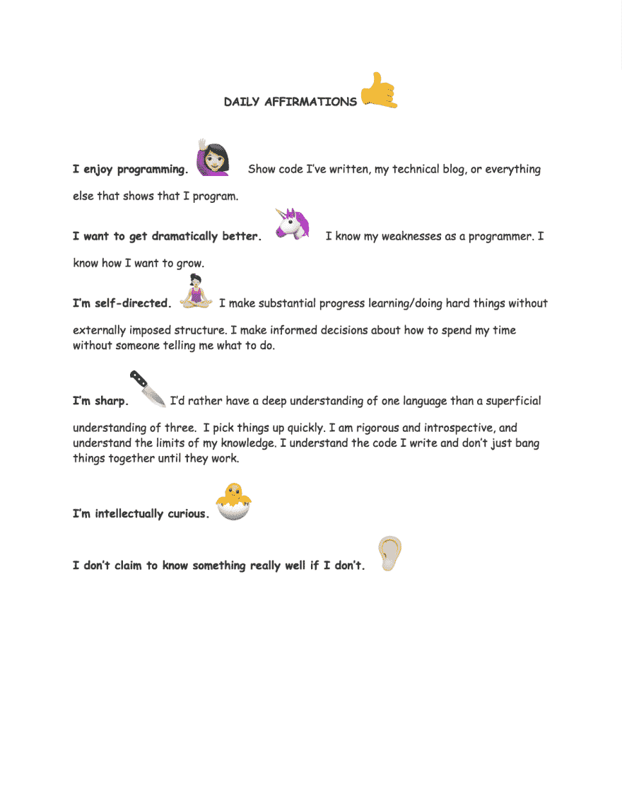

# 我如何制定今年的学习计划

> 原文：<https://dev.to/flopi/how-im-developing-my-learning-plan-this-year-1pj5>

# 动机

> 小时候，我爷爷每周都带我和妹妹去图书馆。我记得对老年人会拿起的大部头书感到敬畏。我记得我告诉自己，有一天我也能读这么长的书。

自从我发现这个中心的存在，我就一直想成为这个中心的一员。一想到要花更多的时间去了解我想要什么，我就很开心。把自己带到一个让我感到舒适的地方，开始对困难的事情进行自学*，这也是我的一个巨大动力。*

 *在你想做得更好的事情上努力[并建立精通](https://www.healthyplace.com/blogs/buildingselfesteem/2015/11/feel-motivated-and-confident-with-this-dbt-skill)是一种辩证的行为治疗技巧，用于增强自信。通过多年在 DBT 的经历，我明白了当你想要实现某个目标时，你需要清晰、可操作的步骤来实现，否则你就是在给自己设置失败。我知道我希望能够学习任何困难的主题，所以我必须练习学习困难的主题，思考什么可行，什么不可行，并继续下去。

# 期望

我观察了递归中心[在申请人](https://www.recurse.com/what-we-look-for)身上寻找的东西，以寻找一个可能的习惯的好模型来努力实现。我创建了下面的每日肯定图，并将其设置为我的屏幕背景。

明确地说，我不认为你需要所有这些才能成功。例如，我不认为你需要喜欢编程才能做得更好，但是这些愿望与我的兴趣一致。我确实喜欢编程！做给我们带来快乐的活动通常会增加幸福感。我能做什么来满足这种兴趣呢？每当我对平凡的工作感到沮丧或感到与我的价值观不一致的外部压力时，我发现这个提醒是有根据的。

另外，请注意，我的价值观之一是*理智诚实*。如果我不知道的话，我不会假装很了解！对我来说，这不是道德优越感的问题，而是当你对自己诚实时，机会就出现了。当你填写你对一个主题的了解时，你可以看到你理解的差距并寻求帮助。当我开始进入这个领域时，我的一个恐惧就是停滞不前。随着时间的推移，我明白了，当你对自己诚实并练习自我意识时，事情很少会让你感到惊讶。对自己诚实也意味着善待自己，当你知道你不理解指针，因为你仍然对引用模糊不清，而不是因为你已经挣扎了一段时间而完全拒绝 C 时，这就容易多了。

# 学习目标

起初，我知道我想彻底地学习一些东西，但我不确定具体是什么，所以我在谷歌文档中写下了一个兴趣列表。这是列表:

> 我的兴趣是什么？
> 
> *   实施不同的数据库类型，即 NoSQL、SQL、图表
> *   了解实施的变化如何影响性能
> *   数据库性能
> *   系统
> *   在最低级别(即汇编)优化代码
> *   司机
> *   网络如何工作
> *   wi-fi 的物理学
> *   引擎如何工作，例如存储引擎，引擎是什么意思？
> *   JVM 是如何工作的？什么是 Java 字节码？那是什么意思？
> *   正则表达式和状态机
> *   设计分布式系统
> *   汇编指令到机器指令，CPU 理解二进制
> 
> 设计数据密集型应用
> 
> *   数据库算法
> 
> 数据库可靠性工程
> 
> *   SLA

这个列表中有很多内容。要想很好地了解一件事，你必须先不那么好地了解它。我目前在工作中使用 Python，所以我决定彻底学习这门语言。我还注意到 JavaScript 社区很受欢迎，那里有很多可访问的学习材料。在学习 Python 的同时学习 JavaScript 应该会让我有机会接触一些我感兴趣的话题，比如性能、语言的底层细节以及引擎是如何工作的。

# 期望的结果

我知道我想彻底了解 Python 和 JavaScript，但是因为我还没有创建一个这样规模和范围的学习计划，所以仍然有很多未知的东西。

我知道我需要加强我的学习，所以我会在博客上记录我一路上学到的东西。我也把我所有的笔记收集在同一个地方，这样我就能清楚地看到我知识的缺口在哪里。我决定用 [Scrivener](https://www.literatureandlatte.com/scrivener/overview) ，这是一款文字处理软件，用于整理文学作品。我喜欢它，因为它可以让你轻松地将你的想法(重新)组织成章节，并与 *BibTex* 集成进行引用管理。

这就是现在项目结构的样子:

我边走边添加副主题。我仍然在寻找一本好的语言实现书。我在考虑得到“龙之书”。**如果有什么推荐，请告诉我！**

# 进展至此

我进步很大！结合 Python 学习 JavaScript 使得识别语言实现模式和这些模式的行话变得更加容易。例如，我看到了这篇优秀的 [JavaScript 执行上下文帖子](https://blog.bitsrc.io/understanding-execution-context-and-execution-stack-in-javascript-1c9ea8642dd0)。我意识到，尽管我知道执行上下文的概念，但我还没有正式考虑过它。**知道要搜索什么关键词非常重要。**通过查找 Python 执行上下文信息，我了解了更多关于 PYTHONPATH 的信息，以及为什么我的代码不久前会以这种方式运行。现在我知道在学习任何新的编程语言时应该寻找什么了。

# 结论

为自己制定一个计划，从基础开始，比如为自己创建激励性的内容，这很有帮助。我找到了渴望的东西(加入 Recurse 中心批次),它已经有了实现目标所需的习惯的基本指南。我选择了要关注的主题，并创建了一个结构，让我看到我错过了什么，以便充分理解一个概念。

我积极地写下我所学到的，并对内容和执行进行反思(没有双关语的意思！).我发现这样学习超级好玩。在进入下一个主题之前，我不觉得有完成整本教科书的负担。当我感到无聊或者一个概念很难用一种语言理解时，我可以从 JavaScript 切换到 Python，反之亦然。我不断地发现新的尝试，比如剖析 Python 代码或者将我自己的普通 JS 站点部署到我的新领域(！)，这让我在 EBNF 语法文件和词汇环境这样的困难概念之间有一种快速的满足感。

重要的是，我注意到我正在把我为了娱乐而学的材料*和为了工作而学的材料*联系起来*，而没有了冒名顶替综合症的焦虑。**我看到我作为一个人正在成长，发展完全属于我自己的兴趣，而不是由增加了我自我效能感的薪水推动的。***

很想听听大家的学习计划和思考！我已经看到这个平台上的一些人如何使用博客来保持自己在学习中的责任感，这非常有激励作用！继续努力，伙计们:)*