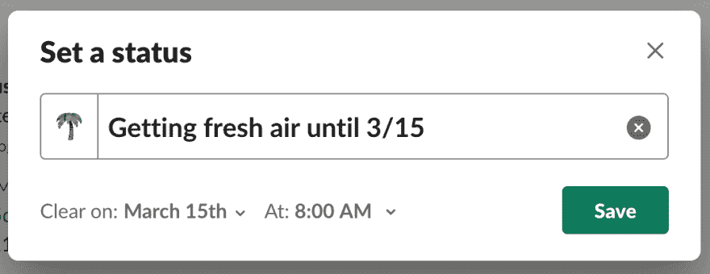

# 真正抽出时间:清单

> 原文：<https://dev.to/easyaspython/truly-taking-time-off-a-checklist-14ei>

这篇文章最初出现在 [dane.engineering](https://dane.engineering/post/truly-taking-time-off-a-checklist)

* * *

最近，我结束了近两周的日常工作，回来了。一部分时间是去参加一个会议( [PyCaribbean](http://pycaribbean.com) 太神奇了！)剩下的就是一个合法的假期了。在过去，我很难真正脱离和享受我离开的时间，所以这次我采取了深思熟虑的措施，以确保我不会再次陷入同样的陷阱。

## 清空你的大脑

我离开的这段时间正好是我的团队非常忙碌的时候，导致了一个截止日期。这可能是最难摆脱的时期之一。当你离开时，对你的团队的成功和你内心的放松至关重要的是确保你头脑中的一切都被释放出来。传播你所知道的或正在进行的一切，这样就有了共同的理解。理想的情况是，在你休假前，和一个同事一起把你不在的时候需要继续运转的事情交接好。

在你离开之前，作为一个团队就对你的期望达成一致，这样你就可以致力于完成这些事情。这不仅会帮助团队感到和谐，而且会给你一个明确的停止点，让你在精神上切换到休假模式。

## 逃避懈怠

当你想独处的时候，懈怠无疑是最大的分心来源。如果您在移动设备上使用它，这一点尤其正确。如果你和你的团队同步后只做一件事，应该是这样。

可宽延状态可以设置到特定的日期和时间，也可以无限期设置。用表情符号设置一个状态，表示你不在/在度假/不在，如果可能的话，表示你什么时候回来。

除了状态之外，Slack 还允许您明确地将自己设置为“离开”这在界面上更清楚地表明你不在，所以它有助于管理期望！

我在这次旅行中选择了核选项，并完全放弃了懈怠。除了删除偶尔的分散注意力的通知之外，它还让我不太可能在停机时间一时冲动去检查 Slack。

## 逃避邮件

与 Slack 类似，电子邮件是我们很多人“以防万一”检查的东西之一。你的收件箱里很少有什么引人注目的东西，至少没有什么不能等到你回来的。只要确保有一个真正紧急情况下的协议，如个人电话号码或电子邮件。理想情况下，这些都在某种“紧急情况下的破裂”玻璃后面。设置一条类似于您的空闲状态的自动回复消息，但除此之外，还要包括您的联系人的姓名或联系信息。这有助于人们更快地解决他们的问题和顾虑。

## 逃离你的日历

日历提醒是另一个分散注意力的来源，这是我在准备这次旅行时才意识到的。日历对于旅行计划和组织也很方便，所以如果仍然有周期性的工作会议，它们会造成混乱。

拒绝不在你离开时间内的会议。如果它们重复出现，确保您只拒绝实例而不是系列！谢绝会议提醒人们你不会出席，这有助于他们在你外出时计划他们的议程。

## 逃离寻呼机

如果您正在进行团队的应用程序监控，请确保您在外出期间没有被安排。如果是的话，和别人交换位置(并表达你的感激之情)。如果无人值守警报升级到每个人，您也可以考虑暂时将自己从升级策略中删除。我事先没有想到这一点，所以我仍然被一些升级的警报所困扰。

## 关乎平衡

我提到过，在过去，我很难脱离。部分原因是我个人不介意即使在外出时也能温和地帮忙。这是我满意的平衡。对另一些人来说，这种平衡出现在其他地方，更靠近光谱的一端。上面的建议属于“不可得”的一端，所以你可以利用你需要的点点滴滴来为自己找到正确的平衡。身体健康，身体好！

* * *

你有什么摆脱烦恼、享受时光的小窍门？