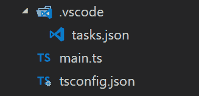
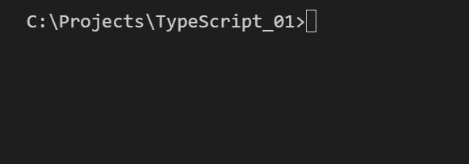
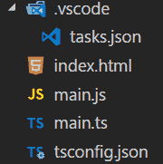
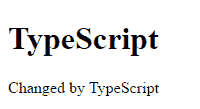
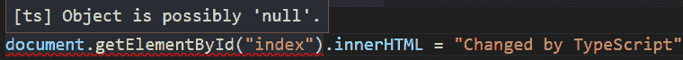

# 使用 Visual Studio 代码的最简单的 TypeScript 项目

> 原文：<https://dev.to/semuserable/simplest-typescript-project-using-visual-studio-code-1lgl>

> 免责声明:最初发布于`medium`，但针对`dev.to`进行了修订和更新

本教程针对`TypeScript`和`Visual Studio Code`的新手。你不会在这里找到深刻的编程概念或挑战，因为我试图提出最简单的可能的解决方案。本来只是写给自己看的，后来决定分享一下。此外，它是针对 Windows 平台的，但如果你使用另一个操作系统，进行切换并不困难。

# 前言

我不会详细讨论什么是`TypeScript`,因为所有相关信息都可以在 wiki 上很容易地找到，而是讨论如何从 Visual Studio 代码中开始使用它。

# 设置

*   获取 [Visual Studio 代码](https://code.visualstudio.com/)
*   获取 [Node.js](https://nodejs.org/en/) 。它附带了`npm`包管理器
*   打开命令提示符并运行以下命令，在全局范围内安装最新稳定版本的`TypeScript`

```
npm install -g typescript 
```

Enter fullscreen mode Exit fullscreen mode

*   检查全局安装的软件包

```
npm list -g --depth=0 
```

Enter fullscreen mode Exit fullscreen mode

# 配置

创建一个空文件夹，并在`Visual Studio Code`中打开它。

我们需要做的第一件事是创建`tsconfig.json`文件。为此，我们将在终端中执行这个命令(`Ctrl+``打开终端)

```
tsc --init 
```

Enter fullscreen mode Exit fullscreen mode

*   创建源代码(例如`main.ts`)

```
interface Person {
    age: number,
    name: string,
    say(): string
}

let mike = {
    age: 25, 
    name:"Mike", 
    say: function() { 
        return `My name is ${this.name} and I'm ${this.age} years old!`;
    }
}

function sayIt(person: Person) {
    return person.say();
}

console.log(sayIt(mike)) 
```

Enter fullscreen mode Exit fullscreen mode

*   现在我们想设置一个方便的构建过程，以便用几个按钮来运行项目。按`Ctrl+Shift+P`开始输入**配置默认构建任务**，按`Enter`选择，然后 **tsc: build - tsconfig.json** 。这将在`.vscodefolder`中创建一个名为`tasks.json`的文件(点击项目选项卡上的`Refresh Explorer`以查看更改)。现在我们都有了构建所需的命令和参数。

这是所有步骤之后我们的项目结构。

[](https://res.cloudinary.com/practicaldev/image/fetch/s--6wbloN3E--/c_limit%2Cf_auto%2Cfl_progressive%2Cq_auto%2Cw_880/https://thepracticaldev.s3.amazonaws.com/i/48xh1m5j1pc3ff1x4wi1.png)

# 运行

是时候最终运行构建任务了。按下`Ctrl+Shift+B`，如果一切顺利，一个新文件将被创建(`main.js`)。为了看到输出，我们需要把它输入到`node`命令中。

```
node main.js 
```

Enter fullscreen mode Exit fullscreen mode

让我们看看它的实际效果吧！
[T3】](https://res.cloudinary.com/practicaldev/image/fetch/s--ugPsiCqm--/c_limit%2Cf_auto%2Cfl_progressive%2Cq_66%2Cw_880/https://thepracticaldev.s3.amazonaws.com/i/mv2wbdpyucdt3iix9n76.gif)

好吧。我们喜欢命令行，并渴望尝试新的东西。让我们创建一个最小的`html`，并通过`TypeScript`改变页面的一些 DOM 属性。

# 使用 DOM

创建一个名为 index.html 的新文件。它是如此的简约，以至于我甚至有点尴尬。

```
<!DOCTYPE html>
<html>    
    <body>
        <h1>Fun with TypeScript</h1>
        <p id="rock_id">Let's rock</p>

        <script src="main.js"> </script>
    </body>
</html> 
```

Enter fullscreen mode Exit fullscreen mode

让我们更改`main.ts`文件，并使用`TypeScript`修改`<p>`元素的内部文本。这里的主要部分是`<script src=”main.js”>`元素。`main.js`是从`TypeScript`移植过来的代码，会自然运行。

警告！！！又一个极简的例子！

```
document.getElementById("rock_id")!.innerHTML = "Changed by TypeScript!" 
```

Enter fullscreen mode Exit fullscreen mode

所有变更后的最终项目结构。

[](https://res.cloudinary.com/practicaldev/image/fetch/s--bic094XF--/c_limit%2Cf_auto%2Cfl_progressive%2Cq_auto%2Cw_880/https://thepracticaldev.s3.amazonaws.com/i/2icj1g1je8mu5c24oar6.png)

按`Ctrl+Shift+B`查看`main.js`文件(只是好奇)。接下来，打开`index.html`，观察结果。哇！如此简单！

<figure>

<figcaption>index.html page</figcaption>

</figure>

太棒了，但是这个例子有些奇怪。`!`符号在这里做什么？它被称为[非空断言操作符](https://github.com/Microsoft/TypeScript/wiki/What%27s-new-in-TypeScript#user-content-non-null-assertion-operator)。如果`tsconfig.json`配置了`strict`标志，编译器会强制我们检查`null/undefined`的值。如果我们试图忽略它，编译器会对你大喊大叫。

<figure>

<figcaption>Compiler error with -strict flag</figcaption>

</figure>

为了安全地使用来自`.getElementById`的返回值，我们必须显式地检查`null/undefined`。但是在这个例子中它是多余的，因为我 100%确定它不会返回任何`null/undefined`。所以我就用`!`。

就是这样！感谢阅读！