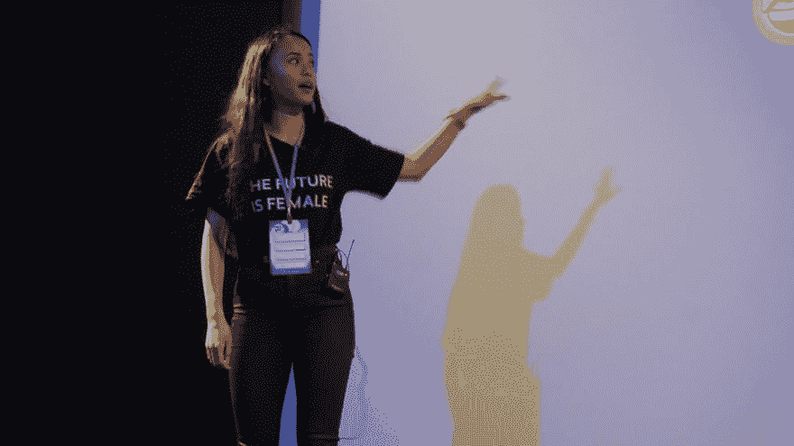

# 指导女性与 Pauline Narvas 一起学习编程

> 原文：<https://dev.to/samjarman/mentoring-women-learning-to-code-with-pauline-narvas-384>

### 自我介绍！你是谁？你在哪里工作？

你好。我叫波林。我的正式职称是 BT 的“数字开发与运营研究生”。我目前正在参加一个培训项目(在英国他们喜欢称之为研究生项目)，在那里我加入了数字工程团队。在我两年的项目中，我有机会在不同的团队中轮换，从架构、开发、测试到发布！这是一种独特的方式来了解大量的技术职业，并希望在计划结束时专攻某个领域。在我朝九晚五的工作之外，我还是一名自由远程网站开发者和设计者以及内容创作者！

### 是谁或什么让你开始编程的？

我在 8 岁的时候就进入了开发/编程领域。我想改变我玩的一个在线游戏的一些方面，因为我发现它是在线的，在一个网站上，我决定学习如何建立一个网站。从那时起，我一头扎进了我完全爱上的前端 web 开发。随着时间的推移，我开发了几个简单有趣的网站，并最终开始开发 Wordpress 主题，与此同时，我开始写博客。

### 拥有强大的网络影响力(博客、youtube 等)对你的职业生涯有何影响？

我绝对*爱*这个问题。拥有强大的在线影响力对我的职业生涯产生了巨大的影响，它给了我以前认为不可能的机会，包括在会议和活动中担任主旨发言人和小组发言人，成为我热衷的活动的一部分，保住我的工作，最重要的是，让我的声音在那里发出，这直接影响了哪些公司看到了我的价值观与他们的价值观相一致。[当然，如果你在网上有一个积极的形象，这一切都行得通！](https://pawlean.com/2018/11/25/building-an-online-presence/)

### 志愿辅导女性学习编程对你的职业生涯有何影响？

对于那些不熟悉我背景的人来说，我是一个非营利组织的志愿者，代码优先:过去两年在谢菲尔德和利兹的女孩。这对我的职业生涯产生了积极的影响。当我申请工作时，我关注的主要问题之一是他们的多元化和包容性声明，这对于我这个过去经历过偏见的有色人种女性来说意义重大。这帮助我找到了符合我价值观的合适公司，并引领我走到了今天！:)志愿做代码第一:首先，女孩们也给了我追求科技职业的信心。

### 工作之外，你有什么爱好吗？你认为它们对你的科技事业有任何帮助吗？

我的爱好是[写博客和记录](http://pawlean.com)我的知识和经验，这对我的科技事业帮助很大！这可以让那些想和我一起工作的人更好地了解我感兴趣的东西，以及我们如何才能更好地合作等等。我能想到的例子包括，几次工作面试、演讲和播客等。博客帮助我改善了书面交流的方式，让我的想法有条理——这对任何职业都很重要！另一个间接有帮助的爱好是举重或我喜欢称之为超级英雄训练，它让我在面对挑战时更加自信和有弹性。

### 你会向那些想走上与你相似道路的人推荐哪些书籍/资源？

实际上，我写了一篇博文，提供了一堆关于任何想学习如何开始编码的人的资源- [你可以在这里查看！](https://pawlean.com/2019/01/14/learning-to-code/)

### 最后，做出你的大喊！你想让读者去看什么？

我在 pawlean.com 写博客，在 [@paulienuh](http://twitter.com/paulienuh) 发推特，在@ [paw.lean](http://instagram.com/paw.lean) 发 gram，想了解更多关于我更广泛的投资组合的信息，请登录[paulinenarvas.com](http://paulinenarvas.com)查看我的博客。