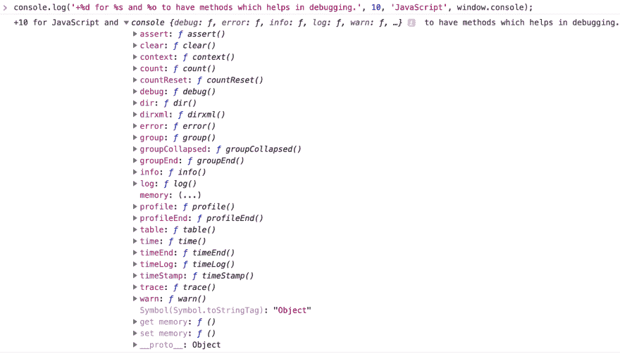
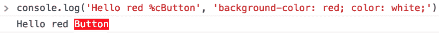
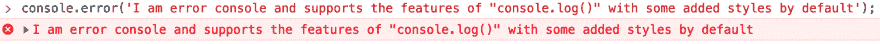
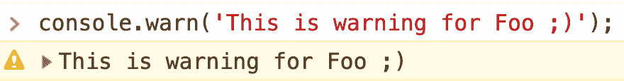
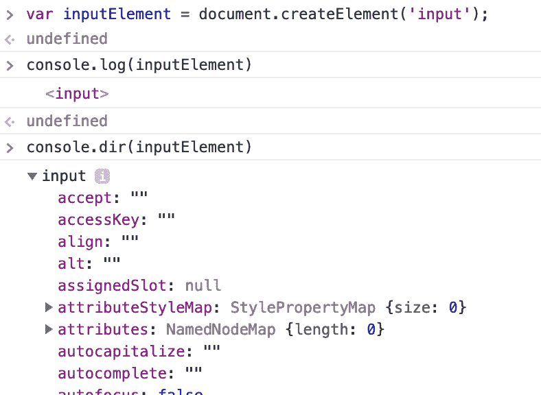
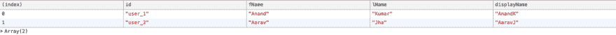
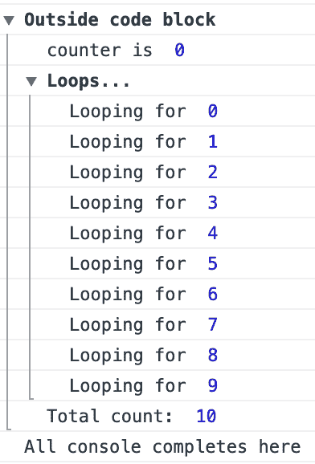

# 磨快 javascript 中的“控制台”斧头，以获得更好的日志记录

> 原文：<https://dev.to/elanandkumar/sharpen-your-console-axe-in-javascript-for-better-logging-44ed>

作为初学者，甚至是高级 web 开发人员，我们在开发或调试时往往会非常频繁地使用控制台。大多数时候，我们使用`console.log()`来输出任何变量/函数等的值。
虽然控制台还有其他一些很好的方便的方法，以及一些我们可以在现有的基础上做的改进。
因此，更常用的`console`方法如下:

*   `console.log()`
*   `console.error()`

我将在本文中解释的其他方法如下:

*   `console.dir()`
*   `console.table()`
*   `console.count()`
*   `console.group()`

我们将在下面逐一讨论这些方法的细节。所以，让我们开始吧，不要再拖延了。

## console.log()

这种方法用得最多，但更多的时候我们不知道它的全部内容。大多数时候我们把它用作`console.log(theObject)`或者我们也做类似
`console.log(theObject, theOtherObject, aString)`的事情。
还有一种我们可以使用的格式是`console.log(theMessageToPrint, theObjectOrValuesToPrint)`。

```
console.log('I like the new way of using %s', 'console.log');
// OR
console.log('Hello %s and %s, how are you doing?', 'Foo', 'Baz'); 
```

上述 console.log 的输出将是:

```
> I like the new way of using console.log
// OR
> Hello Foo and Baz, how are you doing? 
```

我们可以使用的常见占位符有:

*   `%s`花串
*   `%o`取一个对象(不为零)
*   `%d`它代表小数或整数

让我们看一个包含这三种元素的例子:

```
console.log('+%d for %s and %o to have methods which helps in debugging.', 10, 'JavaScript', window.console); 
```

这是输出。

[](https://res.cloudinary.com/practicaldev/image/fetch/s--JcDzmFGR--/c_limit%2Cf_auto%2Cfl_progressive%2Cq_auto%2Cw_880/https://thepracticaldev.s3.amazonaws.com/i/ps183d528n2t8n7djs20.png)

现在，最有趣的占位符出现了(至少对我来说)`%c`。此占位符用于 CSS 值。这意味着，给我们的控制台输出文本添加一些颜色。
我们来举例看看:

```
console.log('Hello red %cButton', 'background-color: red; color: white;'); 
```

[](https://res.cloudinary.com/practicaldev/image/fetch/s--X77KIcGm--/c_limit%2Cf_auto%2Cfl_progressive%2Cq_auto%2Cw_880/https://thepracticaldev.s3.amazonaws.com/i/je1zsoa1t35o5z9g2bks.png)

但是，有用吗？？？把你的想法写在评论区。

## 控制台.错误()

这个类似于`console.log()`,除了它用红色显示文本输出，浅红色背景，在最左边有一个十字图标。下面给出了例子。

```
console.error('I am error console and supports the features of "console.log()" with some added styles by default'); 
```

[](https://res.cloudinary.com/practicaldev/image/fetch/s--Vmt0q9CJ--/c_limit%2Cf_auto%2Cfl_progressive%2Cq_auto%2Cw_880/https://thepracticaldev.s3.amazonaws.com/i/ddmzte3857u9cxv0w6st.png)

## console.warn()

除了一些默认的样式，这个和`console.log()`类似。使用`warn()`，我们得到黄色的文本颜色和浅黄色的背景。它在最左边还有一个感叹号图标。

[](https://res.cloudinary.com/practicaldev/image/fetch/s--9ZQpI1m9--/c_limit%2Cf_auto%2Cfl_progressive%2Cq_auto%2Cw_880/https://cdn-images-1.medium.com/max/2600/1%2AUz1rC9k2edfRNDUARc3Gnw.png)

## console.dir()

虽然这与`log()`的工作方式相似，但略有不同。使用`dir()`时，输出更像是*查看输出的*方式。当我们在 html 元素上使用它时，效果会更好。
看下面给出的例子。

[](https://res.cloudinary.com/practicaldev/image/fetch/s--lOeSLw3P--/c_limit%2Cf_auto%2Cfl_progressive%2Cq_auto%2Cw_880/https://cdn-images-1.medium.com/max/1600/1%2AHyEHvqJEBMCcoqad376HwA.png)

在上面的截图中，我已经使用`document.createElement()`创建了一个 html 元素。然后，做了`console.log()` & `console.dir()`。

区别是显而易见的。因此，有时我们可能需要以`dir()`呈现的方式查看输出。去吧，去探索它。

## 控制台.表()

顾名思义，它以表格格式输出数据。与简单的数组日志记录相比，输出变得更加整洁和易读。让我们看看下面的数据列表:

```
const users = [{
    id: 'user_1',
    fName: 'Anand',
    lName: 'Kumar',
    displayName: 'AnandK'
}, {
    id: 'user_2',
    fName: 'Aarav',
    lName: 'Jha',
    displayName: 'AaravJ'
}]; 
```

我们通常如何处理这些数据？我们做`console.log(users)`。我们用`console.log()`看看它给出什么输出。

```
▶ (2) [{…}, {…}] 
```

上面的输出向我们展示了它是一个包含 2 个数据的数组。左边的小箭头帮助我们更详细地观察它。
但是，如果我们使用`console.table(users)`来控制用户阵列，输出看起来会更有帮助，如下所示:

[](https://res.cloudinary.com/practicaldev/image/fetch/s--MaK7SveI--/c_limit%2Cf_auto%2Cfl_progressive%2Cq_auto%2Cw_880/https://cdn-images-1.medium.com/max/1600/1%2AJT-DZveF5rLoDc6ehA-oLw.png)

`console.table()`还有第二个参数，我们可以用它来得到只包含所选列的输出。
我们来看看。

```
console.table(users, ["id", "displayName"]) 
```

这是输出。

[![console.table(users, ["id", "displayName"])](img/9a6a162c736a4eaaae04686d425541dd.png)](https://res.cloudinary.com/practicaldev/image/fetch/s--hPZVct0i--/c_limit%2Cf_auto%2Cfl_progressive%2Cq_auto%2Cw_880/https://cdn-images-1.medium.com/max/1600/1%2AqggLUDel0V6IZtRrrGQqvw.png)

输出表中的每个标题都是交互式的，也可用于对数据进行排序。在上面的截图中，当您与列进行交互以进行排序时，您可以在 displayName 列的右侧看到一个箭头作为指示器。

## console.count()

当我们想做一些命名的计数器时，这是很方便的。比方说，我们想知道一次执行发生的次数，我们可以使用`count()`来知道完全相同的事情。
我们来看一个例子。

```
for(let i = 0; i < 10; i++){
    if(i % 2 == 0)
    {
      console.count('Even number');
    } else {
      console.count('Odd number');
    }
} 
```

上面的输出会是这样的:

```
Even number: 1
Odd number: 1
Even number: 2
Odd number: 2
Even number: 3
Odd number: 3
Even number: 4
Odd number: 4
Even number: 5
Odd number: 5 
```

因此，我们可以从上面看到，使用 console 语句，它还为我们提供了特定输出的计数，该计数描述了它被调用的次数。如果你想重置计数，有一个叫做`console.countReset()`的方法可以重置计数。示例:

```
console.countReset('Even number'); 
```

请注意，当使用`countReset()`时，确保里面的文本与我们要重置计数器的文本相同。

## console.group()

最后但并非最不重要的是。顾名思义，我们可以用它来对控制台项目进行分组。这意味着，我们可以嵌套控制台项目，使其看起来像一个组。我们按实现来看一下。

```
var counter = 0;
console.group('Outside code block');
console.log('counter is ', counter);
console.group('Loops...')
for(var i = 0; i < 10; i++){
    console.log('Looping for ', i);
    counter++;
}
console.groupEnd();
console.log('Total count: ', counter);
console.groupEnd();
console.log('All console completes here'); 
```

上面代码块的输出在这里。

[](https://res.cloudinary.com/practicaldev/image/fetch/s--3ZqIyCVv--/c_limit%2Cf_auto%2Cfl_progressive%2Cq_auto%2Cw_880/https://cdn-images-1.medium.com/max/1600/1%2A80vwBuXB7OMKpcZQyEBzfw.png)

在这里，我们还使用了一个叫做`console.groupEnd()`的东西。当您想要结束某个特定群组时，可以使用此选项。当我们使用`group()`时，输出总是展开的(默认情况下),但是如果我们想要它折叠，有一个叫做`groupCollapsed()`的替代方法，它产生相同的输出，但是是在折叠模式下。如果我们不想在控制台中显示任何分组输出的所有展开内容，这是很有帮助的。

## 结论

我们真的需要一个结论吗？:)
无论如何，如果你想要的不仅仅是`console.log(theObject)`这些方法都很有用。
我发现，`console.table()`在这些工具中非常有用，但其他工具有时也很有用，因此将它保留在我们的武器库中以记录相关信息并无大碍。

控制台还有其他可用的方法，您可以自己探索。以下是规范的链接:[https://console.spec.whatwg.org](https://console.spec.whatwg.org)

并且，表现出一些爱，喜欢并关注更多这样的教程。