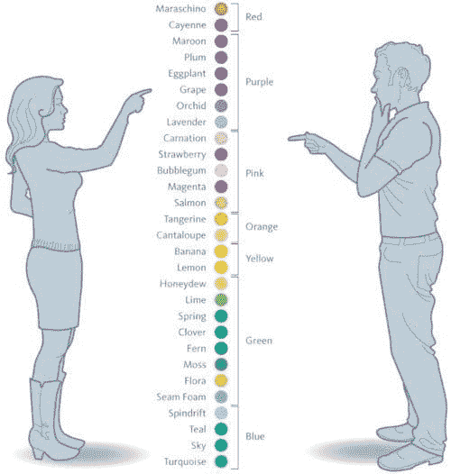
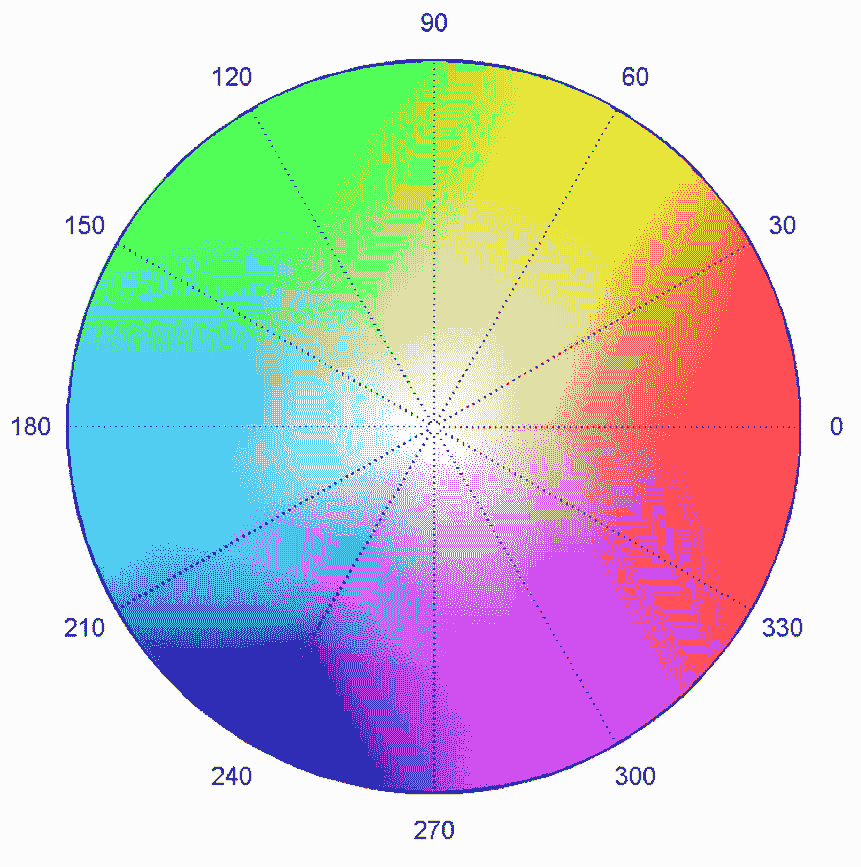
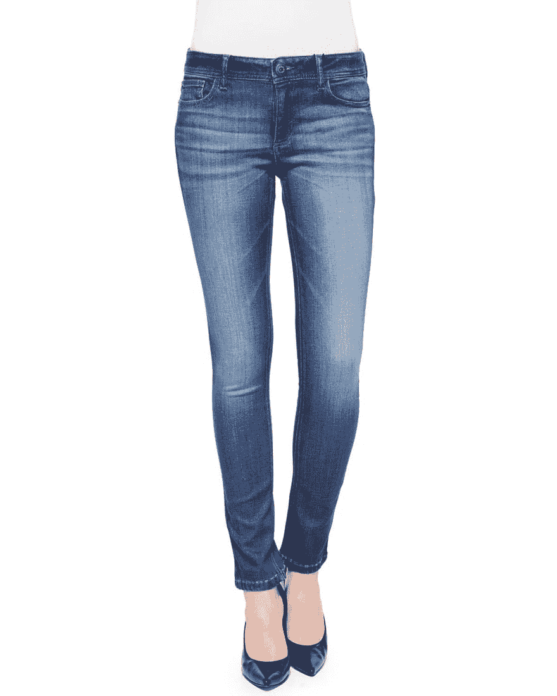
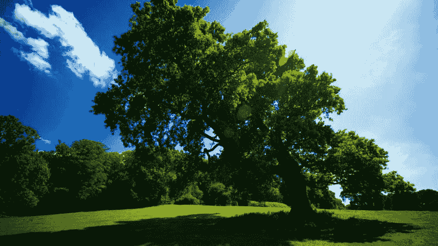
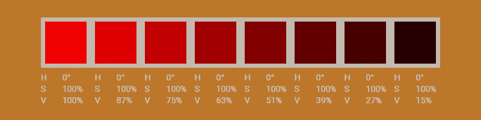
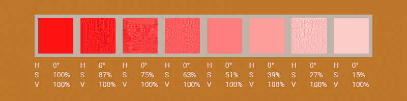
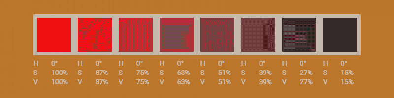
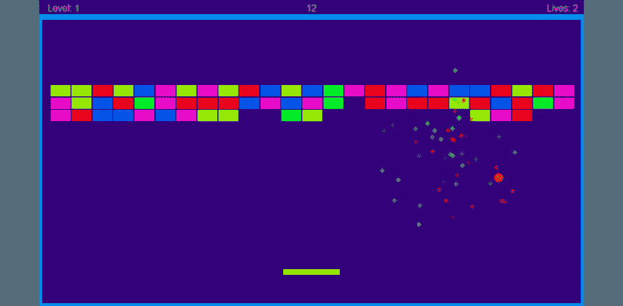

# 调和颜色

> 原文：<https://dev.to/svijaykoushik/harmonizing-colours-13l7>

你好世界！

我将在这里分享一个我在网上找到的简单方法，用 HSV 颜色模型创造和谐的色彩。我也将根据我作为初学者的理解来解释色调、饱和度和值这些术语。

因为我是网页设计的新手，所以选择一个好的颜色对我来说一直是一项艰巨的任务。这些颜色要么看起来不舒服，要么直直地刺痛我的眼睛。因此，我使用在线选色工具如 Adobe Kuler 和 T2 Paletton 来创建我的配色方案。我决定坚持选择传统的方法来创建配色方案，并避免创造一个自定义的口味。但很快我的好奇心开始爆发，我开始阅读关于网页设计和应用程序设计的文章，以了解其他人是如何创造和谐的定制色彩的。

## 使用 HSV/HSB 颜色模型

我读过的大多数文章都建议使用 HSV 颜色模型来创建自定义的颜色味觉，因为它允许选择我们在现实生活中感知的颜色。但是每篇文章都以一种独特的方式定义了这些术语，这让我很困惑，需要一点时间来理解这个想法。在这些文章中 [Tyler Seitz 的](https://tutsplus.com/authors/tyler-seitz)文章[在 tuts-plus 上为你的游戏作品选择调色板](https://gamedevelopment.tutsplus.com/articles/picking-a-color-palette-for-your-games-artwork--gamedev-1174)脱颖而出，因为它在使用 HSV 模型创建定制色彩方面采用了易于理解的算法。

根据他们的文章，可以通过平衡 HSV 模型中的两种成分来创造一种吸引人的色彩味觉。HSV 模型到底是什么？

根据维基百科，

> HSV 颜色模型的创建是为了更好地与人类视觉感知颜色属性的方式保持一致。

它有三个组成部分，即

### 1。顺化(越南城市)

根据维基百科，色调是

> 刺激可以被描述为与被描述为红色、绿色、蓝色和黄色的刺激相似或不同的程度

换句话说，色调是我们根据红色、蓝色、绿色和黄色来识别颜色的方式。例如，我们将玫瑰、木槿、苹果和郁金香识别为红色，尽管它们的颜色并不完全相同。我们认为绿松石是蓝绿色的，而不是绿色或蓝色的，因为它是两种颜色的混合。这个来自 [imgur](https://imgur.com/gallery/DxkYG3s) 的搞笑迷因给出了一个清晰的画面；)我们如何感知色彩。【T2

<figcaption>How people perceive hues</figcaption>

在 HSV 模型中，每种色调的颜色以放射状排列，并表示为 0 到 360 度。其中红色的色调值为 0，逆时针旋转 120 度，我们看到绿色，进一步旋转 240 度，我们看到蓝色。再往前走，我们在 0 点到达红色。[](https://res.cloudinary.com/practicaldev/image/fetch/s--d2UBMEgL--/c_limit%2Cf_auto%2Cfl_progressive%2Cq_auto%2Cw_880/https://svijaykoushik.github.io/blog/img/2019_03_03/color_wheel.png)

<figcaption>Colour wheel showing hues radially in a circular fashion</figcaption>

### 2。浸透

饱和度是颜色相对于光源亮度的强度。饱和度决定了一种颜色在光源中呈现的鲜明程度或苍白程度。为了客观地看待这个问题，想象一下，与我们衣柜里的新衣服相比，旧衣服看起来有多褪色。褪色的颜色饱和度较低，而鲜艳的颜色饱和度较高。这张褪色牛仔裤的图片是不同饱和度的最佳代表。 [](https://res.cloudinary.com/practicaldev/image/fetch/s--TyEv5r2h--/c_limit%2Cf_auto%2Cfl_progressive%2Cq_auto%2Cw_880/https://svijaykoushik.github.io/blog/img/2019_03_03/faded_denim.jpeg) 

<figcaption>图像以恒定的亮度来表示不同饱和度的牛仔蓝</figcaption>

有时饱和度低的颜色称为柔和色。在 HSV 模型中，饱和度取 0%到 100%之间的值。其中 0%饱和度使颜色为白色，100%饱和度具有最大强度。

### 3。价值

值表示颜色有多亮或多暗。当颜色的值分量减少时，它变得越来越暗，最终变成具有最低亮度的黑色。另一方面，增加值分量会使颜色更亮。亮度最高的颜色在完全饱和时被认为是纯色。在现实世界中，明暗度可以被想象为日常生活中物体的照明和阴影区域。被照亮的区域具有高亮度，而阴影中的物体部分具有低亮度。 [](https://res.cloudinary.com/practicaldev/image/fetch/s--S6-UGpLR--/c_limit%2Cf_auto%2Cfl_progressive%2Cq_auto%2Cw_880/https://svijaykoushik.github.io/blog/img/2019_03_03/shades_demo.jpg) 

<figcaption>图像来表示不同亮度下的绿色</figcaption>

## 算法创造和谐的色彩口感

***注意:从这一点开始，我将使用术语亮度来表示 HSV 模型的值部分，因为这样更容易理解。*T3】**

我发现泰勒·塞茨的算法在创造一种定制的色彩品味方面既简单又有效。我就在这里重复他们的算法。

> 要创建一个出色的调色板，你只需要遵循以下规则:
> 
> ```
> IF hues do not equal each other
> 
> THEN set saturations to match each other
> 
> AND set brightnesses to match each other
> 
> ELSE IF saturations do not equal each other
> 
> THEN set hues to match each other
> 
> AND set brightnesses to match each other
> 
> ELSE IF brightnesses do not equal each other
> 
> THEN set hues to equal each other
> 
> AND set saturations to equal each other 
> ```

## 色调、淡色和色调

我们可以扩展这种算法来创建特定色调的阴影、色彩和色调

```
// SHADES

SELECT a Colour

Keep the Hue constant

THEN Change the Brightness in equal intervals

AND Keep the Saturation unchanged. 
```

为了创造不同的红色阴影，我开始时亮度为 100%,然后平均降低 12%。这将产生 8 种色调的颜色。 [](https://res.cloudinary.com/practicaldev/image/fetch/s--o8U0eEFZ--/c_limit%2Cf_auto%2Cfl_progressive%2Cq_auto%2Cw_880/https://svijaykoushik.github.io/blog/img/2019_03_03/shades_of_red.jpg) 深浅不同的红色

```
// TINTS

SELECT a Colour

Keep the Hue constant

THEN Change the Saturation in equal intervals

AND Keep the Brightness unchanged. 
```

类似地，为了创建不同的色调，我从 100%的饱和度开始，然后将其均匀地降低 12，得到 8 个独立的色调。 [](https://res.cloudinary.com/practicaldev/image/fetch/s--bzI9e5p1--/c_limit%2Cf_auto%2Cfl_progressive%2Cq_auto%2Cw_880/https://svijaykoushik.github.io/blog/img/2019_03_03/tints_of_red.jpg) 

<figcaption>不同色调的红色</figcaption>

```
// TONES

SELECT a Colour

Keep the Hue constant

THEN Change the Brightness in equal intervals

AND Change the Saturation with the same interval. 
```

为了创建多种色调，我将再次从 100%的亮度和 100%的饱和度开始，并以 12 为单位减少它们，以获得 8 种不同的色调。 [](https://res.cloudinary.com/practicaldev/image/fetch/s--a-X5aqAc--/c_limit%2Cf_auto%2Cfl_progressive%2Cq_auto%2Cw_880/https://svijaykoushik.github.io/blog/img/2019_03_03/tones_of_red.jpg) 

<figcaption>不同色调的红色</figcaption>

## 结论

我用这个算法创造了一个味觉，这对于第一次尝试来说还不错。这就是我如何实现它的。

[](https://res.cloudinary.com/practicaldev/image/fetch/s--NAqPLFvg--/c_limit%2Cf_auto%2Cfl_progressive%2Cq_auto%2Cw_880/https://svijaykoushik.github.io/blog/img/2019_03_03/my_result.png) 

<figcaption>我的结果是在按照步骤创建一个色腭后</figcaption>

## 参考文献

1.  设计师色彩理论:如何创造自己的配色方案-[https://www . smashingmagazine . com/2010/02/Color-Theory-for-designer-part-3-creating-Your-Own-Color-palettes/](https://www.smashingmagazine.com/2010/02/color-theory-for-designer-part-3-creating-your-own-color-palettes/)
2.  为你的游戏作品挑选调色板-[https://Game development . tuts plus . com/articles/picking-a-Color-Palette-for-Your-Game-Artwork–Game dev-1174](https://gamedevelopment.tutsplus.com/articles/picking-a-color-palette-for-your-games-artwork%E2%80%93gamedev-1174)
3.  颜色:HSB 和色调-色调-阴影-[https://getpocket.com/a/read/1609347779](https://getpocket.com/a/read/1609347779)
4.  HSV 颜色模型-[https://en.wikipedia.org/wiki/HSL\_and\_HSV](https://en.wikipedia.org/wiki/HSL%5C_and%5C_HSV)