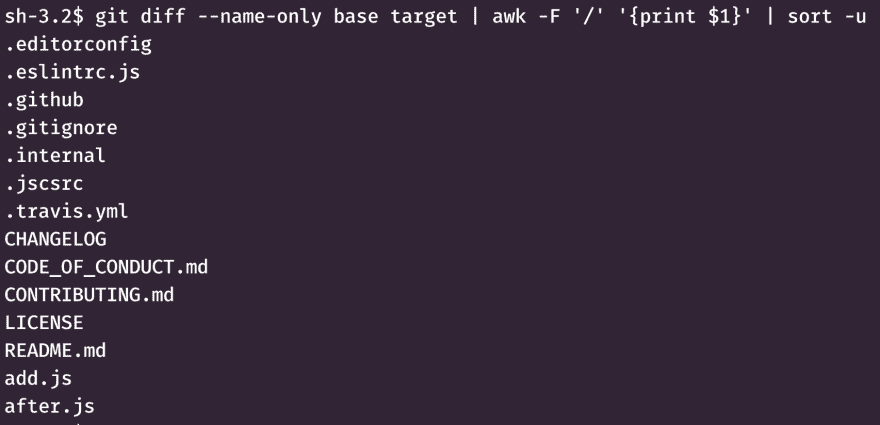

# 查找两个 Git 提交之间的变化，而不进行克隆

> 原文：<https://dev.to/eoinsha/find-changes-between-two-git-commits-without-cloning-4kkp>

在某些情况下，您希望找到 Git 存储库中的变更信息，而不必克隆整个存储库。这通常是在您的自动化构建环境中。当我使用 Jenkins、Travis 或 Circle CI 时，我可以访问克隆的 Git 库，并且可以毫无问题地使用`git log`、`git ls-remote`和`git diff`。

其他工具，我特别指的是 AWS CodeDeploy，采用了不同的方法。AWS CodeDeploy 不是让您访问克隆的 repo，而是给您一个没有`.git`文件夹的代码快照。这使得无法检查自上一次构建以来发生了什么变化，甚至无法确定触发您的构建的提交中发生了什么变化。一些 CI 环境会给你一个没有完整 Git 历史的“浅层克隆”,给你留下一个类似的挑战。

我想运行这种检查来确定 monorepo 中的哪些微服务发生了变化，这样我就知道要构建和重新部署哪些微服务。在这篇可发布的博客文章中很好地描述了这种技术。

我查看了两个选项，以找出自上次成功部署以来发生变化的文件夹:

1.  在代码构建步骤中手动克隆完整的存储库
2.  使用 GitHub API 检索关于提交的信息

第一个选择是我想要避免的。这意味着在构建开始时克隆一个潜在的大型且不断增长的存储库。浅层克隆是不够的，因为它不能捕获前一版本的变更历史。

GitHub REST API 包括一个 [*比较* API](https://developer.github.com/v3/repos/commits/#compare-two-commits) 和一个 [*列表提交* API](https://developer.github.com/v3/repos/commits/#list-commits-on-a-repository) 。比较 API 被限制为 250 次提交，因此不可靠。get-commits API 可以工作，但这意味着对大量数据进行多次分页请求，只是为了获得更改的路径。经过一段时间的反复试验，我最终放弃了 GitHub API 方法。

经过进一步挖掘，我发现了一个 StackOverflow 帖子，这给了我第三个选择。它允许我使用`git`命令获取两个单独的提交，然后进行比较以确定更改的文件名。在这个例子中，我使用公共的`lodash/lodash`存储库。假设我们想要比较标签`4.0.0`和`master`分支的`HEAD`之间的变化，命令序列如下所示:

```
git init .                                               # Create an empty repository
git remote add origin git@github.com:lodash/lodash.git   # Specify the remote repository

git checkout -b base                                     # Create a branch for our base state

git fetch origin --depth 1 4.0.0                         # Fetch the single commit for the base of our comparison
git reset --hard FETCH_HEAD                              # Point the local master to the commit we just fetched

git checkout -b target                                   # Create a branch for our target state

git fetch origin --depth 1 master                        # Fetch the single commit for the target of our comparison
git reset --hard FETCH_HEAD                              # Point the local target to the commit we just fetched

git diff --name-only base target                         # Print a list of all files changed between the two commits 
```

Enter fullscreen mode Exit fullscreen mode

这种最小获取方法的目录大小是 4.6M，而完整的`lodash`存储库是 49M。

[](https://res.cloudinary.com/practicaldev/image/fetch/s--818RYP7P--/c_limit%2Cf_auto%2Cfl_progressive%2Cq_auto%2Cw_880/https://thepracticaldev.s3.amazonaws.com/i/6lwlrl204jw37ynpx67e.png)

* * *

我是四定理的首席技术官。在推特上关注我: [@eoins](https://twitter.com/eoins)