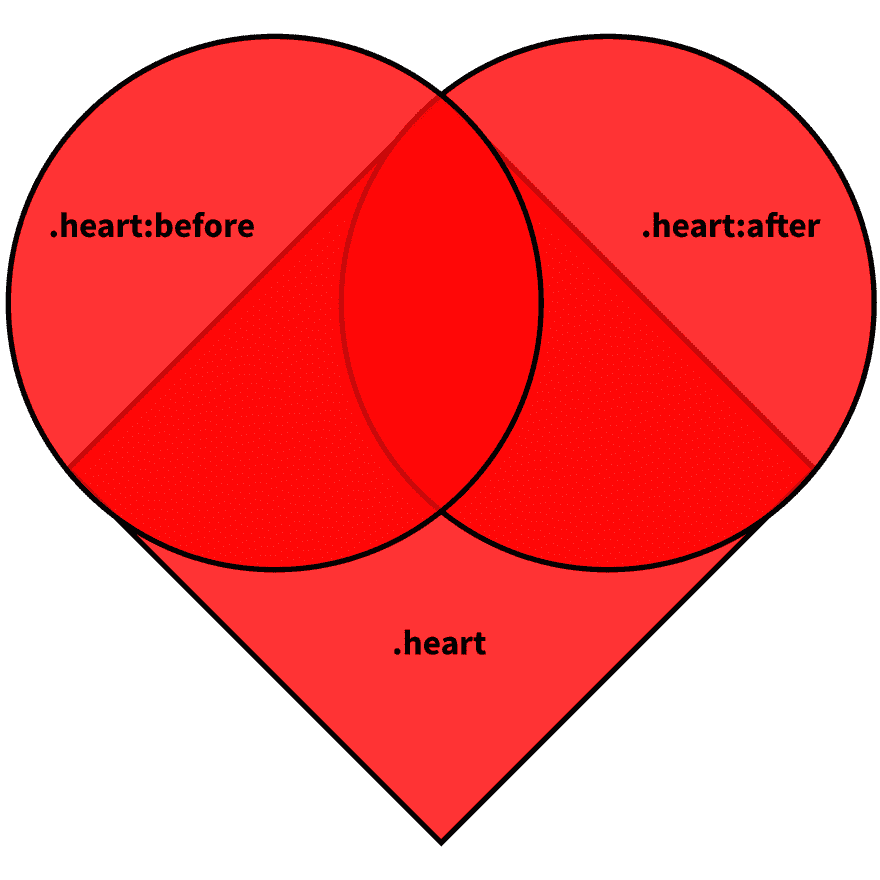
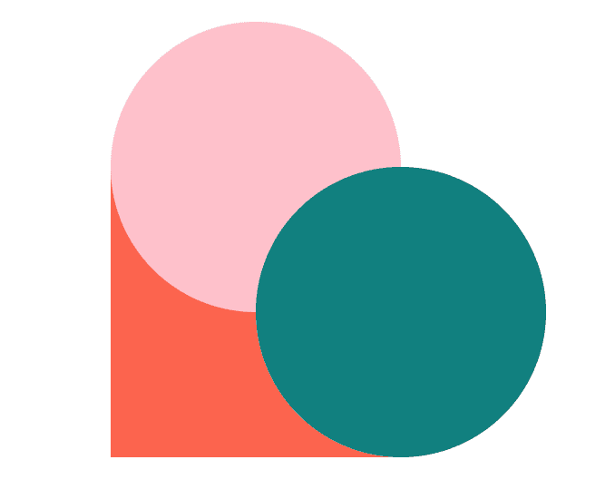
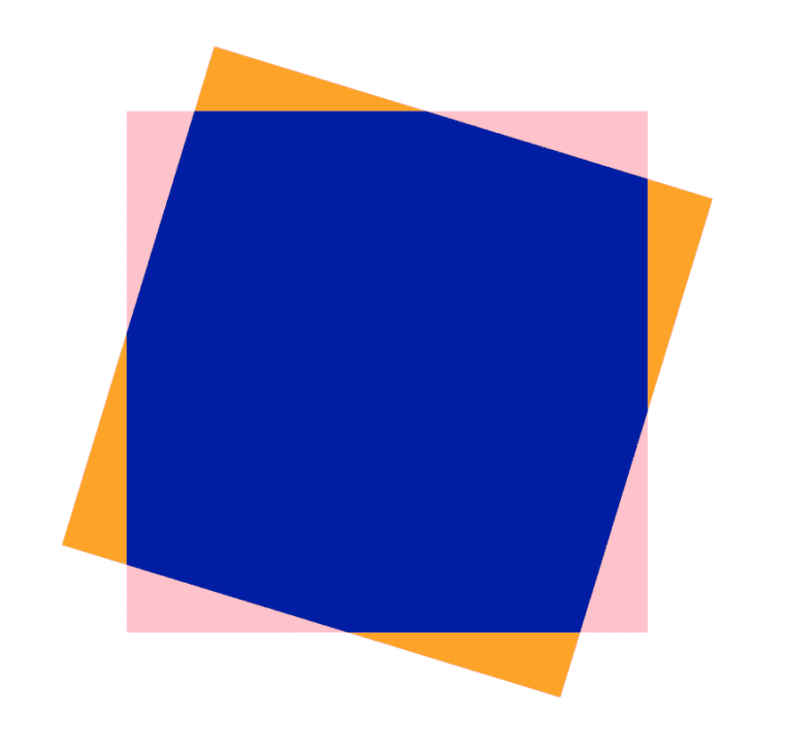

# “变换”为后代建立包含块

> 原文：<https://dev.to/wgao19/transform-establishes-containing-block-for-descendants-1d0a>

当我试图按照这个指南用 CSS 画一颗心的时候，出现了一个问题。

你先画一个盒子。然后你画两个圆，连接到盒子的两个相邻的边上。最后，将正方形旋转-45 度，使心脏直立(但盒子是用脚站立的)。

这个图表相当直观地展示了整个想法:

[](https://res.cloudinary.com/practicaldev/image/fetch/s--T5MH2Raj--/c_limit%2Cf_auto%2Cfl_progressive%2Cq_auto%2Cw_880/https://css-tricks.com/wp-content/uploads/2017/05/book-heart-figure-2.jpg)

出于学习的目的，我试图弄清楚哪边是对的。所以我继续改变了我的`::before`和`::after` :
的颜色

```
.heart:before {
  top: -15px;
  background-color: pink;
}
.heart:after {
  right: -15px;
  background-color: teal;
} 
```

[](https://res.cloudinary.com/practicaldev/image/fetch/s--VX2Bpt9m--/c_limit%2Cf_auto%2Cfl_progressive%2Cq_auto%2Cw_880/https://i.imgur.com/TKXeubZ.png)

看起来我的`::before`(粉色)在左边，我的`::after`(蓝绿色)在右边，我的心是逆时针旋转的，因为`::before`应该有负的`top`偏移，`::after`应该有负的`right`偏移。

为了验证这个想法，我决定把旋转心脏的线拿出来:

```
.heart {
  /* transform: rotate(-45deg); */
} 
```

我希望我的心能平静下来，对吧，就像这样:

[](https://res.cloudinary.com/practicaldev/image/fetch/s--RCLkjtcS--/c_limit%2Cf_auto%2Cfl_progressive%2Cq_auto%2Cw_880/https://i.imgur.com/otJ005K.png)

但是，呃，不。不完全是。一旦我删除该行并点击“刷新”。我的心碎了😱。或者更准确地说，被撕裂了。

[](https://res.cloudinary.com/practicaldev/image/fetch/s--ipOg6gKr--/c_limit%2Cf_auto%2Cfl_progressive%2Cq_auto%2Cw_880/https://i.imgur.com/EEWvJq5.png)

在我继续解释出了什么问题之前，我有几件事要坦白。

首先，我没有完全遵循指南。如果你复制并粘贴代码，你会注意到一个圆边没有出现。这是因为它缺少`::after`伪元素的偏移量定义。

但是我想你也是根据图表自己想出来的。

其次，我给了我的`.heart`元素一个边距偏移量，这样它就显示在我屏幕的中央:

```
.heart {
  margin: 100px auto 0;
} 
```

如果没有这一行，结果看起来会有点不同，但同样是错误的。

现在让我们一起试着修复它。

## 尝试修复

在我看来，我撕裂的心有相对于*视口*定位的`::before`和`::after`伪元素，而不是它们的父元素，即正方形`.heart`。

如果你对此不熟悉，我鼓励你阅读 CSS 规范[可视化格式模型](https://www.w3.org/TR/CSS2/visuren.html)。我在这里引用[第 9.8.4 节绝对定位](https://www.w3.org/TR/CSS2/visuren.html#absolute-positioning)中的话，*绝对定位盒为*:

> ...相对于其包含块定位。定位框的包含块由最近的定位祖先(或者，如果不存在，则为初始包含块)建立。

在人类语言中(精度稍有损失)，绝对定位的盒子被放置在距离其最近的祖先`position: relative`的位置。如果这样的祖先不存在，它们相对于根元素定位，根元素(大致)是视口。

所以看起来我的`::before`和`::after`伪元素找不到它们的`position: relative`祖先，所以相对于视口被放置。它们都有一个等于其直径一半的负偏移，所以我让它们被我的视口边缘整齐地切成两半。

知道了这一点，我应该能够通过将`position: relative`添加到我的`.heart`元素:
中来解决这个问题

```
.heart {
  /* transform: rotate(-45deg); */
  position: relative;
} 
```

并且，我的心被期待地固定下来， [CodePen: `position: relative`为后代](https://codepen.io/wgao19/pen/moPpEY)建立包含块:

[https://codepen.io/wgao19/embed/moPpEY?height=600&default-tab=result&embed-version=2](https://codepen.io/wgao19/embed/moPpEY?height=600&default-tab=result&embed-version=2)

## 失踪`position: relative`

一个直接的问题随之而来:我*没有*最初把`position: relative`放到我的`.heart`里吗？不是吧？为什么最初心脏是完整的？

我修改的唯一一行代码是:

```
.heart {
  transform: rotate(-45deg);
} 
```

所以在这期间一定发生了一些其他的事情*。如果我在没有`position: relative`的情况下尝试`transform: rotate(0deg)`，看看会发生什么？* 

```
.heart {
  transform: rotate(0deg);
  /* position: relative; */
} 
```

我有一颗躺着的心，和我之前的修复一模一样！ [CodePen: Transform 为所有后代建立一个包含块](https://codepen.io/wgao19/pen/LaNegv)

[https://codepen.io/wgao19/embed/LaNegv?height=600&default-tab=result&embed-version=2](https://codepen.io/wgao19/embed/LaNegv?height=600&default-tab=result&embed-version=2)

## `none`以外的  `transform`建立包含块

事实证明:

> transform 属性除了`none`之外的任何值也会导致元素为所有后代建立一个包含块。

第 3 节[说的是](https://www.w3.org/TR/css-transforms-1/#transform-rendering) [CSS 变换模块 1 级](https://www.w3.org/TR/css-transforms-1/)的变换渲染模型。

## 当你`transform`一个盒子而不是变换本身时会发生什么？

如果你改造一个东西，你会期望里面的东西一起被改造吗？如果你这样做了，你会和 CSS 的意图有相同的直觉。这包括:

*   **建立一个包含块**:(再次损失一些精度)绝对定位的子将根据它偏移，宽度/高度将根据它计算，等等。
*   **创建一个堆栈上下文**:即使你设置了一个`z-index`在这个范围内，你也不能让一些东西看起来像是“插入”到堆栈上下文中，因为堆栈上下文内部的任何东西相对于其外部来说都是原子的。

最后，变换*可以*扩展但不缩小溢出区的大小。直观地说，这意味着如果你变换一个盒子，任何可见的东西在变换后都会保持可见。在下图中，橙色部分将是扩展(可见)溢出区。

[](https://res.cloudinary.com/practicaldev/image/fetch/s--jcfM5Eao--/c_limit%2Cf_auto%2Cfl_progressive%2Cq_auto%2Cw_880/https://i.imgur.com/RojEhn1.png)

## 规格读数

希望对这个问题的探索能让你更容易阅读 CSS 规范的以下章节！

*   [CSS 转换模块级别 1](https://www.w3.org/TR/css-transforms-1)
*   [9 视觉格式化模型](https://www.w3.org/TR/CSS2/visuren.html)
*   [10 视觉格式化模型细节](https://www.w3.org/TR/CSS2/visudet.html)*