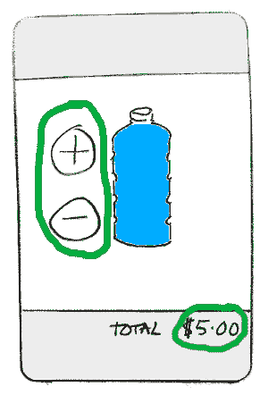
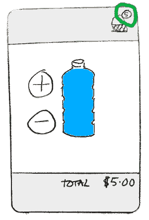
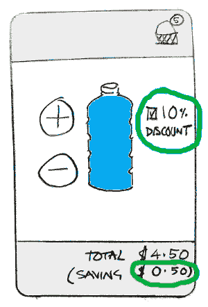
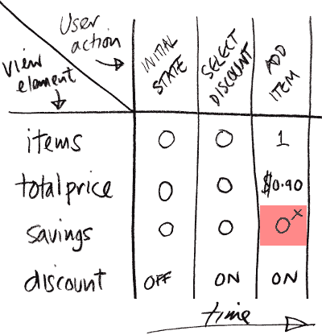
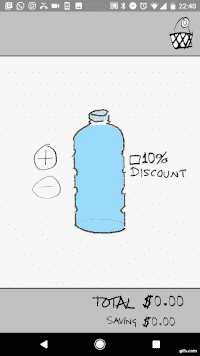

# 教程:发现故意的错误

> 原文：<https://dev.to/erdo/tutorial-spot-the-deliberate-bug-165k>

*这是 android 系列的一部分[fore](https://erdo.github.io/android-fore/)T3】*

| 系列教程 |
| --- |
| 1)教程:[发现故意的 bug](https://dev.to/erdo/tutorial-spot-the-deliberate-bug-165k) |
| 2)教程: [Android fore 基础知识](https://dev.to/erdo/tutorial-android-fore-basics-1155) |
| 3)教程: [Android 架构，全 todo app (MVO 版)](https://dev.to/erdo/tutorial-android-architecture-blueprints-full-todo-app-mvo-edition-259o) |
| 4)教程:[安卓状态诉事件](https://dev.to/erdo/tutorial-android-state-v-event-3n31) |
| 5)教程:[科特林协程，改型和前代](https://dev.to/erdo/tutorial-kotlin-coroutines-retrofit-and-fore-3874) |

如果你不是这个问题的 Android 开发者，不要担心，任何人都可以发现这个错误(但令人惊讶的是，很少有人发现这个错误，直到为时已晚——即使有这个警告！).

我们将要说明 UI 代码会变得多么复杂(即使是简单的视图)，然后该怎么办。

这是一个难看的队列破坏应用程序的用户界面，让漫游的工作人员在节日期间出售 1 美元一瓶的水。

<figure>

[](https://res.cloudinary.com/practicaldev/image/fetch/s--N5Wh53e0--/c_limit%2Cf_auto%2Cfl_progressive%2Cq_auto%2Cw_880/https://thepracticaldev.s3.amazonaws.com/i/6u44lbyharznmnht6sfq.png)

<figcaption>ugly water seller app</figcaption>

</figure>

像往常一样，我们首先编写一个模型(如果你想知道如何做，请参见第二个教程**)。我们不会在这里进一步讨论这个模型，除了说:我们称它为**篮子**；它是*可观测的*；单元测试又快又容易；完整的 kotlin 源代码在下面链接的 github repo 中；并且它有这些公共函数:** 

```
fun addBottle()
fun removeBottle()
fun setIsDiscounted(isDiscounted: Boolean)

fun getTotalItems(): Int
fun getTotalPrice(): Int
fun getIsDiscounted(): Boolean
fun getTotalSaving(): Int 
```

Enter fullscreen mode Exit fullscreen mode

# 查看代码

在 MVO 中应用 syncView()的经验法则是: ***“如果被观察的模型以任何方式发生变化，那么整个视图都会被刷新。”*** 。

让我们首先看看当我们**不**这样做时会发生什么(例如，许多视图层代码是如何编写的——特别是在像 MVP 这样的事件驱动架构中):

**第 1 步，共 3 步**

让我们从超级简单的开始:

<figure>

[](https://res.cloudinary.com/practicaldev/image/fetch/s--sLPBPZDq--/c_limit%2Cf_auto%2Cfl_progressive%2Cq_auto%2Cw_880/https://thepracticaldev.s3.amazonaws.com/i/0ah0red6lvbb6e6nhmwi.png)

<figcaption>ugly water seller app, first version</figcaption>

</figure>

我们所需要做的就是在 UI 中挂上**添加**和**删除**按钮，并确保我们记得更新**总价**。类似这样的事情很典型:

```
addButton.setOnClickListener {
    basket.addBottle()
    updateTotalPriceView()
}

removeButton.setOnClickListener {
    basket.removeBottle()
    updateTotalPriceView()
} 
```

Enter fullscreen mode Exit fullscreen mode

不要担心我们如何获得对 **addButton** 和 **removeButton** 的引用——这作为伪代码工作得很好(如果你感兴趣，可以查看下面的 github 源代码)。

对于 **updateTotalPriceView()** 调用，我们将最终将 UI 中的文本设置为模型告诉我们的内容。在一个真正的应用程序中，根据现有的架构，代码通常会首先通过各种组件，但如果我们一直跟踪到最后，我们最终会找到一段代码来做这样的事情:

```
totalPriceView.text = basket.getTotalPrice() 
```

Enter fullscreen mode Exit fullscreen mode

**第 2 步，共 3 步**

设计师有了一些灵感，决定添加一个篮子图标:

<figure>

[](https://res.cloudinary.com/practicaldev/image/fetch/s--SHL9a2kp--/c_limit%2Cf_auto%2Cfl_progressive%2Cq_auto%2Cw_880/https://thepracticaldev.s3.amazonaws.com/i/00tyvjpa6tpnrtj8nqhv.png)

<figcaption>ugly water seller app, second version</figcaption>

</figure>

这种改变非常简单，因为我们的模型已经支持它了，所以我们只需添加一个**updateTotalNumberOfItemsView()**方法，它会做您认为它会做的事情。我们还将更改按钮单击侦听器，以便它们调用 updateTotalPriceView()和 updateTotalNumberOfItemsView()

```
addButton.setOnClickListener {
    basket.addBottle()
    updateTotalPriceView()
    updateTotalNumberOfItemsView()
}

removeButton.setOnClickListener {
    basket.removeBottle()
    updateTotalPriceView()
    updateTotalNumberOfItemsView()
} 
```

Enter fullscreen mode Exit fullscreen mode

**第 3 步，共 3 步**

企业要求我们支持给学生 10%的折扣。没问题，因为我们提前阅读(...咳咳)，我们的模型已经有那个能力了。

<figure>

[](https://res.cloudinary.com/practicaldev/image/fetch/s--WVIiP80N--/c_limit%2Cf_auto%2Cfl_progressive%2Cq_auto%2Cw_880/https://thepracticaldev.s3.amazonaws.com/i/zdak5inya4lluftj7zv9.png)

<figcaption>ugly water seller app, final version</figcaption>

</figure>

因此，对于折扣复选框，我们调用**basket . setis discount(is checked)**，然后刷新 UI:**updatetolsavingsview()**，它显示已应用的折扣金额，以及**updatetolspriceview()**，因为这将发生变化。

我们**不**调用**updateTotalNumberOfItemsView()**(当然，因为折扣在那里不起作用)。

```
apply10PercOff.setOnCheckedChangeListener { isChecked ->
    basket.setIsDiscounted(isChecked)
    updateTotalPriceView()
    updateTotalSavingsView()
} 
```

Enter fullscreen mode Exit fullscreen mode

我们最终用类似这样的东西来实现视图层(这里没有编译，因为我们在这里只展示了重要的部分——完整代码见 github repo):

```
lateinit var addItemButton: Button
lateinit var removeItemButton: Button
lateinit var apply10PercOff: CheckBox

lateinit var totalItemsView: TextView
lateinit var totalPriceView: TextView
lateinit var totalSavingView: TextView

private fun setupButtonListeners() {

  addButton.setOnClickListener {
      basket.addBottle()
      updateTotalPriceView()
      updateTotalNumberOfItemsView()
  }

  removeButton.setOnClickListener {
      basket.removeBottle()
      updateTotalPriceView()
      updateTotalNumberOfItemsView()
  }

  apply10PercOff.setOnCheckedChangeListener { isChecked ->
      basket.setIsDiscounted(isChecked)
      updateTotalPriceView()
      updateTotalSavingsView()
  }
}

private fun updateTotalNumberOfItemsView() {
    totalItemsView.text = basket.getTotalItems()
}

private fun updateTotalPriceView() {
    totalPriceView.text = basket.getTotalPrice()
}

private fun updateTotalSavingsView() {
    totalSavingView.text = basket.getTotalSaving()
}

private fun updatePostRotation(){
    updateTotalNumberOfItemsView()
    updateTotalPriceView()
    updateTotalSavingsView()
} 
```

Enter fullscreen mode Exit fullscreen mode

**updatePostRotation()** 方法是用来处理 android 旋转的。我们可能也希望一些代码来禁用删除按钮时，篮子是空的等，但这将做我们的目的- **它已经足够复杂**。

# 臭虫

我说它足够复杂的原因是，我们已经设法引入了 bug。你发现了吗？如果我们只关注点击听众呢？(这不是语法错误，如果我们将点击监听器视为伪代码，该错误仍然存在于下面)

```
 addButton.setOnClickListener {
      basket.addBottle()
      updateTotalPriceView()
      updateTotalNumberOfItemsView()
  }

  removeButton.setOnClickListener {
      basket.removeBottle()
      updateTotalPriceView()
      updateTotalNumberOfItemsView()
  }

  apply10PercOff.setOnCheckedChangeListener { isChecked ->
      basket.setIsDiscounted(isChecked)
      updateTotalPriceView()
      updateTotalSavingsView()
  } 
```

Enter fullscreen mode Exit fullscreen mode

如果您还没有解决这个问题，那么当这些操作按顺序执行时，请遵循点击监听器中的代码(关注 savings 字段中的金额):

*   从一个空篮子开始
*   首先选择折扣复选框
*   然后添加一个项目

<figure>

[](https://res.cloudinary.com/practicaldev/image/fetch/s--vC3flmZC--/c_limit%2Cf_auto%2Cfl_progressive%2Cq_auto%2Cw_880/https://thepracticaldev.s3.amazonaws.com/i/txm92nh2ob03gwlnxfgs.png)

<figcaption>recreating the bug</figcaption>

</figure>

**我们忘记了从添加和删除点击监听器**中调用 updateTotalSavingsView()，因此视图中的节省值将是不正确的，除非再次切换折扣复选框。

像这样的 UI 一致性错误一直都在发生，即使是在简单的视图中。

不幸的是，视图层测试起来又慢又烦人(至少在 Android 上)，即使是自动化测试，这些类型的错误也很难发现。在这种情况下，自动化测试或人工测试人员必须以正确的顺序执行特定的动作**才能看到它。**

这就是为什么 syncView()会这样做。 ***“如果被观察的模型以任何方式改变，那么整个视图被刷新。”*** 。

应用那个原则，我们的代码可以这样重写:

```
 lateinit var addItemButton: Button
lateinit var removeItemButton: Button
lateinit var apply10PercOff: CheckBox

lateinit var totalItemsView: TextView
lateinit var totalPriceView: TextView
lateinit var totalSavingView: TextView

private fun setupButtonListeners() {

  addButton.setOnClickListener {
      basket.addBottle()
  }

  removeButton.setOnClickListener {
      basket.removeBottle()
  }

  apply10PercOff.setOnCheckedChangeListener { isChecked ->
      basket.setIsDiscounted(isChecked)
  }
}

fun syncView() {
    totalItemsView.text = basket.getTotalItems()
    totalPriceView.text = basket.getTotalPrice()
    totalSavingView.text = basket.getTotalSaving()
} 
```

Enter fullscreen mode Exit fullscreen mode

如果你想知道这里讨论的这些是如何连接起来的，这就跳过了一些细节。对于我们的目的来说，只要知道我们的购物篮模型发生变化，就会调用 syncView()就足够了。

令人惊讶的是，它不仅比**更健壮**，而且比**更少的代码**。(而且任何 android 视图都可以这样写，包括那些使用适配器的)。

这里有一些写好 syncView()函数的[技巧](https://erdo.github.io/android-fore/01-views.html#writing-an-effective-syncview-method)。

<figure>

[](https://res.cloudinary.com/practicaldev/image/fetch/s--g2As5d8H--/c_limit%2Cf_auto%2Cfl_progressive%2Cq_66%2Cw_880/https://thepracticaldev.s3.amazonaws.com/i/eox7auhypfsnx0j18pgl.gif)

<figcaption>full app, rotation support as standard</figcaption>

</figure>

这个非常简单的 app，没有动画代码，但是:清晰；健壮；没有内存泄漏；这是可以测试的。它支持旋转——在你开始添加漂亮的动画和最后的润色之前，这是一个很好的位置。

* * *

感谢阅读！我希望你从中有所收获，即使你不是 Android 开发者。如果你正考虑在你的团队中为一个 android 项目使用 fore，fore 文档包含了易于理解的示例应用中的大部分基础知识，例如[适配器](https://erdo.github.io/android-fore/#fore-3-adapter-example)、[网络](https://erdo.github.io/android-fore/#fore-4-retrofit-example)或[数据库](https://erdo.github.io/android-fore/#fore-6-db-example-room-db-driven-to-do-list)。

这里是教程的完整代码**