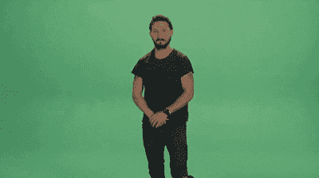

# 我如何克服在公共场合讲话的恐惧

> 原文：<https://dev.to/fabiengreard/how-i-manage-to-overcome-my-fear-of-talking-in-public-2p1>

首先，我不是说这对你有用，但对我肯定有用。
回到今年早些时候，我和其他一些人开始了一个名为 [aixTalks](https://aixtalks.com/) 的当地“聚会”，这是一个位于普罗旺斯地区艾克斯的法国聚会，我们的想法来自 [humanTalks](https://humant%20talks.com/) 同样是法语，所以基本上是 4 个人在短短的 10 分钟内谈论一些事情(主要是发展方面的事情)。

## 我是怎么弄成这样的？

很遗憾，我找不到让我这样做的帖子，但肯定是在 dev.to 上，说你应该提高你的公共演讲技巧，回到 2 个月前，我的演讲很糟糕，还有很多需要改进的地方，但我肯定在正确的道路上。

所以两个月前我回来了，准备做我的第一次演讲，我说话总是有困难，总是说得太快，家人和朋友听不懂我的话，总是给我巨大的压力。我在 8 岁或 9 岁的时候看过一个语言治疗师，但即使在那之后，有阅读障碍，这不是你可以轻易摆脱的事情。

回到我第一次选择的谈话，我总是喜欢看男人或女人试图用一点讽刺来表达观点的谈话，所以我开始谈论当你在做`yarn install`或`npm install`时它真正意味着什么，表明你可以存储多少弗雷迪·水星的照片，而不是有一个巨大的文件夹`node_modules`(对说法语的人来说，这都是在 [youtube](https://www.youtube.com/watch?v=CkhHnTwnReY) 上直播的)？

## 不再强调

我们(或者至少是我)被告知，演讲需要魅力、风度和自信...这并不全是错的，然而要开始，你并不需要所有这些，事实上你只需要一个对你来说重要的主题，你将能够克服一切！

这听起来不错，但是真正抗压力呢？对我来说，只有一个好的解决方案，对于 10 分钟的演讲，我花了 4 个小时写文章，然后花了 2 个小时做幻灯片，再花 4 个小时对着镜子学习演讲，我一直在学习，直到感觉很自然。

你还记得 10 岁的时候学诗吗？就是这样，这就是我所做的一切，但不是在我面前上课(这不是真的，因为我总是转过身去看纸板)，而是有人喜欢你做的事情，或者至少当你拼写错误时，他们不会嘲笑你。

也不要忘记你不是唯一的一个，每个人都低估了自己，所以如果你想做一些让你害怕的事情，只要关掉你大脑的这一部分，另一部分会帮助你！

## 感觉好吗？

是的，对我来说，这就像是大声对每个对我说:“男人公开演讲永远不会是你的事”的人说。

这就是我想和你分享的，也许有一天我会用英语做一些事情，但那是另一个时间的另一个故事了。

值得一提的是:在不到两个月的时间里，订阅我们会议的人数从 10 人增加到了 130 多人，太棒了，但是我们已经有了合作伙伴！

