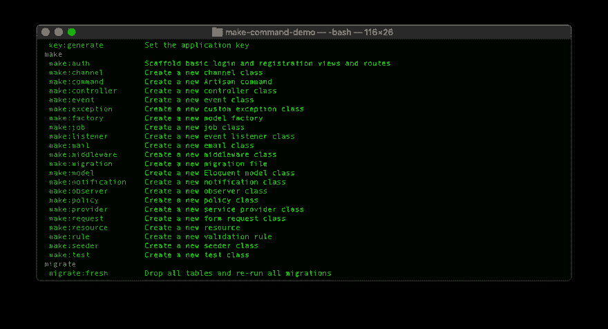

# Laravel:制作制作命令

> 原文：<https://dev.to/slyfirefox/laravel-making-make-commands-354g>

<figure>[](https://res.cloudinary.com/practicaldev/image/fetch/s--MxJSBZM6--/c_limit%2Cf_auto%2Cfl_progressive%2Cq_auto%2Cw_880/https://cdn-images-1.medium.com/max/1024/0%2AVaU7iJlplz2ALO2d) 

<figcaption>照片由 [Neven Krcmarek](https://unsplash.com/@nevenkrcmarek?utm_source=medium&utm_medium=referral) 上 [Unsplash](https://unsplash.com?utm_source=medium&utm_medium=referral)</figcaption>

</figure>

Laravel 有许多有用的小 make 命令。这些允许你基于模板生成一个新的类，但是用你自己的命令来做这件事有多容易呢？不出所料，这实际上很简单，但你不会发现它被记录在案。

<figure>[](https://res.cloudinary.com/practicaldev/image/fetch/s--hezxH1V---/c_limit%2Cf_auto%2Cfl_progressive%2Cq_auto%2Cw_880/https://cdn-images-1.medium.com/max/934/1%2ANL1m7pRIhNvI0hIstOwUzw.png) 

<figcaption>复制工匠制作命令</figcaption>

</figure>

我们将首先使用 make 命令来创建新的 make 命令。这是在终端中用 artisan 命令完成的:

```
php artisan make:command Make\\MakeClassCommand 
```

Enter fullscreen mode Exit fullscreen mode

这将在 app/Console/Commands/Make 文件夹中创建一个新的命令类，如果一切正常，我们应该在那里有一个 MakeClassCommand.php 文件。

我们现在需要定制我们的命令来创建新的类。第一部分是扩展 Illuminate \ Console \ generator Command 类，而不是默认的 *Command* 类。这是 Laravel 框架中的一个类，所有 make 命令都是从这个类继承的。这将工作减少到只编辑和添加一些方法和属性。我们可以从移除 handle 方法和 constructor 方法以及 signature 属性开始，我们不需要这些，因为 *GeneratorCommand* 类已经有了它们。

下一步是向该类添加一些属性。也就是说，我们需要一个名称和类型属性。该名称只是命令的签名，但没有任何参数。该类型仅用于控制台输出的一些内容，如消息“ *{type}已成功创建*”。我们的类目前应该是这样的: