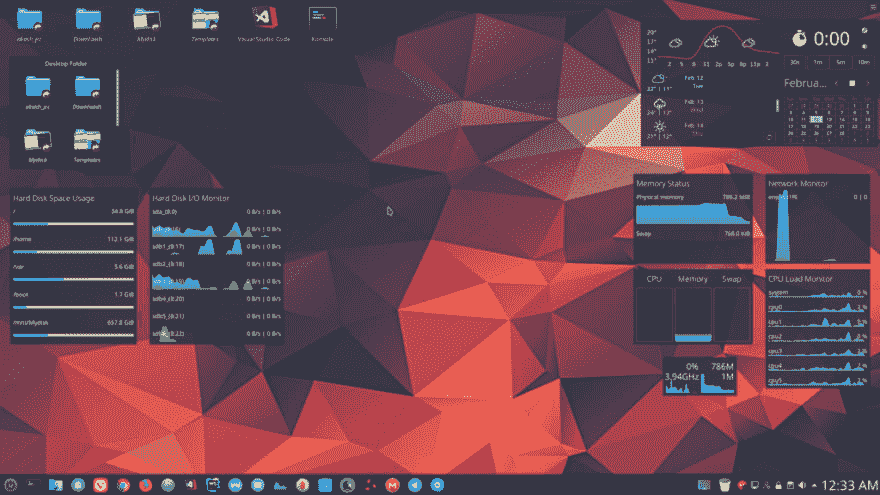
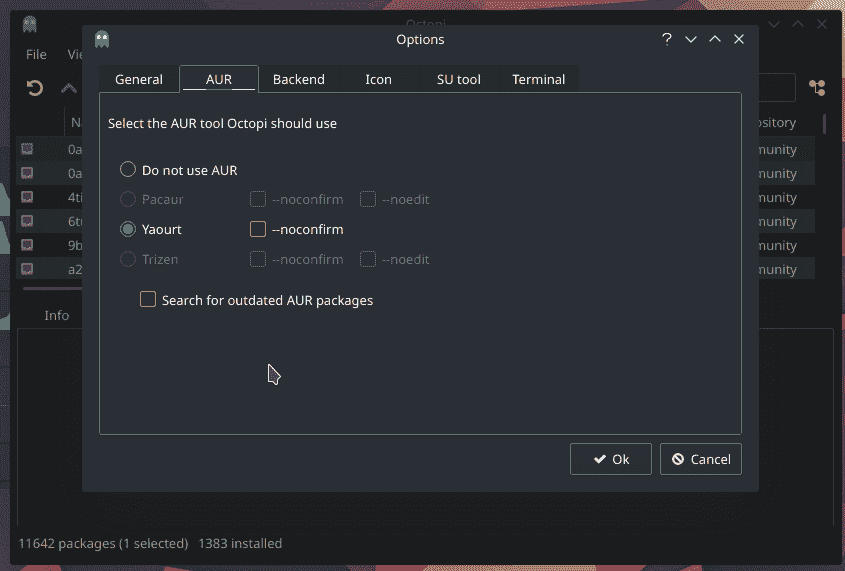
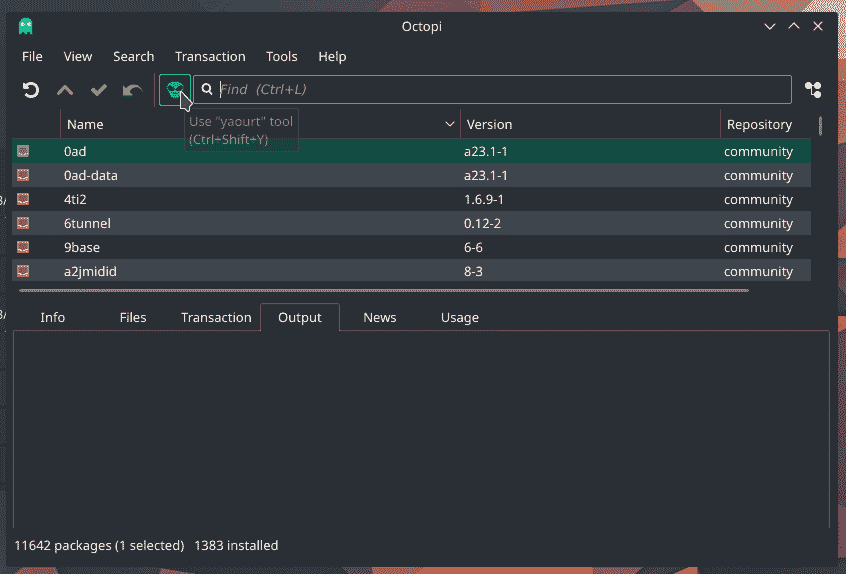
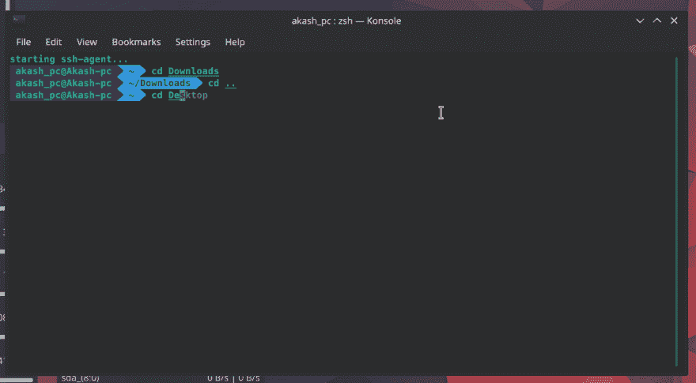

# 从头开始设置 Manjaro Linux！！

> 原文：<https://dev.to/akash_rajvanshi/setting-up-manjaro-linux-from-scratch-55n>

<figure>[](https://res.cloudinary.com/practicaldev/image/fetch/s--rSvfFGwf--/c_limit%2Cf_auto%2Cfl_progressive%2Cq_auto%2Cw_880/https://cdn-images-1.medium.com/max/1024/1%2AenMY7zrq6lHiaSDRwq1Qhg.png) 

<figcaption>我的曼哈罗桌面</figcaption>

</figure>

### **第一步:下载镜像文件**

从他们的 [***官网***](https://manjaro.org/download/kde/) 下载一个镜像文件，通过 Rufus 之类的任何引导软件安装这个镜像文件。

> **注意:**在 **DD** 模式下选择写入。(这个选项是特别为曼加洛 KDE 版本)和其他曼加洛版本选择“ISO 图像模式”

**推荐:曼哈罗 KDE** (如果你的 PC/笔记本有 i5 的话)。

**问题**:有时当你在 **DD** 模式下写下你的 **ISO** 时，你的 u 盘会显示更少的空间。就像如果 USB 是 8gb，那么它只显示 4mb 大小的整个笔驱动器。
**解决此问题**:在 Linux 中插入 u 盘(只有 Linux 和 MacOS 可以解决此问题)。

打开 **KDE 分区管理器**(在 Manjaro 中)，删除当前 u 盘中存在的所有分区，并分配新的分区(这将解决您的问题)。

现在通过 u 盘安装系统。

* * *

### **第二步:分区**

> 比如:—如果你和我一样有 250GB 的 SSD
> 
> 否则，根据您的需要对驱动器进行分区。

```
Root (/) — Primary ( 50–60 GB)

Home (/home) — Primary (As per Need )(In my system (150 -160 GB)

Boot (/boot) — Primary ( 2–3 GB)

Extended (/Logical) — Remaining space( Total =250 Gb — 60Gb —150Gb — 3Gb = 37GB)

Var (/var) — 17GB(Because its stores all the temps and caches)

Swap(Linux Swap) — 20GB ( Mainly 2 X RAM) 
```

* * *

### 第三步:在曼哈罗安装**雅古尔**

> Yaourt 代表**又一个用户存储库工具**
> 
> 是一个命令行界面程序，完成了在 Archlinux 上安装软件的 pacman。

#### **安装:-**

#### **1。使用自定义存储库。**

```
sudo nano /etc/pacman.conf 
```

在文件末尾添加以下内容。

```
[archlinuxfr]  
SigLevel = Never  
Server = http://repo.archlinux.fr/$arch 
```

保存并关闭文件。

现在使用命令更新 Repo 数据库并安装 Yaourt。

```
sudo pacman -Sy yaourt 
```

#### **2。使用 AUR**

```
sudo pacman -S --needed base-devel git wget yajl 
```

在安装了必要的依赖项之后，我们必须安装软件包——允许构建和运行 yaourt 的查询。

```
git clone https://aur.archlinux.org/package-query.git

cd package-query/

makepkg -si

cd ..

git clone https://aur.archlinux.org/yaourt.git

cd yaourt/

makepkg -si

cd ..

sudo rm -dR yaourt/ package-query/ 
```

> 逐行运行这些命令。(我没有在本文中解释每一个命令。如果想了解更多请跟随 [**这个**](https://www.ostechnix.com/install-yaourt-arch-linux/)

这将在系统中安装 Yaourt。

**Yaourt 的一些基本用法**

*   更新 Arch Linux

```
yaourt -Syu 
```

*   安装软件包

```
yaourt -S <package-name> 
```

*   升级软件包

```
yaourt -U <package> 
```

<figure>[](https://res.cloudinary.com/practicaldev/image/fetch/s--7iwfHRjA--/c_limit%2Cf_auto%2Cfl_progressive%2Cq_auto%2Cw_880/https://cdn-images-1.medium.com/max/845/1%2ALSD0D21FSotbi7n5Z48Vrw.png) 

<figcaption>在 Octopi 中启用 yaurt</figcaption>

</figure>

<figure>[](https://res.cloudinary.com/practicaldev/image/fetch/s--HhmvUgPC--/c_limit%2Cf_auto%2Cfl_progressive%2Cq_auto%2Cw_880/https://cdn-images-1.medium.com/max/846/1%2AKPcDGRP6SfRjv6WWJca3Lw.png) 

<figcaption>这个骷髅按钮就是雅乌尔</figcaption>

</figure>

* * *

### **第四步:申请**

> 安装一个系统后，我们会安装一些我们需要的基础 app。
> 
> 启用 AUR : —打开 Octopi，然后转到工具并启用 AUR。

**1。浏览器**

1.  **Mozilla Firefox** —默认安装。
2.  **谷歌浏览器**——使用 AUR 安装(AUR 的包名——`{{ google-chrome }}`)。
3.  **维瓦尔第** —使用 Yaourt lib 安装(点击 Octopi 中的 Skeleton 按钮，然后搜索`{{ Vivaldi }}`

**2。代码编辑器**

1.  原子——AUR
2.  **网络风暴**——作者:约特
3.  **VS 代码工作室** —作者 Yaourt(搜索— `{{ Visual-studio-code-bin }}`

**3。For _ 下载**

1.  AUR
2.  **传输(Torrent_Client)** — AUR `{{ Transmission-cli }}`

**4。For_Email**

1.  **MailSpring**——作者 Yaourt

**5。其他 _ 应用程序**

1.  **电报 _ 桌面** —由 Aur
2.  **弗朗茨**——由酸奶`{{ Franz-bin }}`制成
3.  **超级同步**——作者:约特`{{ megasync }}`
4.  **Stacer(清理工具)** —由 Yaourt `{{ stacer }}`
5.  **TimeShift(备份软件)**——AUR
6.  **清扫器(系统清洁器)**—AUR
7.  **发现(软件经理)** —作者 AUR

> 现在我们已经有了我们需要的所有基本应用程序。

* * *

### 第五步:获取 KDE-等离子的所有 app

> 只有当你有高配置的 Pc 时才遵循这个步骤，否则它会降低你的系统速度或者安装它的小软件包。

```
Sudo pacman -S Plasma kio-extras 
```

*   所有应用程序

```
Sudo pacman -S Kde-applications 
```

*   选定的应用

```
Sudo pacman -S Kdebase 
```

*   其他一些设置是针对 kde SDDM 的(默认显示管理器)

```
Sudo Systemctl enable sddm.service --force  
reboot 
```

*   更新当前用户

```
/usr/bin/cp -rf/etc/skel/.  
reboot 
```

* * *

### 第六步:系统配置

*   **桌面主题** —微风暗
*   **观感** —微风暗
*   **光标** —微风
*   **闪屏**—adaptea
*   **颜色** —呼吸黑暗
*   **字体** —已知无 10
*   **图标** — Breeze 或 La Captaine
*   **应用风格** —微风

#### 微件

*   **活动日历**
*   **内存状态**
*   **网络监视器**
*   **系统负载查看器**
*   **CPU 负载监视器**
*   **资源监视器**
*   **硬盘空间使用情况**
*   **硬盘 I/O 监视器**

#### 一些重要设置:-

**转到系统设置和启动和关机部分**

*   ***点击*** —桌面会话`{{ Restore Manually Saved Session }}`
*   ***点击*** —默认请假选项`{{ End Current Session }}`
*   ***点击*** —自动启动`{{ Disable all applications }}`

否则它会减慢你的电脑，并随时打开新的桌面。

* * *

### 第七步:安装第二个存储驱动器(增加存储容量)

> 此选项仅适用于系统中有第二个存储驱动器的情况。
> 
> 比如我们的系统中有两个存储驱动器 **1 个固态硬盘+ 1 个硬盘**
> 
> 然后，我们将我们的系统安装在 SSD 中，并使用 HDD 作为系统的媒体和其他文件。

#### 分区、格式化和挂载

*   **分区**

```
Sudo fdisk-l 
```

检查你的硬盘的文件系统格式是否基于/dev/sda 上的 1TB MyHdd，但是我们现在不能挂载它，如果我们挂载的话会出现错误。

我们需要先把它分区:

```
Sudo fdisk /dev/sda 
```

**注意**—“m”帮助(命令列表)
检查分区表—“P”(输入 P)
要分区，输入“n”，然后只需通过输入“P”
选择 primary，然后输入“1”只需一个分区号。

*   **格式化**

格式化新分区的硬盘(记住硬盘的 fs 格式)

```
Sudo mkfs.ext4 /dev/sda 
```

*   **安装**

通常驱动器安装在/mnt
中

```
Sudo mkdir /mnt/sda 
```

然后我们可以通过:-
来挂载它

```
Sudo mount /dev/sda /mnt/sda 
```

每当我们重新启动它会自动安装。

我们用 **nano /etc/fstab**

**注** —将此登录终端另存为 Root。

```
/dev/sda /mnt/sda ext4 default 0 0 
```

> **1。硬盘路径
> 
> 2 .挂载的硬盘目的地
> 
> 3 .格式类型
> 
> 4–6。保留为默认 0 和 0。**

* * *

### 第 8 步:通过 TimeShift 创建系统备份

> 当你完成安装所有的应用程序，然后设置所有的设置。现在是时候创建系统的备份了。
> 
> 如果你不小心删除了任何系统文件或者中途发生了任何错误，这个备份是很有用的。
> 
> **注意**-创建备份后，我们会将其文件保存在第二个存储驱动器或外部 hdd 中(因为我的 ssd 中没有空间来永久保存该备份。但是，如果您的 ssd 中有空间，则不要执行步骤 2 之后的步骤。

第一步。打开时移

第二步。创建快照

第三步。现在复制外部硬盘/第二硬盘中的所有备份文件。

以根用户身份打开终端

```
cp -a /timeShift/snapshots/{your snapshot name}/ /mnt/{Name of your 2nd storage drive}/backup 
```

> **注意** —备份来自该命令，因为没有该命令，系统无法向我们提供直接复制的权限。并创建您的备份压缩版本，然后您将能够保存在外部硬盘。

**进行恢复** —打开 octopi，搜索 TimeShift，然后安装

并将整个快照复制到那个文件夹**Root/timeShift/snapshot s/**

接下来，恢复选项会出现在 timeShift 中。

* * *

### 第九步:定期清理 Tmp

> 定期清理 **/Var/tmp** 文件夹，如果不定期清理，系统会崩溃(只有当 **var** 文件夹没有剩余空间时)。

*   **自然法**

打开文件管理器，进入 **Root/var** 文件夹，根据需要清理文件夹，通过“Root Actions”选项删除。

我们将从终端检查在 **Var 文件夹中有多少空间被占用。**

```
df -h 
```

*   **自动化方法**

定期运行**清扫器**和**堆垛机**。

* * *

### 第十步:配置 oh-my-Zsh 终端

> oh-my-Zsh 是我用过的最好的终端。

对于 Zsh，我们必须预先安装这些:

1 . git

2 . curl

3 . wget

*   通过卷曲

```
sudo sh -c "$(curl -fsSL https://raw.githubusercontent.com/robbyrussell/oh-my-zsh/master/tools/install.sh)" 
```

*   吃豆人

```
pacman -S Zsh 
```

**Zsh 的一些设置:**

*   从— zsh 切换到 bash，反之亦然

```
exec bash (to bash)   
exec zsh (to zsh) 
```

*   更改默认外壳

```
chsh -s /bin/zsh 
```

*   手动更新

```
upgrade-oh-my-zsh 
```

*   卸载 zsh

```
uninstall-oh-my-zsh 
```

*   shells 列表(安装在您的系统中)

```
cat /etc/shells 
```

*   插件(在我的系统中)

```
plugins=(git
       archlinux
       brew
       command-not-found
       github
       npm
       node
       ruby
       ssh-agent
       sublime
       sudo terminalapp
       vscode
       web-search
       gem
       rvm
       bundler
       copyfile
       zsh-syntax-highlighting
       zsh-autosuggestions
       ); 
```

*   主题(在我的系统中)

```
ZSH\_THEME=agnoster 
```

*   路径(隐含)

```
.Zshrc file in Home Directory

1\. # Path to your oh-my-zsh installation.
  export ZSH="/home/{{ Pc\_UserName }}/.oh-my-zsh"

2\. source $ZSH/oh-my-zsh.sh

3\. # If you come from bash you might have to change your $PATH.
# export PATH=$HOME/bin:/usr/local/bin:$PATH 
```

*   自定义插件

*添加语法高亮显示*

```
git clone https://github.com/zsh-users/zsh-syntax-highlighting.git  
${ZSH\_CUSTOM:-~/.oh-my-zsh/custom}/plugins/zsh-syntax-highlighting 
```

*汽车建议*

```
git clone https://github.com/zsh-users/zsh-autosuggestions ${ZSH\_CUSTOM:-~/.oh-my-zsh/custom}/plugins/zsh-autosuggestions 
```

> 从 zsh_Terminal 运行这两个代码

现在，激活—转到。主目录中的 Zshrc 文件。

添加:

```
plugins=( 
          zsh-syntax-highlighting
          zsh-autosuggestions
        ); 
```

*   字体和配色方案设置

**在空的 ***zsh_terminal*** 上右击**并点击**编辑当前轮廓**然后点击**出现。**

```
Color-Scheme & background - Maia  
font - Meslo LG S DZ for Powerline 
```

**安装-** [**电力线字体**](https://github.com/powerline/fonts)

* * *

*   **Zsh 的文章**

[**1。agnoster**](https://github.com/agnoster)**/**[**agnoster-zsh-theme**](https://github.com/agnoster/agnoster-zsh-theme)

[**2。电力线/字体**](https://github.com/powerline/fonts)

<figure>[](https://res.cloudinary.com/practicaldev/image/fetch/s--hozq4Gf3--/c_limit%2Cf_auto%2Cfl_progressive%2Cq_auto%2Cw_880/https://cdn-images-1.medium.com/max/984/1%2Aca_Q6hA9q4yT5_k4t0fhvA.png)

<figcaption>oh-my-zsh</figcaption>

</figure>

* * *

找到有用的东西了？按下💖来支持和帮助别人找到这篇文章。感谢阅读！！

*在 Instagram 上关注我*[***@ hypnosiss _ _***](https://www.instagram.com/hypnosisss___/?hl=en&source=post_page---------------------------)*&推特*[***【akash _ Raj vanshi***](https://twitter.com/Akash_Rajvanshi?source=post_page---------------------------)

查看我的其他生产力工具帖子:

*   [***在 GitHub 上推送你的第一个项目的分步指南！！***](https://hackernoon.com/step-by-step-guide-to-push-your-first-project-on-github-fec1dce574f?source=post_page---------------------------)
*   [***每个程序员都应该知道的终极 JavaScript 资源！！***](https://hackernoon.com/ultimate-javascript-resources-that-every-programmer-should-know-9889d4fd691?source=post_page---------------------------)
*   [***为前端开发设置 Visual Studio 代码！！***](https://medium.com/hackernoon/setting-up-vs-code-for-front-end-development-f2c8b87d656)

* * *