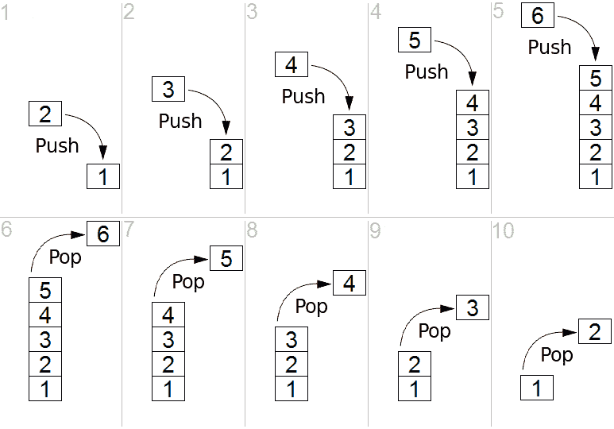
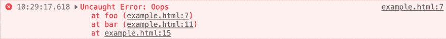
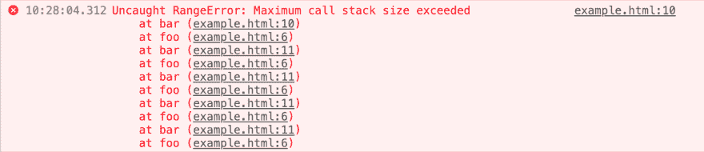

# JS 概念:调用堆栈

> 原文：<https://dev.to/mateusz_janusz/js-concepts-call-stack-12n7>

本文是 JavaScript 语言基础系列的一部分。本系列的目的是帮助开发人员提高他们的知识，真正理解 JavaScript 语言是如何工作的。为了帮助自己更好地写作😉

* * *

今天，我们将了解什么是调用栈，以及它在 JavaScript 中是如何工作的。我们开始吧！👏

# 什么是调用栈

我们可以说调用栈是一种函数调用的待办列表。它是一个存储要调用的函数列表的结构。

我们之所以称之为调用堆栈，是因为它将数据存储在一个堆栈中。堆栈是一种抽象数据类型，其中元素是根据**L**ast-**I**n**F**first-**O**ut(LIFO)原则插入和移除的。

就像一堆煎饼；你总是添加到栈顶，然后从栈顶移除

[](https://res.cloudinary.com/practicaldev/image/fetch/s--q65SH6ht--/c_limit%2Cf_auto%2Cfl_progressive%2Cq_auto%2Cw_880/https://thepracticaldev.s3.amazonaws.com/i/x3qkyibtrqvcgzk3vp54.png)

因为 JavaScript 主要是单线程的，所以它在任何给定时间只能执行一行代码。基本上它一次只能做一件事。

如果在 JavaScript 应用程序中，您调用一个函数，该函数可能会在任何其他函数调用中解析。在主函数完成之前，这些函数可能正在等待其他调用的结果。因此，应用程序需要跟踪被调用的内容和等待返回的内容。它需要保存已调用但尚未完成的函数的历史记录。

# 它是如何工作的

无论何时调用一个函数，调用的细节都保存在栈顶。每当函数返回时，信息从栈顶取出。

代码执行是同步的。每当 JavaScript 引擎找到一个函数调用时，它都会为该函数创建一个新的执行上下文，并将它推到堆栈的顶部。调用栈知道下一个要执行的函数，并会在执行后移除它。它到达当前堆栈中它下面的上下文，直到内存被清空。

我们来看例子:

```
function foo() {
    console.log('Hello')
}

function bar() {
    foo()
    console.log('World')
}

bar() 
```

Enter fullscreen mode Exit fullscreen mode

如果运行以下代码，会发生以下情况:

*   函数栏()被调用；创建了空堆栈框架(执行上下文)；

> *调用栈:*
> **【酒吧()】**

*   函数 bar()调用添加到堆栈顶部的函数 foo()

> *调用栈:*
> **foo()**
> bar()

*   函数 foo()返回并打印“Hello”到控制台
*   函数 foo()从栈顶移除

> *调用栈:*
> ~~foo()~~
> **bar()**

*   现在，函数 bar()被执行，它返回，“World”被打印到控制台
*   函数栏()从堆栈中弹出

> *调用栈:*
> ~~【酒吧()】~~

*   我们以一个空栈结束，内存被清空

> *谓栈:*
> 空

如果您的浏览器在控制台中抛出错误堆栈跟踪，您也可以观察到这种情况。它指出了函数中失败的地方。执行的函数从上到下显示，就像在堆栈中一样。请参见下面的示例。

[](https://res.cloudinary.com/practicaldev/image/fetch/s--FCurV4Mm--/c_limit%2Cf_auto%2Cfl_progressive%2Cq_auto%2Cw_880/https://thepracticaldev.s3.amazonaws.com/i/j7wt70etnv48lb3392sm.png)

# 堆栈溢出

我们都经历过...当我们运行一个无限循环时就会发生这种情况。

递归调用的函数(函数调用自身)可能会达到浏览器中堆栈的大小限制。这就是我们所说的堆栈溢出。如果发生这种情况，浏览器将停止所有调用并抛出“超出最大调用堆栈大小”错误。

[](https://res.cloudinary.com/practicaldev/image/fetch/s--vSCtvxK4--/c_limit%2Cf_auto%2Cfl_progressive%2Cq_auto%2Cw_880/https://thepracticaldev.s3.amazonaws.com/i/k9oveggwe64dbtif99r4.png)

# 总结

调用堆栈是一组有序的堆栈帧，其中:

*   最近执行的函数在栈顶
*   第一个被调用的函数在堆栈的底部
*   从上到下处理堆栈

其他要点包括:

*   JavaScript 是单线程的，它一次只能做一件事
*   栈是一种数据结构，在这种结构中，你总是添加到栈顶并从栈顶移除(LIFO)
*   功能执行是同步的

本文原载于我的[个人博客](https://mateuszjanusz.dev)。