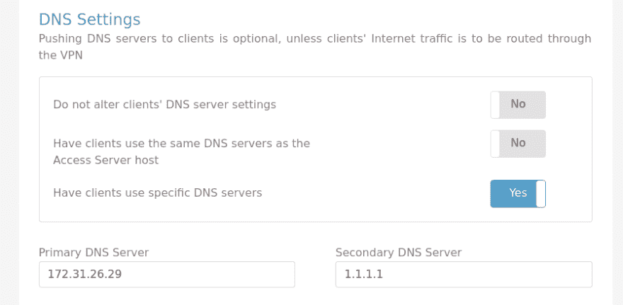

# arch Linux:OpenVPN–resolv . conf 未更新

> 原文：<https://dev.to/setevoy/arch-linux-openvpn--resolvconf-is-not-updated-2470>

Arch Linux 设置上的[](https://res.cloudinary.com/practicaldev/image/fetch/s--bNb1hH5q--/c_limit%2Cf_auto%2Cfl_progressive%2Cq_auto%2Cw_880/https://rtfm.co.ua/wp-content/uploads/2018/04/archlinux_logo.png)—本地`resolv.conf`在连接到 OpenVPN AS 后未更新。

据我所知——这个问题是特定于 Arch Linux 和它的“孩子”如 Manjaro Linux 安装的。

本地`openvpn`通过`pacman`安装——关于其配置的详细信息，请参见 [OpenVPN: OpenVPN 接入服务器设置和 AWS VPC 对等配置](https://rtfm.co.ua/en/openvpn-openvpn-access-server-set-up-and-aws-vpc-peering-configuration/#VPN_client_connection)帖子。

在连接初始化期间–日志显示:

```
Fri Feb 22 16:40:28 2019 Unrecognized option or missing or extra parameter(s) in [PUSH-OPTIONS]:4: dhcp-pre-release (2.4.6)
Fri Feb 22 16:40:28 2019 Unrecognized option or missing or extra parameter(s) in [PUSH-OPTIONS]:5: dhcp-renew (2.4.6)
Fri Feb 22 16:40:28 2019 Unrecognized option or missing or extra parameter(s) in [PUSH-OPTIONS]:6: dhcp-release (2.4.6)
Fri Feb 22 16:40:28 2019 Unrecognized option or missing or extra parameter(s) in [PUSH-OPTIONS]:23: register-dns (2.4.6)
Fri Feb 22 16:40:28 2019 Unrecognized option or missing or extra parameter(s) in [PUSH-OPTIONS]:24: block-ipv6 (2.4.6)
... 
```

检查本地`resolv.conf`–仍然有我的互联网提供商的 DNS:

```
$ cat /etc/resolv.conf
# Generated by resolvconf
nameserver 188.190.254.254
nameserver 31.43.120.254
nameserver 92.249.120.254 
```

文档——[此处> > >](https://wiki.archlinux.org/index.php/OpenVPN#Update_resolv-conf_script) 。

下载`update-resolv-conf`脚本:

```
$ sudo wget -O /etc/openvpn/update-resolv-conf https://raw.githubusercontent.com/masterkorp/openvpn-update-resolv-conf/master/update-resolv-conf.sh 
```

(在 Debian/Ubuntu 中，它是在`openvpn`包安装期间创建的)

设置执行属性:

```
$ sudo chmod +x /etc/openvpn/update-resolv-conf 
```

更新您的`client.ovpn`(在我当前的情况下为`/etc/openvpn/client/setevoy-ovnas.conf`)-在连接启动和停止期间添加脚本执行:

```
...
script-security 2 
up /etc/openvpn/update-resolv-conf 
down /etc/openvpn/update-resolv-conf
... 
```

要设置的 DNS 在 OpenVPN 中配置为:第一个 IP 是来自其本地网络的 VPN，第二个是 CloudFlare，以防万一:

[](https://rtfm.co.ua/wp-content/uploads/2019/03/Screenshot_20190302_102314.png)

重新启动连接:

```
$ sudo /usr/bin/openvpn --suppress-timestamps --nobind --config /etc/openvpn/client/setevoy-ovnas.conf
...
Unrecognized option or missing or extra parameter(s) in [PUSH-OPTIONS]:4: dhcp-pre-release (2.4.7)
Unrecognized option or missing or extra parameter(s) in [PUSH-OPTIONS]:5: dhcp-renew (2.4.7)
Unrecognized option or missing or extra parameter(s) in [PUSH-OPTIONS]:6: dhcp-release (2.4.7)
Unrecognized option or missing or extra parameter(s) in [PUSH-OPTIONS]:20: register-dns (2.4.7)
Unrecognized option or missing or extra parameter(s) in [PUSH-OPTIONS]:21: block-ipv6 (2.4.7)
...
/etc/openvpn/update-resolv-conf tun0 1500 1553 172.27.232.17 255.255.248.0 init
dhcp-option DNS 172.31.26.29
dhcp-option DNS 1.1.1.1
... 
```

检查`resolv.conf`:

```
$ cat /etc/resolv.conf
# Generated by resolvconf
nameserver 172.31.26.29
nameserver 1.1.1.1 
```

完成了。