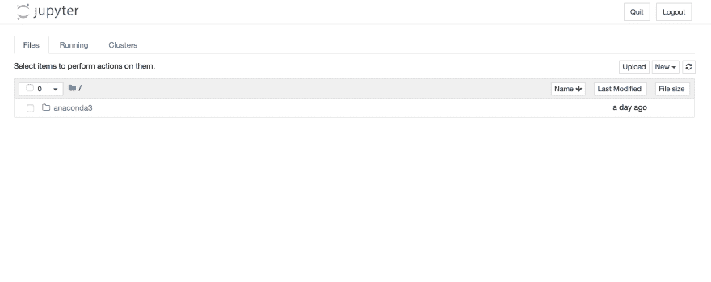
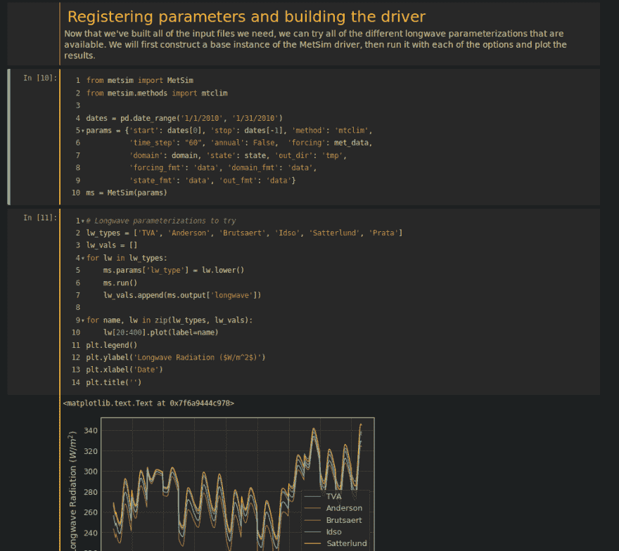
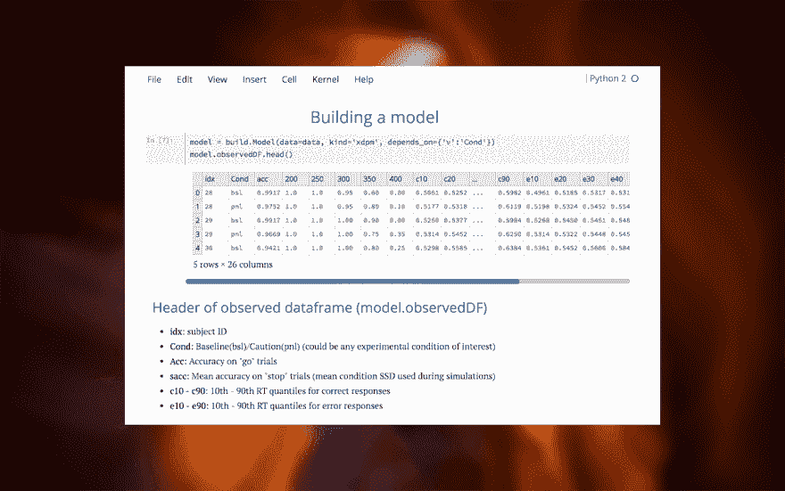
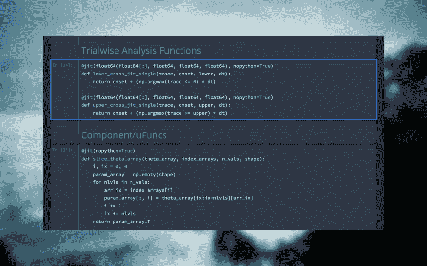
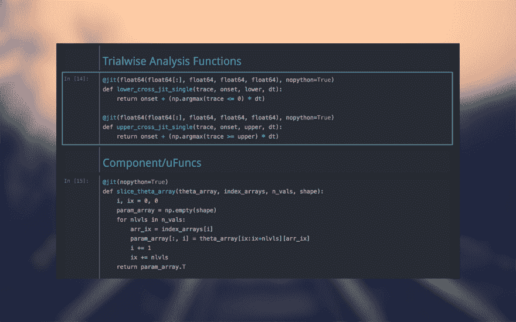
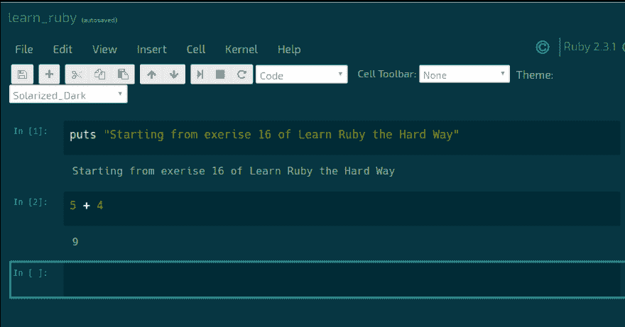
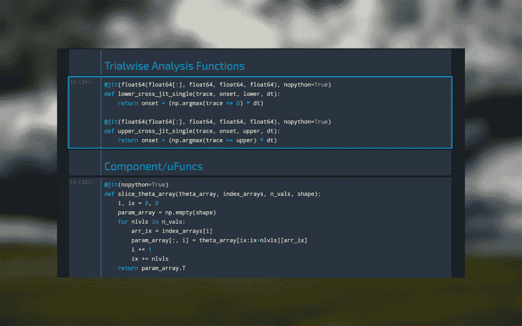

# 在 Ubuntu 服务器上运行 Jupyter 笔记本

> 原文：<https://dev.to/hackersandslackers/running-jupyter-notebooks-on-a-ubuntu-server-3340>

[](https://res.cloudinary.com/practicaldev/image/fetch/s--gpw-2DoY--/c_limit%2Cf_auto%2Cfl_progressive%2Cq_auto%2Cw_880/https://hackersandslackers.com/conteimg/2019/03/jupyter.jpg)

有一天我突然意识到，对于一个经常使用和谈论 Jupyter 笔记本的出版物来说，我们实际上从来没有花时间解释它们是什么或者如何开始使用它们。无论你在职业生涯的哪个阶段，第一次接触 Jupyter 和 [IPython](https://ipython.org/) shell 通常是一次令人困惑的神奇经历。一行一行写程序，实时接收反馈，感觉更像是在画布上画油画，编程。我想我们终于可以赢得动态类型语言的胜利了。

在使用 Jupyter 之前，实际开发人员需要克服几个障碍，最明显的是硬件成本。如果你正在使用一个完整的 Anaconda 安装，那么你可能不是那种可以乱来的人。真正的机器学习算法需要真正的资源，真正的资源需要真正的金钱。出于这个原因，这里出现了一些提供托管云托管笔记本电脑的供应商。对于我们这些费心计算的人来说，事实证明这些服务中的大多数都比建立一个专用的 VPS 更昂贵。

拥有令人印象深刻的机器的数据科学家在本地运行笔记本电脑对于大多数用例来说没有问题。虽然这对于科学家来说很好，但对于我们这些在笔记本之外致力于 Python 的人来说，这种设置是有问题的。安装完成后，Anaconda 会闯入你系统的`~/.bash_profile`，大喊 ***“我现在是船长了”*** ，并把自己冠为你系统的默认 Python 路径。Conda 和 Pip 相处起来有些困难，所以对于我们这些构建 Python 应用程序和使用笔记本的人来说，最好将这些东西隔离开来。

## 设置 VPS

我们将从头开始构建一个准系统 Ubuntu 18.04 实例。对我来说，我选择了数字海洋，既是因为简单，也是因为我已经破产了。根据你是否破产，这是你需要对你的系统资源做出判断的地方:

亲爱的先生，我想点菜单上最精致几乎最便宜的小滴

嘘，那个坏男孩。你知道下一步该做什么:

```
$ sudo apt update
$ sudo apt upgrade 
```

解决了这个问题，接下来我们来看看 Python 的最新版本:

```
$ sudo apt install python3-pip python3-dev
$ sudo -H pip3 install --upgrade pip 
```

最后，我们将开放端口 8888，因为这是 Jupyter 运行的端口:

```
sudo ufw enable
sudo ufw allow 8888
sudo ufw status

To Action From
-- ------ ----
OpenSSH ALLOW Anywhere
8888 ALLOW Anywhere 
```

### 创建新用户

和往常一样，除了 root 用户之外，我们应该创建一个 Linux 用户来做任何事情:

```
Adding user `myuser' ...
Adding new group `myuser' (1001) ...
Adding new user `myuser' (1001) with group `myuser' ...
Creating home directory `/home/myuser' ...
Copying files from `/etc/skel' ...
Enter new UNIX password:
Retype new UNIX password:
passwd: password updated successfully
Changing the user information for myuser
Enter the new value, or press ENTER for the default
        Full Name []: My User
        Room Number []: 420
        Work Phone []: 555-1738
        Home Phone []: derrrr
        Other []: i like turtles
Is the information correct? [Y/n] y 
```

然后，将他们添加到 **sudoers** 组:

```
$ usermod -aG sudo myuser 
```

以用户身份登录:

```
$ su - myuser
To run a command as administrator (user "root"), use "sudo <command>".
See "man sudo_root" for details. 
```

### 安装最新的 Anaconda 发行版

Anaconda 提供了我们笔记本所需的所有奇妙的数据科学 Python 包。要找到最新的分布，查看这里:[https://www.anaconda.com/download/](https://www.anaconda.com/download/)。我们将把它安装到一个`/tmp`文件夹中:

```
cd /tmp
curl -O https://repo.anaconda.com/archive/Anaconda3-2018.12-Linux-x86_64.sh 
```

下载完成后，开始安装:

```
$ sh Anaconda3-2018.12-Linux-x86_64.sh 
```

完成出现的提示:

```
Welcome to Anaconda3 2018.12

In order to continue the installation process, please review the license
agreement.
Please, press ENTER to continue
>>> 
```

为文本墙做好准备....

```
===================================

Copyright 2015, Anaconda, Inc.

All rights reserved under the 3-clause BSD License:

Redistribution and use in source and binary forms, with or without modification, are permitted provided that the following conditions are met:

.......

Do you accept the license terms? [yes|no] 
```

这开始了一个相当长的安装过程。之后，系统会提示您将 Conda 添加到启动脚本中。说**是**:

```
installation finished.
Do you wish the installer to prepend the Anaconda3 install location
to PATH in your /home/sammy/.bashrc ? [yes|no] 
```

安装的最后一部分会询问你是否想安装 VS 代码。拒绝这个提议，因为微软烂透了。

最后，重新加载您的 **/。bashrc** 文件来获取应用 Conda 的更改:

```
$ source ~/.bashrc 
```

### 设置 Conda 环境

Conda 装置可以隔离到不同的环境中，类似于 Pipenv 处理这种情况的方式。创建和激活 Conda 环境:

```
$ conda create --name myenv python=3
$ source activate myenv 
```

恭喜你，你现在处于一个活跃的 Conda 环境中！

### 启动 Jupyter

确保你在一个你想要运行 Jupyter 的目录下。在该目录中输入`jupyter notebook`应该会产生以下结果:

```
(jupyter_env) myuser@jupyter:~$ jupyter notebook
[I 21:23:21.198 NotebookApp] Writing notebook server cookie secret to /run/user/1001/jupyter/notebook_cookie_secret
[I 21:23:21.361 NotebookApp] Serving notebooks from local directory: /home/myuser/jupyter
[I 21:23:21.361 NotebookApp] The Jupyter Notebook is running at:
[I 21:23:21.361 NotebookApp] http://localhost:8888/?token=1fefa6ab49a498a3f37c959404f7baf16b9a2eda3eaa6d72
[I 21:23:21.361 NotebookApp] Use Control-C to stop this server and shut down all kernels (twice to skip confirmation).
[W 21:23:21.361 NotebookApp] No web browser found: could not locate runnable browser.
[C 21:23:21.361 NotebookApp]

    Copy/paste this URL into your browser when you connect for the first time,
    to login with a token:
        http://localhost:8888/?token=1u2grit856t5yig5f37tf5iu5y4gfi73tfty5hf 
```

下一部分很棘手。为了运行我们的笔记本，我们需要通过 SSH 隧道重新连接到我们的 VPS。关闭终端，用以下格式重新连接到您的服务器:

```
ssh -L 8888:localhost:8888 myuser@your_server_ip 
```

实际上，`localhost`打算保持不变，但是`your_server_ip`将被替换为您的服务器的地址。

完成后，让我们再试一次。记得先重新激活你的 Conda 环境！

```
(jupyter_env) myuser@jupyter:~$ jupyter notebook 
```

这一次，出现在终端中的链接应该工作了！

[](https://res.cloudinary.com/practicaldev/image/fetch/s--bsI99EZ9--/c_limit%2Cf_auto%2Cfl_progressive%2Cq_auto%2Cw_880/https://hackersandslackers.com/conteimg/2019/03/Screen-Shot-2019-03-01-at-7.01.42-PM.png)T3】我们做到了

## 有奖游戏:主题化您的笔记本

如果丑陋的界面像困扰我一样困扰你，我强烈推荐你看看 Github 上的 jupyter-themes 包。这个软件包允许你自定义你的笔记本的外观，或者像激活一个样式一样简单，或者像设置你的边距宽度一样复杂。我强烈推荐查看可用的主题，为你的笔记本增添趣味！

[](https://res.cloudinary.com/practicaldev/image/fetch/s--3dbEpu2u--/c_limit%2Cf_auto%2Cfl_progressive%2Cq_auto%2Cw_880/https://hackersandslackers.com/conteimg/2019/03/gruvbox-dark-python.png)

[](https://res.cloudinary.com/practicaldev/image/fetch/s--Ket2g_Hr--/c_limit%2Cf_auto%2Cfl_progressive%2Cq_auto%2Cw_880/https://hackersandslackers.com/conteimg/2019/03/grade3_table.png)

[](https://res.cloudinary.com/practicaldev/image/fetch/s--ow_nPRv_--/c_limit%2Cf_auto%2Cfl_progressive%2Cq_auto%2Cw_880/https://hackersandslackers.com/conteimg/2019/03/jtplotDark_reach.png)

[](https://res.cloudinary.com/practicaldev/image/fetch/s--T8jJEq7p--/c_limit%2Cf_auto%2Cfl_progressive%2Cq_auto%2Cw_880/https://hackersandslackers.com/conteimg/2019/03/oceans16_code_headers.png)

[](https://res.cloudinary.com/practicaldev/image/fetch/s--s0DC1QFy--/c_limit%2Cf_auto%2Cfl_progressive%2Cq_auto%2Cw_880/https://hackersandslackers.com/conteimg/2019/03/onedork_code_headers.png)

[](https://res.cloudinary.com/practicaldev/image/fetch/s--ERlECZkQ--/c_limit%2Cf_auto%2Cfl_progressive%2Cq_auto%2Cw_880/https://hackersandslackers.com/conteimg/2019/03/solarized-dark_iruby.png)

[](https://res.cloudinary.com/practicaldev/image/fetch/s--sA7Ld1xk--/c_limit%2Cf_auto%2Cfl_progressive%2Cq_auto%2Cw_880/https://hackersandslackers.com/conteimg/2019/03/chesterish_code_headers.png)