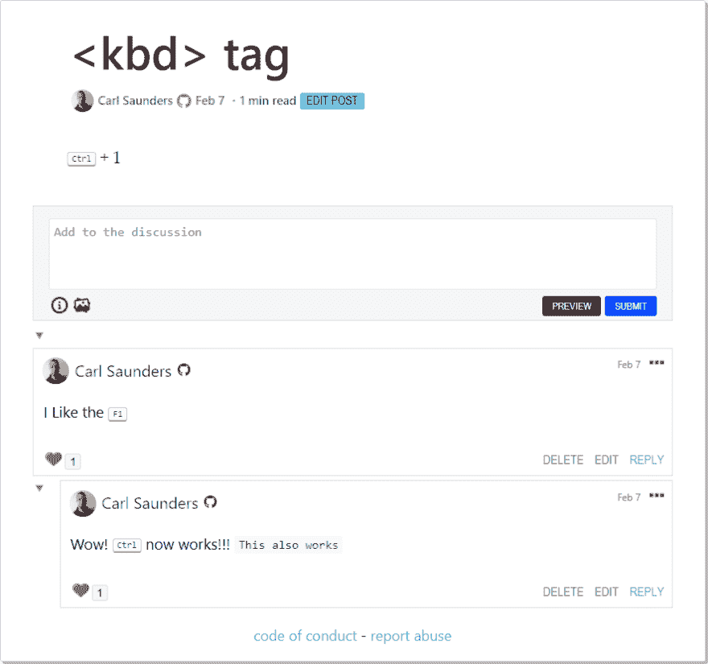
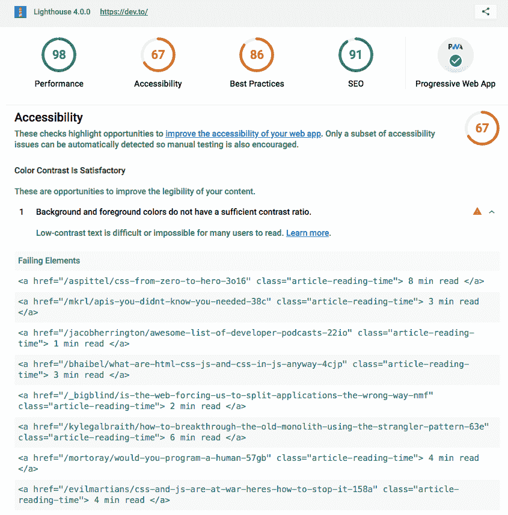
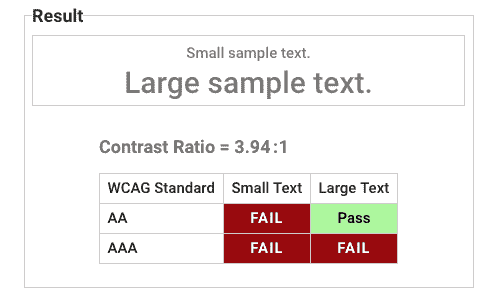
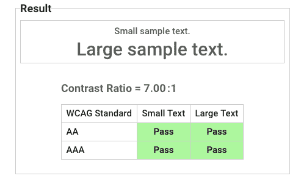
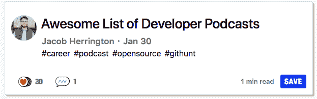
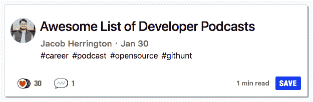
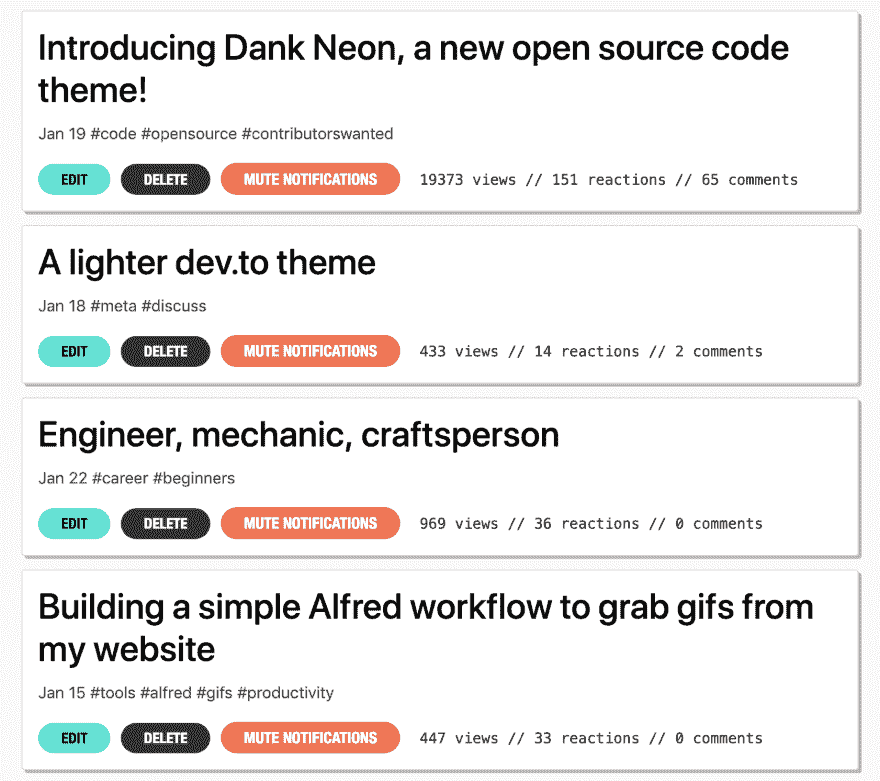

# 开发人员对上周的回购进行总结

> 原文：<https://dev.to/devteam/devto-repo-recap-from-the-past-week-1kkb>

欢迎回到另一个回购回顾，我们涵盖了上周对 [dev.to 的仓库](https://github.com/thepracticaldev/dev.to)和[iOS 回购](https://github.com/thepracticaldev/dev-ios)的贡献。这一期涵盖 2 月 17 日至 2 月 23 日。

# 特性

*   [@deadlybyte](https://dev.to/deadlybyte) 在帖子和评论中增加了对`<kbd>`标签的支持，所以现在你可以做类似`ctrl`的事情了！谢谢， [@deadlybyte](https://dev.to/deadlybyte) ！

# [ 在文章帖子和 comm…   #1761](https://github.com/thepracticaldev/dev.to/pull/1761) 中增加了< kbd >标签支持

[](https://github.com/deadlybyte) **[deadlybyte](https://github.com/deadlybyte)** posted on [<time datetime="2019-02-07T21:43:24Z">Feb 07, 2019</time>](https://github.com/thepracticaldev/dev.to/pull/1761)

…树人。

## 这是什么类型的公关？(勾选所有适用选项)

*   [ ]重构
*   [x]功能
*   [ ]错误修复
*   [ ]文档更新

## 描述

在文章帖子和评论中为 markdown 编辑器添加标签支持。

## 相关车票&单据

## 手机&桌面截图/录音(如有 UI 改动)

[](https://user-images.githubusercontent.com/3695975/52444650-e3a99380-2b20-11e9-980c-8608d18723c1.png)

## 添加到文档中？

*   [ ]文档开发到
*   [ ]自述文件
*   [x]不需要文档

## 【可选】哪个 gif 最能描述这个 PR 或者给你的感觉？

[](https://camo.githubusercontent.com/42db9ca7ea946b5e4bef35d9b63aa4978bacc881/68747470733a2f2f6d656469612e67697068792e636f6d2f6d656469612f574a6a4c7958435676726f32492f67697068792e676966)

[View on GitHub](https://github.com/thepracticaldev/dev.to/pull/1761)

# Bug 修复/其他贡献

*   [@韵](https://dev.to/rhymes)增加了阅读持续时间的对比度(例如`1 min read`)。公关也有关于如何做的详细信息。谢谢，[@韵](https://dev.to/rhymes)！

# [ 为“阅读时间”信息增加对比度 #1689](https://github.com/thepracticaldev/dev.to/pull/1689) 

[](https://github.com/rhymes) **[rhymes](https://github.com/rhymes)** posted on [<time datetime="2019-01-30T16:19:25Z">Jan 30, 2019</time>](https://github.com/thepracticaldev/dev.to/pull/1689)

## 这是什么类型的公关？(勾选所有适用选项)

*   [ ]重构
*   [ ]功能
*   [x]错误修复
*   [ ]文档更新

## 描述

在为 dev.to 阅读 Lighthouse 报告时，我注意到了关于白色背景和“阅读时间”信息文本之间的对比的“快速胜利”。

[](https://user-images.githubusercontent.com/146201/51995155-765b8a00-24b2-11e9-82cf-41772fcfc097.png)

现在背景是`#fff`，阅读时间文本是`gray`，也就是`rgb(128, 128, 128)`，这又导致了这个对比度:

[](https://user-images.githubusercontent.com/146201/51995260-a99e1900-24b2-11e9-81e1-fb48dd2dc758.png)

我把文本涂成黑色

```
color: darken($medium-gray, 5%);
```

Enter fullscreen mode Exit fullscreen mode

而不是电流

```
color: lighten($medium-gray, 10%);
```

Enter fullscreen mode Exit fullscreen mode

现在的对比度是:

[](https://user-images.githubusercontent.com/146201/51995385-e79b3d00-24b2-11e9-9c0f-2cfb1af4a8e2.png)

我用过灯塔链接的这个[色彩对比度分析仪](https://dequeuniversity.com/rules/axe/3.1/color-contrast)。

ps。diff 包括一些自动固定间距的问题，相关的行在这里:[https://github . com/thepractical dev/dev . to/pull/1689/files # diff-8604 F2 aa 24d 368 DBA 9 c 73900d 331 fbbbr 575](https://github.com/thepracticaldev/dev.to/pull/1689/files#diff-8604f2aa24d368dba9c73900d331fbbbR575)

## 相关车票&单据

## 手机&桌面截图/录音(如有 UI 改动)

以前

[](https://user-images.githubusercontent.com/146201/51995628-58425980-24b3-11e9-8204-510fe76ea5b0.png)

在...之后

[](https://user-images.githubusercontent.com/146201/51995674-6db78380-24b3-11e9-8507-ec36e4db6862.png)

## 添加到文档中？

*   [ ]文档开发到
*   [ ]自述文件
*   [x]不需要文档

[View on GitHub](https://github.com/thepracticaldev/dev.to/pull/1689)

*   [@lightalloy](https://dev.to/lightalloy) 专门为编辑指南页面禁用了`erblint` cops，以防止出现奇怪的交互。谢谢安娜。

# [ 为编辑指南【1830 号](https://github.com/thepracticaldev/dev.to/pull/1830)

[](https://github.com/lightalloy) **[lightalloy](https://github.com/lightalloy)** posted on [<time datetime="2019-02-19T09:35:14Z">Feb 19, 2019</time>](https://github.com/thepracticaldev/dev.to/pull/1830)

## 这是什么类型的公关？(勾选所有适用选项)

*   [x]错误修复

## 描述

Erblint 在 pre 中解析 html，而不是将其视为代码块(更多信息请参见 [pr](https://github.com/thepracticaldev/dev.to/pull/1784) 和 [an issue](https://github.com/thepracticaldev/dev.to/issues/1828#issuecomment-465041370) 该 pr 禁用相应的 erblint cops，以防止`lint-stage`失败。

[View on GitHub](https://github.com/thepracticaldev/dev.to/pull/1830)

*   [@aspittel](https://dev.to/aspittel) 在 Connect 中链接到 GitHub repos 时增加一些额外的清理。谢谢你，阿里！

# [ 在聊天上添加杀毒到 github# 1834](https://github.com/thepracticaldev/dev.to/pull/1834)

[](https://github.com/aspittel) **[aspittel](https://github.com/aspittel)** posted on [<time datetime="2019-02-20T12:51:47Z">Feb 20, 2019</time>](https://github.com/thepracticaldev/dev.to/pull/1834)

## 这是什么类型的公关？(勾选所有适用选项)

*   [ ]重构
*   [ ]功能
*   [x]错误修复
*   [ ]文档更新

## 描述

将清理添加到标记(已在后端完成)

## 相关车票&单据

## 手机&桌面截图/录音(如有 UI 改动)

## 添加到文档中？

*   [ ]文档开发到
*   [ ]自述文件
*   [X]不需要文档

[View on GitHub](https://github.com/thepracticaldev/dev.to/pull/1834)

*   [@markfilus](https://dev.to/markfilus) 修复了 FAQ 页面的一个错别字。马克，谢谢你的第一次投稿！🎉

# [ 修复 faq 页面的错别字 #1836](https://github.com/thepracticaldev/dev.to/pull/1836) 

[](https://github.com/MarkFilus) **[MarkFilus](https://github.com/MarkFilus)** posted on [<time datetime="2019-02-20T18:51:05Z">Feb 20, 2019</time>](https://github.com/thepracticaldev/dev.to/pull/1836)

## 这是什么类型的公关？(勾选所有适用选项)

*   [ ]重构
*   [ ]功能
*   [x]错误修复
*   [ ]文档更新

## 描述

固定错别字

## 添加到文档中？

*   [ ]文档开发到
*   [ ]自述文件
*   [x]不需要文档

[View on GitHub](https://github.com/thepracticaldev/dev.to/pull/1836)

*   @molly_struve 在建议帖子的底部添加了一个帖子的 ID 到我们的缓存键。莫莉，谢谢你的第一次投稿！

# [ 在底部内容缓存中包含文章 ID 关键字 #1773](https://github.com/thepracticaldev/dev.to/pull/1773) 

[](https://github.com/mstruve) **[mstruve](https://github.com/mstruve)** posted on [<time datetime="2019-02-10T22:19:32Z">Feb 10, 2019</time>](https://github.com/thepracticaldev/dev.to/pull/1773)

## 这是什么类型的公关？(勾选所有适用选项)

*   [ ]重构
*   [ ]功能
*   [x]错误修复
*   [ ]文档更新

## 描述

如果文章展示页面上的附加底部内容被存储在仅使用文章的标签创建的缓存关键字下，那么如果标签与先前查看的文章相同，则人们可能最终在实际的文章页面上看到建议的文章。这确实意味着缓存的重用会减少，因为它是特定于文章的，这会影响性能。我不确定这个缓存在不同文章中被命中的频率，但这是需要考虑的事情。

我还将文章 ID 添加到了`:not_ids`列表中，以获取`@classic_article`

我确实阅读了关于添加 bug 修复规范的指导方针，但是因为我看到的缓存没有在规范中测试过，并且因为我不能提出一个好的干净的测试，所以我选择放弃它。如果您确定需要测试，请告诉我，我可以关闭 PR 并在添加后重新打开。

## 相关车票&单据

[https://github.com/thepracticaldev/dev.to/issues/1697](https://github.com/thepracticaldev/dev.to/issues/1697)

## 手机&桌面截图/录音(如有 UI 改动)

不适用的

## 添加到文档中？

*   [ ]文档开发到
*   [ ]自述文件
*   [x]不需要文档

## 哪个 gif 最能描述这次公关或者给你的感觉？

一些事情，第一个总是最差的，不管你给其他回复贡献了多少次....[](https://camo.githubusercontent.com/379d2a907ade7fda9778a9fffe39edd39e495447/68747470733a2f2f6d656469612e67697068792e636f6d2f6d656469612f377a78676c544d34736a7939792f67697068792e676966)

[View on GitHub](https://github.com/thepracticaldev/dev.to/pull/1773)

*   @arnellebalane 修复了一个问题，在移动设备中，可能会在侧边栏中向下滚动太多。谢谢你，阿尼尔！

# [ 修复手机侧边栏滚动问题 #1787](https://github.com/thepracticaldev/dev.to/pull/1787) 

[](https://github.com/arnellebalane) **[arnellebalane](https://github.com/arnellebalane)** posted on [<time datetime="2019-02-12T09:12:53Z">Feb 12, 2019</time>](https://github.com/thepracticaldev/dev.to/pull/1787)

## 这是什么类型的公关？(勾选所有适用选项)

*   [ ]重构
*   [ ]功能
*   [x]错误修复
*   [ ]文档更新

## 描述

当侧边栏在 mobile layout 中打开时，变暗的背景(`.sidebar-bg`)比实际的侧边栏元素本身更长，这使得可以滚动越过实际侧边栏的底部。

问题的原因是在`.sidebar-bg`元素中设置的`height: 1000%;`声明。这个 PR ~~重构了侧边栏行为，不再依赖`.sidebar-bg`元素作为变暗的背景。变暗的背景作为`box-shadow`被移动到`.side-bar`元素，并且`.sidebar-bg`元素被移除，确保滚动不会超过侧边栏的底部。~~确保侧栏包装器和`.sidebar-bg`元素的大小正确，并且侧栏不会溢出包装器。侧边栏总是在包装器内，暗背景也不会滚动。

## 相关车票&单据

[https://github.com/thepracticaldev/dev.to/issues/1746](https://github.com/thepracticaldev/dev.to/issues/1746)

## 手机&桌面截图/录音(如有 UI 改动)

应用更改后，UI 保持不变。

## 添加到文档中？

*   [ ]文档开发到
*   [ ]自述文件
*   [x]不需要文档

[View on GitHub](https://github.com/thepracticaldev/dev.to/pull/1787)

*   [@arnellebalane](https://dev.to/arnellebalane) 也修复了`views/additional_content_boxes`文件夹中的一些林挺问题。再次感谢！

# [ 修复视图/附加 _ 内容 _ 框中的林挺问题 #1843](https://github.com/thepracticaldev/dev.to/pull/1843) 

[](https://github.com/arnellebalane) **[arnellebalane](https://github.com/arnellebalane)** posted on [<time datetime="2019-02-22T00:39:36Z">Feb 22, 2019</time>](https://github.com/thepracticaldev/dev.to/pull/1843)

## 这是什么类型的公关？(勾选所有适用选项)

*   [ ]重构
*   [ ]功能
*   [ ]错误修复
*   [ ]文档更新

## 描述

修复位于`app/views/additional_content_boxes`的视图中的林挺问题。

```
🐈 bin/bundle exec erblint app/views/additional_content_boxes
warning: parser/current is loading parser/ruby26, which recognizes
warning: 2.6.0-compliant syntax, but you are running 2.6.1.
warning: please see https://github.com/whitequark/parser#compatibility-with-ruby-mri.
Linting 4 files with 12 linters...

.erblint-rubocop20190222-7517-2zlp5: RSpec/FilePath has the wrong namespace - should be Rails
Warning: unrecognized cop RSpec/MultipleExpectations found in .erblint-rubocop20190222-7517-2zlp5
No errors were found in ERB files
```

Enter fullscreen mode Exit fullscreen mode

**附加问题:**

有些视图，如 [`_article_content_area.html.erb`](https://github.com/thepracticaldev/dev.to/blob/master/app/views/additional_content_boxes/_article_content_area.html.erb) 将整个文件缩进了几级。`erblint`并不抱怨这个缩进，所以我在想这是不是故意的，应该这样留着，还是应该修复这个缩进？

## 相关车票&单据

#1842

## 添加到文档中？

*   [ ]文档开发到
*   [ ]自述文件
*   [x]不需要文档

[View on GitHub](https://github.com/thepracticaldev/dev.to/pull/1843)

*   [@maestromac](https://dev.to/maestromac) 增加了更多的测试覆盖。✅谢谢你，麦克！

# [ 添加更多测试覆盖面 #1829](https://github.com/thepracticaldev/dev.to/pull/1829) 

[](https://github.com/maestromac) **[maestromac](https://github.com/maestromac)** posted on [<time datetime="2019-02-18T23:55:03Z">Feb 18, 2019</time>](https://github.com/thepracticaldev/dev.to/pull/1829)

## 这是什么类型的公关？(勾选所有适用选项)

*   [x]重构
*   [x]杂项

## 描述

扩大我们的测试范围

## 相关车票&单据

不适用的

## 手机&桌面截图/录音(如有 UI 改动)

不适用的

## 添加到文档中？

*   [x]不需要文档

[View on GitHub](https://github.com/thepracticaldev/dev.to/pull/1829)

# 新的问题和讨论

*   [@mkrl](https://dev.to/mkrl) 请求了一个可以在 markdown 编辑器中使用键盘快捷键的功能。谢谢， [@mkrl](https://dev.to/mkrl) ！

# [ 键盘快捷键为 markdown 编辑 #1826](https://github.com/thepracticaldev/dev.to/issues/1826) 

[](https://github.com/mkrl) **[mkrl](https://github.com/mkrl)** posted on [<time datetime="2019-02-18T11:09:12Z">Feb 18, 2019</time>](https://github.com/thepracticaldev/dev.to/issues/1826)

**您的功能请求是否与某个问题相关？请描述一下。拥有键盘快捷键总是会派上用场。在每一个 markdown 编辑器旁边(包括我用来写这个问题的编辑器),都至少提供了几个非常基本的粗体/斜体/代码块等的快捷键。能够像键盘忍者一样发表评论和帖子可以极大地改善用户体验。**

**描述您想要的解决方案**按下 Ctrl+[键]会用适当的标签格式化当前选定的文本:

*   `B: **bold text**`
*   `I: _italic_`
*   `L: [link]()`当光标移动到离创建有效链接只差一个 ctrl+v 的位置时
*   `1-6: # level 1-6 headers`(类似于，比方说， [editor.md](https://github.com/pandao/editor.md/blob/master/src/editormd.js#L3176)
*   液体标签的其他东西，可能有常见的预置像``或``

当然，对于不同的库，markdown 快捷方式有许多不同的实现。

**描述你考虑过的替代方案**回到我之前写的文本，手动箭头指向我的光标是唯一的替代方案(不包括浏览器扩展，但非常快速的谷歌搜索没有找到任何有价值的东西)。

如果获得批准，我将负责此事。

[View on GitHub](https://github.com/thepracticaldev/dev.to/issues/1826)

*   [@ben](https://dev.to/ben) 提出了一个问题“是否可以认为林挺在压制捐款？”一场伟大的讨论和令人敬畏的开源努力随之而来。谢谢你，本！下周更！

# [ 能否看待林挺被压制立功？ #1828](https://github.com/thepracticaldev/dev.to/issues/1828) 

[](https://github.com/benhalpern) **[benhalpern](https://github.com/benhalpern)** posted on [<time datetime="2019-02-18T23:48:22Z">Feb 18, 2019</time>](https://github.com/thepracticaldev/dev.to/issues/1828)

我有一种感觉，认为林挺可能是一个相当大的捐款负担。你可以做一点小小的贡献，却被目前林挺的一大堆琐事所困扰。

我只是觉得作为一个没有背景的局外人，这会给我增加太多的负担。有没有想过把它作为一个阻碍推的障碍，让它成为人们可以自愿取得进展的东西，直到应用程序更接近于以我们喜欢的风格完全呈现在视图上？

[View on GitHub](https://github.com/thepracticaldev/dev.to/issues/1828)

*   [@lightalloy](https://dev.to/lightalloy) 提出了一个问题，当驱逐用户时`CacheBuster#bust_comment`可能会失败。谢谢安娜。

# [CacheBuster # bust _ comment 可能无法驱逐用户 #1831](https://github.com/thepracticaldev/dev.to/issues/1831) 

[](https://github.com/lightalloy) **[lightalloy](https://github.com/lightalloy)** posted on [<time datetime="2019-02-19T12:28:47Z">Feb 19, 2019</time>](https://github.com/thepracticaldev/dev.to/issues/1831)

**描述 bug** `Commentable`在`CacheBuster#bust_comment`([https://github . com/thepractical dev/dev . to/blob/master/app/labor/cache _ buster . Rb # L15](https://github.com/thepracticaldev/dev.to/blob/master/app/labor/cache_buster.rb#L15))方法中被传递和引用，但有时`commentable`可能是`nil`，因为 commentable(如文章)destroy 上的评论没有销毁。

**重现**

*   用评论毁掉一篇文章
*   尝试驱逐一个用户，他在被销毁的文章上留下了评论
*   获取`undefined method 'id' for nil:NilClass`错误

**预期行为**(假设我们需要保留 commentable destroy 上的注释)不要试图破坏不存在的 commentable/article 的缓存。至少为该方法添加失败的规范并修复代码:在引用 commentable 之前检查它是否存在。

[View on GitHub](https://github.com/thepracticaldev/dev.to/issues/1831)

*   @jess 请求了一个功能，当通过 RSS 获取的帖子准备发布时，我们会发送一封电子邮件。谢谢杰西。在此插话:

# [RSS 帖子准备发布时发送邮件 #1832](https://github.com/thepracticaldev/dev.to/issues/1832) 

[](https://github.com/jessleenyc) **[jessleenyc](https://github.com/jessleenyc)** posted on [<time datetime="2019-02-19T21:38:02Z">Feb 19, 2019</time>](https://github.com/thepracticaldev/dev.to/issues/1832)

**您的功能请求是否与某个问题相关？请描述一下。**有许多未发表的“草稿”帖子是从 RSS 订阅源中获取的。我认为如果我们提醒人们发布这些帖子会很有帮助！

**描述您想要的解决方案**我们会定期检查用户是否有新的 RSS 帖子，如果有，我们会发送电子邮件。

**描述你考虑过的替代方案**每次 RSS feed 引入新文章时，我们都会发送一封电子邮件。我不知道现在该怎么做，但我知道，如果我们一次写 10 篇文章，我们会避免一天多次发送同一封邮件。

[View on GitHub](https://github.com/thepracticaldev/dev.to/issues/1832)

*   @wuz 请求了一个功能，我们可以根据发布日期对仪表板中发布的帖子进行排序。谢谢你，科林！

# [ 根据发布日期对仪表板进行排序 #1837](https://github.com/thepracticaldev/dev.to/issues/1837) 

[](https://github.com/wuz) **[wuz](https://github.com/wuz)** posted on [<time datetime="2019-02-20T19:53:12Z">Feb 20, 2019</time>](https://github.com/thepracticaldev/dev.to/issues/1837)

**您的功能请求是否与某个问题相关？请描述一下。**我经常将文章想法作为草稿保存到我的仪表板上，以便回来处理它们。在很大程度上，这很好，但是仪表板上的帖子是按照创建日期排序的(我假设)。这导致了这样一种情况:在我的仪表板上，一些发布晚于其他人的帖子会列在它们之前。这里有一个例子:

[](https://user-images.githubusercontent.com/2363236/53120072-f8bdf380-351e-11e9-975e-46e5d3fe59f6.png)

正如你看到的日期:“1 月 19 日，1 月 18 日，1 月 22 日，1 月 15 日”。我查看我的仪表板，以确保我定期发布，但这种排序有点难以分辨。

**描述您想要的解决方案**添加按发布日期对仪表板进行排序的功能，草稿使用其创建日期。

**描述你考虑过的替代方案**我可以将草稿存储在其他地方，并且已经考虑过了，但是我喜欢用 dev.to 编写，并且喜欢将想法保存为草稿。

[View on GitHub](https://github.com/thepracticaldev/dev.to/issues/1837)

*   @lightalloy 开了一个关于在我们的观点中解决林挺问题的问题，作为本早期问题的一部分。谢谢安娜。

# [ 解决林挺问题的意见 #1842](https://github.com/thepracticaldev/dev.to/issues/1842) 

[](https://github.com/lightalloy) **[lightalloy](https://github.com/lightalloy)** posted on [<time datetime="2019-02-21T10:01:55Z">Feb 21, 2019</time>](https://github.com/thepracticaldev/dev.to/issues/1842)

几周前,`erblint`和相应的`lint-staged`钩子被添加到项目中。但是现在,`*.html.erb`档案中有一笔巨大的林挺债务。你可以从#1828 讨论中了解更多关于它如何影响项目以及对项目的贡献。志愿者可以帮助该项目消除债务或使其变小。您可以运行林挺问题列表:

```
bundle exec erblint --lint-all 
```

获取特定文件或目录的问题列表:

```
bundle exec erblint app/views/%path_to_file_or_directory% 
```

你可以使用`--autocorrect`标志，但是要小心，因为它有时会错误地修复缩进。我建议跑步

```
bundle exec erblint --autocorrect %path_to_file%` and check manually if the fixes are correct. 
```

请保持较小的拉取请求，这样可以更快地审查它们。例如对每个`app/views/`文件夹(例如`app/views/comments`)的单独的拉请求。如果有一些你不能解决的问题，请给这个问题留下评论，或者提交一个`--no-verify`标志并在你的拉请求中提到它。我将感谢你在这个问题上的帮助。

[View on GitHub](https://github.com/thepracticaldev/dev.to/issues/1842)

*   [@kayis](https://dev.to/kayis) 提出了一个用不同规范网址保存帖子会引发错误的 bug`canonical_url has already been taken.`:thinking _ face:谢谢， [@kayis](https://dev.to/kayis) ！

# [ 规范的 url 已经被占用 #1845](https://github.com/thepracticaldev/dev.to/issues/1845) 

[](https://github.com/kay-is) **[kay-is](https://github.com/kay-is)** posted on [<time datetime="2019-02-22T13:48:54Z">Feb 22, 2019</time>](https://github.com/thepracticaldev/dev.to/issues/1845)

**描述 bug** 我想用`canonical_url`保存一篇文章，但是出现了错误。

**重现**重现行为的步骤:

1.  写文章
2.  保存
3.  将`canonical_url`设置为一个已经被使用的 URL
4.  保存
5.  得到错误“规范的 url 已被采用”
6.  返回并将`canonical_url`更改为一个未被使用的 URL
7.  保存
8.  仍然得到错误“规范的 url 已被采用”

预期行为它应该用新的规范 URL 保存我的文章。

**桌面(请填写以下信息):**

*   操作系统:Windows 7
*   浏览器:Firefox
*   版本:66

[View on GitHub](https://github.com/thepracticaldev/dev.to/issues/1845)

*   [@wes](https://dev.to/wes) 请求了一个功能，可以让你更容易地给封面图片添加照片属性。谢谢，[@韦斯](https://dev.to/wes)！

# [ 允许照片署名为封面 _ 图片 #1849](https://github.com/thepracticaldev/dev.to/issues/1849) 

[](https://github.com/WesSouza) **[WesSouza](https://github.com/WesSouza)** posted on [<time datetime="2019-02-22T22:54:22Z">Feb 22, 2019</time>](https://github.com/thepracticaldev/dev.to/issues/1849)

给文章中使用的图片加演职员表是常见的做法。我建议给 FrontMatter 添加更多属性，以便在照片下方添加一个`<figcaption>`元素。

**描述您想要的解决方案**

```
cover_image: https://cdn-images-1.medium.com/max/1024/1*NQRv_y3HIXXvCOt5UWLjzQ.jpeg
cover_image_credit_text: Photo by John Smith
cover_image_credit_url: https://example.org/
```

Enter fullscreen mode Exit fullscreen mode

**描述你考虑过的替代方案**我用我帖子的结尾来说明原因，但在我看来这并不理想。

**附加语境** [](https://user-images.githubusercontent.com/126160/53275893-d79a0600-36ca-11e9-9673-d4cbb07a0a9c.png)

[View on GitHub](https://github.com/thepracticaldev/dev.to/issues/1849)

*   [@thejaredwilcurt](https://dev.to/thejaredwilcurt) 提出了一个 bug，如果在列表之间插入代码块，编号列表会乱序。谢谢，杰瑞德！

# [ 降价:编号列表中的代码块 #1855](https://github.com/thepracticaldev/dev.to/issues/1855) 

[](https://github.com/TheJaredWilcurt) **[TheJaredWilcurt](https://github.com/TheJaredWilcurt)** posted on [<time datetime="2019-02-23T15:50:07Z">Feb 23, 2019</time>](https://github.com/thepracticaldev/dev.to/issues/1855)

在 GitHub，Reddit 等上。我能做到

1.  第一步是`npm install`
2.  接下来添加这段代码:

    ```
    console.log('some code');
    ```

    进入全屏模式 退出全屏模式
3.  第三步是...
4.  第四步是....
5.  第五步...

但是在 dev.to 上看起来是这样的:

1.  第一步是`npm install`
2.  接下来添加以下代码:

```
console.log('some code');
```

Enter fullscreen mode Exit fullscreen mode

1.  第三步是...
2.  第四步是....
3.  第五步...

* * *

如果有一种方法可以在不破坏顺序的情况下将代码块嵌入到有序列表中，那么这种方法在任何地方都没有记录。

这也是一种在许多不同站点上略有不同的模式，其中代码块开头所需的空格数各不相同，它是否允许在列表代码块中突出显示语法，它是否允许三重格雷夫，以及剩余的行是否需要缩进。

有很多可能的排列来实现它，没有一个现场的 mardown 预览，试错来尝试让它工作是令人沮丧的。您需要在每一行代码的开头添加或删除一个空格，单击预览，向下滚动，然后再次单击预览返回并尝试其他内容。

[View on GitHub](https://github.com/thepracticaldev/dev.to/issues/1855)

*   [@defman](https://dev.to/defman) 开启了关于我们是否应该拥有一个允许我们忽略你不想在提要上看到的标签的功能的讨论。谢谢， [@defman](https://dev.to/defman) ！

# [ 忽略/黑名单标签 #1856](https://github.com/thepracticaldev/dev.to/issues/1856) 

[](https://github.com/Defman21) **[Defman21](https://github.com/Defman21)** posted on [<time datetime="2019-02-23T15:56:30Z">Feb 23, 2019</time>](https://github.com/thepracticaldev/dev.to/issues/1856)

**您的功能请求是否与某个问题相关？请描述一下。**问题是我想让一些帖子从我的订阅源中消失。

**描述您想要的解决方案**我希望能够忽略标签。

**描述你考虑过的替代方案**看起来实现它的唯一方法 atm 是跟随标签并将其权重设置为-999 或其他。我不想关注我想忽略的标签。

**附加语境**也许是类似的东西？

[](https://user-images.githubusercontent.com/7100645/53288704-a4c04280-379c-11e9-919c-0a164b728a09.png)

[View on GitHub](https://github.com/thepracticaldev/dev.to/issues/1856)

# 开发-iOS

我们最近没有任何新的问题或 PRs 合并。请随意查看 [iOS 回购](https://github.com/thepracticaldev/dev-ios)，或者在 App Store 下载[我们的 iOS 应用。](https://itunes.apple.com/us/app/dev-community/id1439094790)

这就是这周的内容。感谢阅读！