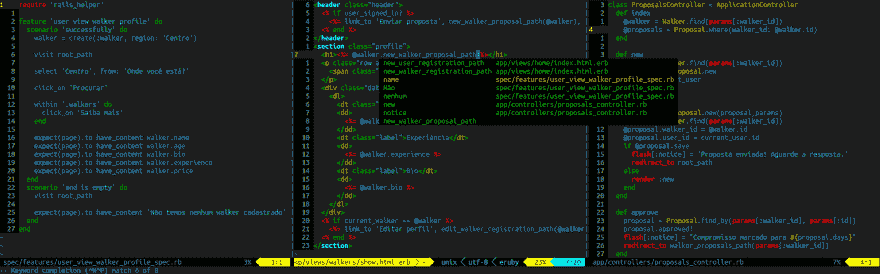
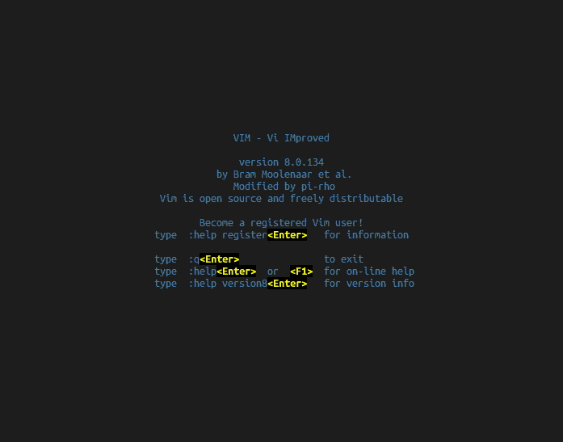
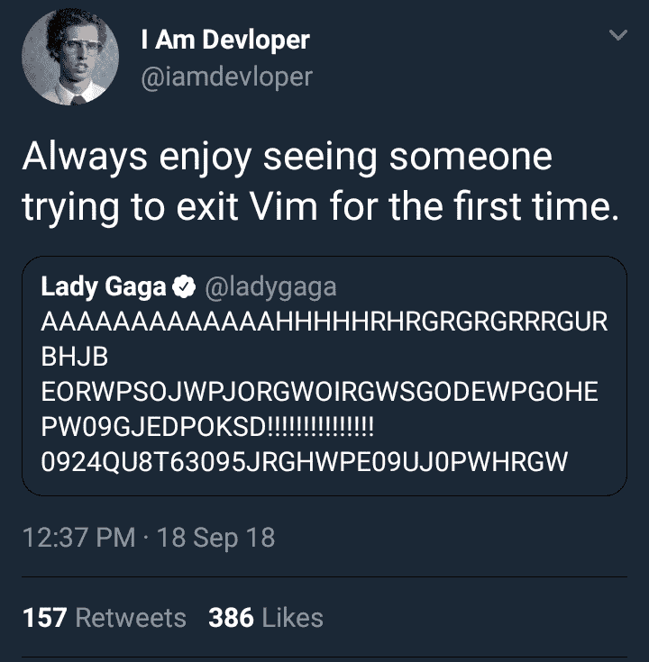
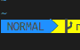
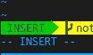
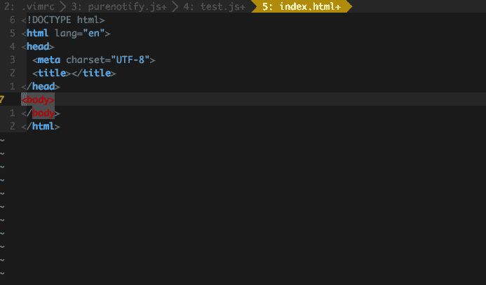

# 我如何(以及为什么)使用 Vim

> 原文：<https://dev.to/gionaufal/how-and-why-i-usevim-4h6g>

* * *

 
*Vim 在行动*

在 web 上，程序员和开发人员之间有很多关于什么是最好的文本编辑器的讨论。有很多选择，其中一些是最受欢迎的； [Atom](https://atom.io) ， [Sublime](https://www.sublimetext.com/) ， [VS Code](https://code.visualstudio.com/) ， [Notepad++](https://notepad-plus-plus.org/) ， [Emacs](https://www.gnu.org/software/emacs/) ， [Vim](http://www.vim.org/) …有些具有类似 IDE 的特性，有些则是最基本最简单的，就像标准的记事本。

当我在 [Campus Code](https://campuscode.com.br) 工作时，我们有 8 名开发人员，几乎都使用 Vim。我们有标准配置，你可以[在这里](https://github.com/campuscode/cc_dotfiles)查看。
在这篇文章中，我不会试图说服你什么是最好的编辑器或 IDE。我将只展示我发现的使用 Vim 的优点，我为什么使用它，以及你也可以如何使用它。

### 先来点历史……

Vim (Vi 改进版)是 Vi 编辑器的改进版。它是开源的，于 1991 年推出。要启动它，只需在您的终端(Linux 或 MacOS)中键入`vim`。您将看到这样一个屏幕:

 
*Vim 初始屏幕*

### 而现在，我该怎么办？

如果您不知道如何使用 Vim，您并不孤单。2017 年 [Stack Overflow 宣布](https://stackoverflow.blog/2017/05/23/stack-overflow-helping-one-million-developers-exit-vim/)问题“如何退出 Vim？”达到了 100 万次访问。这就相当于说，每 20，000 个访问该网站的用户中就有 1 个只是想退出 Vim。

 
*只需键入`:q`并回车，当真*

您可能已经注意到，Vim 既没有图形界面也没有鼠标支持(它有，但是没有人使用它)，所以导航必须通过键盘进行。这比看起来容易，但是需要一点点的练习。
要用 Vim 打开一个文件，只需在你的终端键入`$ vim <path_to_file>`。如果您想打开您所在的文件夹，`$ vim .`。

Vim 建立时考虑到，作为开发人员，我们把大部分时间花在编辑文本上，而不一定是写新东西。这就是为什么它有两种主要模式:`Normal`(导航)和`Insert`。

#### 正常模式:

 
*模式显示在编辑器下方的一个栏中*

这是打开 Vim 时的标准模式。使用`h`(左)、`j`(下)、`k`(上)和`l`(右)键进行导航。如果你想的话，你可以使用箭头，但是事实上，你必须把你的手从字符上移开才能够到它们，这使得字母导航更加有效。

其他一些重要的命令:

`w`移动光标到下一个单词的开头
T1】移动到下一个单词的结尾
`b`移动到上一个单词的开头
T3】擦除光标下面的字符
`u`撤消最后一次更改
`<ctrl>+r`重做最后一次撤消的更改
`v`访问可视模式(用于选择)。要选择某样东西，通过 hjkl 或箭头导航，选中的文字会变成另一种颜色。
`y`复制视觉模式下选中的内容。它可以与其他命令结合使用，例如 yw 复制下一个单词，yy 复制整行。
`d`删除视觉模式下选中的内容。像 y 一样，它可以与其他命令一起使用。
`c`删除选中的内容，打开插入模式(更改)。如上所述，它可以与其他命令一起使用。

#### 插入模式

 
*当下方栏显示插入时，可以写*

按`i`进入插入模式。顾名思义，你可以在上面插入或书写你想要的东西。在这里，Vim 像任何其他编辑器一样工作，根据您的配置，您可以使用自动完成选项甚至快捷方式来创建 HTML 标签，如 [Emmet](https://github.com/mattn/emmet-vim) 。

 
*动作中的 Emmet-vim 按下+y*

要退出插入模式，请按`ESC`。我发现在这两种模式之间转换更好。

* * *

其他有用的命令

在正常模式下:

`:e <path-to-file>`打开文件
`:w`保存当前文件
`:q`关闭文件(和 Vim)
`/foo`在文件中找到 foo。按 Enter 键进入该单词，按 N 键进入该单词的下一个出现处，按 N 键进入前一个
`:%s/foo/bar/g`在整个文件中用 bar 替换 foo。参见此处其他替换选项
`g10`将光标跳到第 10 行(例如)
`gg`将光标跳到文件的第一行
`G`将光标跳到最后一行

* * *

只是一些基本的提示。使用 Vim 需要耐心和坚持，但至少对我来说是值得的，因为它大大提高了我的工作速度和效率。

你还有其他有用的 Vim 技巧或问题吗？把它们留在回复里吧！