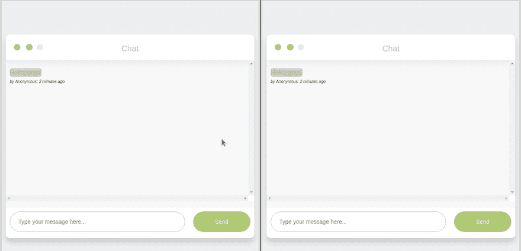
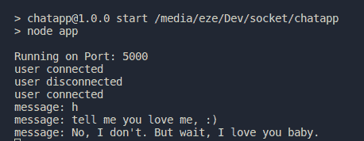

# 如何用 NodeJS，Socket 搭建实时聊天 App？IO 和 MongoDB

> 原文：<https://dev.to/rexeze/how-to-build-a-real-time-chat-app-with-nodejs-socketio-and-mongodb-2kho>

## 如何用 NodeJS，Socket 搭建实时聊天 App？IO 和 MongoDB

在本教程中，我们将使用 NodeJS、Express、Socket.io 和 MongoDB 构建一个实时聊天应用程序。

下面是我们将要构建的内容的截图:

[](https://res.cloudinary.com/practicaldev/image/fetch/s--F0VZS_EG--/c_limit%2Cf_auto%2Cfl_progressive%2Cq_66%2Cw_880/https://thepracticaldev.s3.amazonaws.com/i/1v827419k0axq56duj9k.gif)

## 设置

我假设您已经安装了 NodeJS 和 NPM。如果你还没有安装它，你可以从 [Node JS](https://nodejs.org/en/) 网站安装它。

需要 Javascript 的基础知识。

让我们开始吧。

为应用程序创建一个目录，用你喜欢的编辑器打开目录，比如 Visual Studio Code。你可以使用任何其他编辑器，我将在本教程中使用 VS 代码:

```
mkdir chatApplication && cd chatApplication && code . 
```

接下来，让我们将目录初始化为 Nodejs 应用程序。

```
 npm init 
```

系统会提示您填写一些信息——没关系。这些信息将用于设置您的`package.json`文件。

## 依赖项安装

让我们安装应用程序的依赖项。

我们将使用`express` web 服务器来服务我们的静态文件，而`body-parser`提取传入请求流的整个主体部分，并将其暴露给 API 端点。所以，让我们安装它们。在本教程的后面，您将看到它们是如何使用的。

```
 npm install express body-parser --save 
```

我们添加了- save 标志，这样它将作为一个依赖项添加到我们的`package.json`文件中。

**注:**

> 请不要使用快速生成器，因为我不会介绍如何配置`socket.io`来使用快速生成器设置。

接下来，安装 mongoose 节点模块。这是一个用于 MongoDB 的 ODM(对象文档映射器),它将使我们的工作变得容易得多。

让我们把它安装在 socket.io 和 bluebird 旁边。插座。IO 是一个用于实时 web 应用程序的 JavaScript 库。蓝鸟是一个全功能的 JavaScript Promise 库。

```
 npm install mongoose socket.io bluebird --save 
```

这就是 Nodejs 后端模块的安装。

我们的`package.json`文件现在应该是这样的。

```
{
    "name": "chatApplication",
    "version": "1.0.0",
    "description": "",
    "main": "app.js",
    "scripts": {
    "test": "echo \"Error: no test specified\" && exit 1",
    "start": "node app"
    },
    "author": "",
    "license": "ISC",
    "dependencies": {
        "bluebird": "^3.5.3",
        "body-parser": "^1.18.3",
        "express": "^4.16.4",
        "mongoose": "^5.4.14",
        "socket.io": "^2.2.0"
    }
} 
```

另一种安装上述软件包的方法是复制上面的`package.json`文件并粘贴到你的`package.json`文件中，然后运行:

```
npm install 
```

它将安装所有需要的软件包。

让我们设置客户端。

```
<!doctype  html>
<html>
    <head>
        Anonymouse Real-time chat
        <link  href="https://maxcdn.bootstrapcdn.com/bootstrap/3.3.0/css/bootstrap.min.css"  rel="stylesheet"  id="bootstrap-css">
        <!------ Include the above in your HEAD tag ---------->
        <link  href="/css/style.css"  type="text/css"  rel="stylesheet"/>
    </head>
<body>
<div  class="chat_window">
    <div  class="top_menu">
    <div  class="buttons">
    <div  class="button close"></div>
    <div  class="button minimize"></div>
    <div  class="button maximize"></div>
</div>
    <div  class="title">Chat</div>
</div>
    <ul id="messages"  class="messages"></ul>
<div  class="bottom_wrapper clearfix">
<i  id="typing"></i>
    <form  id="form">
        <div  class="message_input_wrapper">
        <input  id="message"  class="message_input"  placeholder="Type your message here..."  />
        </div>
        <button  class="send_message">Send</button>
    </form>
</div>
</div>
<script src="/js/socket.js"></script>
<script src="https://code.jquery.com/jquery-1.11.1.min.js"></script>
<script src="https://cdn.jsdelivr.net/gh/rexeze/formatTimeStamp/src/index.min.js"></script>
<script src="/js/chat.js"></script>
</body>
</html> 
```

连接插座。我们给客户端的 IO 服务器添加了 Socket。IO 客户端 javascript 库。

```
<script src="/js/socket.js"></script> 
```

这将是我们前端的 html 文件。你可以在这里获取前端[的全部代码。最好的学习方法是跟着做。](https://github.com/rexeze/anonymouse-realtime-chat-app)

你可以在这里下载客户端 socket.io 库[。](https://github.com/socketio/socket.io-client/blob/master/dist/socket.io.js)

这里`/js/chat.js`是我们定制客户端 javascript 代码的地方。

### 设置我们的快递服务器:

创建一个`App.js`。你愿意的话可以叫它 server.js。
我个人比较喜欢叫 App.js。

在 App.js 文件中，让我们创建并配置 express 服务器以使用 socket.io。

`App.js`

```
//Require the express moule
const express = require(“express”);

//create a new express application
const app = express()

//require the http module
const http = require(“http”).Server(app)

// require the socket.io module
const io = require(“socket.io”);

const port = 500;

const socket = io(http);
//create an event listener

//To listen to messages
socket.on(“connection”, (socket)=>{
console.log(“user connected”);
});

//wire up the server to listen to our port 500
http.listen(port, ()=>{
console.log(“connected to port: ”+ port)
}); 
```

这是在后端设置 socket.io 所需的基本配置。

插座。IO 通过向`http.Server`
的实例添加事件监听器来工作，这就是我们在这里所做的:

```
const socket = io(http); 
```

这里是我们监听新连接事件的地方:

```
socket.on(“connection”, (socket)=>{
console.log(“user connected”);
}); 
```

例如，如果一个新用户访问 localhost:500，消息“用户已连接”将打印在控制台上。

socket.on()将事件名和回调作为参数。

还有一个特殊的 disconnect 事件，每次用户关闭选项卡时都会触发该事件。

```
socket.on(“connection”, (socket)=>{
    console.log(“user connected”);
    socket.on("disconnect", ()=>{
    console.log("Disconnected")
})
}); 
```

## 设置本方前端代码

打开您的`js/chat.js`文件并键入以下代码:

```
(function() {
    var  socket  =  io();
    $("form").submit(function(e) {
        e.preventDefault(); // prevents page reloading
        socket.emit("chat message", $("#m").val());
        $("#m").val("");
    return  true;
});
})(); 
```

这是一个自执行函数，它在客户端初始化 socket.io，并发出输入到输入框中的消息。

通过这行代码，我们在前端创建了一个 soicket.io 客户端的全局实例。

```
 var  socket  =  io(); 
```

在提交事件处理程序中，socket io 从文本框中获取我们的聊天内容，并将其发送到服务器。

```
$("form").submit(function(e) {
    e.preventDefault(); // prevents page reloading
    socket.emit("chat message", $("#m").val());
    $("#m").val("");
 return  true;
}); 
```

如果你已经到了这一步，恭喜你，你应该得到一些赞扬。
😄

很好，我们的 express 和 socket.io 服务器都设置得很好。事实上，我们已经能够通过从我们的输入框发出消息来向服务器发送消息。

```
socket.emit("chat message", $("#m").val()); 
```

现在，让我们从服务器端设置一个事件来监听“聊天消息”事件，并将其广播给连接在端口 500 上的客户端。

`App.js`

```
socket.on("chat message", function(msg) {
console.log("message: "  +  msg);
//broadcast message to everyone in port:5000 except yourself.
socket.broadcast.emit("received", { message: msg  });
});
}); 
```

这是监听“聊天消息”事件的事件处理程序，收到的消息在传递给回调函数的参数中。

```
socket.on("chat message", function(msg){
}); 
```

在这个事件中，我们可以选择如何处理来自客户端的消息——将其插入数据库，将其发送回客户端，等等。

在我们的例子中，我们将把它保存到数据库中，并把它发送给客户机。

我们会广播的。这意味着除了发送者之外，服务器将把它发送给连接到服务器的每个其他人。

所以，如果 A 先生发送消息给服务器，服务器广播它，B、C、D 等先生会收到，但 A 先生不会。

我们不想收到我们发出的信息，对吗？😭

这并不意味着我们不能收到我们发出的信息。如果我们删除广播标志，我们也将删除消息。

以下是如何广播一个事件:

```
socket.broadcast.emit("received",{message:msg}) 
```

这样一来，我们就可以将收到的消息添加到我们的 UI 中。

如果你运行你的应用程序。您应该会看到类似这样的内容。请不要嘲笑我的直播聊天。❤️

[](https://res.cloudinary.com/practicaldev/image/fetch/s--pfEdwO-b--/c_limit%2Cf_auto%2Cfl_progressive%2Cq_auto%2Cw_880/https://lh6.googleusercontent.com/F3c2THavSa8-lGYbgIhQLp9M9Ari5Z99b1mJEmEA_ee-D4cLKFCNgmiSrkRCgqR_Gx84BVpNVcvRBKL_Lzc4BVEycunIk4XgCfQi4dwIRTVpZ9F5MMU2JL-1hzGZz3dy-kR9w63A)

瓦屋！再次祝贺你。让我们添加一些数据库的东西，并在前端显示我们的聊天。

## 数据库设置

### 安装 MongoDB

如果您还没有下载，请访问 [mongoDB](https://www.mongodb.com/) 网站下载。

并确保您的 MongoDB 服务器正在运行。他们有一份很好的文档，详细说明了如何着手设置和运行它。你可以在这里找到文档。

### 创建聊天模式

在模型的目录中创建一个名为`models/ChatSchema.js`
的文件这并不复杂，我们的模式中只有 3 个字段——消息字段、发送者字段和时间戳。

`ChatSchema.js`文件应该是这样的:

```
 const  mongoose  = require("mongoose");
const  Schema  =  mongoose.Schema;
const  chatSchema  =  new Schema(
    {
    message: {
    type: String
    },
    sender: {
    type: String
        }
    },
        {
    timestamps: true
});

let  Chat  =  mongoose.model("Chat", chatSchema);
module.exports  =  Chat; 
```

### 连接到 mongodb 数据库

创建一个文件，命名为`dbconnection.js`。这就是我们的数据库连接所在的地方。

```
const  mongoose  = require("mongoose");
mongoose.Promise  = require("bluebird");
const  url  =  "mongodb://localhost:27017/chat";
const  connect  =  mongoose.connect(url, { useNewUrlParser: true  });
module.exports  =  connect; 
```

### 将消息插入数据库

因为我们将在服务器端插入消息，所以我们将在`App.js`文件中插入从前端接收的消息。

所以，我们来更新一下 App.js 文件。

```
 ...
//database connection
const  Chat  = require("./models/Chat");
const  connect  = require("./dbconnect"); 
```

```
 //setup event listener
socket.on("connection", socket  =>  {
    console.log("user connected");
    socket.on("disconnect", function() {
    console.log("user disconnected");
    });  
    socket.on("chat message", function(msg) {
        console.log("message: "  +  msg);
        //broadcast message to everyone in port:5000 except yourself.
    socket.broadcast.emit("received", { message: msg  });

    //save chat to the database
    connect.then(db  =>  {
    console.log("connected correctly to the server");

    let  chatMessage  =  new Chat({ message: msg, sender: "Anonymous"});
    chatMessage.save();
    });
    });
}); 
```

我们正在创建一个新文档，并将其保存到数据库的聊天集合中。

```
 let  chatMessage  =  new Chat({ message: msg, sender: "Anonymous"});
    chatMessage.save(); 
```

### 在前端显示消息

首先，我们将显示数据库中的消息历史，并追加事件发出的所有消息。

为了实现这一点，我们需要创建一个 API，当我们发送 get 请求时，它将数据从数据库发送到客户端。

```
const  express  = require("express");
const  connectdb  = require("./../dbconnect");
const  Chats  = require("./../models/Chat");

const  router  =  express.Router();

router.route("/").get((req, res, next) =>  {
        res.setHeader("Content-Type", "application/json");
        res.statusCode  =  200;
        connectdb.then(db  =>  {
            Chats.find({}).then(chat  =>  {
            res.json(chat);
        });
    });
});

module.exports  =  router; 
```

在上面的代码中，我们查询数据库并获取聊天集合中的所有消息。

我们将把它导入到服务器代码`App.js file`中，我们还将导入 bodyparser 中间件。

```
const  bodyParser  = require("body-parser");
const  chatRouter  = require("./route/chatroute");

//bodyparser middleware
app.use(bodyParser.json());

//routes
app.use("/chats", chatRouter); 
```

这样一来，我们就可以从前端访问我们的 API，并获取我们聊天集合中的所有消息。

```
// fetching initial chat messages from the database
(function() {
    fetch("/chats")
    .then(data  =>  {
    return  data.json();
    })
.then(json  =>  {
json.map(data  =>  {
let  li  =  document.createElement("li");
let messages = docuemtn.getElementById("messages")
let  span  =  document.createElement("span");
messages.appendChild(li).append(data.message);

    messages
    .appendChild(span)
    .append("by "  +  data.sender  +  ": "  +  formatTimeAgo(data.createdAt));
});
});
})(); 
```

因此，我们使用 fetch API 获取消息，并将消息附加到 UI。

你还会注意到我使用了`formatTimeAgo(data.createdAt));`这个 1.31kb 的库来管理小项目的日期，因为 moment.js 有时候太大了。formatTimeAgo()将显示“几秒钟前”等。

有兴趣的可以在这里找到更多信息[。](https://www.npmjs.com/package/simple-datetime-formater)

在这一点上一切似乎都很好，对吗？

但是，由于您没有收到发送给服务器的消息，所以让我们从输入框中取出我们自己的消息并显示在 UI 上。

```
(function() {
$("form").submit(function(e) {
    let  li  =  document.createElement("li");
    e.preventDefault(); // prevents page reloading
    socket.emit("chat message", $("#message").val());
    messages.appendChild(li).append($("#message").val());
    let  span  =  document.createElement("span");
    messages.appendChild(span).append("by "  +  "Anonymous"  +  ": "  +  "just now");
    $("#message").val("");
return  false;

});
})(); 
```

同样，如果我们从事件中收到消息，我们也将其输出到 UI。

```
(function(){
socket.on("received", data  =>  {
let  li  =  document.createElement("li");
let  span  =  document.createElement("span");
var  messages  =  document.getElementById("messages");
messages.appendChild(li).append(data.message);
messages.appendChild(span).append("by "  +  "anonymous"  +  ": "  +  "just now");
});
}) 
```

我们的申请现在完成了。去测试一下吧。

请注意，如果我们让用户登录，我们就不会硬编码“匿名”用户，因为它现在就在我们的代码中。我们会从服务器上得到它。

如果你想告诉每个人有人在打字，你也可以在前端添加这段代码。

```
//isTyping event
messageInput.addEventListener("keypress", () =>  {
socket.emit("typing", { user: "Someone", message: "is typing..."  });
});
socket.on("notifyTyping", data  =>  {
typing.innerText  =  data.user  +  "  "  +  data.message;
console.log(data.user  +  data.message);
});
//stop typing
messageInput.addEventListener("keyup", () =>  {
socket.emit("stopTyping", "");
});
socket.on("notifyStopTyping", () =>  {
typing.innerText  =  "";

}); 
```

它所做的是，当用户输入时，它向服务器发出一个事件，然后服务器将它广播给其他客户端。您监听该事件，并用消息“有人正在键入...”更新 UI。如果你愿意，你可以加上这个人的名字。

这里是服务器端事件监听器和发射器:

```
 //Someone is typing

 socket.on("typing", data => { 

    socket.broadcast.emit("notifyTyping", { user: data.user, message: data.message }); }); 

//when soemone stops typing

socket.on("stopTyping", () => { socket.broadcast.emit("notifyStopTyping"); }); 
```

恭喜你。

您可以改进这段代码、添加身份验证、添加组或使之成为一对一的聊天、重新建模模式以适应所有这些，等等。

看到您将使用 socket.IO 构建的实时应用程序，我会非常兴奋。

我希望这有所帮助。全部代码都在 Github 上。在这里可以得到[。](https://github.com/rexeze/anonymouse-realtime-chat-app)