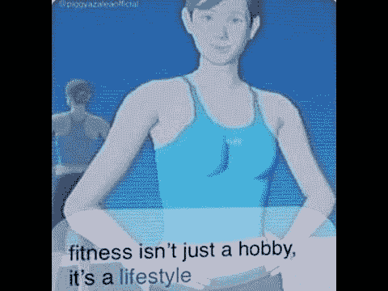
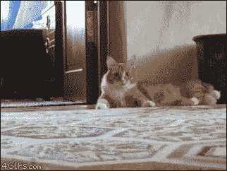
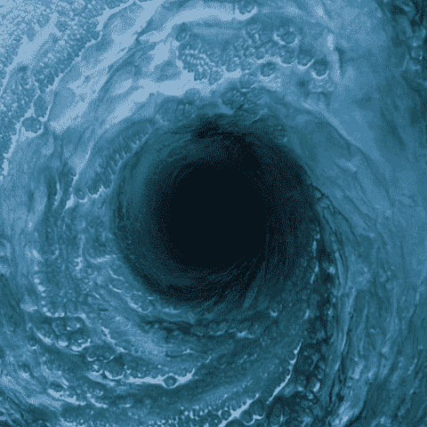
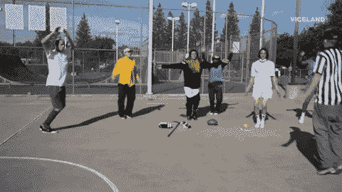

# 如何在你的开发人员生活方式中加入一些锻炼

> 原文：<https://dev.to/dansyuqri/how-to-sprinkle-some-exercise-into-your-developer-lifestyle-4o06>

我们太熟悉自己给自己找的借口了。

> “也许以后下班后我会做些运动”

当你到家的时候...

> “也许明天早上上班前”

当第二天早上到来时

> “哎呀，我上班要迟到了”

如此循环往复。下班后，我们可能想放松一下，或者接受一些个人挑战，探索新技术。我们很少有甚至没有时间来照顾自己的身体。然而，我们需要记住，当我们认为我们的身体理所当然时，它可能会影响我们的思想——我们每天都在使用的工具。

这不是一个关于为什么你应该这样做的帖子。我绝不是健身专家。但是我想分享一下对我有效的方法，以及考虑到你可能有的忙乱的生活方式，你如何能够在一天中进行少量的锻炼。

## 如何在日常生活中加入迷你运动

让我和你们分享一些我想出的让自己多走路的小技巧。你可能认为散步没什么作用，但是如果你每天集体散步，它会创造奇迹。

<figure>

<figcaption>Come hooman let's walk</figcaption>

</figure>

### 走楼梯

你乘公共/私人交通工具到达你的办公楼。假设你的隔间在大楼的 2 楼/3 楼/4 楼。为什么不走楼梯呢？想象一下，每天走楼梯到 4 楼。假设你每天要走两次楼梯(一次在上班前，一次在午饭后)，你将在一年内爬上相当于珠穆朗玛峰的高度！当你在自己的城市里每天都可以爬真正的山时，谁还需要去爬呢？

<figure>

<figcaption>ohhhh yeaaahhhh</figcaption>

</figure>

如果上班的楼梯太难走，你也许可以在上班的路上走楼梯。在火车站，在你家附近公园的大楼梯上。下班后，走楼梯回到你的公寓。只要有机会，就去争取吧！

起初，这可能看起来有点令人不知所措，非常累人。最开始的几次可能是最难的，无论是身体上还是精神上。过一段时间后，这自然会成为一种习惯，你会想爬上你发现的每一个楼梯！(这里可能有点夸张)你只需要克服最初的困难，其他的都会跟着你做的，:D

### 去更远厕所

我们都必须时不时地去上厕所(如果你不去，请原谅我)。你可以去更远的厕所，而不是去最近的厕所。如果你的楼层只有一个，去楼上或楼下的那个。这与上一个关于爬楼梯的观点紧密相关。

<figure>

<figcaption>let me help you with that</figcaption>

</figure>

增加来回的步数不仅有助于燃烧额外的卡路里，还能让你的身体得到很好的伸展——这是你在办公桌前坐了一整天后所需要的。就我个人而言，在散步的时候，我也会有一些小的想法。无论是寻找一个新的角度来解决我目前面临的问题，还是为我的工作增加新的功能。

首先，因为散步带走了我当前嵌在屏幕上的思维方式。第二，因为它能让我紧张的背部和颈部得到很好的伸展，当我回到办公桌前时能让我的大脑放松一点。新鲜的头脑总是有帮助的。也许这些散步也会对你有所帮助！

(专业提示:尽可能多的保持水分。你喝的水越多，你走的路就越多)

### 给那些有 10 分钟空闲的人

10 分钟听起来不多，但是如果你能集中精力让你的心脏跳动起来，你很快就会出一身汗。我通常会在繁忙的日子里抽出 5-10 分钟来锻炼。这通常以静态练习的形式出现，这样我就有 10 分钟的时间完全集中在流汗上，一点也不少。像[家庭锻炼](https://play.google.com/store/apps/details?id=homeworkout.homeworkouts.noequipment&hl=en_SG)(不隶属于它们)这样的移动应用程序提供短时间的锻炼程序，通常不超过 10 分钟。

<figure>

<figcaption>We all can jump can't we?</figcaption>

</figure>

你甚至可以在午休或其他休息时间做这些事情。该应用程序上最短的例行程序仅由 3 分钟的例行程序组成(减去每次锻炼之间的休息时间)。然而，如果你有更多的时间，为什么不在下班后尝试一系列的日常锻炼呢？出汗后好好睡一觉。

## TL；速度三角形定位法(dead reckoning)

*   攀爬
    *   爬上你能找到的所有楼梯，在你自己的后院征服珠穆朗玛峰
*   步行
    *   找到更远的厕所，走过去走更远的距离
*   焦急
    *   在 10 分钟以内做静态锻炼-> [家庭锻炼](https://play.google.com/store/apps/details?id=homeworkout.homeworkouts.noequipment&hl=en_SG)