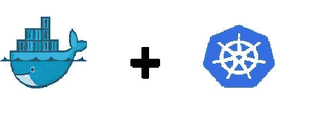

# Docker、Kubernetes 和无服务器——初学者基础

> 原文：<https://dev.to/mirknn/docker-kubernetes-and-serverless--basics-for-beginners-17cd>

“无服务器化”并不是一个新的概念，如果你正在阅读这篇文章，你可能听说过或者有兴趣了解文章标题中提到的一个话题，因为在过去几年里，它们都已经成为越来越受欢迎的话题。如果你在技术行业工作，但不是一个“技术迷”,并且想要跟上时代，或者计划在技术领域工作——你应该花一些时间学习关于容器、Docker、Kubernetes 和无服务器的知识。这篇文章是写给那些想更多了解这些基本软件的人的。

## 容器

这里有两个术语你需要知道:容器图像和容器。映像是一个软件包，其中包含运行它所需的一切，比如运行时环境规范。容器本身是该图像的活动实例。它们允许您在任何环境下部署和运行应用程序。

## 何时装箱

假设你正在和不同部门的人合作一个项目。您正在使用 MySQL 编写一个数据库，而您的同事正在用 Python 创建一个游戏 GUI。您能想象尝试部署一个单一的工作环境，并为两种环境提供所有的依赖关系吗？在这种情况下，我们可以简单地使用一个包含两个运行时环境映像的容器来实现更高效的项目协作。

容器化的主要原因是有一个轻量级的解决方案来打包应用程序，而不必处理耗尽计算机宝贵资源的虚拟机。

## 码头工人

Docker 是一个平台，它提供了一套工具来帮助开发人员在上面提到的容器中构建、发布和运行他们的应用程序。它最初是一个开源项目，现在已经成为最流行的容器平台。Docker 提供了基于图像的分发模式。这使得跨许多环境共享应用程序及其依赖关系变得容易。

但是 Docker 住在哪里呢？如前所述，容器提供了虚拟机的轻量级替代方案。下面是两个系统。你可以看到运行 Docker 的程序是如何被简化的。它消除了主机上繁重的来宾虚拟操作系统的需求。

[via [NetApp](https://blog.netapp.com/)](img/fa8b6305ae83f69d31efc17e979946ec.png)](https://res.cloudinary.com/practicaldev/image/fetch/s--PPyYf_9m--/c_limit%2Cf_auto%2Cfl_progressive%2Cq_auto%2Cw_880/https://cdn-images-1.medium.com/max/2000/1%2AHxi2wFAFKe76q2BSs40XVw.jpeg)

有大量的[文档](https://www.docker.com/)可以帮助你构建一个“docker file”。docker file 将是你未来容器的基础映像。然而，在开始使用 Docker 之前，您应该考虑的一件事是您的操作系统。如果你刚刚起步，我没有意识到这对你的生产力有多大影响——Linux 或 Linux 的发行版(例如 [Ubuntu 18.04](https://www.ubuntu.com/download/desktop) [)](https://www.ubuntu.com/download/desktop) )会工作得最好。为了你自己，如果你是一个初学者，请不要在 Windows 机器上使用 Docker 它的配置是毁灭性的。

将一个大型应用程序划分到不同的容器中也有安全上的好处:如果一个容器受损，其他容器不会受到影响。开发人员使用 Docker 在本地测试和开发环境——类似于一个实时服务器，他们可以在那里即时更新代码。这使我们进入下一个话题。

## Kubernetes

Kubernetes(或 K8s)是 GitHub 上发展最快的开源项目之一。它*** *提供了管理大量容器* *的工具。**Kubernetes 可以在内部运行，也可以使用云服务运行。Kubernetes 在不同的服务器上安排“pods”**。* * pod 是由一个或多个共享相同 IP 地址的容器组成的组，因此它们可以通过本地主机相互通信。了解 Kubernetes 的一个很好的方法是观看这个名为“[儿童 Kubernetes”](https://www.youtube.com/watch?v=4ht22ReBjno)的创意视频。

## 无服务器

这个名字有点模糊，因为当然在某个地方有运行你的应用程序的服务器，但是你不需要担心它们，因为它们不是用户定义的* *。* *这个想法是，开发者不需要担心他们程序的可伸缩性——这意味着更少的上市时间* *。* *他们将代码部署为功能(FaaS，功能即服务)* *。* *可以随时随地访问这些功能。用户按执行付费，函数是无状态的(意味着寿命很短)。

无服务器平台的一个例子是支持所有编程语言的 fnproject。

## 无服务器的一些好处

*   **少运营管理**

无服务器架构允许开发人员专注于编写代码，责任在于您的云提供商，他们提供的功能即服务由他们单独管理。

*   **缩放**

无服务器功能(您的应用程序)总是由一个事件(比如一个 HTTP 请求)调用，并且按需伸缩。这有可能成为一个非常有成本效益的服务，因为你每次执行支付。

*   **表现不佳的代码将变得明显**

有人说这将改变开发者编写软件的方式。

## 现在怎么办？

现在，您已经有了更好地理解容器化和无服务器架构的基础。你现在可能不明白它们是如何联系在一起的，但是你对这些话题读得越多，这就会变得越清楚。

首先，这里有一个关于如何将 WordPress 部署到 Docker 容器的简单教程。

## 注

这篇文章和后面的文章是为像我一样对开发感兴趣的初学者准备的。未来的任何帖子都将包含我自己的学习经历。

我还参加了#100daysofcode 挑战赛👨‍💻请随时在 Twitter 上与我联系，我会很高兴听到其他程序员参与其中的故事！