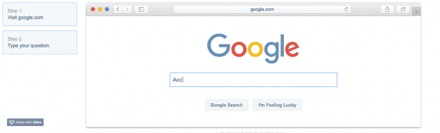

# 通常你的解决方案是一个(更多的)谷歌搜索

> 原文：<https://dev.to/dvddpl/often-your-solution-is-one-more-google-search-away-574a>

最近我有机会参与一个项目，我们必须从 PHP + Vertica 迁移到 T2 nodeJS+Aurora 无服务器。
那里发生了很多事情，而我对此却没有什么经验。我观看了 Udemy 的课程，阅读了大量的文档，并跟随教程。我已经做了很多了，然后我被一个奇怪的错误卡住了:

`Error: Access denied for user 'MY_USER'@'%' (using password: YES)`

[](https://i.giphy.com/media/l2JhtKtDWYNKdRpoA/giphy.gif)

为什么拒绝访问？我已经可以连接到新的数据库，创建所有的表——甚至向它们插入单行，为什么将 CSV 文件加载到表中会因为凭证或权限而失败呢？

SQL 查询很简单:

```
LOAD DATA INFILE '${filename}' 
INTO TABLE ${table} 
FIELDS TERMINATED BY ',' 
ENCLOSED BY '"'
LINES TERMINATED BY '\n'
IGNORE 1 ROWS;` 
```

Enter fullscreen mode Exit fullscreen mode

在谷歌上搜索这个错误时，我发现了堆栈溢出的东西，它把我引向了错误的方向——用户访问、用户创建、表上的权限。然后我很快问了一个同事，他甚至没有检查我的脚本，只是简单地[重新措辞了我的搜索](http://lmgtfy.com/?q=Access+denied+for+user+%20(using+password%3A+YES)+LOAD+INFILE)并让我回到正轨。
T3T5】

正如所料，该解决方案与拒绝访问无关，如果我(更仔细地)阅读了 [LOAD DATA INFILE](https://dev.mysql.com/doc/refman/5.7/en/load-data.html) 的文档，我就会知道这一点

> 如果未指定 LOCAL，则该文件必须位于服务器主机上，并由服务器直接读取。如果指定了 LOCAL，该文件将由客户端主机上的客户端程序读取并发送到服务器。

[](https://i.giphy.com/media/MuTenSRsJ7TQQ/giphy.gif)

结论:

*   [RTFM](https://it.wikipedia.org/wiki/RTFM)
*   谷歌一下(经常改述)
*   一旦你找到了你的解决方案——不要只是复制粘贴，而是要理解它，多读一些，否则你什么也学不到
*   当你遇到困难时，不要害怕问