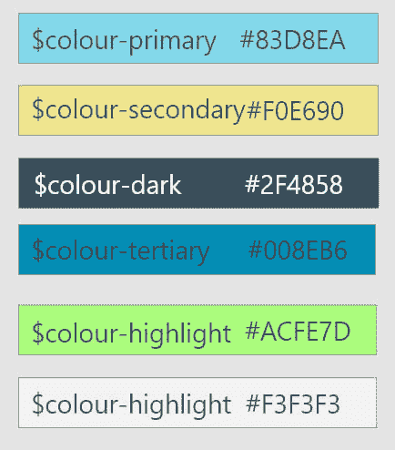
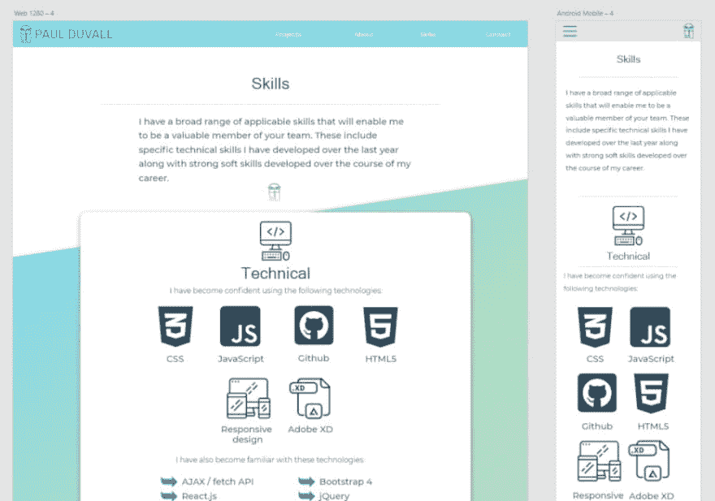

# 更新我的投资组合

> 原文：<https://dev.to/paul_duvall/updating-my-portfolio-1349>

一段时间以来，我一直痛苦地意识到，作为一名开发人员，我给未来雇主的第一个指示是我的投资组合。我的作品还有很多不足之处。

首先，这个设计很笨重。我可能不是一流的设计师，但在过去的几个月里，我对网页设计原则的认识突飞猛进。除了笨拙的设计，作为我创建响应性网站能力的证明，它完全失败了。

考虑到这一点，我最近开始创建一个全新的投资组合，使用一些我第一次没有用过的工具从零开始构建。请继续阅读，了解我是如何进行这次重新设计的，以及我希望最终产品达到什么样的效果。

### 设计简介

我的作品集的目的是展示我在努力过渡到一个与 web 开发相关的角色的过程中所学到的技能，通过创建一个既赏心悦目又使用组织良好、干净的代码构建的专业展示的产品。

目标受众主要是招聘人员和未来的雇主。因此，网站的主要目标应该是:

确保我的技能简明扼要

明确如何最好地联系我

提供我参与过的项目的信息和链接。

我也希望能够从事自由职业工作，尽管这是我目前的第二目标，我所做的设计并不是为了吸引自由职业客户。这样做将需要更大的范围，但是当前的设计可以在未来的基础上实现这一目的。

### 灵感

在创建我的设计之前，我花了相当多的时间研究其他人的投资组合。我发现这非常具有挑战性。我通过标题为“30 个灵感组合设计”的博客帖子找到了大量雄心勃勃的独特设计，但这些设计总是围绕着过于雄心勃勃的设计，以我目前的技能水平来指导我。

然而，我想要一些视觉上吸引人的东西，并建立在坚实、可靠的布局模式上。几个投资组合启发了我:

汤姆·赫斯特的网站我发现它非常专注。任何文本内容都是简洁的，网站的意图非常明确，大量使用绿色作为“行动号召”的颜色。

Sarah Evan 的网站有一种现代但平易近人的感觉。特别是，我喜欢[的个人项目页面](http://www.sarahevansdesign.co.uk/work/the-living-coast)，它详细描述了每个项目背后的过程和简介。

Adam Marsden 的网站提供了一些更直接的灵感——我喜欢他的项目卡片的布局，并决定以此作为我布局的灵感。我也喜欢他将项目分成两个部分的方式，关键项目在页面上获得更高的优先级，而“杂项”部分用于较旧或较小的项目。

最后，虽然这可能不是网站最华丽的部分，但我非常喜欢汉娜·金的页脚部分，并以此作为我的灵感来源。

### 初始设计

有了一些灵感，我开始思考我的设计。看了 Kevin Powell 关于使用 [Adobe XD](https://www.adobe.com/uk/products/xd.html) 设计一个酿酒厂网站的视频(并且发现，与 Adobe 的其他软件不同，XD 是免费的)，我决定尝试使用它来为我的作品集设计一个作品。这是我第一次尝试在项目中使用设计软件。过去，我会在纸上画出一个粗略的页面布局，但我可以诚实地说，在电脑上创建了一个网站的初始设计后，如果不花时间在这个阶段，我将永远不会再开始一个项目。

在我看来，Adobe XD 使用起来非常直观和愉快。我花了 15 个小时的大部分时间来完成我的设计，这可能是一段很长的时间，但我学到了很多东西，而且我使用软件越多，我就变得越快。我相信，现在我正在编码，拥有一个经过深思熟虑的设计可以节省我的时间。这有几个原因——颜色、尺寸和有针对性的布局。

#### 颜色

首先，我做了我通常做的事情:选择一些颜色，并主要使用这些颜色，在我完成这个项目的过程中，随机加入一些我认为合适的颜色。

在创作我的作品集设计时，我反复选择了几种配色方案，最后才选定了最终的调色板。我使用[色彩空间](https://mycolor.space/)来帮助我选择互补色，但正是 Adobe XD 的色彩库功能确保我开发了一种更有纪律的方法。

只要有可能，我就使用相同的少量颜色，从而使设计更加一致。我选择了一种醒目、充满活力的绿色作为突出的亮色，吸引用户的注意力。

我为自己创建了一个小色板，包括我将在 Sass 中使用的变量名。

#### 上浆

创建初始设计也鼓励我更仔细地考虑元素的大小和位置。我读过很多关于空白的重要性，以及它的有效使用是如何融入现代设计的。花时间在 Adobe XD 中创建一个设计无疑帮助我更好地意识到我对空白的使用，确保我的网站上的组件有空间来最大化它们的影响，并确保良好的流动。

我还发现设计过程有助于思考给文本更多的空间，比我过去使用的行距更大，字符间距略有增加。最重要的是，我能够保持所有这些设计考虑的一致性。

#### 响应式布局

Adobe XD 允许用户将新的“画板”快速添加到项目中，并在这样做的过程中，根据不同的设备选择宽度。虽然我知道我很可能需要创建第三个中等大小的布局，但我决定在我的初始设计中包括两个版本:一个更大的版本(1280 像素)和一个更小的版本(360 像素)。

创建这两个版本给了我一种真实的感觉，它们是如何相互关联的，不同的组件是如何堆叠和改变位置的。这个过程自然地引导我考虑这可能如何工作的实用性，我的大脑开始形成想法，并根据我知道我可以用代码实现的东西做出实际的决定。反过来，这也影响了我的设计。

### 编码-设置

在我上一个项目的 CSS 文件很快变得非常混乱之后，我很清楚这一次我需要一个更好的方法来组织我的 CSS。所以我决定使用 Sass，可以说是最流行的 CSS 预处理器，将我的代码组织成单独的(部分)文件。

我使用 node package manager (npm)在我的项目中安装 node-sass，创建一个脚本，在发生更改时自动运行和编译 sass。我之所以能够做到这一点，很大程度上要感谢乔纳斯·施梅德曼的[高级 CSS 和 Sass 课程](https://www.udemy.com/advanced-css-and-sass/)。

我也花了一些时间来加深对 git 和 Github 的理解，我渴望以更专业的方式将这些技术集成到我的工作流程中。我开始在 Github 上使用 issues 和 pull 请求，在我的电脑上使用命令行工具 Git Bash 来管理项目的分支和提交。我已经准备好更加自信地开始使用这些工具，这在很大程度上要归功于 Udacity 精彩的免费课程[如何使用 Git 和 Github](https://eu.udacity.com/course/how-to-use-git-and-github--ud775) 。

### 首页

首页将分为四个主要部分:

一个标题，包括我的名字，照片，最重要的是，链接到联系页面和我的简历

一个关于的部分，简短而甜蜜

技能部分，将再次简短明了，因为关于我的技能的大部分信息将位于单独的页面上

一个项目部分，也很简短(注意到这里的模式了吗？)，只有两个最近的项目，以及一个到专门项目页面的链接。

读了史蒂夫·克鲁格的[不要让我思考](https://www.amazon.co.uk/Dont-Make-Think-Revisited-Usability/dp/0321965515/ref=pd_lpo_sbs_14_t_0?_encoding=UTF8&psc=1&refRID=PJJANYBF3EMAWGXSSNAA)，他在其中强调了人们平均花在任何给定网页上的时间是多么少，我想让首页上的信息尽可能集中和简洁。上面概述的主要目标在这一页中用最少的废话就实现了。

### 下一步

我的目的是尽可能快地让它运行起来——旧的产品组合退出，新的产品组合加入。然后，当它们准备好时，我可以添加二级页面。

希望一旦为主页编写了 CSS，我就能更快地将其他页面放在一起。我为主页设计的一些重用组件，例如技能卡组件(在“关于我”页面上重用)和项目卡组件(在“项目”页面上重用)。

我对这个项目感到兴奋，并相信它会更好地展示我的能力。我已经和几个看过我目前作品集的招聘人员谈过了，虽然他们有时会对我的作品进行补充，但我知道当我的新网站建立并运行时，我会在这些谈话中感到更加自信。