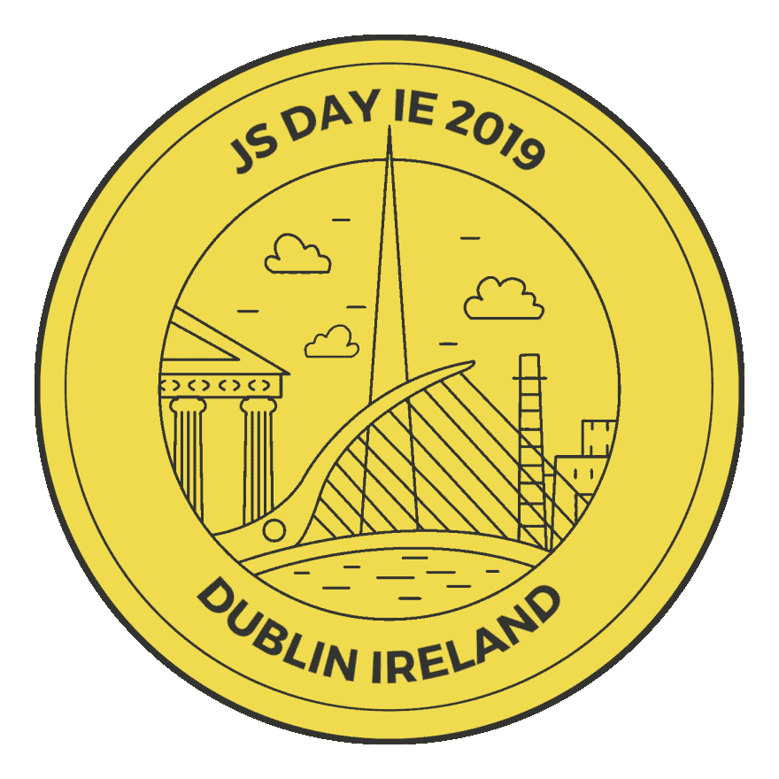
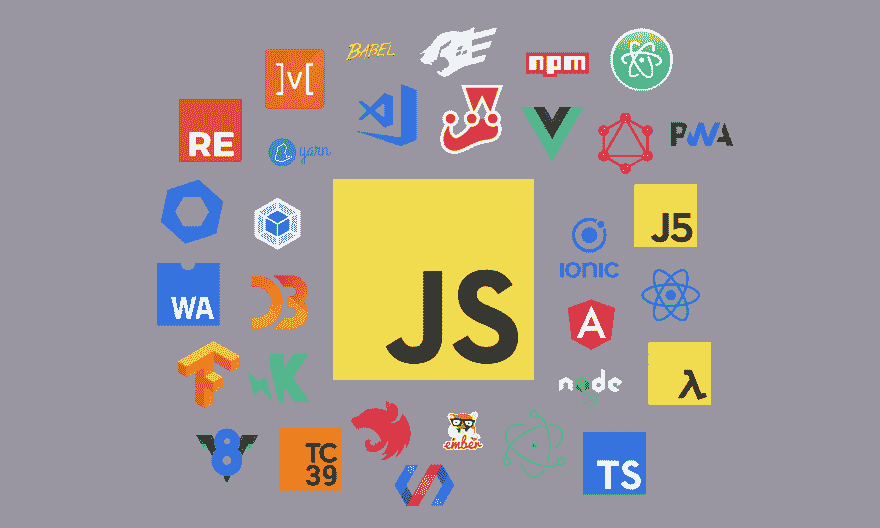

# 介绍 JSDayIE 2019！

> 原文 https://dev.to/wolksoftware/introducing-jsdayie-2019-515 p

欢迎来到 JSDayIE 2019 官方公布！我们很高兴在爱尔兰举办第一届 JavaScript 大会。

JSDayIE 2019 将是爱尔兰 JavaScript 社区的一天，将有超过 450 人参加。该活动的目标是将 JavaScript 社区聚集在一起一天，展示爱尔兰 JavaScript 社区成员所做的一些最好和最具创新性的工作。

JSDayIE 由 [Wolk 软件](http://www.wolksoftware.com/)呈现。Wolk Software 是一家位于爱尔兰的初创公司，致力于通过咨询和培训服务以及技术出版物和活动来帮助开发人员和团队实现最佳状态。

JSDayIE 2019 将于 2019 年 9 月 20 日在都柏林市中心 Dawson 街 Mansion House 的圆形房间举行。

JSDayIE 是一个单场为期一天的技术会议，主要讨论与 JavaScript 相关的各种技术主题。讲座将重点关注 JavaScript 最佳实践、经验教训、前端 JavaScript 框架和库(如 React、Vue 和 Angular)、Node.js 和 GraphQL 开发、JavaScript 性能、JavaScript 风格(如 TypeScript 或 Reason ML)以及新兴技术(如 Web 组装和渐进式 Web 应用程序)。

我们正在与爱尔兰的 JavaScript 社区合作，如 Node.js Dublin、React Dublin、CorkJS、BelfastJS、DublinJS、Dublin TypeScript 和许多其他社区，以确保每个人都参加这次活动。

我们还积极参与促进包容性和开放性，不仅在我们的会议上，而且在整个设计和技术领域。我们正与诸如 Woman Who Code 这样的社区合作，努力打造多元化的演讲者阵容。

我们目前正在寻找演讲者。如果您想发表演讲，请访问[征集提案页面](https://www.jsday.org/cfp)，了解如何立即提交您的提案！

我们目前也在寻找赞助商。赞助 JSDayIE 是促进爱尔兰 JavaScript 社区健康发展的一个很好的方式，并且提供了一个独特的机会来展示你的品牌和在爱尔兰寻找 JavaScript 技术方面的专业人才。如果您希望您的公司赞助 JSDayIE 2019，请访问[赞助商页面](https://www.jsday.org/sponsors)。

票很快就能买到了！订阅我们的[时事通讯](https://www.jsday.org/newsletter)或关注我们的[推特](https://twitter.com/JSDayIE)、[脸书](https://www.facebook.com/Jsdayie-336263463661254)或 [LinkedIn](https://www.linkedin.com/company/jsdayie/) ，我们会通知您何时有票以及其他重要更新！

徽标致谢:JSDayIE 2019 徽标基于由 [Kieran Sheehan](https://twitter.com/KSheehan77) 设计的都柏林徽标，并根据知识共享署名-非专有许可证进行许可。