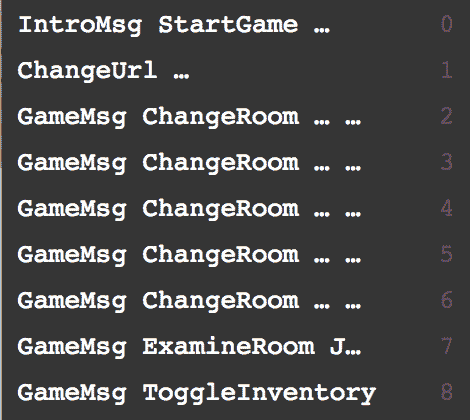

# 状态转换(即 Elm 消息/反应行动等。):过去式还是祈使式？

> 原文：<https://dev.to/nimmo/state-transitions-ie-elm-messagesreact-actions-etc-past-or-imperative-tense-488i>

你认为哪一种方法能帮助你或你的同事更好地对你的申请进行推理？

`DetailsUpdated`过去式:
祈使式:`UpdateDetails`

就我个人而言，我总是倾向于命令式，但是最近我想了想，意识到每当我看到状态转换列表时，事情都感觉有点奇怪。例如:

虽然这很容易理解，但无论如何，如果不回到过去式就很难描述它:用户**开始**游戏，网址**改变**，用户**改变**房间，用户**切换**库存...

但是当你写代码时，这就不一样了:“当用户选择开始游戏时，我希望游戏开始”等等。

所以我很感兴趣:你用什么？