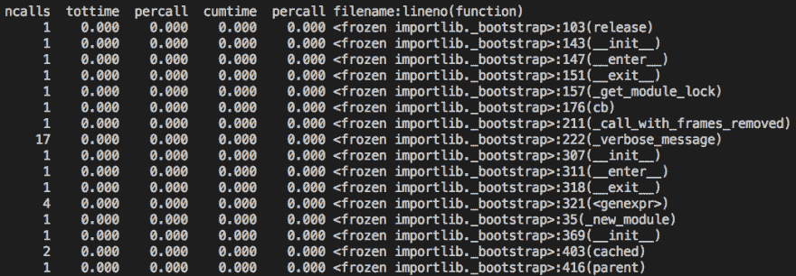
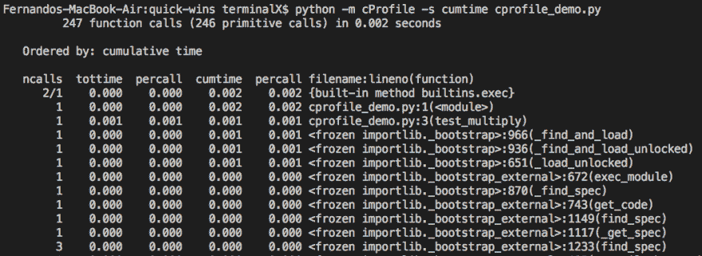
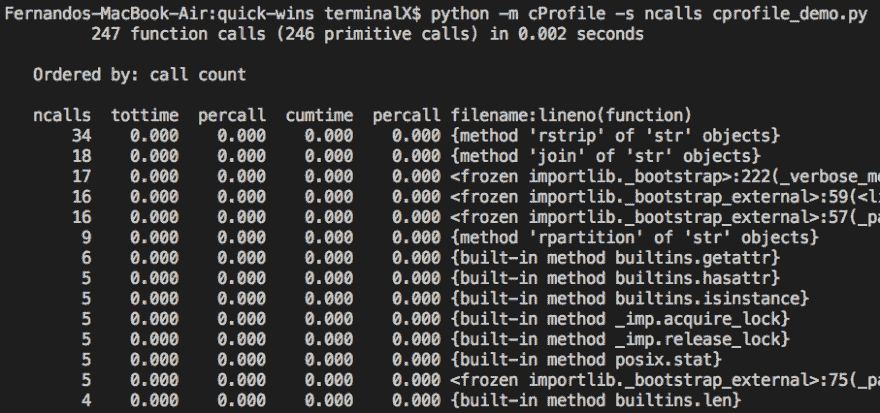
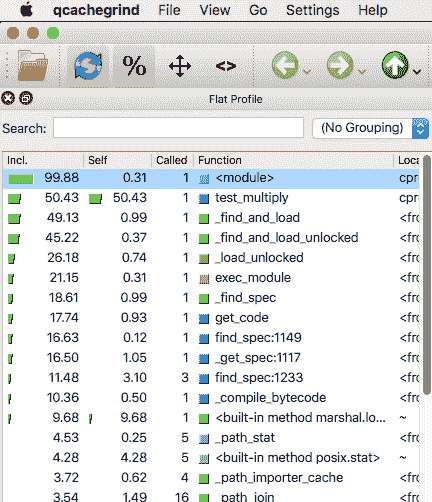
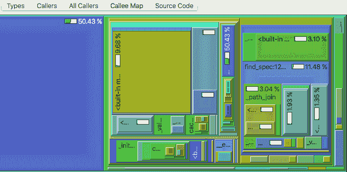

# 用 cProfile 分析 Python

> 原文：<https://dev.to/thefern/profiling-python-with-cprofile-53jf>

# 用 cProfile 剖析 Python 脚本

## 什么是剖析？

顾名思义，性能分析为您提供了脚本的性能分析。它评估时间、呼叫计数和各种统计数据。因此，如果您正在尝试优化脚本运行时，或者您有一个花费太多时间处理的特定函数，您可以分析脚本来缩小问题范围。

cProfile 模块与 python 捆绑在一起。下面的例子运行 cprofile_demo.py

```
Usage: cProfile.py [-o output_file_path] [-s sort] scriptfile [arg] ...
python -m cProfile cprofile_demo.py 
```

Enter fullscreen mode Exit fullscreen mode

它会将输出打印到控制台:

[](https://res.cloudinary.com/practicaldev/image/fetch/s--GEjyh1pY--/c_limit%2Cf_auto%2Cfl_progressive%2Cq_auto%2Cw_880/https://thepracticaldev.s3.amazonaws.com/i/rk8iqtv3zbokabp3daph.png)

*   **ncalls** 是发出的呼叫数。
*   **tottime** 是给定函数花费的总时间。
*   **percall** 指总时间除以 ncalls 的商
*   **累计时间**是在该功能和所有子功能中花费的累计时间。甚至对递归函数也很准确！
*   第二个 **percall 列**是累计时间除以原始调用的商
*   **filename:line no(function)**提供每个函数各自的数据

## 参数选项

下面是一些可用于排序的参数。[完整文档](https://docs.python.org/3/library/profile.html)

| 字符串参数 | 枚举参数 | 意义 |
| --- | --- | --- |
| '呼叫' | 排序键。打电话 | 呼叫计数 |
| '累积' | 排序键。累积的 | 总时间 |
| 累积时间 | 不适用的 | 总时间 |
| '文件' | 不适用的 | 文件名 |
| ncalls 的 | 不适用的 | 呼叫计数 |

```
python -m cProfile -s cumtime cprofile_demo.py 
```

Enter fullscreen mode Exit fullscreen mode

[](https://res.cloudinary.com/practicaldev/image/fetch/s--S-FKFEZ_--/c_limit%2Cf_auto%2Cfl_progressive%2Cq_auto%2Cw_880/https://thepracticaldev.s3.amazonaws.com/i/l9s298c8nz2m0rkqjphi.png)T3】

```
python -m cProfile -s ncalls cprofile_demo.py 
```

Enter fullscreen mode Exit fullscreen mode

[](https://res.cloudinary.com/practicaldev/image/fetch/s--BrRbmqgU--/c_limit%2Cf_auto%2Cfl_progressive%2Cq_auto%2Cw_880/https://thepracticaldev.s3.amazonaws.com/i/eutepxclmtf3dse3tjei.png)

如您所见，有大量关于脚本执行性能的信息。然而，许多人喜欢用更直观的方式看待事物。

## QCachegrind 可视化

如果你用的是 mac，首先用 brew 安装 qcachegrind。对于 linux 和 windows，你必须从[源](http://kcachegrind.sourceforge.net/html/Download.html)编译或者找到一个编译好的安装程序。

**未测试，风险自担:)**

*   Ubuntu [安装脚本](https://gist.github.com/jtilly/866ee2cc4baec369150a)的链接
*   Windows 的链接 [Windows installer](https://sourceforge.net/projects/qcachegrindwin/)

## Mac 安装

```
brew update
brew install qcachegrind
pip install pyprof2calltree 
```

Enter fullscreen mode Exit fullscreen mode

首先我们需要将分析结果输出到一个文件:

```
python -m cProfile -o myscript.cprof cprofile_demo.py 
```

Enter fullscreen mode Exit fullscreen mode

然后我们就可以在 qcachegrind:
中打开了

```
pyprof2calltree -k -i myscript.cprof 
```

Enter fullscreen mode Exit fullscreen mode

[](https://res.cloudinary.com/practicaldev/image/fetch/s--kXYhE0Q---/c_limit%2Cf_auto%2Cfl_progressive%2Cq_auto%2Cw_880/https://thepracticaldev.s3.amazonaws.com/i/6ml2dj4yjcchqhm4ue8p.png)

[](https://res.cloudinary.com/practicaldev/image/fetch/s--IL4GB_a8--/c_limit%2Cf_auto%2Cfl_progressive%2Cq_auto%2Cw_880/https://thepracticaldev.s3.amazonaws.com/i/y8xy7fee4kn0aj1k85mz.png)

## 结论

我的小脚本没有做到公正，但是我希望您能够理解使用这些令人敬畏的工具进行剖析的想法。我第一次使用剖析，是在 codewars 中做一个由于太慢而没有通过的挑战。在找到瓶颈之后，我会逐步执行这个函数，并找出优化它的方法。感谢您的阅读！