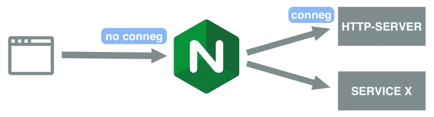

# 使用 NGINX 时向网站添加内容协商

> 原文：<https://dev.to/heypieter/add-content-negotiation-to-website-when-using-nginx-4j07>

合著者[朱利安·罗哈斯](https://twitter.com/julianr1987)

[内容协商](https://en.wikipedia.org/wiki/Content_negotiation) (conneg)是一种 HTTP 机制，使得在同一个 URI 上提供不同的资源表示成为可能。这允许代理指定他们更喜欢的资源表示。例如，一方面，当浏览器打开`http://example.com/house`时，它会向服务器请求一个 HTML 文档。另一方面，另一个处理 XML 文档的应用程序可以在`http://example.com/house`请求相同的资源，但是该应用程序将要求资源的 XML 表示。在这篇博文中，我们将解释如何在使用 [NGINX](https://www.nginx.com/) 时为你的网站获得链接。

我们希望实现以下目标:

*   使用 NGINX 作为反向代理。
*   服务于一个静态网站，它有相同资源的不同文档。
*   启用网站连接。

首先，我们来看看我们使用的[工具](#tools)。其次，我们讨论[设置](#setup)和[配置](#configuration)。最后，我们展示两个真实的[例子](#examples)和[总结](#summary)这篇博文。

## 工具

NGINX 不支持开箱即用。有一些教程和博客文章解释了如何实现某种连接，但是它们都与特定的用例紧密相关。因此，它们需要很大的改变来使它适合你的用例，并且不容易被重用。如果 NGINX 不支持 conneg，那为什么不干脆挑别的。嗯，虽然 NGINX 缺乏这个特性，但它在其他方面确实工作得很好，比如高性能、缓存、反向操作等等。

那么我们用什么来启动连接呢？我们使用 [http-server](https://github.com/indexzero/http-server) 的一个[分支](https://github.com/pheyvaer/http-server)。
http-sever 是“一个简单的、零配置的命令行 http 服务器”,使用 Node.js 构建。更详细地说:服务器根据 Accept 头中的 MIME 类型查找正确的文件。MIME 类型链接到它们相应的扩展名。例如，当你用接受头`text/turtle`向`http://localhost:8080/test`发出请求时，服务器会寻找文件`/test.ttl`。当你用接受头`application/n-triples`向`http://localhost:8080/test`发出请求时，服务器会寻找文件`/test.nt`。
也支持多种类型的接受头，可选地用质量值加权。例如，当您用 Accept header `text/turtle;q=0.5, application/n-triples`向`http://localhost:8080/test`发出请求时，服务器会查找文件`/test.nt`。

## 设置

[](https://res.cloudinary.com/practicaldev/image/fetch/s--X2Gq2-Tl--/c_limit%2Cf_auto%2Cfl_progressive%2Cq_auto%2Cw_880/https://thepracticaldev.s3.amazonaws.com/i/1rgow6gh2ajzrt94ibfu.jpg)

您可以在上图中找到我们的设置的不同组件的概述。我们有三个正在运行的服务:NGINX，http-server，和一个服务 x。后一个服务可以是任何东西，服务的数量没有限制。所有的请求都被 NGINX 接收，而我们网站的请求，我们想要连接的，被重定向到 http-server。NGINX 不知道任何连接，因为所有请求都被转发到 http-server。添加服务 X 是为了表明 NGINX 背后的其他服务也不知道连接，因为所有连接逻辑都在 http-server 中处理。当然，服务 X 也可以支持连接，但是这并不影响 http 服务器的连接。

## 配置

我们需要配置 NGINX 和 http-server，以便两者一起工作。NGINX 配置的相关部分如下:

```
location / {
        proxy_set_header X-Real-IP $remote_addr;
        proxy_set_header X-Forwarded-For $proxy_add_x_forwarded_for;
        proxy_set_header Host $http_host;
        proxy_set_header X-NginX-Proxy true;
        proxy_pass http://127.0.0.1:4000/;
        proxy_redirect off;
} 
```

最重要的一行是`proxy_pass http://127.0.0.1:4000/;`，它表示请求被转发到 http-server，该服务器与 NGINX 运行在同一台服务器上，端口为 4000。当然，您可以在另一个服务器和端口上运行它。

当您通过 NGINX 和 conneg 一起启用缓存时，将 Accept 头添加到 [`proxy_cache_key`](http://nginx.org/en/docs/http/ngx_http_proxy_module.html?&_ga=2.191697123.859341525.1551188069-1620149709.1547735724#proxy_cache_key) 非常重要，例如，通过`proxy_cache_key "$request_uri $http_accept";`。如果不这样做，那么 Accept 头就不会被缓存考虑，因为`proxy_cache_key`的默认值是`$scheme$proxy_host$request_uri`。注意`$http_accept`不见了。因此，一旦资源的缓存版本可用，无论新请求中 Accept 头的值如何，都将返回该缓存版本。

http-server 运行在端口 4000 上，启用了连接和自动添加尾随斜线，处于静默模式。这是通过`http-server -P 4000 --conneg --trailing -s`实现的，其中:

*   `-P 4000`:使用端口 4000，
*   `--conneg`:启用连接，
*   `--trailing`:启用自动添加尾随斜线，以及
*   `-s`:启用静音模式。

有关可用参数的更多详细信息，请参考[自述文件](https://github.com/pheyvaer/http-server/blob/master/README.md)。

## 例子

上面描述的设置已经可以在野外使用了:Pieter Heyvaert 的描述和 T2 的 Open Velopark Ontology 的描述可以通过 conneg 以不同的方式使用。

### 通过 HTML 和 RDF 描述一个人

一个人的网站的主要目标是向他人提供关于这个人的信息。当浏览该网站时，从服务器下载并显示 HTML 文档。然而，应用程序可能更喜欢另一种更容易处理的表示。通过为一个人的网站提供连接，应用程序可以决定请求哪种表示。例如，浏览器请求 HTML 表示来显示给用户，而链接数据应用程序请求 RDF 表示来方便地处理数据。

关于 Pieter 的基本信息已经通过 conneg 以 HTML 和 RDF(以 Turtle 和 RDF/XML 序列化)的形式提供，使用的是上面描述的设置。

当您在没有 Accept 头的情况下执行 GET to `https://pieterheyvaert.com/#me`时，会返回一个 HTML 文档，提供关于 Pieter 的信息，比如感兴趣的主题和正在进行的工作。浏览`https://pieterheyvaert.com/#me`或通过
亲自尝试一下

```
curl https://pieterheyvaert.com/#me 
```

当您使用 Accept 头`text/turtle`执行 GET 时，将返回描述 Pieter 的 Turtle 格式的 RDF。通过
亲自尝试一下

```
curl -H 'accept: text/turtle' https://pieterheyvaert.com/#me 
```

最后，当您使用 Accept 头`application/rdf+xml`执行 GET 时，会返回 XML 格式的 RDF。通过
亲自尝试一下

```
curl -H 'accept: application/rdf+xml' https://pieterheyvaert.com/#me 
```

### 通过 HTML 和 RDF 解释本体

本体提供了领域模型的结构化描述。它们定义了特定领域的不同概念和元素，并描述了它们之间的相互关系。以 [Open Velopark 本体](https://velopark.ilabt.imec.be/openvelopark/vocabulary)为例。这个本体提供了与自行车停放相关的概念和属性的描述。例如，这个描述可以被想知道领域模型中考虑了什么不同类型的自行车停放的人使用，或者被机器使用来自动发现和推理关于自行车停放的数据。

本体中包含的信息需要以正确的格式交付给正确的受众。对于使用浏览器的人来说，HTML 表示是最合适的格式，而对于机器来说，机器可读的格式(例如 RDF、JSON、XML 等)可能是最合适的。这就是康涅发挥作用的地方。通过 URI 公开同一资源的不同表示，我们说任何人和任何事物都可以使用他们需要的格式(当然，如果可用的话)请求包含在该资源中的信息。

使用上面描述的设置，通过 conneg，已经可以使用 HTML 和 RDF(在 Turtle 中序列化)两种形式的 Velopark 本体。

当您在没有 Accept 头的情况下执行 GET to `http://velopark.ilabt.imec.be/openvelopark/vocabulary`时，会返回一个 HTML 文档，提供关于本体的信息。浏览`http://velopark.ilabt.imec.be/openvelopark/vocabulary`或通过
亲自尝试一下

```
curl http://velopark.ilabt.imec.be/openvelopark/vocabulary 
```

当使用 Accept 头`text/turtle`进行 GET 时，描述本体的 Turtle 格式的 RDF 被返回。通过
亲自尝试一下

```
curl -H 'accept: text/turtle' http://velopark.ilabt.imec.be/openvelopark/vocabulary 
```

## 总结

在这篇博文中，我们展示了我们可以通过使用 NGINX 和 http-server 来为网站添加连接。NGINX 和 http-server 都可以很容易地配置来支持这一点。对应于每个资源的不同表示的不同文档由 http 服务器根据请求的 Accept 报头来提供服务。NGINX 和其他运行在它后面的服务并不知道 conneg。

* * *

如果您有任何问题或意见，请随时通过[电子邮件](//mailto:pheyvaer.heyvaert@ugent.be)或[推特](https://twitter.com/PHaDventure)联系我。

最初发表于 2019 年 2 月 25 日 pieterheyvaert.com。