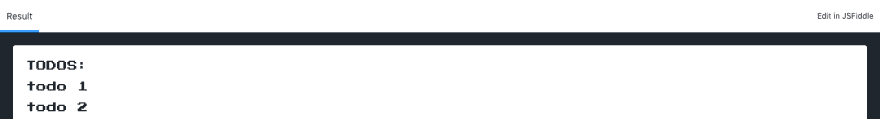
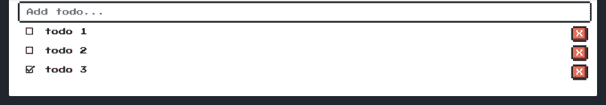
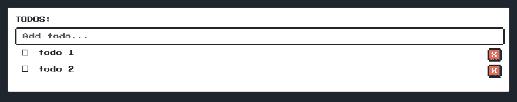
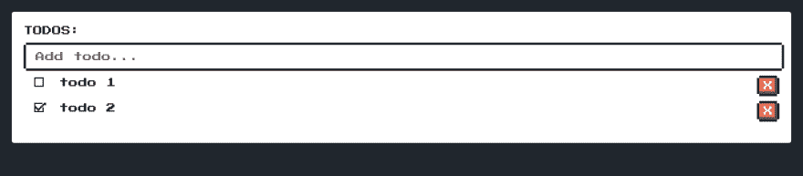
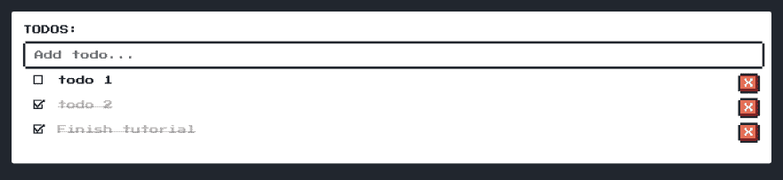

# 让我们使用 Vue.js 构建一个 Todo 应用程序

> 原文：<https://dev.to/hugoliconv/lets-build-a-todo-app-using-vuejs-52in>

当你开始学习一种新的编程语言或框架时，TODO 应用程序是你首先要做的事情之一，很多人讨厌它，其他人喜欢它，我个人认为这是一个很好的选择，可以让你了解一种语言/框架是如何工作的。所以现在我正在学习 Vue.js，我决定创建一个。

这是最终的结果:
[TODO Vue Finished-js fiddle](https://jsfiddle.net/HugoLiconV/snaj9opd/embedded/result)
[https://jsfiddle.net/HugoLiconV/snaj9opd//embedded/result,js,html,css//dark](https://jsfiddle.net/HugoLiconV/snaj9opd//embedded/result,js,html,css//dark)
我们将简单地使用 [Vue.js](https://vuejs.org/) 和 [NES.css](https://nostalgic-css.github.io/NES.css/) 进行样式。

因为这是一个简单的应用程序，我们将使用 JSFiddle，这里是[基础项目](https://jsfiddle.net/HugoLiconV/e4sxpru9/)如果你想跟随教程:
让我们开始吧。

正如我们所看到的，我们有三个选项卡:HTML、Vue 和 CSS。
在 HTML 标签中，我们只有一个`<link>`来获取印刷开始字体，还有一个`div`里面有一个标题。这里重要的是要指出，在这里我们可以访问我们将在 Vue 文件中使用的所有变量和方法。

```
<link href="https://fonts.googleapis.com/css?family=Press+Start+2P" rel="stylesheet">
<div id="app"> 
    <h1>TODOS:</h1>
</div> 
```

Enter fullscreen mode Exit fullscreen mode

在 Vue 选项卡中，我们有我们的 Vue 实例，这是应用程序所有逻辑的位置。

```
new Vue({
  el: "#app",
  data: {
    todos: [
      { text: 'todo 1', done: false, id: Date.now() },
      { text: 'todo 2', done: false, id: Date.now() + 1 }
    ]
  },
  methods: {

  }
}) 
```

Enter fullscreen mode Exit fullscreen mode

在我们传递给 Vue 实例的属性中有`el`，它用来指示 Vue 它将被安装在哪个 DOM 元素中。
同样，我们有`data`，猜猜看，它用来存储我们在应用程序中使用的所有数据，在这种情况下，它只是一个名为`todos`的对象数组。

最后，我们有方法，这里我们会把 app 的所有功能。

如上所述，我们可以在 div 中访问在`data`中定义的所有变量，我们可以简单地通过添加一个名为 title 的新变量来检查它，为了访问它，我们在 HTML 中使用下面的语法:`{{variableName}}`。Vue.js 使用基于 HTML 的模板语法，允许您以声明方式将呈现的 DOM 绑定到底层 Vue 实例的数据。

```
data: {
  title: 'TODOS',
  todos: [
    { text: 'todo 1', done: false, id: Date.now() },
    { text: 'todo 2', done: false, id: Date.now() + 1 }
  ]
} 
```

Enter fullscreen mode Exit fullscreen mode

```
<div id="app">
  <h1>{{title}}:</h1>
</div> 
```

Enter fullscreen mode Exit fullscreen mode

在编写应用程序逻辑之前，让我们定义一下应用程序应该做什么:

*   它应该显示待办事项列表。
*   它应该会添加 TODOs。
*   它应该删除 TODOs。
*   它应该将 TODOs 标记为完成。

## 显示待办事项

如果你还记得的话，我们已经在数据中有了一个对象数组来存储 TODOs。

```
data: {
  title: 'TODOS',
  todos: [
    { text: 'todo 1', done: false, id: Date.now() },
    { text: 'todo 2', done: false, id: Date.now() + 1 }
  ]
} 
```

Enter fullscreen mode Exit fullscreen mode

我们希望在列表中显示待办事项文本和状态。

```
<ul>
  <li class="flex"></li> 
</ul> 
```

Enter fullscreen mode Exit fullscreen mode

这是基本结构，现在我们只需显示数组数据，我们可以使用模板语法`{{}}`
来完成

```
<ul>
  <li class="flex"> {{todos[0].text}} </li> 
  <li class="flex"> {{todos[1].text}} </li>
</ul> 
```

Enter fullscreen mode Exit fullscreen mode

但这是重复的，幸运的是，Vue 提供了一个名为`v-for`的指令，允许我们迭代数组的元素。所以我们可以在下面重构前面的代码:

```
<ul> 
  <!-- Remember that todos is the name of our array --> 
  <li v-for="todo in todos" class="flex"> 
    <!-- and now, we can access to an item using todo--> 
    {{todo.text}} 
  </li>
</ul> 
```

Enter fullscreen mode Exit fullscreen mode

[](https://res.cloudinary.com/practicaldev/image/fetch/s--bY9zgxL3--/c_limit%2Cf_auto%2Cfl_progressive%2Cq_auto%2Cw_880/https://thepracticaldev.s3.amazonaws.com/i/m1kfpo080pgy8xvzx87e.png)

## 添加待办事项

要添加待办事项，我们需要一个输入框。

```
<input type=“text” class=“nes-input” placeholder="Add todo…"> 
```

Enter fullscreen mode Exit fullscreen mode

我们想要做的是在每次按下 enter 键时添加一个 to do。Vue 允许我们使用`v-on:some-event="doSomething"`的语法来监听事件，在这种情况下，我们需要的是使用`v-on:keyup.enter`，在这里，keyup 是我们想要听到的事件，并输入我们需要触发 addTodo 的键。

```
<input type="text" class="nes-input" placeholder="Add todo..." v-on:keyup.enter="addTodo"> 
```

Enter fullscreen mode Exit fullscreen mode

现在，我们只需添加我们的方法 addTodo

```
methods: {
  addTodo(event) {
    const text = event.target.value
    this.todos.push({text, done: false, id: Date.now()})
    event.target.value = ''
  }
} 
```

Enter fullscreen mode Exit fullscreen mode

我们几乎完成了，我们只需要删除 TODOs 并将它们标记为完成。

*   [x]它应该显示待办事项列表
*   [x]它应该添加 TODOs
*   [ ]它应该删除 TODOs
*   [ ]它应该将 TODOs 标记为完成

## 删除 TODOs

我们做的第一件事是添加一个按钮来删除 TODOs:

```
<li v-for="todo in todos" class="flex">
  <!-- and now, we can access to an item using todo-->
  {{todo.text}}
  <div class="space"></div>
  <button class="nes-btn is-error padding">X</button>
</li> 
```

Enter fullscreen mode Exit fullscreen mode

现在，我们要做的是监听一个`onclick`事件，按照事件`v-on:some-event="doSomething"`的语法，我们得到这个`v-on:click ="removeTodo(todo.id)"`。我们将调用 removeTodo 方法并向其传递 todo id。之后，我们需要创建那个方法。

```
<ul>
  <li v-for="todo in todos" class="flex">
    {{todo.text}}
    <div class="space"></div>
    <button class="nes-btn is-error padding" v-on:click="removeTodo(todo.id)">X</button>
  </li>
</ul> 
```

Enter fullscreen mode Exit fullscreen mode

```
removeTodo(id) {
  this.todos = this.todos.filter(todo => todo.id !== id)
} 
```

Enter fullscreen mode Exit fullscreen mode

## 将待办事项标记为完成

最后，我们只需要将待办事项标记为完成，为此，我们将添加一个复选框。

```
<ul>
  <li v-for="todo in todos" class="flex">
    <label>
      <input type="checkbox" class="nes-checkbox">
      <span>&nbsp</span>
    </label> 
    {{todo.text}}
    <div class="space"></div>
    <button class="nes-btn is-error padding" v-on:click="removeTodo(todo.id)">X</button>
  </li>
</ul> 
```

Enter fullscreen mode Exit fullscreen mode

我们将复选框放在一个`label`中，并添加一个带空格的`span`，因为 NES.css 有一个 bug，如果你不这样做，它就不会显示复选框。
嗯，这里我们要做两件事，首先，我们希望每次复选框被按下时，to do 状态从`done: false`变为`done: true`，反之亦然，那么我们需要什么？你猜，一个事件监听器:

```
<input type="checkbox" class="nes-checkbox" v-on:click="check(todo)"> 
```

Enter fullscreen mode Exit fullscreen mode

并且我们添加了`check`方法:

```
check(todo){
  todo.done = !todo.done
} 
```

Enter fullscreen mode Exit fullscreen mode

[](https://res.cloudinary.com/practicaldev/image/fetch/s--lldFJl0p--/c_limit%2Cf_auto%2Cfl_progressive%2Cq_auto%2Cw_880/https://thepracticaldev.s3.amazonaws.com/i/a3v4eq8fud1g23qlxptm.png) 
就这样，我们完成了，对吗？不完全是，我们的应用程序有一个小错误。让我们这样做，让我们把我们的一个待办事项从`done: false`改为`done: true`

```
data: {
  title: 'TODOS',
  todos: [
    {text: 'todo 1', done: false, id: Date.now()},
    {text: 'todo 2', done: true, id: Date.now() + 1}
  ]
} 
```

Enter fullscreen mode Exit fullscreen mode

[](https://res.cloudinary.com/practicaldev/image/fetch/s--Z3y-vLix--/c_limit%2Cf_auto%2Cfl_progressive%2Cq_auto%2Cw_880/https://thepracticaldev.s3.amazonaws.com/i/end4fsakh4dq22cp6sz2.png) 
有一个错误，我们的复选框与我们的 TODO 状态不“同步”，所以我们必须使用一个叫做 v-bind 的东西，这样输入的`checked`属性就与我们的 TODO 的`done`属性绑定，语法是:`v-bind:checked ="todo.done"`

```
<input type="checkbox" class="nes-checkbox" v-on:click="check(todo)" v-bind:checked="todo.done"> 
```

Enter fullscreen mode Exit fullscreen mode

[](https://res.cloudinary.com/practicaldev/image/fetch/s--fcGK3snn--/c_limit%2Cf_auto%2Cfl_progressive%2Cq_auto%2Cw_880/https://thepracticaldev.s3.amazonaws.com/i/jeolqnui8xbpukjhqpji.png) 
我们即将完成，我们只需要添加一点视觉细节，我们希望如果 TODO 被标记为完成，删除文本如下:
[](https://res.cloudinary.com/practicaldev/image/fetch/s--o7QWimjZ--/c_limit%2Cf_auto%2Cfl_progressive%2Cq_auto%2Cw_880/https://thepracticaldev.s3.amazonaws.com/i/7la7bvglqbv8ta5otjoz.png) 
这很容易做到，我们只需使用`v-if`和`v-else`

```
<ul>
  <li v-for="todo in todos" class="flex">
    <label>
      <input type="checkbox" class="nes-checkbox">
      <span>&nbsp</span>
    </label> 
    <!-- WE DELETE THIS: {{todo.text}} -->
    <del v-if="todo.done">{{ todo.text }}</del>
    <span v-else>{{ todo.text }}</span>
    <div class="space"></div>
    <button class="nes-btn is-error padding" v-on:click="removeTodo(todo.id)">X</button>
  </li>
</ul> 
```

Enter fullscreen mode Exit fullscreen mode

现在我们结束了。
[T3】](https://res.cloudinary.com/practicaldev/image/fetch/s--tC8APxRQ--/c_limit%2Cf_auto%2Cfl_progressive%2Cq_auto%2Cw_880/https://thepracticaldev.s3.amazonaws.com/i/ba9rltex3qu52hgjb1bo.png)

## 重构我们的应用

我知道我说过我们已经完成了，但我们可以稍微重构一下代码，Vue 有一个叫 v-model 的东西，它允许我们替换 v-bind 和 v-on:单击我们的复选框。根据 [vue 文档](https://vuejs.org/v2/guide/components.html#Using-v-model-on-Components)这:

```
<input v-model=“searchText”> 
```

Enter fullscreen mode Exit fullscreen mode

和这个一样:

```
<input
  v-bind:value="searchText"
  v-on:input="searchText = $event.target.value"
> 
```

Enter fullscreen mode Exit fullscreen mode

因此，让我们重构我们的应用程序。我们用`v-on:click="check(todo)"`和`v-bind:checked="todo.done"`替换`v-model="todo.done"`，现在我们也可以删除`check`方法。

```
<input type="checkbox" class="nes-checkbox" v-model="todo.done"> 
```

Enter fullscreen mode Exit fullscreen mode

现在我们真的完成了。

如你所见，Vue 非常简单易学。要开始，你需要熟悉 HTML 和一些 JavaScript。如果你有使用 React 或 Angular 等其他框架的经验，学习 Vue 的过程会简单得多。

我希望你喜欢它。