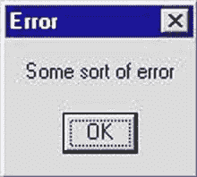

# 作为开发人员，你应该学习的三项技能(外加一项)

> 原文：<https://dev.to/yechielk/the-three-skills-plus-one-you-should-be-learning-as-a-developer-g44>

“你需要学会如何学习”是你开始旅行时经常听到的一句话。

不要管 bootcamp X 或者 course Y 教的是哪种语言/框架，人家会告诉你，重要的是他们给你展示了如何自己学习。

这是事实。大多数编程训练营的毕业生无法使用训练营中教授的堆栈找到工作。即使你足够幸运，使用你所学的框架找到了一份工作，科技世界的飞速发展几乎保证了你的知识很快就会过时，你必须每隔几年学习下一个闪亮的东西。

那些发现自己过于专注于获得某项特定技术，而不是专注于获得继续自主学习所需的技能的学生，可能会发现自己在仅仅为了获得第一个初级职位而学习一项不同的技术时被蒙在鼓里，他们可能会觉得自己的训练营经历是在浪费时间和金钱。观点的改变。

但是“学会如何学习”是什么意思呢？开发人员使用什么技能来帮助他们跟上永无止境的新框架和技术潮流？

在与以前和潜在的训练营学生进行了多次交谈后，我相信我能够将它归纳为三项技能，如果你想在毕业后能够自学的话，你需要掌握这三项技能:

1.  如何阅读和理解错误信息？

2.  如何谷歌东西？

3.  如何阅读和理解技术文档？

从我作为开发人员的经验来看，我可以说我 90%的工作日都在做这三件事情中的一件。如果你能掌握这三项技能，你就有理由相信没有你学不会的技术。

#### 1。读取错误消息

这是我在学习编码时必须学习的第一课，在我看来，这也是开发人员与社会其他人的区别。

<figure> 

<figcaption>没有一条有用的错误信息</figcaption>

</figure>

回到我的“平民生活”,错误信息是可怕的，它们是不透明的，它们感觉就像计算机在用外语对我尖叫，并指责我，它可能认为这是我的错。

当我开始学习如何编码时，我自然会遇到许多错误信息，这让我感到非常沮丧；我觉得我一定是做错了什么。

后来有一天，我突然明白了。我看了一个训练营导师的讲座，他正在编写一个应用程序。有一次，他运行代码时遇到了一个错误，他没有感到尴尬或慌乱，而是完全无表情地喊道:“我们遇到了一个错误！太好了！”这时我才意识到错误信息离我们的敌人很远。作为开发人员，当我们遇到错误消息时，这是计算机让我们知道代码有什么问题的方式；它是如何为我们需要解决的问题提供线索的。

作为一名开发人员，你将专门处理破损的代码(如果代码正常工作，那么谁需要你呢？)阅读和分析错误信息是你解决问题的方法。

您得到的错误消息的种类以及它们的有用性在很大程度上取决于您使用的语言/框架，有些语言比其他语言有更多有用的错误，但是有些元素是通用的。

每个错误消息通常包含:

1.  实际的错误消息:到底哪里出错了。这些可以是几个隐晦的词，也可以是一个完整的段落，其中包含如何修复 bug 的建议。

2.  错误发生的位置:文件、行号，有时还有程序崩溃时所在的函数名。

3.  堆栈跟踪:程序在到达第二个函数之前执行的所有代码行。这有助于跟踪调用函数的位置和使用的参数。

阅读所有这些内容并熟练地解析错误消息的不同部分可能需要一些练习，但这是当您的代码没有按照您期望的方式运行时首先要注意的地方。

一个好的训练营会鼓励你去玩代码，打破常规，并且会庆祝错误信息，而不仅仅是告诉你如何修复它们。

但是，尽管错误消息很有帮助，但它们对您的帮助是有限的。毕竟，这种语言的设计者不可能预先知道用他们的语言编写的程序可以破解的所有不同方式。这时候下一个技能就派上用场了。

#### 2。如何用谷歌搜索资料

作为一名开发人员，你将花费大部分时间做你不知道的事情。Google(或者 DuckDuckGo，Bing 等。)会是你最好的朋友。

<figure> 

<figcaption>老实说，如果你做到了这一步，你做得很好。</figcaption>

</figure>

对于初学者来说，可能很难知道谷歌搜索什么，尤其是在开始的时候，你甚至不确定你想做什么，更不用说用搜索引擎可以理解的方式来表达了。学习如何组织你的查询以获得最佳结果是一门需要经验的艺术，但是一些规则将帮助你开始:

*   包括你正在使用的语言:如果你正在学习 Ruby，并且有一个你想要排序的数组，搜索“如何排序一个数组”可能不会很有帮助；当我刚做的时候，结果的第一页只包含如何用 Java、Visual Basic 和 JavaScript 做的答案。总是以您正在搜索的语言的名称开始您的查询(在我们的例子中，“ruby sort an array”将为您提供大量 ruby 程序员实际上会发现有用的结果)。

*   使用定义明确的关键词:这需要更多的经验，但是知道哪些关键词代表你真正需要的信息将会节省你过滤无用结果的时间。一般来说，不要包含不必要的单词；设计一个包含所有与你的搜索相关的关键词的最短的查询将有助于确保你只得到你想要的结果。

*   知道哪些结果更有可能是有帮助的:同样，这来自经验，但一些结果比其他结果更有可能是有用的。随着时间的推移，你会逐渐喜欢上这一点，但一般来说，更新的结果不太可能过时，一个关于堆栈溢出的答案加上 100 张赞成票比一个无名作者的博客帖子更有帮助(这并不是说没有相对不知名的作者的伟大博客帖子)。

这最后一点把我们带到了下一个技能。

#### 3。如何阅读技术文档

语言/框架有许多特性和功能，除非你半定期地使用某个特定的功能，否则你不太可能记住它的语法。

这并不意味着你是一个糟糕的程序员，即使是有多年经验的优秀程序员也会发现自己在谷歌上搜索诸如“连接一个字符串”或“过滤一个数组”之类的东西。

<figure>

> @ dhh大家好，我叫大卫。我不会在白板上写冒泡排序。我一直在网上查代码。我不猜谜语。2017 年 2 月 21 日下午 21:04

<figcaption>This tweet is by the creator of the popular Ruby On Rails framework.</figcaption>

</figure>

大多数语言的文档通常是最全面、最简明的语言特性参考，省去了您记忆数百种晦涩难懂的语言特性的麻烦。

例如，Ruby 有大约 20 种不同的方法来迭代数组。如果你试图学习 Ruby，你可能认为你必须记住所有 20 个，但是如果你的目标是学习如何学习，那么你必须记住的是你可以在关于 Ruby 的可枚举模块的文档中找到所有迭代数组的方法。

对于初学者来说，问题是文档看起来很密集，令人生畏；简洁性意味着页面可能看起来像一堵由术语、术语和可怕的符号组成的可怕的墙，但通过练习，您可以学习这些模式，并学习如何找到您需要的信息。随着时间的推移，你会发现官方文档将成为你简单语法的首选参考。

#### 加一

像任何项目一样，这个项目也超出了预算。实际上，还有另一个非常重要的技能，与自学无关，但如果你想成为一个有效的学习者，这是一项必不可少的技能。

最后一项技能是知道何时后退一步寻求帮助。

我们没有一个人靠自己做到过,“自学成才的开发人员”是一个神话。

让自己周围有一个导师和学习伙伴的网络，并知道何时/如何利用这个网络，将会节省你的时间，最好是花在学习新东西上。这将意味着你不必为了一个简单的打字错误而花费几个小时去敲打键盘，而第二双新鲜的眼睛一分钟就能发现这个错误(尽管我们都经历过这种情况:)

有许多面向初学者的在线社区。如果你在训练营，他们可能有办法让学生(现在的和以前的)联系。Dev Twitter 非常友好、乐于助人和支持(我最喜欢的一些社区是 [#CodeNewbie](https://twitter.com/CodeNewbies) 社区和 [@ThePracticalDev](https://twitter.com/ThePracticalDev) )。找到你的角落，你联系的人，你会发现一起旅行比独自旅行好 100 倍。

#### 总之

总之，学习编码是一个重大的决定。一个好的训练营或课程包含许多因素。我希望阅读这篇文章能让你了解哪些技能是必须关注的，哪些只是一时的流行。

祝你好运！

* * *

*这篇文章是从我的博客 [Rabbi On Rails](https://blog.yechiel.me/) 交叉发布的。
你可以在那里了解更多关于我的编程之旅，或者在 Twitter 上关注我 [@yechielk](https://twitter.com/yechielk)*