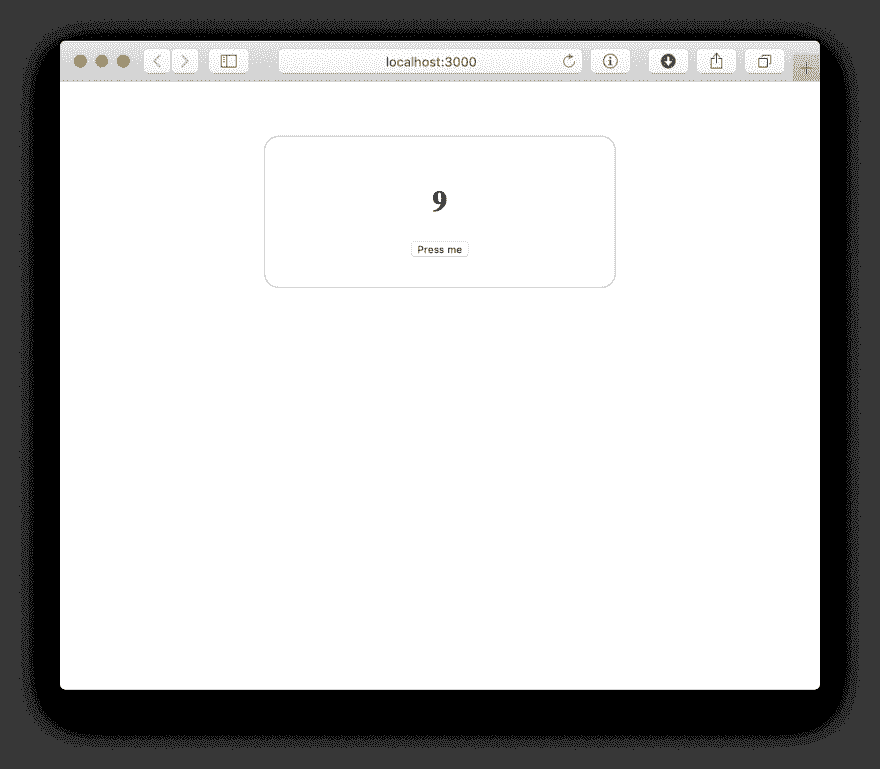

# 设置完整堆栈类型脚本应用程序

> 原文：<https://dev.to/nuclight/setting-up-fullstack-typescript-app-1bbe>

如你所知，`create-react-app`是一个用于脚手架反应的格栅工具。JS 应用。它支持类型脚本。但它只配置 app 的前端部分。如果你也需要设置后端，你可能会遇到麻烦。

在这篇文章中，我将描述我搭建全栈类型脚本应用程序的方法。

## 基础知识

首先，让我们初始化新的项目文件夹。我要用`npm`。

```
$ mkdir my-fullstack-typescript-app
$ cd my-fullstack-typescript-app
$ npm init -y 
```

现在我们应该安装`typescript`包作为开发依赖。

```
$ npm i -D typescript 
```

我们将有两个不同的`tsconfig.json`文件，一个用于后端，另一个用于前端。

让我们从后端生成一个。

```
$ npx tsc --init 
```

这将在我们的项目根目录下创建`tsconfig.json`文件。我将更新其中的一些字段。

在你喜欢的编辑器中打开`./tsconfig.json`，将`compilerOptions.target`改为`"es6"`。

我们的源代码将在目录`./src`中，编译后的代码在目录`./dist`中。取消注释，将选项`compilerOptions.root`和`compilerOptions.outDir`分别改为`"./src"`和`"./dist"`。

此外，我将取消选项`compilerOptions.sourceMap`的注释，以允许调试编译后的代码。

现在你的`./tsconfig.json`应该是这样的:

```
{  "compilerOptions":  {  "target":  "ES2018",  "module":  "commonjs",  "sourceMap":  true,  "outDir":  "./dist",  "rootDir":  "./src",  "strict":  true,  "esModuleInterop":  true  }  } 
```

注意:为了保持代码简短，我已经删除了所有其他的注释字段。

## 后端

好的。让我们编写简单的后端。

我们需要安装 node.js 的类型定义来告诉 TypeScript 关于 node.js 标准库的信息。

```
$ npm i -D @types/node 
```

此外，我将使用`express`作为后端框架和`ejs`作为模板引擎，所以让我们也安装它们。

```
$ npm i express
$ npm i -D @types/express
$ npm i ejs 
```

现在我们可以开始编码了。

让我们创建`./src`目录，然后创建`./src/config.ts`文件。

在这个文件中，我将为我们的应用程序存储一些配置变量。

现在，让我们只放一行代码:

```
export const SERVER_PORT = parseInt(process.env.SERVER_PORT || "3000"); 
```

好的。现在我们可以编写我们的 *web* 模块了。

我将把 web 模块的整个逻辑放在`./src/web`目录中。

用我们的*网页*模块:
的内容创建文件`./src/web/web.ts`

```
import express from "express";
import http from "http";
import path from "path";

// Express app initialization
const app = express();

// Template configuration
app.set("view engine", "ejs");
app.set("views", "public");

// Static files configuration
app.use("/assets", express.static(path.join(__dirname, "frontend")));

// Controllers
app.get("/*", (req, res) => {
    res.render("index");
});

// Start function
export const start = (port: number): Promise<void> => {
    const server = http.createServer(app);

    return new Promise<void>((resolve, reject) => {
        server.listen(port, resolve);
    });
}; 
```

这里你可以注意到两件事。首先—我们需要查看目录`./public`。第二—我们需要静态文件目录`frontend`。

让我们创建`./public`目录(在我们项目的根目录下)并将文件`index.ejs`和内容
放在那里

```
<!DOCTYPE html>
<html lang="en">
<head>
    My Fullstack TypeScript App

    <meta http-equiv="Content-Type" content="text/html;charset=UTF-8">
    <meta name="viewport" content="width=device-width, minimum-scale=1.0, maximum-scale=1.0, user-scalable=no">

</head>
<body>
    <div id="root"></div>

    <script src="/assets/vendors~main.chunk.js"></script>
    <script src="/assets/main.bundle.js"></script>
</body>
</html> 
```

这里你可以看到，我们有两个`script`标签，目标是前端代码包。我们将使用 Webpack 来构建前端预算。

通往`frontend`的道路很难走。我们的前端代码将存储在`./src/web/frontend`目录中。但是编译捆绑出现在`./dist/web/frontend`。我们将在一分钟内设置前端，但首先让我们完成后端。

我喜欢像处理单个模块一样处理复杂模块，所以让我们用一行代码
创建文件`./src/web/index.ts`

```
export * from "./web"; 
```

而且我们已经用 *web* 模块完成了。

这里剩下的最后一件事是创建入口点文件`./src/main.ts`，其内容如下:

```
import {SERVER_PORT} from "./config";

import * as web from "./web";

async function main() {
    await web.start(SERVER_PORT);
    console.log(`Server started at http://localhost:${SERVER_PORT}`);
}

main().catch(error => console.error(error)); 
```

我们的后端已经完成🥳.我们来编译一下。

打开`./package.json`文件，添加一些 npm 脚本:

```
"build:backend":  "tsc",  "start":  "./dist/main.js" 
```

所以您的`./package.json`文件应该是这样的:

```
{  "name":  "my-fullstack-typescript-app",  "version":  "1.0.0",  "description":  "",  "main":  "index.js",  "scripts":  {  "test":  "echo \"Error: no test specified\" && exit 1",  "build:backend":  "tsc",  "start":  "node ./dist/main.js"  },  "keywords":  [],  "author":  "",  "license":  "ISC",  "devDependencies":  {  "@types/express":  "^4.16.1",  "@types/node":  "^11.9.6",  "typescript":  "^3.3.3333"  },  "dependencies":  {  "ejs":  "^2.6.1",  "express":  "^4.16.4"  }  } 
```

现在可以聊到这部分作品:

```
$ npm run build:backend
$ npm start 
```

但是如果我们访问 http://localhost:3000 ，我们只会看到黑色页面。

## 前端

现在我们的项目结构看起来像:

```
.
├── dist
│   ├── web
│   │   ├── index.js
│   │   ├── index.js.map
│   │   ├── web.js
│   │   └── web.js.map
│   ├── config.js
│   ├── config.js.map
│   ├── main.js
│   └── main.js.map
├── public
│   └── index.ejs
├── src
│   ├── web
│   │   ├── index.ts
│   │   └── web.ts
│   ├── config.ts
│   └── main.ts
├── package-lock.json
├── package.json
└── tsconfig.json 
```

我们准备创建`./src/web/frontend` dir 来存储我们的前端代码。

这里重要的一点是:我们使用 TypeScript 编译器和`./tsconfig.json`中的配置来编译后端代码。但是对于前端，我们将使用文件`./src/web/frontend/tsconfig.json`中的 Webpack 和 TypeScript 配置。

所以让我们创建`./src/web/frontend`目录并初始化`./src/web/frontend/tsconfig.json`文件。

```
$ mkdir ./src/web/frontend
$ cd ./src/web/frontend
$ npx tsc --init 
```

我们在`./src/web/frontend/`中以一个`tsconfig.json`文件结束。

让我们进去做些改变。

再次将`compilerOptions.target`设置为`"es6"`。

将`compilerOptions.module`设置为`"esnext"`。

取消选项`compilerOptions.sourceMap`的注释以允许调试前端包。

取消注释并将`compilerOptions.jsx`设置为`"react"`。

您的`./src/web/frontend/tsconfig.json`应该看起来像:

```
{  "compilerOptions":  {  "target":  "es6",  "module":  "esnext",  "sourceMap":  true,  "jsx":  "react",  "strict":  true,  "esModuleInterop":  true  }  } 
```

注意:我们在这里不指定`compilerOptions.rootDir`和`compilerOptions.outDir`。文件解析将由 Webpack 完成。

现在我们需要让后端编译器忽略前端文件。

为此，我们需要向`./tsconfig.json` :
添加两个选项

```
"include":  ["./src"],  "exclude":  ["./src/web/frontend"] 
```

您的`./tsconfig.json`应该看起来像:

```
{  "compilerOptions":  {  "target":  "ES2018",  "module":  "commonjs",  "sourceMap":  true,  "outDir":  "./dist",  "rootDir":  "./src",  "strict":  true,  "esModuleInterop":  true  },  "include":  ["./src"],  "exclude":  ["./src/web/frontend"]  } 
```

我们的前端入口点将是`./src/web/frontend/main.tsx` :

```
import React, {useState} from "react";
import ReactDOM from "react-dom";

import "./style.css";

const App = () => {
    const [counter, setCounter] = useState(0);

    return (
        <div className="App">
            <h1>{counter}</h1>
            <button onClick={() => setCounter(c + 1)}>Press me</button>
        </div>
    )
};

ReactDOM.render(
    <App/>,
    document.getElementById("root"),
); 
```

这是一个非常简单的反应。JS app。

让我们用`./src/web/frontend/style.css` :
给它加一点样式

```
.App {
    margin: 30px auto;
    max-width: 320px;
    padding: 2em;
    border: 1px solid silver;
    border-radius: 1em;

    text-align: center;
} 
```

让我们安装需要的软件包:

```
$ npm i react react-dom
$ npm i -D @types/react @types/react-dom 
```

为了构建前端，我将使用 Webpack 和`ts-loader`包。

让我们安装所有需要的东西:

```
$ npm i -D webpack webpack-cli ts-loader style-loader css-loader source-map-loader 
```

现在我们需要配置 Webpack。让我们用以下内容创建`./webpack.config.js`:

```
module.exports = {
    mode: "development",

    entry: {
        main: "./src/web/frontend/main.tsx",
    },

    output: {
        filename: "[name].bundle.js",
        chunkFilename: '[name].chunk.js',
        path: __dirname + "/dist/web/frontend",
        publicPath: "/assets/"
    },

    // Enable sourcemaps for debugging webpack's output.
    devtool: "source-map",

    resolve: {
        // Add '.ts' and '.tsx' as resolvable extensions.
        extensions: [".ts", ".tsx", ".js"]
    },

    module: {
        rules: [
            // All files with a '.ts' or '.tsx' extension will be handled by 'ts-loader'.
            {
                test: /\.tsx?$/,
                loader: "ts-loader",
            },

            // All output '.js' files will have any sourcemaps re-processed by 'source-map-loader'.
            {enforce: "pre", test: /\.js$/, loader: "source-map-loader"},
            {
                test: /\.css$/,
                use: [{loader: "style-loader"}, {loader: "css-loader"}]
            },
        ]
    },

    optimization: {
        splitChunks: {
            chunks: "all"
        },
        usedExports: true
    },
}; 
```

我们做到了！

剩下的最后一件事是将 npm 脚本添加到`./package.json`文件来构建前端:

```
"build:frontend":  "webpack" 
```

现在可以测试了:

```
$ npm run build:backend
$ npm run build:frontend
$ npm start 
```

转到 [http://localhost:3000](http://localhost:3000)

[](https://res.cloudinary.com/practicaldev/image/fetch/s--OCbFkcnf--/c_limit%2Cf_auto%2Cfl_progressive%2Cq_auto%2Cw_880/https://i.ibb.co/xqC51zr/Screen-Shot-2019-03-01-at-01-39-03.png)

完整代码可以在这里找到[。](https://github.com/atomAltera/my-fullstack-typescript-app-scaffold)

祝您愉快！