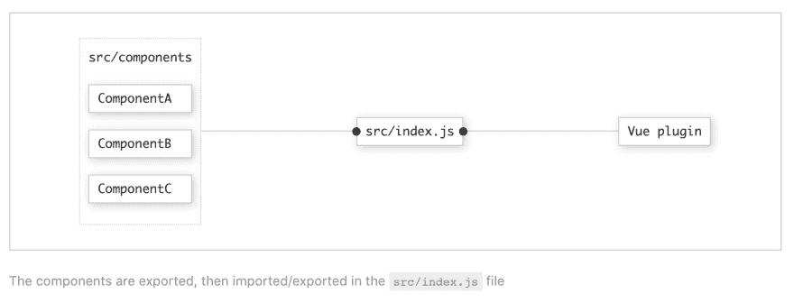

# 创建 Vue.js 组件库:第二部分-结构

> 原文：<https://dev.to/siegerts/creating-a-vue-js-component-library-part-ii-structure-iph>

## 概述

在本帖中，我们将逐步介绍 Vue 组件的初始项目结构。在[的上一篇文章](https://dev.to/siegerts/creating-a-vue-js-component-library-part-i-introduction-2o9f)中，我谈到了打包一个组件库的重要性。如果你还没有快速阅读这篇文章，请快速阅读这篇文章，以获得关于项目目标的更多背景信息。

## Vue 项目结构

让我们直接开始吧。我们将使用 [Vue CLI 3](https://cli.vuejs.org/guide/) 。嘭！

幸运的是，许多曾经是 T2 的配置步骤现在由 CLI 处理，主要是关于 webpack 的。这并不是说你最终不需要用`vue.config.js`来[修改 webpack 配置](https://cli.vuejs.org/guide/webpack.html#simple-configuration)，但是你会惊奇地发现，不这样做你能走多远。如果可能的话，我尽量避免修改通用的 webpack 设置🙏。记住，为了让其他开发者理解你的设计选择，你需要降低他们理解的门槛。不仅是为了使用，也是为了调试(这可能更有可能，TBH)。

记住这一点，使用 CLI 创建您的 Vue 项目框架。

```
vue create vue-component-library 
```

Enter fullscreen mode Exit fullscreen mode

创建项目并下载依赖项后，您应该在终端上看到这个:

```
 🎉  Successfully created project vue-component-library.
👉  Get started with the following commands:

 $ cd vue-component-library
 $ yarn serve 
```

Enter fullscreen mode Exit fullscreen mode

当项目初始化时出现提示，我选择以下选项:

```
Vue CLI v3.0.0
? Please pick a preset: Manually select features
? Check the features needed for your project: Babel, Linter
? Pick a linter / formatter config: Prettier
? Pick additional lint features: Lint on save
? Where do you prefer placing config for Babel, PostCSS, ESLint, etc.? In dedicated config files
? Save this as a preset for future projects? (y/N) n 
```

Enter fullscreen mode Exit fullscreen mode

如果您的偏好发生变化，请务必调整这些选项。Vue CLI 捆绑了一个漂亮的 [GUI](https://cli.vuejs.org/guide/creating-a-project.html#using-the-gui) ，可以轻松添加和删除插件。

`vue-component-library`是构件库工程的名称(文件夹等。).这个*不需要*与库的编程表示相同。我们将在即将到来的*插件*系列文章中讨论这个问题。

默认情况下，CLI 将创建`src/components`目录。我通过删除未使用的项目，如`App.vue`、`assets/favicon.ico`等，来合并这个项目目录和项目。初始结构通常用作应用程序基线。对于一个典型的 web 应用程序，我保持设置不变。相反，我们将使用 VuePress 来实现文档网站的功能。

接下来，我们将:

1.  移除`public`目录
2.  移除`src/assets`
3.  移除`components/HelloWorld.vue`
4.  移除`src/App.vue`

目录更改在下面的布局中有所不同。

```
 .
- ├── public/
  ├── src/
- │   ├─ assets/
  │   └─ components/
- │      └─ HelloWorld.vue
- └─ App.vue 
```

Enter fullscreen mode Exit fullscreen mode

你让我思考...*我们刚刚删除了整个项目吗？*不！除了文件布局之外，CLI 还为您的项目添加了大量功能。注意，`vue-cli-service`和生成的`package.json`中对应的`devDependencies`。

如果你想要更少的护栏，考虑使用上面生成的视图结构作为自定义 Vue 应用*或* [弹出你的 VuePress 主题](https://vuepress.vuejs.org/theme/default-theme-config.html#ejecting)。

```
{  "name":  "vue-component-library",  "version":  "0.1.0",  "private":  true,  "scripts":  {  "serve":  "vue-cli-service serve",  "build":  "vue-cli-service build",  "lint":  "vue-cli-service lint"  },  "dependencies":  {  "vue":  "^2.6.6"  },  "devDependencies":  {  "@vue/cli-plugin-babel":  "^3.0.0",  "@vue/cli-plugin-eslint":  "^3.0.0",  "@vue/cli-service":  "^3.0.0",  "@vue/eslint-config-prettier":  "^4.0.1",  "babel-eslint":  "^10.0.1",  "eslint":  "^5.8.0",  "eslint-plugin-vue":  "^5.0.0",  "vue-template-compiler":  "^2.5.21"  }  } 
```

Enter fullscreen mode Exit fullscreen mode

<small>根据创建日期的不同，软件包版本可能不完全相同。</small>

### 组件目录结构

对于每个组件，我在`src/components`内的一个命名组件目录中创建三个文件。

目录结构的一般视图是:

```
.
└─ src/
  └─ components/
    └─ <component-identifier>/
      ├─ <component-identifier>.vue
      ├─ <component-identifier>.spec.js
      └─ index.js 
```

Enter fullscreen mode Exit fullscreen mode

现在，相反，对于一个假设的`Button`组件:

```
.
└─ src/
  └─ components/
    └─ Button/
      ├─ Button.vue
      ├─ Button.spec.js
      └─ index.js 
```

Enter fullscreen mode Exit fullscreen mode

*   `<component>.vue`

> 包含单个文件组件(SFC)。

*   `index.js`

> 从独立的组件目录中导入和导出组件。

*   `<component>.spec.js`

> 组件测试将在哪里进行。如果测试创建了快照，那么将在这个目录中创建一个`__snapshots__`目录。

因此，对于每个文件，让我们创建一个占位符。

#### `<component>.vue`

```
<template>
  <div>
    <slot></slot>
  </div>
</template>

<script>
  export default {
    name: 'name-of-your-component'
  }
</script>

<style></style> 
```

Enter fullscreen mode Exit fullscreen mode

组件不需要完全独立(模板+脚本+样式)，但我喜欢从这种方式开始。如果需要的话，随着库的规模或复杂性的增长，我会进行重构。关于 JS 中带有 JS 或 *CSS 的*样式有很多看法。我喜欢从常规的 SFC +范围的样式开始，并从那里迭代。**

注意，组件有一个`name`。这是非常重要的，将会影响我们在几个步骤中把这个库注册为一个插件。组件由`name`属性注册和引用。尝试使用不会与其他项目依赖项或标签冲突的标识符。

#### `index.js`

```
import Button from './Button.vue'

export default Button 
```

Enter fullscreen mode Exit fullscreen mode

#### `<component>.spec.js`

我们暂时将这个文件留空。最终，这将包含组件测试。

#### 组件导出

在`src`目录中，创建另一个`index.js`文件来导出组件。该文件将位于顶层`/components`目录旁边，如下所示。

```
 .
 └─ src/
   ├─ components/
   │  └─ ...
+  └─ index.js 
```

Enter fullscreen mode Exit fullscreen mode

在这个文件中，我们将从这个文件导入和导出组件。

```
// index.js
export { default as Button } from './Button' 
```

Enter fullscreen mode Exit fullscreen mode

这种模式可能看起来有点重复，但是它在库中提供了灵活性。中间文件`index.js`将要导入的组件合并为入口点文件 *main.js* 中的一行程序。

[](https://res.cloudinary.com/practicaldev/image/fetch/s--hsxZbw2U--/c_limit%2Cf_auto%2Cfl_progressive%2Cq_auto%2Cw_880/https://dev-to-uploads.s3.amazonaws.com/i/5vxjsyb1m7gdtvtleicp.png)

同一个`<component>`目录中可以有多个组件。例如，根据使用模式(即`<List>`和`<ListItem>`)以逻辑方式对组件进行分组可能是有意义的。如果是，调整上述文件以反映:

```
// src/components
import List from './List.vue'
import ListItem from './ListItem.vue'

export default { List, ListItem } 
```

Enter fullscreen mode Exit fullscreen mode

再高一级:

```
// src/index.js
export { List, ListItem } from './ListComponents' 
```

Enter fullscreen mode Exit fullscreen mode

基金会现在准备添加库的文档部分📖。但是首先，我们将[把这些组件合并成一个插件](https://dev.to/siegerts/consolidating-components-into-a-vue-js-plugin-ndc)！我们下一步会谈到这个。