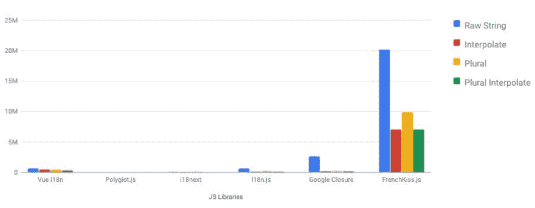

# 加速您的国际化调用多达 5-1000 次

> 原文：<https://dev.to/vince_tblt/speed-up-your-internationalization-calls-up-to-5-1000-times-1778>

# 上下文

这一切都始于两年前。我当时正在为一个大型社交网络编写一个新的 PWA，该网络需要一个 i18n 模块来处理不同的语言。该模块必须:

*   手柄**插补**。
*   处理**复数并选择表达式**。
*   **轻量级**(这是 PWA，必须在有限的带宽下运行)。
*   **运行速度快**(部分用户有低端设备)。

这就是事情变得令人毛骨悚然的地方，唯一可能的库是 Google Closure MessageFormat。它在低端设备上速度不是很快，而且在我们的产品包中很重。**所以我决定写自己的**考虑到性能。

快进到今天，i18n 库仍然存在这个问题，所以我开放了源代码[💋Frenchkiss.js](https://github.com/koala-interactive/frenchkiss.js) **一个 1kb 的 i18n 库比别人快 5 到 1000 倍**。
和我一起踏上性能优化之旅。

> 👉*是时候为您的移动设备 webapp 提速了！*

* * *

# 🤷i18n 模块是如何工作的？

在引擎盖下，**很烂**，一些 i18n 模块在每次调用时都重新处理翻译，导致性能不佳。

下面是一个在翻译函数*(真正简化/简单版本的 [Polyglot.js](https://github.com/airbnb/polyglot.js) )* 中会发生什么的例子。

```
const applyParams = (text, params = {}) => {
  // Apply plural if exists
  const list = text.split('||||');
  const pluralIndex = getPluralIndex(params.count);
  const output = list[pluralIndex] || list[0];

  // Replace interpolation
  return output.replace(/%\{\s*(\w+)\s*\}/g, ($0, $1) =>  params[$1] || '');
}

applyParams('Hello %{name} !', {
  name: 'John'
});
// => Hello John ! 
```

简而言之，在每个翻译调用中，我们分割文本，计算复数索引，创建一个 RegExp 并用指定的给定参数替换所有出现的内容(如果它存在)并返回结果。

这没什么大不了，但是你能在每个渲染/过滤/指令调用中多次这样做吗？

> 👉这是我们在 react、angular、vuejs 或任何其他框架中构建应用时学到的第一件事:避免在渲染方法、过滤器和指令中进行密集操作，这会扼杀你的应用！

### 部分 i18n 库做的比较好！

其他一些人也做了很多优化，比如 Angular，VueJs-i18n，Google Closure。

他们是怎么做到的？实际上，它们只解析字符串一次，并缓存一个操作码列表，以便在下次调用时处理它们。

如果您不熟悉操作码，它基本上是要处理的指令列表，在本例中只是为了构建一个翻译。这里有一个从翻译中生成的操作码的例子:

```
[{  "type":  "text",  "value":  "Hello "  },  {  "type":  "variable",  "value":  "name"  },  {  "type":  "text",  "value":  " !"  }] 
```

以及我们如何打印结果:

```
const printOpcode = opcodes => opcodes.map(code => (
  (code.type === 'text') ? code.value :
  (code.type === 'variable') ? (params[code.value] || '') :
  (code.type === 'select') ? printOpCode( // recursive
    params.data[params[code.value]] || params.data.other
  ) :
  (code.type === 'plural') ? printOpCode( // recursive
    params.list[getPluralIndex(params[code.value])] || params.list[0]
  ) :
  '' // TODO not supported ?
)).join(''); 
```

使用这种类型的算法，会为生成操作码的第一个调用分配更多时间，但我们会存储它并在下一个调用中重用它以提高性能:

*   它不会分裂绳子。
*   它不做密集的正则表达式操作。
*   它只是读取操作码并将结果合并在一起。

太棒了。但是有可能更进一步吗？

* * *

# 🤔我们怎样才能加快速度？

[💋Frenchkiss.js](https://github.com/koala-interactive/frenchkiss.js) 更进了一步，**它将翻译编译成本地函数**，这个函数是如此的轻而纯，以至于 Javascript 可以轻松地 [JIT 编译它](https://v8.dev/)。

### 它是如何工作的？

很简单，你可以通过下面的方法从一个字符串构建一个函数:

```
const sum = new Function('a', 'b', 'return a + b');

sum(5, 3);
// => 8 
```

> 更多信息，请看[函数构造器(MDN)](https://developer.mozilla.org/en-US/docs/Web/JavaScript/Reference/Global_Objects/Function) 。

主要的逻辑仍然是生成一个操作码列表，但不是使用它来生成翻译，而是使用它来生成一个优化的函数，该函数将返回翻译而无需进一步处理。

这实际上是可能的，因为插值和 SELECT/PLUTAL 表达式的结构很简单。它基本上是一个三元收益。

```
const opCodeToFunction = (opcodes) => {
  const output = opcodes.map(code => (
    (code.type === 'text') ? escapeText(code.value) :
    (code.type === 'variable') ? `params[${code.value}]` :
    (code.type === 'select') ? ... :
    (code.type === 'plural') ? ... :
    '' // TODO Something wrong happened (invalid opcode)
  ));

  // Fallback for empty string if no data;
  const result = output.join('+') || "";

  // Generate the function
  return new Function(
    'arg0',
    'arg1',
    `
    var params = arg0 || {};
    return ${result};
  `);
}); 
```

**⚠️注意:当构建动态函数时，确保通过转义用户输入来避免 [XSS 注入](https://www.owasp.org/index.php/Cross-site_Scripting_(XSS))！**

事不宜迟，我们来看看生成函数*(注:真正的生成函数稍微复杂一点，但你会明白其中的意思)*。

### 插值生成函数

```
// "Hello {name} !"
function generated (params = {}) {
  return 'Hello ' + (params.name || '') + ' !';
} 
```

> 默认情况下，我们仍然回退到空字符串，以避免将*“undefined”*打印为纯文本。

### 选择表达式生成函数

```
// "Check my {pet, select, cat{evil cat} dog{good boy} other{{pet}}} :D"
function generated (params = {}) {
  return 'Check my ' + (
    (params.pet == 'cat') ? 'evil cat' :
    (params.pet == 'dog') ? 'good boy' :
    (params.pet || '')
  ) + ' :D';
} 
```

> 我们不使用严格的等式来保持对数字的支持。

### 复数表达式生成函数

```
// "Here {N, plural, =0{nothing} few{few} other{some}} things !"
function generated (params = {}, plural) {
  const safePlural = plural ? { N: plural(params.N) } :{};

  return 'Here ' + (
    (params.N == '0') ? 'nothing' :
    (safePlural.N == 'few') ? 'few' :
    'some'
  ) + ' things !';
} 
```

> 我们缓存复数类别，以避免在多次检查的情况下重新获取它。

* * *

# 🚀结论

使用生成的函数，我们能够以比其他人快 5 到 1000 倍的速度执行代码，避免了在渲染关键路径时执行 T2 正则表达式、T4 分割、映射操作，也避免了垃圾收集器暂停。

[](https://res.cloudinary.com/practicaldev/image/fetch/s--x1tPc0mp--/c_limit%2Cf_auto%2Cfl_progressive%2Cq_auto%2Cw_880/https://github.com/koala-interactive/frenchkiss.js/blob/master/benchmark/benchmark.jpg%3Fraw%3Dtrue)

最后一个好消息，它只有 1kB 的 GZIP 大小！

> 如果您正在搜索一个 i18n javascript 库来加速您的 PWA 或 SSR，您可能应该给出[💋Frenchkiss.js](https://github.com/koala-interactive/frenchkiss.js) 一试！