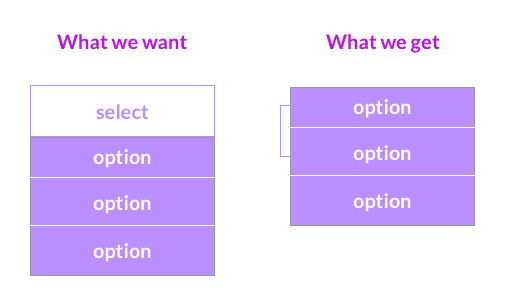

# 创建自定义的、可访问的下拉菜单

> 原文：<https://dev.to/emmabostian/creating-a-custom-accessible-drop-down-3gmo>

注意:我还在学习可访问性，所以如果你发现我的方法有缺陷，请在下面的评论中告诉我！

创建定制组件很难。您必须覆盖许多默认的浏览器样式，这通常会很繁琐。在某些情况下，不可能设计 HTML 元素的样式。选择下拉菜单就是这种情况。

无法设计选择下拉菜单的样式，因为我们无法将一组`<option>`元素包装在一个容器中(这是绝对定位父元素列表项所必需的)。

因此，我们必须“黑”出一条路来创建下拉菜单。不幸的是，这通常会导致缺乏可访问性。

在本教程中，我们将学习如何创建一个自定义的选择下拉菜单，同时遵守 W3C 可访问性标准。

# 第一步- HTML

这是我们将要创建的下拉菜单:
[https://codepen.io/emmawedekind/embed/eXNppG?height=600&default-tab=result&embed-version=2](https://codepen.io/emmawedekind/embed/eXNppG?height=600&default-tab=result&embed-version=2)

传统上，当创建一个选择下拉菜单时，你会使用下面的:

```
<select>
    <option value="option-1">Option 1</option>
    <option value="option-2">Option 2</option>
    <option value="option-3">Option 3</option>
</select> 
```

Enter fullscreen mode Exit fullscreen mode

使用`<select>`元素的问题是您不能将子`<option>`元素包装在容器中。为什么我们需要将这些元素包装在一个容器中？以便将下拉列表定位在输入框下方。

在我们的例子中，我们希望列表项、`<option>`元素位于`<select>`框的下面。默认情况下，浏览器将菜单项呈现为覆盖图:

[](https://res.cloudinary.com/practicaldev/image/fetch/s--yWttxC1F--/c_limit%2Cf_auto%2Cfl_progressive%2Cq_auto%2Cw_880/https://user-images.githubusercontent.com/7671983/53564458-44901e80-3b57-11e9-81af-ac25c9a34e34.png)

要相对于父元素定位子元素，自定义下拉菜单就是这种情况，您必须设置以下 CSS 属性:

```
 .parent {
        position: relative;
    }

    .child {
        position: absolute;
        top: 0;
        left: 0;
     } 
```

Enter fullscreen mode Exit fullscreen mode

你可能想知道:“你不能把 HTML 重写为下面的(使用上面的 CSS)吗？

```
 <select class="parent">
        <div class="child">
            <option value="option-1">Option 1</option>
            <option value="option-2">Option 2</option>
            <option value="option-3">Option 3</option>
        </div>
    </select> 
```

Enter fullscreen mode Exit fullscreen mode

答案很不幸**没有**。不能将`<div>`放在`<select>`的内部。

[https://codepen.io/emmawedekind/embed/ZPbapL?height=600&default-tab=result&embed-version=2](https://codepen.io/emmawedekind/embed/ZPbapL?height=600&default-tab=result&embed-version=2)

因此，我们必须创建一个可访问的工作区。

### 创建自定义选择

由于我们不能使用`<select>`元素，我选择使用一系列的`<ul>`和`<li>`元素。

结构大概是这样的:

```
<ul class="dropdown">
  <li class="dropdown__label">
    Label
  </li>

  <!-- The "select" drop down -->
  <li role="button" id="dropdown__selected" tabindex="0">Option 1</li>

  <!-- Icon -->
  
      <path d="M10 0L5 5 0 0z"></path>
  

  <li class="dropdown__list-container">
    <ul class="dropdown__list">
      <li class="dropdown__list-item" id="option-1">Option 1</li>
    <li class="dropdown__list-item" id="option-2">Option 2</li>
  </ul>
  </li>
</ul> 
```

Enter fullscreen mode Exit fullscreen mode

这很简单。

*   我们将整个组件包装在一个无序列表中。
*   标签是一个列表项。
*   选择也是一个列表项。
*   接下来我们有下拉箭头图标。最后，列表项菜单被包装在一个子无序列表中。

但是...这是不可访问的。如果有视觉障碍的用户在辅助技术的帮助下访问这个页面，他们不会知道这是一个下拉菜单，也不知道如何与之交互。此外，它完全无法通过键盘访问。

### 使自定义元素可访问

在键盘导航和屏幕阅读器可访问性方面，自定义元素的功能必须与语义元素相同。

为了使这个屏幕阅读器可访问，我们需要以下内容:

*   下拉标签必须有 id。这是因为我们将在`<li>`上使用`aria-labelledby`，它将作为一个选择下拉菜单，并且这个属性接受标记它的 HTML 的`id`。我给它的 id 是`dropdown-label`。
*   用作选择下拉框的`<li>`必须有一个`role="button"`和一个`aria-labelledby="dropdown-label"`。
*   ``元素需要额外的信息来描述它是什么。因此，我们可以添加一个`Open drop down`作为 SVG 的第一个子节点。
*   下拉列表容器需要通知用户菜单是否展开。我们可以添加一个`aria-expanded="false"`属性来传达这个信息。随着状态的改变，这必须用 JavaScript 来更新。

以下是我们需要的，以使此键盘可访问:

*   作为选择下拉菜单的`<li>`需要一个`tabindex="0"`，这样用户就可以聚焦在元素上。
*   下拉菜单中的所有`<li>`也需要`tabindex="0"`。

以下是可访问的 HTML:

```
 <ul class="dropdown">
    <li id="dropdown-label" class="dropdown__label">
      Label
    </li>

    <li
      role="button"
      aria-labelledby="dropdown-label"
      id="dropdown__selected"
      tabindex="0"
    >
      Option 1
    </li>

    
      Open drop down
      <path d="M10 0L5 5 0 0z"></path>
    
    <li aria-expanded="false" role="list" class="dropdown__list-container">
      <ul class="dropdown__list">
        <li class="dropdown__list-item" tabindex="0" id="option-1">
          Option 1
        </li>
        <li class="dropdown__list-item" tabindex="0" id="option-2">
          Option 2
        </li>
      </ul>
    </li>
  </ul> 
```

Enter fullscreen mode Exit fullscreen mode

我们还需要添加一些 JavaScript 逻辑，以确保组件像本地选择下拉菜单一样工作。这是预期的交互:

*   用户可以用键盘关注该元素。
*   用户可以通过按空格键或回车键来打开选择下拉列表。
*   用户可以使用上下箭头键或 Tab 键来导航列表项元素。
*   用户可以通过聚焦于列表项并按 Enter 来改变选择。
*   用户可以通过按 Escape 键来关闭下拉菜单。
*   一旦用户选择了一个列表项，列表就会关闭。

所以现在让我们来实现它。

### 用 JavaScript 实现键盘辅助功能

首先，我们需要获取空格键、回车键、上下箭头键和退出键的键码。(我见过空格键表示为 0 和 32，所以为了安全起见，我把它都设置为 0 和 32)。

```
 const SPACEBAR_KEY_CODE = [0,32];
  const ENTER_KEY_CODE = 13;
  const DOWN_ARROW_KEY_CODE = 40;
  const UP_ARROW_KEY_CODE = 38;
  const ESCAPE_KEY_CODE = 27; 
```

Enter fullscreen mode Exit fullscreen mode

接下来，我们知道需要一些元素。我会把它们保存到常量中。我们还想跟踪列表项 id，所以我将声明一个空数组，我们将填充它。

```
 const list = document.querySelector(".dropdown__list");
  const listContainer = document.querySelector(".dropdown__list-container");
  const dropdownArrow = document.querySelector(".dropdown__arrow");
  const listItems = document.querySelectorAll(".dropdown__list-item");
  const dropdownSelectedNode = document.querySelector("#dropdown__selected"); 
  const listItemIds = []; 
```

Enter fullscreen mode Exit fullscreen mode

接下来，我们需要向元素中添加一些事件侦听器，以确保它们能够响应用户交互。不要担心这里声明的函数，我们很快就会用到它们。

```
 dropdownSelectedNode.addEventListener("click", e =>
    toggleListVisibility(e)
  );
  dropdownSelectedNode.addEventListener("keydown", e =>
    toggleListVisibility(e)
  );

  // Add each list item's id to the listItems array
  listItems.forEach(item => listItemIds.push(item.id));

  listItems.forEach(item => {
    item.addEventListener("click", e => {
      setSelectedListItem(e);
      closeList();
    });

    item.addEventListener("keydown", e => {
      switch (e.keyCode) {
        case ENTER_KEY_CODE:
          setSelectedListItem(e);
          closeList();
          return;

        case DOWN_ARROW_KEY_CODE:
          focusNextListItem(DOWN_ARROW_KEY_CODE);
          return;

        case UP_ARROW_KEY_CODE:
          focusNextListItem(UP_ARROW_KEY_CODE);
          return;

        case ESCAPE_KEY_CODE:
          closeList();
          return;

         default:
           return;
      }
    });
  }); 
```

Enter fullscreen mode Exit fullscreen mode

现在让我们创建一些刚刚在事件监听器中调用的函数。
`setSelectedListItem`接受一个事件并更新“选择”框中当前选中的项目。

```
function setSelectedListItem(e) {
  let selectedTextToAppend = document.createTextNode(e.target.innerText);
  dropdownSelectedNode.innerHTML = null;
  dropdownSelectedNode.appendChild(selectedTextToAppend);
} 
```

Enter fullscreen mode Exit fullscreen mode

`closeList`关闭列表并更新`aria-expanded`值。

```
function closeList() {
  list.classList.remove("open");
  dropdownArrow.classList.remove("expanded");
  listContainer.setAttribute("aria-expanded", false);
} 
```

Enter fullscreen mode Exit fullscreen mode

`toggleListVisibility`参加一个活动。如果按了退出键，则关闭列表。否则，如果用户点击了或者他们按了空格键或回车键，切换展开状态并相应地更新`aria-expanded`值。最后，如果按下了向下或向上箭头键，聚焦下一个列表项。

```
function toggleListVisibility(e) {
  let openDropDown = SPACEBAR_KEY_CODE.includes(e.keyCode) || e.keyCode === ENTER_KEY_CODE;

  if (e.keyCode === ESCAPE_KEY_CODE) {
    closeList();
  }

  if (e.type === "click" || openDropDown) {
    list.classList.toggle("open");
    dropdownArrow.classList.toggle("expanded");
    listContainer.setAttribute(
      "aria-expanded",
      list.classList.contains("open")
    );
  }

  if (e.keyCode === DOWN_ARROW_KEY_CODE) {
    focusNextListItem(DOWN_ARROW_KEY_CODE);
  }

  if (e.keyCode === UP_ARROW_KEY_CODE) {
    focusNextListItem(UP_ARROW_KEY_CODE);
  }
} 
```

Enter fullscreen mode Exit fullscreen mode

`focusNextListItem`选择常量`DOWN_ARROW_KEY_PRESSED`或`UP_ARROW_KEY_PRESSED`的方向。如果用户当前聚焦在“选择”上，聚焦在第一个列表项上。否则，我们需要找到当前焦点列表项的索引。这就是`listItemsId`数组派上用场的地方。现在我们知道了当前焦点项在列表中的位置，我们可以决定做什么了。

如果用户按下了向下箭头键，并且他们不在最后一个列表项，则关注下一个列表项。如果用户按了向上箭头键，并且他们不在第一个列表项上，则聚焦于前一个列表项。

```
function focusNextListItem(direction) {
  const activeElementId = document.activeElement.id;
  if (activeElementId === "dropdown__selected") {
    document.querySelector(`#${listItemIds[0]}`).focus();
  } else {
    const currentActiveElementIndex = listItemIds.indexOf(activeElementId);
    if (direction === DOWN_ARROW_KEY_CODE) {
      const currentActiveElementIsNotLastItem =
      currentActiveElementIndex < listItemIds.length - 1;
      if (currentActiveElementIsNotLastItem) {
        const nextListItemId = listItemIds[currentActiveElementIndex + 1];
        document.querySelector(`#${nextListItemId}`).focus();
      }
    } else if (direction === UP_ARROW_KEY_CODE) {
      const currentActiveElementIsNotFirstItem =
      currentActiveElementIndex > 0;
      if (currentActiveElementIsNotFirstItem) {
        const nextListItemId = listItemIds[currentActiveElementIndex - 1];
        document.querySelector(`#${nextListItemId}`).focus();
      }
    }
  }
} 
```

Enter fullscreen mode Exit fullscreen mode

就是这样！你现在有一个完全兼容的键盘可访问的下拉菜单！我不会在这里讨论 Sass/CSS，但是欢迎你在 [CodePen](https://codepen.io/emmawedekind/pen/eXNppG) 上查看。