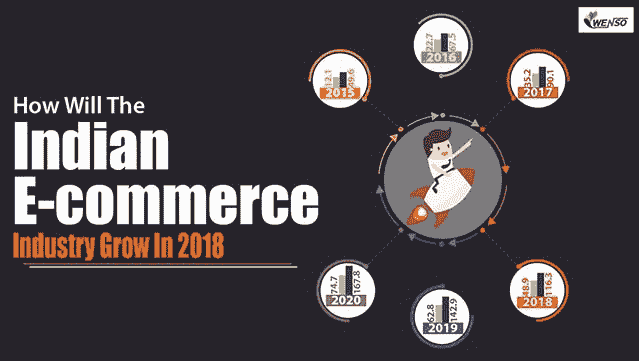

# 2018 年印度电商行业将如何增长

> 原文：<https://dev.to/wenso_smith/how-will-the-indian-e-commerce-industry-grow-in-2018-5f67>

随着网上商务的出现，购物显然有了一个全新的层面。印度消费者最常通过网络购买产品。从日常用品到奢侈品，如电子产品。人们想买的任何东西都只需轻轻一点，就像在家里一样舒适。有了不同的支付方式选择，网上购物体验变得更加轻松和令人满意。如果收到损坏的产品，可以选择退货，货到付款，这使得网上购物物有所值。

电子商务的全称是电子商务业务。通常用作电子商务的销售术语。这项业务以许多有用的方式进行。它使用的技术有 [**、移动电子商务**](https://www.wenso.co.uk/news/the-future-of-mobility-in-the-ecommerce-industry/) 、在线交易流程、在线营销。它利用万维网销售其产品和服务，甚至进行小规模营销。

在印度， [**电子商务行业**](https://www.wenso.co.uk/it-services/e-commerce/) 显示出非常积极的增长。据估计，大约 70%到 80%的人通过他们的手机访问互联网，这使得在线买卖过程更加频繁。电子商务行业的这一热潮最大的功劳要归功于智能手机，它帮助了在线业务和在特定市场中的轻松渗透。由于电子商务的大玩家，如 Flipkart 和亚马逊，正在进行大规模的竞争，以占据电子商务的最大空间；零售业务的这一部分获得了最大的关注。

在印度，要想在电子商务领域取得成功，就必须有效地营销产品和服务。因此，为了在这里取得成功，人们应该以有效的方式销售他们的产品。为此，他们必须在多个网站上展示他们的产品。

然而，有些网站是有吸引力的和可靠的，而另一些则不是。

人们在网上购物的最大好处是可以自由选择他们认为有用的经销商和卖家。人们会根据各种社交媒体平台上显示的广告进行判断。这些产品也在卖家的网页上被讨论，人们也通过谈论他们的产品或相关服务的好处来传播信息。

印度电子商务行业的增长非常明显，因为很大一部分客户群正在转向在线营销。这推动了电子商务的发展。

这一点在折扣季非常明显，每个玩家都会发放折扣券和奖励积分，以将最大流量转移到他们的网站。例如，亚马逊的大印度销售提供了许多折扣优惠，现金返还优惠，让人们尽可能多地在他们的网站上购物。他们特别针对信用卡/借记卡持有者。

网站在客户和卖家之间起着重要的作用，因此企业主雇佣 SEO 和 SEM 为他们的网站设计好的内容，作为他们产品广告的有效营销工具。为了使他们的广告看起来有效，他们努力设计他们的主页，以便获得最大的访问者。

*最初发表于*[*【www.wenso.co.uk】*](https://www.wenso.co.uk/news/how-will-the-indian-e-commerce-industry-grow-in-2018/)*。*