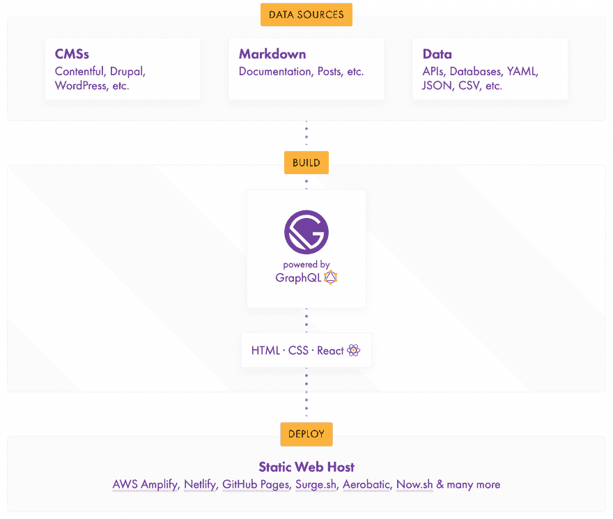

# 一个动态静态站点生成器

> 原文：<https://dev.to/geocine/a-static-site-generator-doesnt-have-to-be-static-41i>

我将试着解释什么是[静态站点发生器](https://en.wikipedia.org/wiki/Web_template_system#Static_site_generators) (SSG)。SSG 是静态站点和内容管理系统(CMS)的结合，静态内容是从数据源生成的。

最终的输出将是一个静态网站，它可以通过一个内容交付网络或任何网络服务器提供服务。你不需要运行后端，数据库之类的东西。你甚至可以通过在浏览器上打开 HTML 文件在你的电脑上运行它。

这篇文章很好地解释了什么是 SSG。

## 文章不再可用

## 其动态能力

SSG 不是完全静止的。它通过从源收集数据并通过模板将数据转换为人类可消费的内容的过程来实现动态内容。

这里的关键词是*生成器*。生成器负责这个过程，每次我们需要更新内容时，这个过程只发生一次。大多数 SSG 使用文件作为数据源。最常见的文件是降价文件。

如果你不知道什么是降价，去看看这篇文章:

 [## 面向开发人员的降价备忘单

### rattan AK Chea 11 月 13 日 183 分钟阅读

#markdown #cheatsheet](/rattanakchea/markdown-cheatsheet-for-developers-2bjj)

能够通过文件编辑内容并不是真正的动态。如果我们可以从 API、数据库或 CMS 等动态来源获取数据，会怎么样？这的确是可能的，盖茨比说。

## 盖茨比

我想向你介绍盖茨比。在我开始之前，只是想让你知道有大量的 SSG 可用。看看[这个由 Netlify 团队列出的](https://www.staticgen.com/)，它包含了大约 ***~248*** 个静态站点发电机。

### 是什么让盖茨比与众不同？

盖茨比引入了*“自带数据”*的概念。大多数 SSG 只能从文件中获取内容。这就是盖茨比的闪光点，它闪耀着阶级的光芒。我引用他们网站上的话:

> Gatsby 丰富的数据插件生态系统允许您使用您想要的数据(来自一个或多个来源)构建站点:使用 GraphQL 从 headless CMSs、SaaS 服务、API、数据库、您的文件系统以及更直接的页面中提取数据。

### 什么是 GraphQL，它在图片中的位置如何？

我可能会在另一篇文章中保存对 GraphQL 的介绍。但是这里有一个很好的帖子解释了它是什么:

 [## GraphQL 是什么？

### grigor Khachatryan Jun 17 ' 183 分钟阅读

#graphql #javascript #facebook #node](/grigorkh/what-is-graphql-4n9j)

沉住气，我们不需要设置任何 GraphQL 服务器来使用 Gatsby 中的 GraphQL。我们甚至不需要将现有的 API 转换成 GraphQL。那么我们为什么还要讨论 GraphQL 呢？

下面的图表来自于 [Gatsby](https://Gatsby.org) 网站，展示了 GraphQL 是如何被使用的。Gatsby 通过 GraphQL 公开了您的数据源。这意味着如果您有许多不同的数据源，您不必处理不同的事情。

 
如果你正在集成一个数据源，很有可能已经为此编写了一个插件。请务必查看盖茨比[插件页面](https://www.Gatsby.org/plugins/?=gatsby-source)并寻找`gatsby-source`。

如果您没有看到适合您的用例的插件，那么开始编写您自己的 Gatsby 源代码插件真的很容易。详细指南可在[这里](https://www.Gatsby.org/docs/create-source-plugin/)找到。

### 动态模板

模板引擎将使用模板预处理数据，以生成结果文档或任何类型的格式化输出。一旦产生了输出，它就停止了。

盖茨比是由 React 构建的，所以你展示东西的方式是通过 [JSX](https://en.wikipedia.org/wiki/React_(JavaScript_library)#JSX) 。它还会产生类似于常规 SSG 的输出。当您在浏览器上加载生成的输出时，ReactJS 就会启动，它将使您的站点更具交互性、更快、更简洁，从而使您能够提供更好的用户体验。

如果你一直在使用 ReactJS，这将是相同的体验，就像你如何使用它或没有盖茨比。您不必将上下文切换到一个模糊的构建系统，甚至是一种您以前没有使用过的语言。

### 盖茨比为什么这么快？

通过使用 SSG，我们已经消除了很多开销。盖茨比把这一点提高了两个档次。

> 《盖茨比》中的表演不是可有可无的，而是内在的。我设计《盖茨比》的目的是，当使用它时，很难建立一个缓慢的网站

你可以在这里阅读(盖茨比的创始人)*凯尔·马修斯* [对此的详细论述。亲自尝试一下，看一看 Gatsby 团队的网上研讨会。](https://www.Gatsby.org/blog/2017-09-13-why-is-gatsby-so-fast/)

[https://www.youtube.com/embed/gOeeZI8jbpA](https://www.youtube.com/embed/gOeeZI8jbpA)