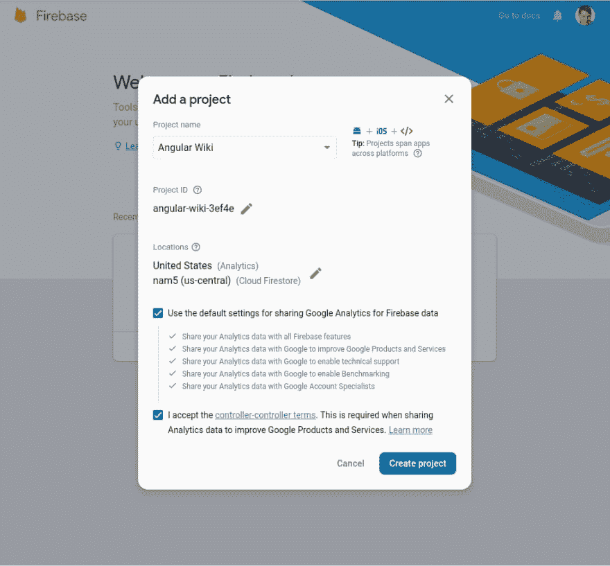
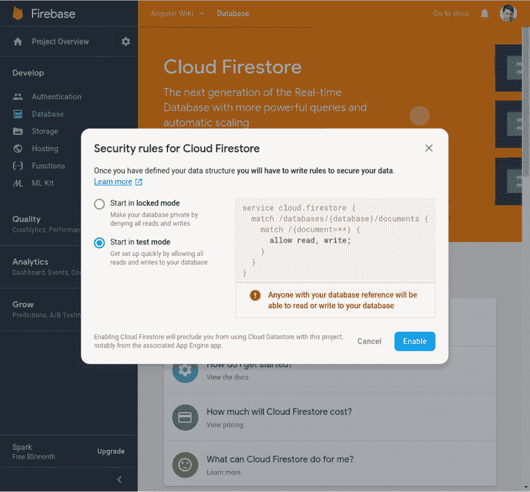
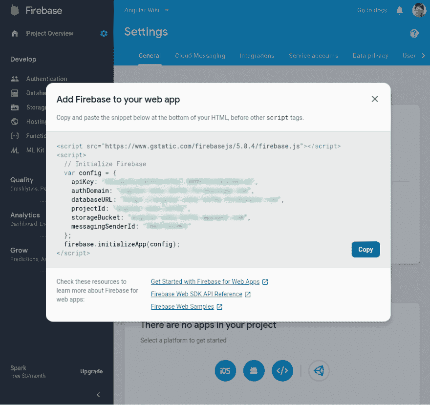
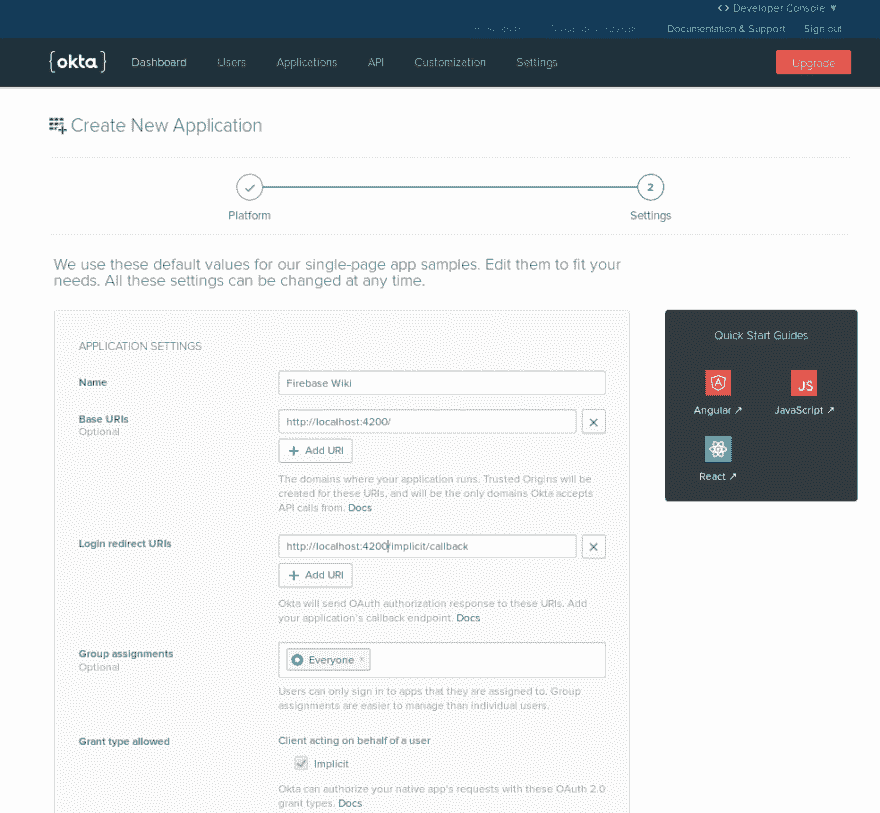
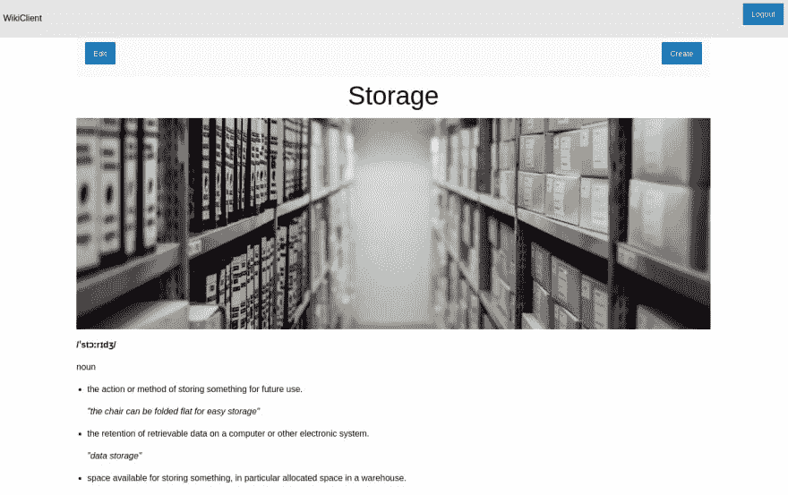

# 用 Angular 和 Firebase 构建 CRUD 应用程序

> 原文：<https://dev.to/oktadev/build-a-crud-app-with-angular-and-firebase-a0b>

存储即服务(SaaS)在许多企业中越来越受欢迎。优势显而易见。您可以将服务外包给不同的提供商，而不是维护自己的后端服务器。这可以显著提高生产率，并降低开发和维护成本。此外，对服务器安全性的担忧也转移给了存储提供商。当应用程序的服务器部分可以简化为存储对象数据时，可以选择使用 SaaS。有许多不同的 SaaS 供应商。可以说，该领域最大的玩家之一是提供 Firebase 服务的谷歌。

在本教程中，我将向你展示如何使用 Angular 为前端客户端创建自己的 Wiki，并使用 Firebase 存储 Wiki 文档。您会发现在几分钟内创建一个完整的应用程序是很容易的。

## 建立 Firebase 数据库

Firebase 提供了不同的数据存储方法。我将使用新的 Firestore 服务，而不是更成熟的实时数据库。Firestore 允许您建立一个更结构化的数据库以及一个更强大的查询 API。首先，打开浏览器，导航到 Firebase 控制台`https://console.firebase.google.com/`。使用您的 Google 帐户登录，并接受所有条款和条件。在 Firebase 控制台中，您可以看到所有项目的概述。

如果你以前没有使用过 Firebase，你需要创建你的第一个项目。点击带有加号的卡片，上面写着**添加项目**。在出现的弹出窗口中，您可以编辑项目名称和设置。将名称更改为您喜欢的任何名称，接受条款和条件，并保留其他所有内容的默认值。

[](https://res.cloudinary.com/practicaldev/image/fetch/s--NJbxx85H--/c_limit%2Cf_auto%2Cfl_progressive%2Cq_auto%2Cw_880/https://developer.okta.com/assets-jekyll/blog/firebase-angular-wiki/firebase-step01-b99cbc75b11c31292b6d79da5a21292b86e82c1df5f0d223ccf3b5542687d7f2.png)

当您提交表单时，您将被带到**项目概述**页面。记下 Firebase 项目的 URL 您将需要它来设置客户端。这里您必须做的第一件事是创建一个新的数据库。在左侧工具条菜单中选择**数据库**。您可以在不同的数据存储技术之间进行选择。我将使用 Firestore，它允许你以分层格式存储数据。在撰写本文时，Firestore 数据库在页面顶部的大横幅中做了广告。点击**创建数据库**创建一个 Firestore 数据库。

[](https://res.cloudinary.com/practicaldev/image/fetch/s--s7Ew6cW1--/c_limit%2Cf_auto%2Cfl_progressive%2Cq_auto%2Cw_880/https://developer.okta.com/assets-jekyll/blog/firebase-angular-wiki/firebase-step02-b8c17b8c3b1e008adfd25447a0d40e5999ca73d3e5fc171ee5b1f0d78b5cb813.png)

将出现另一个弹出对话框，允许您更改数据库的设置。选择**以测试模式**开始，允许任何开发人员访问数据库。点击**启用**，您将被带到一个对话框，允许您手动将第一条数据记录添加到数据库中。Firestore 不允许一个完全空的数据库，所以你必须在这里添加一些数据。

首先，创建一个名为`pages`的新集合。此集合将包含您的应用程序的所有 wiki 页面。然后添加一个包含以下字段的新文档。

| 字段名 | 类型 |
| --- | --- |
| `content` | 文本 |
| `created` | 时间戳 |
| `modified` | 时间戳 |

您创建的第一个文档将是您的 wiki 主页。输入`home`作为文件 ID。这是唯一标识页面的字符串。然后在`content`字段中输入任何文本。我将向您展示如何将 markdown 集成到您的 wiki 中，因此您可以在这里输入任何 markdown 字符串。接下来，在`created`和`modified`字段中输入当前日期和时间。最后点击**保存**保存文件。现在，您已经成功设置了 Firebase 存储。

接下来，您需要获取在应用程序中使用服务的信息。在 Firebase 控制台中，单击**项目概述**旁边的齿轮图标，打开项目设置。在**通用**选项卡中向下滚动到底部。您将看到一个通知，告诉您项目中没有应用程序。您不会在此处添加应用程序，但您可以通过点击网络图标“< / >”来获取信息。出现一个弹出窗口，显示您的 API 密钥、数据库 URL 等。将信息复制到安全的地方，您以后会需要它。

[](https://res.cloudinary.com/practicaldev/image/fetch/s--1CevBSlh--/c_limit%2Cf_auto%2Cfl_progressive%2Cq_auto%2Cw_880/https://developer.okta.com/assets-jekyll/blog/firebase-angular-wiki/firebase-settings-faa32fbd23053bfc4c1287d4ebd99db5440c5f4a9e8a91d86a7aa8acfd49c70c.png)

## 为您的 Angular + Firebase 应用添加用户认证

客户端将通过 Okta 的用户认证来实现。所以，在开始编写任何客户机代码之前，应该向 Okta 注册应用程序。如果你还没有开发者账户，那么[注册一个免费账户](http://developer.okta.com/signup)。注册后，您将被带到 Okta 仪表板。在这里，您可以通过点击**添加应用程序**按钮来添加一个应该使用 Okta 认证的新应用程序。出现的页面允许您在不同类型的应用程序之间进行选择。选择**单页应用**，将进入设置页面。您需要修改默认值，因为 Angular 使用端口 4200 作为其测试服务器的默认端口。您的设置应该如下所示。

[](https://res.cloudinary.com/practicaldev/image/fetch/s--PBseei5Q--/c_limit%2Cf_auto%2Cfl_progressive%2Cq_auto%2Cw_880/https://developer.okta.com/assets-jekyll/blog/firebase-angular-wiki/okta-settings-c3544b6776426bf3d5bbb7233f14d60bc8d52d9a7eb5858a23a3ebd49217eab5.png)

## 设置您的 Angular 客户端

客户端将使用 Angular 实现，它是基于节点的。我假设您已经在系统上安装了 Node 和`npm`命令。Angular 使用一个名为`ng`的命令行客户端来自动化许多开发任务。如果您还没有这样做，打开一个终端并使用`npm`全球安装它。

```
npm install -g @angular/cli@7.3.3 
```

如果您所在的系统不允许您以普通用户的身份修改系统文件，那么您必须使用`sudo`来运行这个命令。您现在已经准备好创建您的应用程序了。在终端中，导航到您选择的目录并创建 wiki 客户端。

```
ng new WikiClient --routing --style=css 
```

这将创建一个名为`WikiClient`的目录，在其中添加一些准系统应用程序代码，并安装所有必需的包。在对代码进行任何修改之前，您可以使用 Okta 提供的 Angular 示意图来设置身份验证。导航到`WikiClient`目录并运行以下命令。

```
ng add @oktadev/schematics 
```

您将被询问应用程序的发行者 URL 和客户端 ID。要设置它们，只需复制并粘贴从 Okta 控制台获得的值。该命令将为 Angular 添加最新的 Okta 包，并设置基本配置以在您的应用程序中使用 Okta 身份验证。

## 为你的 Angular + Firebase 应用添加视觉设计

在实现响应式前端用户界面时，我非常喜欢使用 Zurb 基金会框架。它是一套全面的 CSS 类和 JavaScript 工具，有大量的设置，可以根据您的需要进行样式化。对于本教程，您将只使用框架的 CSS 部分，它可以从 CDN 导入。将下面一行添加到`src/index.html`的`<head>`标签中。

```
<link rel="stylesheet" href="https://cdn.jsdelivr.net/npm/foundation-sites@6.5.3/dist/css/foundation.min.css" integrity="sha256-xpOKVlYXzQ3P03j397+jWFZLMBXLES3IiryeClgU5og= sha384-gP4DhqyoT9b1vaikoHi9XQ8If7UNLO73JFOOlQV1RATrA7D0O7TjJZifac6NwPps sha512-AKwIib1E+xDeXe0tCgbc9uSvPwVYl6Awj7xl0FoaPFostZHOuDQ1abnDNCYtxL/HWEnVOMrFyf91TDgLPi9pNg==" crossorigin="anonymous"> 
```

接下来，打开`src/styles.css`，用一些基本的样式替换内容。

```
body {
  margin: 0;
  font-family: sans-serif;
}

h1, h2 {
  text-align: center;
} 
```

您将需要导入一些稍后要使用的模块，并使它们可用于您的应用程序。打开`src/app/app.module.ts`并将以下导入添加到文件的顶部。

```
import { FormsModule, ReactiveFormsModule } from '@angular/forms'; 
```

然后将它们添加到同一文件中的导入列表中。

```
imports: [
  FormsModule,
  ReactiveFormsModule,
  ... ] 
```

主应用设计放入`src/app/app.component.html`。将以下代码复制到文件中。

```
<div class="top-bar">
  <div class="top-bar-left">
    <button routerLink="/">{{title}}</button>
  </div>
  <div class="top-bar-right">
    <button class="button" *ngIf="!isAuthenticated" (click)="oktaAuth.loginRedirect()"> Login </button>
    <button class="button" *ngIf="isAuthenticated" (click)="oktaAuth.logout()"> Logout </button>
  </div>
</div>
<router-outlet></router-outlet> 
```

元素定义了页面顶部的应用程序工具栏。它包含一个到 wiki 主页的链接和一个让用户登录或注销的按钮。您会注意到使用了`isAuthenticated`标志和`oktaAuth`属性。这些已经通过`src/app/app.component.ts`中的应用程序组件由您在上一步中应用到客户端的 Okta 原理图提供。`<router-outlet>`是路由器呈现其内容的容器。

## 实现你的 Angular + Firebase Wiki

wiki 客户端需要连接到 Firebase 服务器。Google 提供了节点和角度库来连接数据库。照例可以用`npm`安装。

```
npm install --save @angular/fire@5.1.1 firebase@5.8.4 
```

这些模块必须对应用程序可用。再次打开`src/app/app.module.ts`并添加以下导入和配置。

```
import { AngularFireModule } from '@angular/fire';
import { AngularFirestoreModule } from '@angular/fire/firestore';

const firebaseConfig = {
  apiKey: "<Firebase API key>",
  authDomain: "<Firebase auth domain>",
  databaseURL: "<Firebase database URL>",
  projectId: "<Firebase project ID>",
  storageBucket: "<Firebase storage bucket>",
  messagingSenderId: "<Firebase messaging sender ID>",
}; 
```

您只需将从 Firebase 控制台获得的信息粘贴到配置对象中。在同一个文件的下面，将两个模块都添加到导入中。

```
AngularFireModule.initializeApp(firebaseConfig),
AngularFirestoreModule, 
```

您将把页面内容加载到主页中。打开`src/app/home/home.component.ts`，用以下内容替换当前内容。

```
import { Component, OnInit } from '@angular/core';
import { OktaAuthService } from '@okta/okta-angular';
import { ActivatedRoute } from '@angular/router';
import { AngularFirestore } from '@angular/fire/firestore';
import { Subscription } from 'rxjs';
import { DocumentSnapshot } from '@firebase/firestore-types';

@Component({
  selector: 'app-home',
  templateUrl: './home.component.html',
  styleUrls: ['./home.component.css']
})
export class HomeComponent implements OnInit {
  isAuthenticated: boolean;
  slug: string;
  content: string;
  created: number;
  modified: number;

  subs: Subscription;

  constructor(private oktaAuth: OktaAuthService,
              private db: AngularFirestore,
              private route: ActivatedRoute) {
  }

  async ngOnInit() {
    this.route.paramMap.subscribe(params => {
      this.loadPage(params.get('slug') || 'home');
    });

    this.isAuthenticated = await this.oktaAuth.isAuthenticated();
    this.oktaAuth.$authenticationState.subscribe(
      (isAuthenticated: boolean) => this.isAuthenticated = isAuthenticated
    );
  }

  loadPage(slug) {
    if (this.subs) {
      this.subs.unsubscribe();
    }

    const doc = this.db.collection('pages').doc(slug).get();
    this.subs = doc.subscribe((snapshot) => {
      const page = snapshot.data();
      if (!page) {
        this.content = '### This page does not exist';
        this.slug = undefined;
      } else {
        this.slug = slug;
        this.content = page.content;
        this.created = page.created;
        this.modified = page.modified;
        console.log(page);
      }
    });
  }
} 
```

`HomeComponent`根据通过路由传入的`slug`参数加载页面。Firestore API 可通过`AngularFirestore`注射剂获得。一旦加载完毕，`content`、`slug`和时间戳属性将根据获得的数据进行设置。在`src/app/home/home.component.html`中的 home 组件的模板中，然后用下面的代码替换内容。

```
<div class="grid-container wiki">
  <div class="grid-x">
    <div class="small-12 cell">
      <div class="manage-post" *ngIf="isAuthenticated">
        <button class="button" [routerLink]="['/edit', slug]">Edit</button>
        <button class="button" routerLink="/edit">Create</button>
      </div>
      {{content}}
    </div>
  </div>
</div> 
```

如果用户通过了身份验证，页面还会包含一个带有按钮的栏来管理页面。这些按钮链接到`edit`页面，您将在本教程稍后实现该页面。通过编辑`src/app/home/home.component.css`赋予这个工具栏一些风格。

```
.manage-post {
  display: flex;
  justify-content: space-between;
  padding: 0.5rem 1rem;
  background-color: #fafafa;
} 
```

考虑到`slug`参数，必须修改`home`路由的默认路由器设置。打开`src/app/app-routing.module.ts`，修改`routes`阵。

```
const routes: Routes = [
  {path: '', redirectTo: '/home/', pathMatch: 'full'},
  {
    path: 'home/:slug',
    component: HomeComponent
  },
  {
    path: 'home',
    component: HomeComponent
  },
  {
    path: 'implicit/callback',
    component: OktaCallbackComponent
  }
]; 
```

应用程序现在可以显示来自 Firebase 服务器的 wiki 页面了。在终端中，运行`ng serve`。然后打开浏览器，导航至`http://localhost:4200`。您将看到您输入到数据库中的主页内容。然而，在这一点上，降价没有被正确地呈现。这很快得到补救。再次打开终端，安装`ngx-markdown`包。

```
npm install --save ngx-markdown@7.1.3 
```

再次，导入`src/app/app.module.ts`顶部的模块。

```
import { MarkdownModule } from 'ngx-markdown'; 
```

然后将`MarkdownModule.forRoot()`添加到`AppModule`的`imports`数组中。接下来，对`src/app/home/home.component.html`做一个小的改动，将`{{content}}`改为如下。

```
<markdown [data]="content"></markdown> 
```

现在，当你查看 wiki 的主页时，你可以看到 markdown 被正确地渲染了。

## 编辑 Angular + Firebase 应用程序中的页面

对于 wiki 应用程序来说，显示 wiki 页面是不够的。当然，您会想要创建新页面或编辑现有页面。使用终端中的命令行工具创建一个新组件。

```
ng generate component edit 
```

这将在`src/app/edit`目录中创建许多文件。打开`src/app/edit/edit.component.ts`，用下面的代码替换它的内容。

```
import { Component, OnInit } from '@angular/core';
import { ActivatedRoute, Router } from '@angular/router';
import { AngularFirestore } from '@angular/fire/firestore';
import { FormGroup, FormBuilder, Validators } from '@angular/forms';

@Component({
  selector: 'app-edit',
  templateUrl: './edit.component.html',
  styleUrls: ['./edit.component.css']
})
export class EditComponent implements OnInit {
  editPageForm: FormGroup;
  newPage: boolean = true;
  pending: boolean = true;
  slug: string;

  constructor(private formBuilder: FormBuilder,
              private db: AngularFirestore,
              private route: ActivatedRoute,
              private router: Router) { }

  ngOnInit() {
        this.route.paramMap.subscribe(params => {
      const slug = params.get('slug');
      if (!slug) {
        this.initNewPage();
      } else {
        this.initEditPage(slug);
      }
    });
  }

  initNewPage() {
    this.newPage = true;
    this.pending = false;
    this.editPageForm = this.formBuilder.group({
      slug: ['', Validators.required],
      content: ['', Validators.required]
    });
  }

  initEditPage(slug) {
    const doc = this.db.collection('pages').doc(slug).get();
    const subs = doc.subscribe((snapshot) => {
      const page = snapshot.data();
      if (!page) {
        this.initNewPage();
      } else {
        this.editPageForm = this.formBuilder.group({
          content: [page.content, Validators.required]
        });
        this.newPage = false;
        this.pending = false;
        this.slug = slug;
      }
      subs.unsubscribe();
    });
  }

  savePage() {
    if (!this.editPageForm.valid) return;
    const now = Date.now();
    let slug, document;
    if (this.newPage) {
      slug = this.editPageForm.get('slug').value;
      document = {
        content: this.editPageForm.get('content').value,
        modified: now,
        created: now
      }
    } else {
      slug = this.slug;
      document = {
        content: this.editPageForm.get('content').value,
        modified: now
      }
    }
    this.db.collection('pages').doc(slug).set(document, {merge: true}).then(() => {
      this.router.navigate(['/home', slug]);
    });
  }
} 
```

该组件用于处理添加新页面和编辑现有页面。使用 Firebase API，这两种操作都是通过使用`set`操作来执行的。`{merge: true}`选项告诉 Firebase，如果更新调用中没有提供属性，就不要删除文档的属性。编辑组件的模板，在`src/app/edit/edit.component.html`中包含一个简单的表单。

```
<div class="grid-container wiki">
  <div class="grid-x">
    <div class="small-12 cell">
      <form [formGroup]="editPageForm" (ngSubmit)="savePage()" *ngIf="!pending">
        <label *ngIf="newPage">Slug
          <input type="text" placeholder="Slug" formControlName="slug">
        </label>
        <label>
          Page Content
          <textarea placeholder="Page Content" formControlName="content"></textarea>
        </label>
        <button class="button">Save</button>
      </form>
    </div>
  </div>
</div> 
```

在`src/app/edit/edit.component.css`中添加一点点造型。

```
input {
  width: 100%;
}

textarea {
  height: 80vh;
} 
```

要使编辑组件通过路由器可用，打开`src/app/app-routing.module.ts`，首先修改从`okta-angular`的导入，以包含`OktaAuthGuard`。

```
import { OktaCallbackComponent, OktaAuthGuard } from '@okta/okta-angular'; 
```

接下来，添加`EditComponent`的导入。

```
import { EditComponent } from './edit/edit.component'; 
```

然后将以下条目添加到`routes`数组中。

```
{
  path: 'edit/:slug',
  component: EditComponent,
  canActivate: [OktaAuthGuard]
},
{
  path: 'edit',
  component: EditComponent,
  canActivate: [OktaAuthGuard]
} 
```

注意这些路线上的`canActivate`属性。它们阻止任何未登录的用户访问页面编辑器。现在您已经准备好测试您的 wiki 了。打开终端并运行启动角度测试服务器。

```
ng serve 
```

现在，打开浏览器并导航至`http://localhost:4200`。如果您尚未登录您的应用程序，请点击**登录**链接，然后输入您的用户名和密码。登录后，您应该会看到添加新页面或编辑当前页面的按钮。数据存储在 Firebase 数据库中。这意味着你可以在任何地方运行你的应用程序，并且总是访问相同的页面。

[](https://res.cloudinary.com/practicaldev/image/fetch/s--YQA2jr5I--/c_limit%2Cf_auto%2Cfl_progressive%2Cq_auto%2Cw_880/https://developer.okta.com/assets-jekyll/blog/firebase-angular-wiki/wiki-example-dda46d3bf261aee5233635387fd0989f140684259ba64c46d8fcb25c2d731aa4.png)

你知道创建你自己的维基这么容易吗？

## 了解更多关于角度和安全用户认证的信息

我希望你喜欢这篇关于整合 Angular 和 Firebase 的教程。我认为它很好地展示了存储即服务有多么有用。如果你想学习更多关于 Angular 和 JavaScript 的知识，为什么不看看下面的链接呢？

*   [Angular 7:有什么新鲜值得关注的+ OIDC 善良](https://developer.okta.com/blog/2018/12/04/angular-7-oidc-oauth2-pkce)
*   [用 Angular 和 Node](https://developer.okta.com/blog/2018/10/30/basic-crud-angular-and-node) 构建一个基本的 CRUD App
*   [JavaScript 生成器的基础知识](https://developer.okta.com/blog/2019/02/25/basics-of-javascript-generators)

本教程的代码可在[https://github . com/oktadeveloper/angular-firebase-wiki-example](https://github.com/oktadeveloper/angular-firebase-wiki-example)获得。

如果你觉得这个教程有用，我们希望你在 Twitter 上关注我们 [@oktadev](https://twitter.com/oktadev) 以了解我们何时发布更多内容。我们还在我们的 YouTube 频道上发布[的截屏视频。](https://www.youtube.com/channel/UC5AMiWqFVFxF1q9Ya1FuZ_Q)