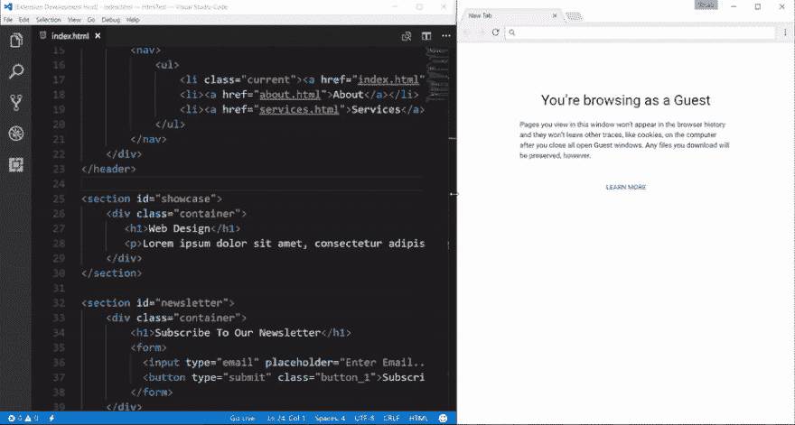
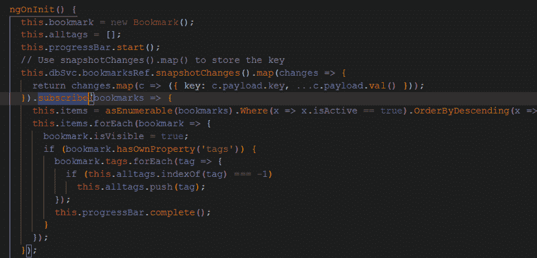
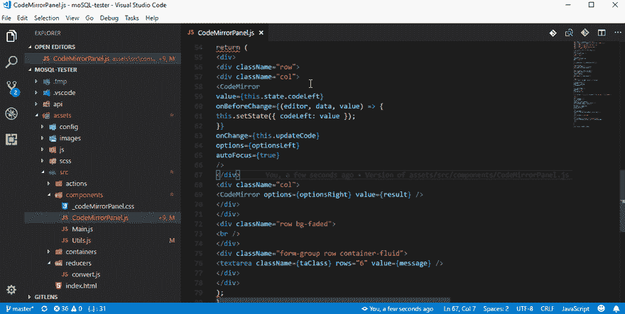
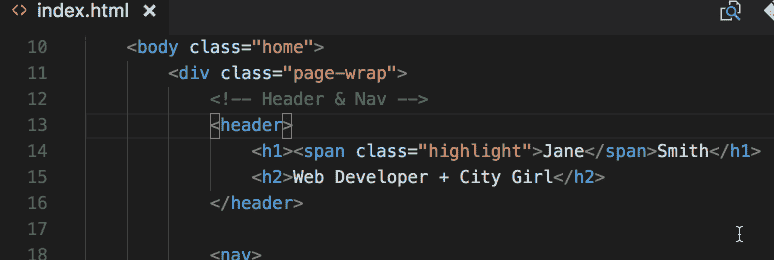
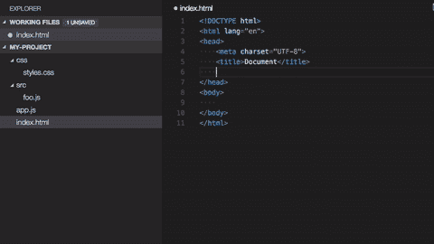
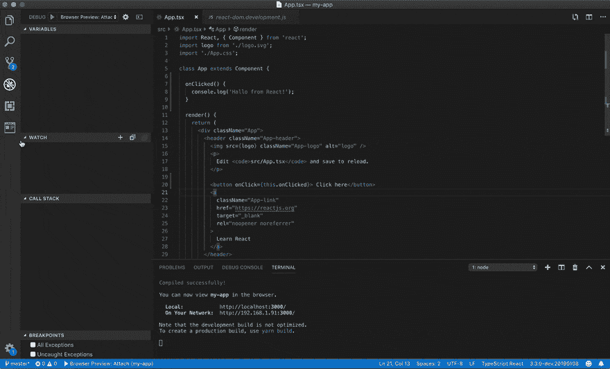
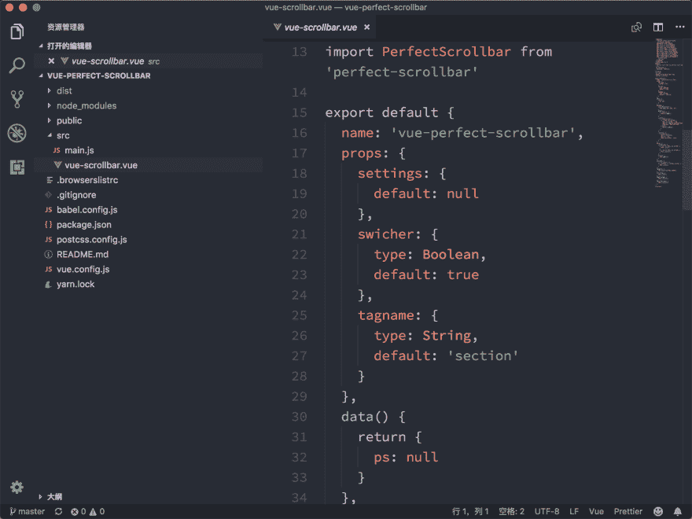

# 9 + 1 Visual Studio 代码扩展，使开发更加简单快捷

> 原文：<https://dev.to/drsavvina/9--1-visual-studio-code-extensions-for-easier-and-faster-development-164n>

*披露:这篇文章包括附属链接；如果您从本文提供的不同链接购买产品或服务，我可能会收到报酬。*

Visual Studio 代码是我最喜欢的编辑器之一，因为我喜欢它的高度可定制性。确实有很多扩展可以让你的生活变得更容易，这里有一些最好的扩展可以提高你的工作效率。如果您是初学者，请尝试这些扩展，让您的 web 开发体验更加有效和简单。

您可以在 VS 代码中浏览和安装扩展。点击 VS 代码旁边的**活动栏**中的扩展图标或**视图:扩展**命令(Ctrl+Shift+X)调出扩展视图。

随意分享你最喜欢的 VS 代码扩展。玩得开心！

### 排名第一的实时服务器

在代码编辑器中进行更改，切换到浏览器，然后刷新以查看更改。这是开发人员永无止境的循环，但是如果您的浏览器在您做出更改时会自动刷新呢？这就是 Live Server 的用武之地！

它还在本地主机服务器上运行您的应用程序。有些东西你只能在从服务器上运行你的应用时测试，所以这是一个很好的好处。

您在编辑器中进行了更改，必须刷新才能检查这些更改。真实的故事，不是吗？Live Server extension 在这里帮助您实时查看您的更改，因为每次您在 VSCode 中保存时，您的浏览器都会自动刷新。

### #2 支架对着色机

恋爱的延伸。当你有这么多行嵌套代码时，匹配括号就变得相当棘手。括号对颜色匹配括号，使代码更具可读性和趣味性。

### #3 更漂亮

再也不用担心格式化了！漂亮是在这里帮助你格式化你的代码，使它更漂亮(显然)。它可以配置为保存时自动格式化。

### #4 CSS Peek

CSS Peek 非常有用，因为它节省了来回查看 HTML 和 CSS 文件的时间。对于不喜欢分屏的开发者来说，这是一个相当不错的扩展。将鼠标悬停在 HTML 文件中的选择器上，查看 CSS 代码的图像。CSS Peek 还会将 id 和类名转换为超链接，引导您找到它们在 CSS 文件中的定义。

### Chrome 的#5 调试器

作为开发人员最受欢迎的 VS 代码扩展之一，Chrome 官方调试器自带内置功能，可以帮助您直接从 VS 代码调试在 Chrome 浏览器中运行的 Javascript 文件。

### 6 号走

这是 VS 代码最有用的扩展之一，当不止一个贡献者在同一个存储库上工作时，它会帮你节省时间。历史，最近的变化，代码作者，责备信息和提交搜索是这个很酷的扩展的一些最好的特性。

### #7 自动重命名标签

你需要重命名一个 HTML 元素吗？使用自动重命名标签扩展，您只需重命名开始或结束标签，另一个将自动重命名。简单有效！

### #8 路径智能感知

如果您从事大型项目，记住所有的目录和文件名可能会非常棘手。这个扩展将帮助您，当您开始在引号中键入路径时，它会显示自动完成文件名。

### #9 浏览器预览

Live Server extension 非常酷，但它更进了一步，允许你在编辑器中打开一个真正的浏览器预览，你可以调试它。做了一个小小的改变后，不再需要检查浏览器。

### #10 一个黑暗职业

如果你是黑暗主题爱好者，Atom 标志性的 One Dark 主题会成为你的最爱。毫不奇怪，这是 VS 代码下载量最大的主题之一！