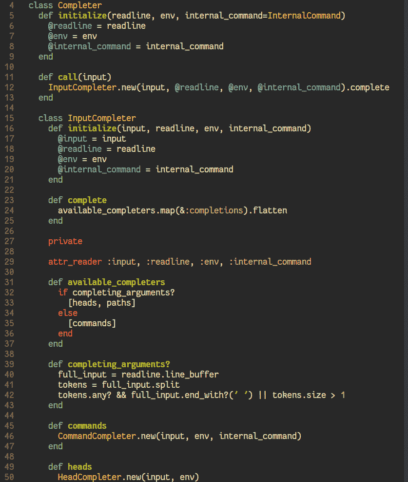

# Gruvbox

> 原文： [https://dev.to/scottw/gruvbox-4d40](https://dev.to/scottw/gruvbox-4d40)

最近开始使用 [Gruvbox](https://github.com/morhetz/gruvbox) 主题。

我喜欢它有深色和浅色两种选择。它自称对比度比曝晒好，我不得不同意(嗯，至少看起来感觉更好)。

对于黑暗和光明的选择，我觉得最舒服的是对比度的`hard`选项。适合深色、软质和中号。为了光明，努力工作。

将它与 Fire Code Retina 混合在一起，一切感觉都是全新的。