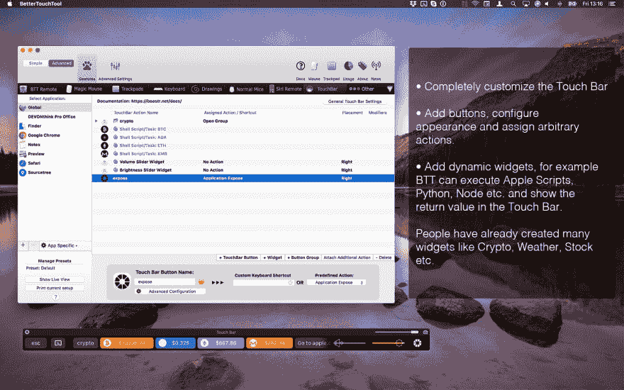
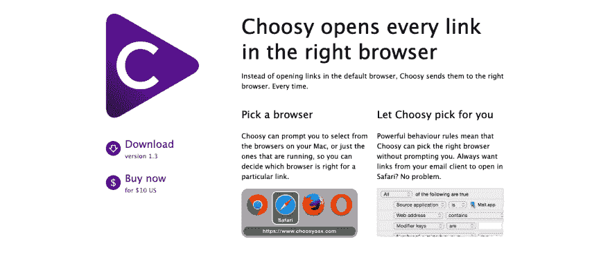
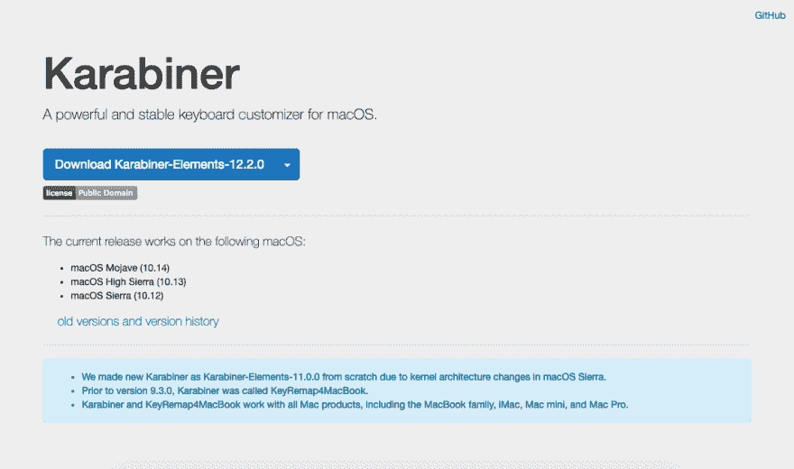
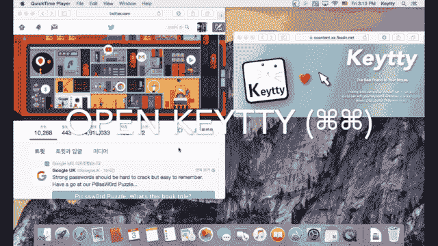
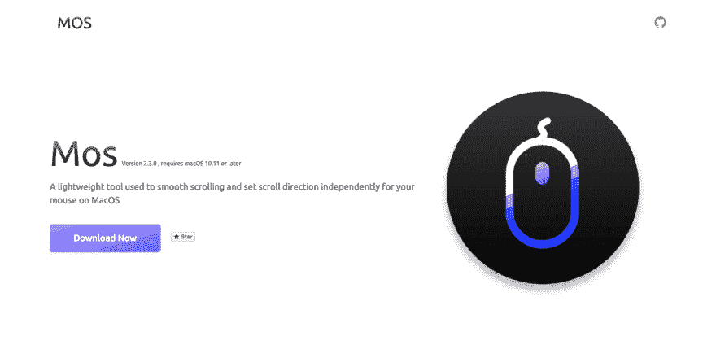
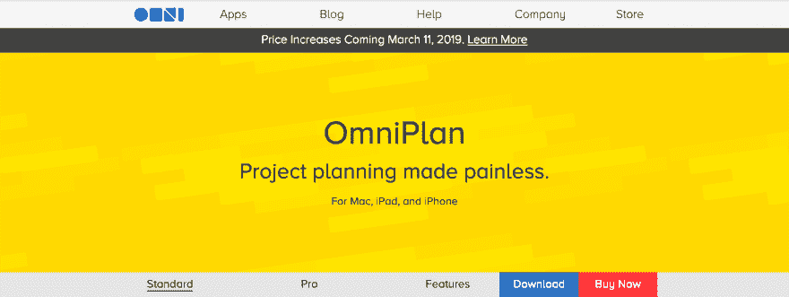
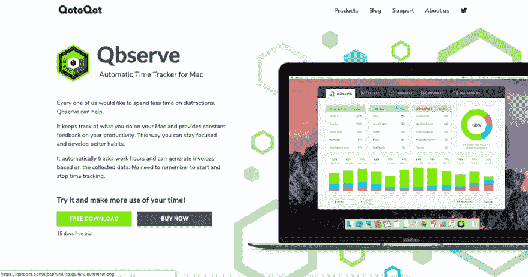
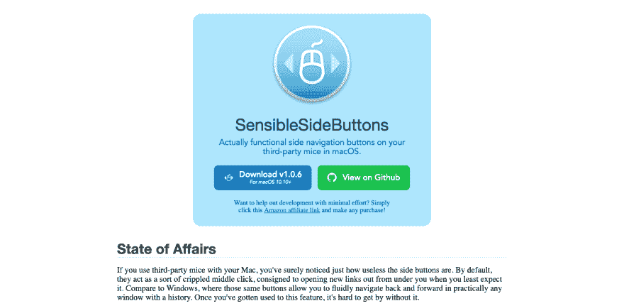
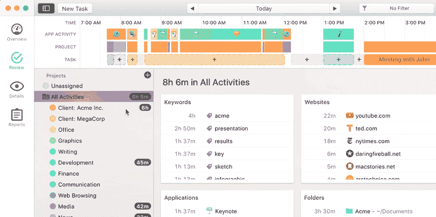
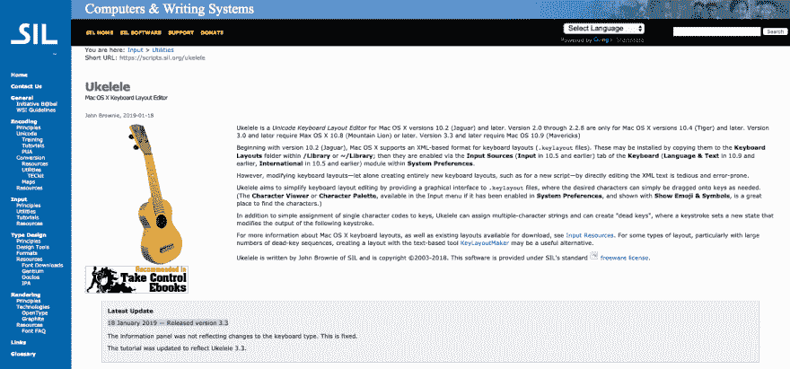

# 适用于 MacBook 的生产力工具

> 原文：<https://dev.to/iankurbiswas/productivity-tools-for-your-macbook-46ed>

嘿，伙计们，我又回来了，我会在这里列出一些你们可能知道也可能不知道的 MacBook 生产力工具。这份工具清单是按字母顺序排列的。不要再拖延了，让我们开始吧🏃🏻‍♂️

阿尔弗雷德

Alfred 是一款屡获殊荣的应用程序，它通过热键、关键字、文本扩展等提高了效率。搜索您的 Mac 和 web，并通过自定操作更高效地控制您的 Mac。

[更好的触摸工具](https://folivora.ai/)

这是一个非常棒的功能丰富的应用程序，允许您为 Magic Mouse、Macbook Trackpad、Magic Trackpad 配置许多手势，还可以为普通鼠标配置鼠标手势。

[挑剔](https://www.choosyosx.com/)

UI、URL API 和浏览器扩展集，用于管理在何处以及如何打开链接的规则。它可以提示您从 Mac 上的浏览器中进行选择，因此您可以决定哪个浏览器适合特定的链接。

[登山扣](https://pqrs.org/osx/karabiner/index.html)

OS X 的强大而稳定的键盘定制程序。

[键盘大师](http://www.keyboardmaestro.com/main/)

基于来自键盘、菜单、位置、添加的设备等的触发器自动执行日常操作。

[Keytty](https://keytty.com/)

让你的手放在键盘上。移动，点击，滚动，拖动和更多的几个笔画。

[Mos](https://mos.caldis.me/)

一个简单的工具可以在你的 Mac 上提供平滑滚动和反转鼠标滚动方向。

[OmniPlan](https://www.omnigroup.com/omniplan/)

可视化、维护和简化项目的最佳方式。项目管理变得简单。

[Qbserve](https://qotoqot.com/qbserve/)

时间跟踪自动化:自由职业者项目跟踪，时间表，发票和实时生产力反馈。

[感性侧按钮](https://sensible-side-buttons.archagon.net/)

在许多应用程序中，如在 Windows 中，使用鼠标上的侧键来前后移动。

[定时](https://timingapp.com/)

Mac 的自动时间和生产力跟踪。帮助您保持工作进度，并确保如果您按小时计费，不会损失计费时间。

特雷罗

一个协作工具，可以将您的项目组织成多个板块。

[尤克里里](http://scripts.sil.org/ukelele)

Unicode 键盘布局编辑器。

名单上的人都到此为止。希望你觉得有用。如果你喜欢这篇文章，那么别忘了和你的朋友分享，如果你发现了你以前没有听说过的应用程序，那么别忘了在下面的评论里和我提一下。