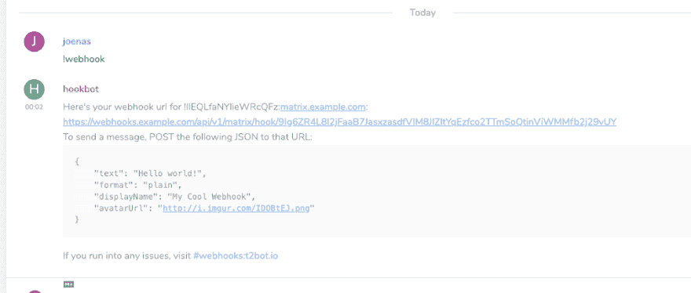
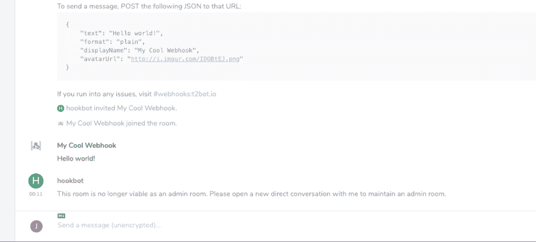

# 将 webhooks 添加到矩阵

> 原文：<https://dev.to/joenas/adding-webhooks-to-matrix-396n>

[](https://res.cloudinary.com/practicaldev/image/fetch/s--MGHf5iAa--/c_limit%2Cf_auto%2Cfl_progressive%2Cq_auto%2Cw_880/https://jonnev.se/conteimg/2019/02/Screenshot-2019-02-26-at-00.03.38-1.png)

现在你有了自己的[主服务器](https://dev.to/joenas/matrix-homeserver-synapse-v09911-with-traefik-35ja)你想要一些集成，对吗？Webhooks 似乎是一个很好的起点——它非常容易设置，并且用例几乎是无限的。

举几个例子，我在 [Huginn](https://dev.to/joenas/my-two-favourite-services-30km-temp-slug-492995) 中有几个场景可以发布明天的天气，来自各个[子区](https://www.reddit.com/me/m/devsnack/)的热门帖子和来自 Grafana 的提醒。

在本指南中，我们将使用一个[应用服务](https://matrix.org/docs/guides/application_services.html)(👈*如果你还没有*调用[matrix-appservice-webhooks](https://github.com/turt2live/matrix-appservice-webhooks)来通过发布命令将 web hooks 添加到房间，请阅读这篇文章。它有一个 Docker 图像，所以它正好适合我的标准 Traefik 设置。如果你的突触没有像我的[一样建立起来，你必须做一些调整。](https://dev.to/joenas/matrix-homeserver-synapse-v09911-with-traefik-35ja)

## 设置

首先，让我们获取 appservice 所需的文件。

```
cd /opt/matrix # or wherever your stuff is 
mkdir matrix-appservice-webhooks
cd matrix-appservice-webhooks
curl https://raw.githubusercontent.com/turt2live/matrix-appservice-webhooks/master/config/database.json -o database.json
curl https://raw.githubusercontent.com/turt2live/matrix-appservice-webhooks/master/config/sample.yaml -o config.yaml 
```

然后我们替换`database.json`中的路径...

```
sed -i 's/db\//\/data\//' database.json 
```

...所以它看起来像这样。

```
{
  "defaultEnv": {
    "ENV": "NODE_ENV"
  },
  "development": {
    "driver": "sqlite3",
    "filename": "/data/development.db"
  },
  "production": {
    "driver": "sqlite3",
    "filename": "/data/production.db"
  }
} 
```

我们编辑`config.yaml`...

```
nano config.yaml 
```

...并输入 Synapse 的(内部)URL——可通过我们的 Docker 网络访问——我们的 webhooks 和 Matrix 域名的公共 URL。

```
homeserver:
  # The name here is from docker-compose.yaml
  url: "http://synapse:8008"

  # Domain for you matrix server, with subdomain if needed
  domain: "example.com"

web:
  # This domain will be proxied via Traefik
  hookUrlBase: 'https://webhooks.example.com'
  # Because we're in a container
  bind: '0.0.0.0' 
```

☝️我只包括了本指南需要更改的设置。根据文件中的注释编辑其他内容，并记住替换`example.com`。

### 登记文件

然后我们需要生成一个注册文件，通过`homeserver.yaml`添加到 Synapse 中。

```
docker run --rm \
  -v /opt/matrix/matrix-appservice-webhooks:/data \
  turt2live/matrix-appservice-webhooks \
  node index.js -r \
  -f /data/appservice-registration-webhooks.yaml \
  -u "http://webhooks:9000" \
  -c /data/config.yaml 
```

现在，在 appservice 目录中应该有一个名为`appservice-registration-webhooks.yaml`的文件。将该文件复制到 Synapse 目录中(在我的例子中是 T1)。

```
sudo cp appservice-registration-webhooks.yaml ../synapse 
```

在您的`homeserver.yaml`中添加/编辑下面一行，以便 Synapse 能够识别 appservice。

```
app_service_config_files: ['/data/appservice-registration-webhooks.yaml'] 
```

### 码头工-化合物

是时候将容器添加到我们的`docker-compose.yaml`中了。

```
 webhooks:
    image: turt2live/matrix-appservice-webhooks
    restart: unless-stopped
    depends_on:
      - synapse
    networks:
      - web
      - default
    volumes:
      - "/opt/matrix/matrix-appservice-webhooks:/data"
    labels:
      - "traefik.enable=true"
      - "traefik.frontend.rule=Host:webhooks.example.com"
      - "traefik.port=9000"
      - "traefik.docker.network=web" 
```

☝️:如果你遵循了我之前的指南，这就足够了。记得更换`example.com`。

现在我们已经准备好开始服务了。

```
docker-compose up -d webhooks
docker-compose restart synapse 
```

### 给房间添加挂钩

去一个你想要有一个网络钩子的房间，邀请机器人用户`@_webhook:example.com`(如果你在`config.yaml`中改变了它，调整手柄)，在房间里发送消息`!webhook`，你应该看到这样的东西👇

[](https://res.cloudinary.com/practicaldev/image/fetch/s--UrC-L7O---/c_limit%2Cf_auto%2Cfl_progressive%2Cq_auto%2Cw_880/https://jonnev.se/conteimg/2019/02/Screenshot-2019-02-26-at-00.03.38.png)

### 发帖挂勾

用一个类似[失眠](https://insomnia.rest) / [邮差](https://www.getpostman.com)的应用测试你的 webhook，或者直接用`curl`。

```
curl --header "Content-Type: application/json" \
     --data '{
       "text": "Hello world!",
       "format": "plain",
       "displayName": "My Cool Webhook",
       "avatarUrl": "http://i.imgur.com/IDOBtEJ.png"
     }' \
   YOUR_URL 
```

[](https://res.cloudinary.com/practicaldev/image/fetch/s--ojB6l21F--/c_limit%2Cf_auto%2Cfl_progressive%2Cq_auto%2Cw_880/https://jonnev.se/conteimg/2019/02/Screenshot-2019-02-26-at-00.11.57.png)

### 更新钩子

你第一次发布 appservice 会邀请一个*虚拟用户*使用你设置的名字和头像。如果你在随后的帖子中更改了`displayName`，另一个用户将会加入，如果你更改了`avatarUrl`而不是`displayName`，头像将会更新。

就是这样！玩得开心🎉