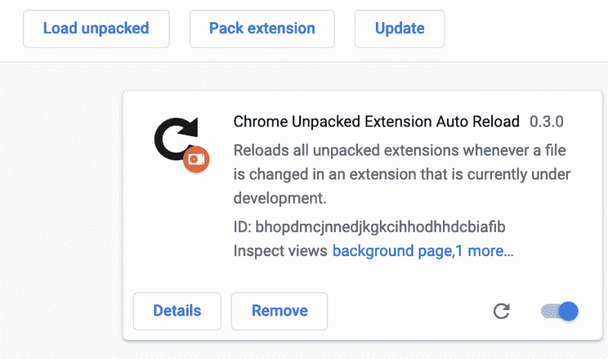

# 如何从任何地方重新加载你的 Chrome 扩展！

> 原文：<https://dev.to/solomon/reloading-your-unpacked-chrome-extensions-on-save-from-anywhere-884>

在 DEV 上有一个非常酷的 Chrome 扩展我[评论了](https://dev.to/sgvictorino/comment/91dc)叫做“重新加载扩展”，它让我避免了加载扩展的错误(除了重新加载未打包的扩展的一般不便之外):

[ ](/solomon) [ Solomon ](/solomon) • [<time datetime="2019-02-23T22:55:47Z"> Feb 23 '19 </time>](https://dev.to/solomon/comment/92b9) 

没错。尤其是当我启用/加载一个扩展后，扩展图标没有更新时(我认为这是无意的行为)，我只需进入 [reload.extensions](http://reload.extensions) ，一切都按预期工作！

但是对于我们这些有抱负的扩展开发人员来说，它会变得更加方便:

[ ](/kinghat) [ kinghat ](/kinghat) • [<time datetime="2019-02-23T22:48:44Z"> Feb 23 '19 </time>](https://dev.to/kinghat/comment/92b7) 

您是否使用扩展重新加载器 url 来自动重新加载？

(感谢 [@kinghat](https://dev.to/kinghat) 对本帖研究的协助！)

# 要求

让我们回到最基本的！

您需要安装以下软件:

*   [去](https://git-scm.com)
*   [一个文本编辑器](https://code.visualstudio.com/Download)
*   [谷歌 Chrome](https://www.google.com/chrome) 、[勇敢](//brave.com)、[维瓦尔第](https://vivaldi.com)，或者任何支持安装 Chrome 扩展的浏览器。

# 指令

## 分机

在您的[终端](https://hyper.is)中运行以下命令，构建一个[杰罗姆·戴恩](https://github.com/JeromeDane)的`chrome.management`扩展源代码的基于 API 的分支的副本:

```
git clone https://github.com/JeromeDane/chrome-extension-auto-reload
cd chrome-extension-auto-reload
npm install npm audit fix
npm run build 
```

Enter fullscreen mode Exit fullscreen mode

现在，将`chrome-extension-auto-reload/build/`的内容作为未打包的扩展加载到 Chrome 中，并像这样配置它:

*   使用地址栏导航到 [chrome://extensions](https://dev.tochrome://extensions) 。
*   如果你还没有的话，打开右上角的“开发者模式”。
*   点击“Load Unpacked ”,浏览到我们之前生成的`build`目录。
*   单击图 1 中的“详细信息”按钮。 *图 1:带有“详情”按钮的扩展卡。*
*   滚动到“扩展选项”链接并点击它。
*   在页面顶部，将“重新加载方法”下拉列表更改为“管理 API”。这使得它可以与最新版本的 Chrome 上的所有扩展脚本一起工作。

## 你的项目

导航到您的扩展项目的目录，创建一个名为`gulpfile.js`的新文件，并将以下内容粘贴到其中:

```
var gulp = require("gulp");
var watch = require("gulp-watch");
var io = require("socket.io");

gulp.task("chrome-watch", function() {
  var WEB_SOCKET_PORT = 8890;
  io = io.listen(WEB_SOCKET_PORT);
  watch("**/*.*", function(file) {
    io.emit("file.change", {});
  });
}); 
```

Enter fullscreen mode Exit fullscreen mode

将`Gulpfile`的依赖项安装到您的扩展项目中，如下所示:`npm install gulp gulp-watch socket.io --save-dev`。假设它还不是一个节点项目，您需要运行`npm init`并首先填写要放入`package.json`的元数据。

跑步`npx gulp chrome-watch`尽情享受！

* * *

感谢阅读！

如果你从这篇文章中获得了一些知识，请按下那个❤️按钮奇数次。

# 来源

*   [https://github.com/JeromeDane/chrome-extension-auto-reload](https://github.com/JeromeDane/chrome-extension-auto-reload)
*   与 [@kinghat](https://dev.to/kinghat) 关于我之前在[发的关于这个话题的帖子](https://blog.solomonvictorino.com/reload-chrome-extensions-on-save-vs-code/)的对话。