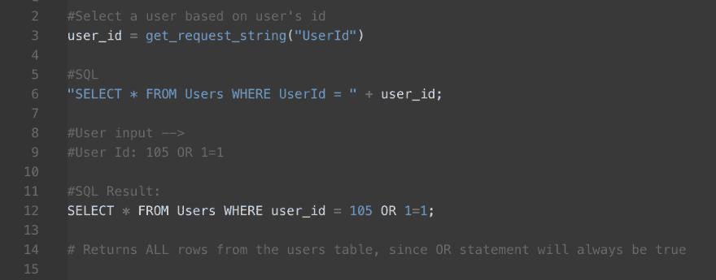
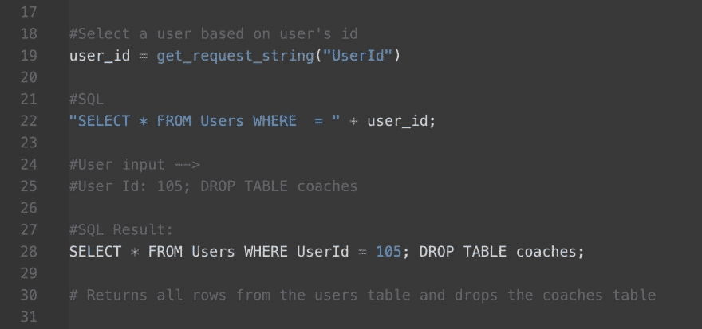
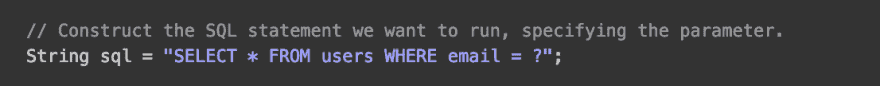
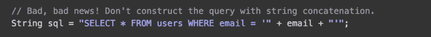

# 防止 SQL 注入

> 原文：<https://dev.to/crishanks/prevent-sql-injections-c6o>

## 保护您的数据免受恶意用户输入的影响

现在是 3019 年，自然地，所有的运动员都是机器人。你已经设定每个机器人球员接受教练的指令，以执行精心编排的比赛。

一个例子可能是这样的:

球员(教练输入)做(教练输入)。玩家(教练输入然后做(教练输入)。

比如:玩家 **12** 、 **传*给玩家 _ 6*** *。玩家 **6** ，__ 运行 模式 4 _ 。*

 *但坏消息是。蔻驰很不高兴，因为他的球员在上周大胜后出现故障，没有把黄色运动饮料倒在他身上！他心怀不满，将以下指令输入到您的程序中:

球员 **8** ， **转身将球坠入椽子** 。球员 **7、3、4、12** 、 **g o 到更衣室想想自己做了什么** 。

由于机器人玩家没有受到这些输入的保护，他们执行了这些输入！现在你和整个教练组都被解雇了，没有人得到任何有色运动饮料。

### 什么是 SQL 注入？

SQL(结构化查询语言)是一种特殊的编程语言，用于与数据库通信并告诉它做什么。SQL 可以用来告诉数据库创建、读取、更新和销毁数据(CRUD)。当用户在输入字段中输入 SQL 命令时(例如用户名、密码、电子邮件等典型的登录信息。)，它将被你的程序读取，并完全按照你的程序执行。如果不加保护，您的程序会与有害的输入交互，并错误地允许它向数据库发送非预期的命令。

### 那些讨厌的黑客

让我们看一个例子。蔻驰对自己最近的职业状态并不满意，抑郁症让他几乎不可能在朋友的粉丝博客上保持 100 分。三个星期和 15 磅后，他期待着国家机器人运动联盟(NRSL)的报复。

蔻驰知道 NRSL 网站的登录页面有一个简单的用户 Id 输入字段。代码被设置为接收该字符串并将其赋给一个变量，然后该变量将用于运行一个简单的 SQL 查询。它可能看起来像这样:

用户输入的字符串是 105 或 1=1，这将始终为真。你猜怎么着？蔻驰刚刚获得了每个用户所有列中的所有数据！这可能意味着密码、信用卡信息和其他私人信息。

让我们看另一个例子。

在联邦探员出现之前，蔻驰会合作。但是他复仇的欲望就像瑞秋-罗斯的爱情一样不稳定。他重新登录 NRSL 网站，查看用户输入字段。这一次，他的输入如下所示:

因为他们没有受到 SQL 注入的保护，所以没有人能在 NRSL 当教练！

### 会有多糟？

尽管 SQL 注入在 15 年前就被发现了，但它仍然是网站和应用程序最普遍的威胁之一。最近，Motherboard 报道[网络罪犯能够使用 SQL 注入登录堡垒之夜，这是我们这个时代最流行的视频游戏之一，并接管任何玩家的账户。](https://motherboard.vice.com/en_us/article/vba5nb/fornite-login-hack-epic-games-website)流氓媒体实验室发现[黑客获得了数百份客户护照](https://roguemedialabs.com/2018/12/20/atlanta-international-airport-hacked-617-57-kb-of-data-including-700-passports-leaked-online/)。这些只是最近的几个例子。在没有保护的情况下，任何试图向你的程序输入数据的人都可以(有意或无意地)绕过密码等受保护的字段来访问私人信息(信用卡号、电子邮件地址等)。)，更改数据库中的数据，删除表，甚至控制整个系统。正如我们在未来的运动类比中了解到的，SQL 注入会要求我们的程序执行令人尴尬的有害命令，并带来严重后果。

### **防范 SQL 注入**

有几个方法可以保护我们自己不受报复的教练和其他使用 SQL 注入的黑客的攻击。

*   使用 SQL 参数允许我们使用“？”并传入一个参数，而不是使用字符串连接。

######  [截图来自 hacksplaining.com](https://www.hacksplaining.com/prevention/sql-injection)

*   提供的 ActiveRecord 方法是用受保护的代码预先构建的。使用类似“find_or_create_by”的方法，而不是类似“where”的 SQL 查询。
*   清洁你的琴弦。换句话说，用户名输入“1=1”似乎很可疑...我们可以运行逻辑来检查和拒绝奇怪的输入。例如，[使用正则表达式来匹配电子邮件输入的](https://medium.com/factory-mind/regex-tutorial-a-simple-cheatsheet-by-examples-649dc1c3f285)。确保字母数字字段输入不包含任何符号。去掉任何空白。甚至还有像 sanitize 这样很酷的[宝石可以帮忙。](https://apidock.com/rails/ActionView/Helpers/SanitizeHelper/sanitize)

SQL 注入不会很快消失。不满的教练也不会。聪明点，使用保护措施。*