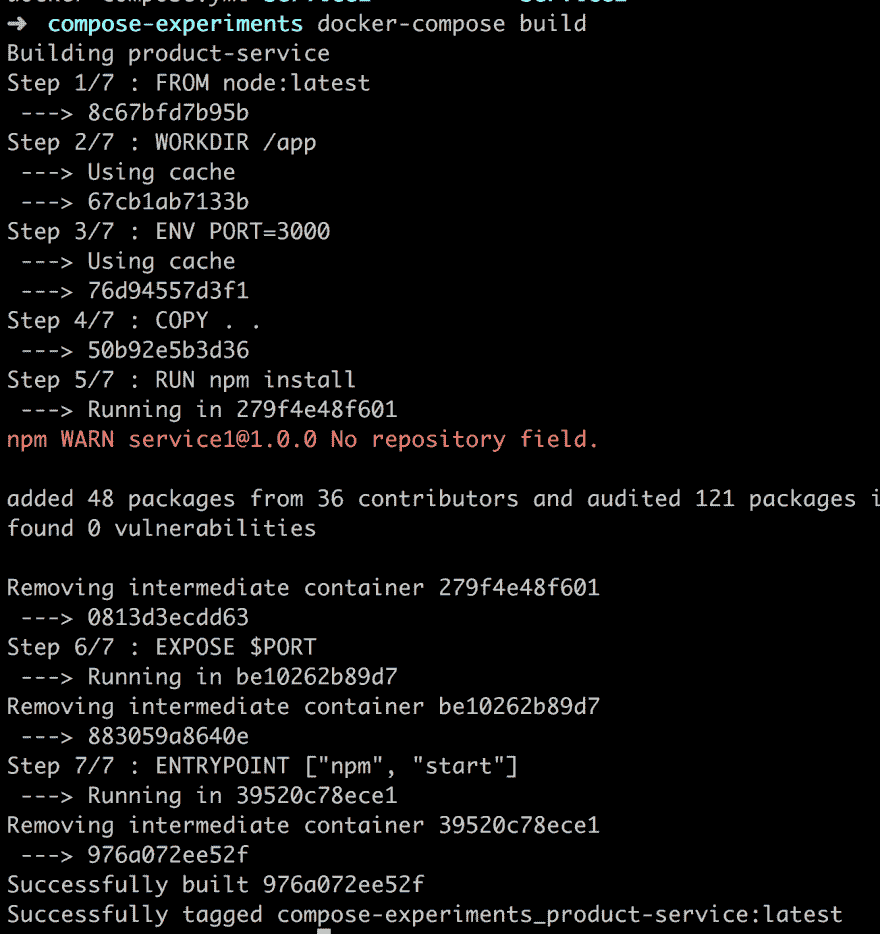

# 学习 Docker -从头开始，第四部分 Docker-撰写基础

> 原文：<https://dev.to/azure/docker-from-the-beginning-partiv-mi6>

在 [Twitter](https://twitter.com/chris_noring) 上关注我，很乐意接受您对主题或改进的建议/Chris

本文是系列文章的一部分:

*   从一开始，第一部分，这包括:为什么是 Docker，它是如何工作的，并涵盖了基本概念，如图像，容器和 Docker 文件的用法。它还介绍了一些关于如何管理上述概念的基本 Docker 命令。
*   [Docker -从一开始，第二部分](https://dev.to/softchris/docker-from-the-beginning---part-ii-5g8n)，这是关于学习卷，它们是什么，它们如何为你工作，主要是它们将如何创建一个惊人的开发环境
*   从一开始，第三部分，这部分是关于理解如何在一个容器化的环境中使用数据库，在这样做的时候，我们需要学习链接和网络
*   码头工人-从开始，第四部分，我们在这里
*   [Docker -从第五部分](https://dev.to/softchris/dockerfrom-the-beginning-part-v-n2c)开始，这部分是 Docker Compose 的第二部分，也是最后一部分，我们将讨论卷、环境变量以及如何使用数据库和网络

> 这一部分是关于处理两个以上的码头集装箱。当你有如此多的容器需要管理时，你最终会感到难以管理。你只能一直输入 docker run 到某个点，一旦你开始旋转多个容器，只会伤到你的头和手指。为了解决这个问题，我们有 Docker Compose。

TLDR；Docker Compose 是一个庞大主题，因此本文分为两部分。在这一部分中，我们将描述 Docker 为什么在它发光时进行合成和显示。在 Docker Compose 的第二部分，我们将讨论更高级的主题，如环境变量、卷和数据库。

在这一部分，我们将涵盖:

*   **为什么 docker compose** ，重要的是要理解，至少在高层次上，有两种主要的架构整体和微服务，docker compose 确实有助于管理后者
*   **特性**，我们将解释 Docker Compose 支持哪些特性，这样我们就会明白为什么它如此适合我们选择的微服务架构
*   **当 Docker 不够用的时候**，我们将解释在什么时候使用 Docker 命令变得乏味和痛苦，以及在什么时候使用 Docker Compose 变得越来越有吸引力
*   **在动作**中，最后我们将从头构建一个 docker-compose.yaml 文件，并学习如何使用 Docker Compose 和一些核心命令来管理我们的容器

## 资源

使用 Docker 和容器化就是将一个整体分割成多个微服务。在整个系列中，我们将学习掌握 Docker 及其所有命令。迟早您会想要将您的容器带到生产环境中。这个环境通常是云。当你觉得你已经有了足够的 Docker 经验时，看看这些链接，看看 Docker 是如何在云中使用的:

*   [云中的容器](https://docs.microsoft.com/en-gb/azure/containers/?wt.mc_id=academic-0000-chnoring)这是一个很棒的概述页面，展示了关于云中容器的其他信息
*   [在云中部署您的容器](https://docs.microsoft.com/en-gb/azure/container-instances/container-instances-tutorial-prepare-app?wt.mc_id=academic-0000-chnoring)教程展示了利用您现有的 Docker 技能并让您的服务在云中运行是多么容易
*   [创建容器注册表](https://docs.microsoft.com/en-gb/azure/container-instances/container-instances-tutorial-prepare-acr?wt.mc_id=academic-0000-chnoring)您的 Docker 映像可以在 Docker Hub 中，也可以在云中的容器注册表中。将您的图像存储在某个地方，并能够在几分钟内从该注册表创建一个服务，这不是很棒吗？

## 码头工为什么作曲

Docker Compose 是在我们需要独立管理许多服务时使用的。我们描述的是一种叫做微服务架构的东西。

### 微服务架构

让我们在这样的架构上定义一些属性:

*   **松耦合**，这意味着它们不依赖于另一个服务来运行，它们需要的所有数据就在那里。虽然它们可以与其他服务交互，但那是通过调用它们的外部 API，例如 HTTP 调用
*   **可独立部署**，这意味着我们可以在不直接影响其他服务的情况下启动、停止和重建它们。
*   高度可维护性和可测试性，服务很小，因此很少需要理解，并且因为没有依赖性，测试变得更简单
*   **围绕业务能力**组织，这意味着我们应该尝试寻找不同的主题，如预订、产品管理、计费等

我们也许应该从为什么我们想要这个架构这个问题开始。从上面列出的属性可以清楚地看出，它提供了很大的灵活性，依赖性很小甚至没有，等等。这听起来都是好事，那么这是所有应用都应该拥有的新架构吗？

一如既往，这要看情况。与整体架构相比，微服务在某些方面会大放异彩，例如:

*   **不同的技术堆栈/新兴技术**，我们有许多开发团队，他们都想使用自己的技术堆栈，或者想在不改变整个应用程序的情况下尝试新技术。让每个团队以他们选择的技术构建他们自己的服务，作为微服务架构的一部分。
*   **重用**，你真的想一次构建一个特定的功能，例如计费，如果它被分解到一个单独的服务中，它会更容易被其他应用程序重用。哦，在微服务架构中，您可以轻松组合不同的服务，并从中创建许多应用程序
*   **最小的故障影响**，当整体架构中出现故障时，它可能会导致整个应用程序停止运行，借助微服务，您可能能够更好地保护自己免受故障影响

关于为什么微服务优于整体架构，还有很多争论。有兴趣的读者不妨看看下面的[链接](https://www.cio.com/article/3201193/it-strategy/7-reasons-to-switch-to-microservices-and-5-reasons-you-might-not-succeed.html)。

### 为 Docker 撰写的案例

微服务架构的描述告诉我们，我们需要围绕业务功能组织的一系列服务。此外，它们需要能够独立部署，我们需要能够使用不同的技术堆栈和更多的东西。在我看来，这听起来像 Docker 将是一个伟大的适合一般。我们支持 Docker Compose 胜过 Docker 的原因仅仅是因为它的庞大规模。如果我们有两个以上的容器，我们需要输入的命令数量会突然以线性方式增长。让我们在下一节中解释 Docker Compose 的哪些特性使得它在服务数量增加时可以很好地扩展。

## Docker 撰写功能概述

现在，Docker Compose 使我们能够很好地扩展，我们可以很容易地一次构建几个映像，启动几个容器等等。功能的完整列表如下:

*   **管理**整个应用生命周期。
*   **启动**，停止并重建服务
*   **查看**运行服务的状态
*   **流**正在运行的服务的日志输出
*   **在服务上运行**一次性命令

正如我们所看到的，当我们需要管理由许多服务组成的微服务架构时，它照顾到了我们可能需要的一切。

## 当普通码头工人不再满足时

让我们回顾一下 Docker 是如何操作的，我们需要什么命令，让我们看看当我们添加一两个服务时，它会把我们带到哪里。

为了对某件事进行分类，我们知道我们需要:

*   定义一个 Dockerfile ,它包含我们需要的操作系统映像、我们需要安装的库、我们需要设置的 env 变量、需要打开的端口以及如何启动我们的服务
*   **构建一个映像**或从 Docker Hub 下载一个现有映像
*   **创建**并运行容器

现在，使用 Docker Compose 我们仍然需要使用 Dockerfile，但是 Docker Compose 会负责构建图像和管理容器。让我们用 plain Docker 来说明这些命令可能是什么样子:

> docker 建立一些图像名称。

然后

> 3000-name some-container-name some-image-name

这并不是一个可怕的工作量，但想象一下，你有三个不同的服务需要这样做，然后突然变成六个命令，然后你有两个以上的命令，这实际上并不可伸缩。

[](https://res.cloudinary.com/practicaldev/image/fetch/s--itHBniqi--/c_limit%2Cf_auto%2Cfl_progressive%2Cq_66%2Cw_880/https://thepracticaldev.s3.amazonaws.com/i/9zdbajjweos0erfkjl2h.gif)

### 输入码头-化合物。yaml

这是 Docker Compose 真正大放异彩的地方。您可以在一个文件中定义项目中的所有服务，而不是为您想要构建的每个服务键入两个命令，这个文件我们称为`docker-compose.yaml`。您可以在`docker-compose.yaml`文件中配置以下主题:

*   **Build** ，我们可以指定构建上下文和 Dockerfile 文件的名称，如果它不叫标准名称的话
*   **环境**，我们可以定义任意多的环境变量，并给它们赋值
*   **图像**，我们可以定义现成的图像，从 Docker Hub 下载并在我们的解决方案中使用，而不是从头开始构建图像
*   **网络**，我们可以创建网络，我们还可以为每个服务指定它应该属于哪个网络(如果有的话)
*   **端口**，我们还可以定义端口转发，即容器中哪个外部端口应该匹配哪个内部端口
*   **体积**当然，我们也可以定义体积

## 坞站在动作中复合

好了，现在我们知道 Docker Compose 可以处理我们在命令行上可以做的几乎所有事情，它还依赖于文件`docker-compose.yaml`来知道要执行什么操作。

### 编写对接器-compose.yml 文件

让我们试着创建这样一个文件，并给出一些说明。首先，让我们快速回顾一下典型的项目文件结构。下面我们有一个由两个服务组成的项目，每个服务都有自己的目录。每个目录都有一个包含如何构建服务的指令的`Dockerfile`。

它可能是这样的:

```
docker-compose.yaml
/product-service
  app.js
  package.json
  Dockerfile
/inventory-service
  app.js
  package.json
  Dockerfile 
```

Enter fullscreen mode Exit fullscreen mode

上面值得注意的是我们如何在项目的根目录下创建`docker-compose.yaml`文件。这样做的原因是，我们旨在构建的所有服务以及如何构建和启动它们应该在一个文件中定义，我们的`docker-compose.yml`。
好了，我们打开`docker-compose.yaml`，进入我们的第一行:

```
// docker-compose.yaml
version: '3' 
```

Enter fullscreen mode Exit fullscreen mode

现在，您在这里指定什么实际上很重要。目前，Docker 支持三个不同的主要版本。3 是最新的主要版本，在这里阅读不同版本的不同之处，因为它们支持不同的功能，它们之间的语法甚至可能不同 Docker 版本[官方文档](https://docs.docker.com/compose/compose-file/)
接下来让我们定义我们的服务:

```
// docker-compose.yaml
version: '3'
services:
  product-service:
    build:
      context: ./product-service
    ports:
      - "8000:3000" 
```

Enter fullscreen mode Exit fullscreen mode

好吧，一次就这么多，让我们来分解一下:

*   **services:** ，整个 docker-compose.yaml 文件中应该只有一个这样的。另外，请注意我们是如何以`:`结束的，我们需要它，否则它将不是有效的语法，对于任何命令来说都是如此
*   **产品-服务**，这是我们为自己的服务选择的名称
*   **构建:**，这是指导 Docker Compose 如何构建图像。如果我们已经有一个现成的图像，我们不需要指定这个
*   **上下文:**，这需要告诉 Docker Compose 我们的`Dockerfile`在哪里，在这种情况下，我们说它需要向下一级到`product-service`目录
*   **端口:**，这是端口转发，我们首先指定外部端口，然后指定内部端口

所有这些对应于下面两个命令:

```
docker build -t [default name]/product-service .
docker run -p 8000:3000 --name [default name]/product-service 
```

Enter fullscreen mode Exit fullscreen mode

嗯，这几乎是真的，我们还没有确切地告诉 Docker Compose 执行图像的构建或创建和运行容器。让我们从如何构建图像开始，了解如何做到这一点:

> docker 合成构建

上面将构建您在`docker-compose.yaml`中指定的每一个服务。让我们看看我们的命令的输出:

[](https://res.cloudinary.com/practicaldev/image/fetch/s--6_Zej_fI--/c_limit%2Cf_auto%2Cfl_progressive%2Cq_auto%2Cw_880/https://thepracticaldev.s3.amazonaws.com/i/gezojc19cb7cvlda0fcr.png)

在上面我们可以看到我们的映像正在构建中，我们还看到它被赋予了全名`compose-experiments_product-service:latest`，如最后一行所示。这个名字来源于我们所在的目录，即`compose-experiments`,另一部分是我们在`docker-compose.yaml`文件中给服务起的名字。
好的，至于旋转它，我们输入:

> 坞站-合成 up

这将再次读取我们的`docker-compose.yaml`文件，但这次它将创建并运行一个容器。我们还要确保在后台运行我们的容器，所以我们添加了标志`-d`，所以完整的命令现在是:

> 坞站-合成 up -d

好了，从上面我们可以看到我们的服务正在被创建。让我们运行`docker ps`来验证我们新创建的容器的状态:
它似乎在端口`8000`上启动并运行。让我们验证一下:
好的，我们去了码头，可以看到我们得到了一个集装箱。我们知道可以用 docker stop 或 docker kill 来关闭它，但是让我们用 docker-compose 的方式来做:

> 坞站-拨号

正如我们在上面看到的，日志说它正在停止并移除容器，它似乎为我们做了两项工作`docker stop [id]`和`docker rm [id]`，sweet :)
应该说，如果我们只想停止容器，我们可以使用:

> 坞站-组合停止

我不知道你怎么想，但是在这一点上，我准备停止使用`docker build`、`docker run`、`docker stop`和`docker rm`。Docker compose 似乎照顾到了整个生命周期:)

## 码头工人作曲炫耀

让我们简单回顾一下目前的情况。Docker compose 负责为我们管理服务的整个生命周期。让我们试着列出最常用的 Docker 命令，以及 Docker Compose 中相应的命令是什么样子的:

*   `docker build`变成了`docker-compose build`，Docker Compose 版本能够构建`docker-compose.yaml`中指定的所有服务，但是我们也可以指定它构建单个服务，因此如果我们愿意，我们可以进行更细粒度的控制
*   `docker build + docker run`变成了`docker-compose up`，这一次做了很多事情，如果你的图像之前没有被构建，它会构建它们，并且它还会从图像中创建容器
*   `docker stop`变成了`docker-compose stop`，这也是 Docker Compose 中的一个命令，如果我们给它一个容器作为参数，它可以用来停止所有的容器或特定的容器
*   `docker stop && docker rm`变为`docker-compose down`，这将首先停止容器，然后移除它们，以便我们可以重新开始

上述内容本身就很棒，但更棒的是，继续扩展我们的解决方案并向其添加越来越多的服务是多么容易。

## 构建出我们的解决方案

让我们再添加一个服务，看看它有多简单，伸缩性有多好。我们需要做到以下几点:

*   **在我们的`docker-compose.yaml`中添加**一个新的服务条目
*   **建立**我们的形象`docker-compose build`
*   **运行** `docker-compose up`

让我们看看我们的`docker-compose.yaml`文件，并为我们的下一个服务添加必要的信息:

```
// docker-compose.yaml

version: '3'
services:
  product-service:
    build:
      context: ./product-service
    ports:
      - "8000:3000"
  inventory-service:
    build:
      context: ./inventory-service
    ports:
        - "8001:3000" 
```

Enter fullscreen mode Exit fullscreen mode

好了，让我们启动并运行这些容器，包括我们的新服务:

> 坞站-合成 up

等等，你不是应该跑`docker-compose build`吗？实际上，我们不需要`docker-compose up`为我们做所有的事情，构建图像，创建和运行容器。

[](https://res.cloudinary.com/practicaldev/image/fetch/s--ju0EHktg--/c_limit%2Cf_auto%2Cfl_progressive%2Cq_66%2Cw_880/https://thepracticaldev.s3.amazonaws.com/i/09jstlay2u68e0uhhllw.gif)

注意，这并不简单，对于第一次构建+运行来说很好，因为之前没有映像。但是，如果您对服务进行了更改，需要重新构建，这意味着您需要先运行 docker-compose build，然后再运行 docker-compose up。

## 总结

这里是我们需要停止覆盖 Docker Compose 的前半部分的地方，否则会太多。我们已经能够涵盖 Docker Compose 背后的动机，并且我们得到了对微服务架构的轻量级解释。此外，我们讨论了 Docker 与 Docker Compose，最后，我们能够对比和比较 Docker Compose 命令与普通 Docker 命令。
因此，我们希望能够展示使用 Docker Compose 并在一个`docker-compose.yaml`文件中指定您的所有服务是多么容易。
我们确实说过 Docker 还有更多东西需要构建，比如环境变量、网络和数据库，但这些将在下一部分中介绍。