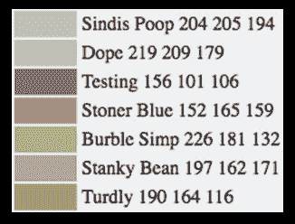
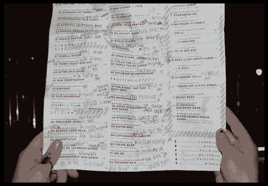
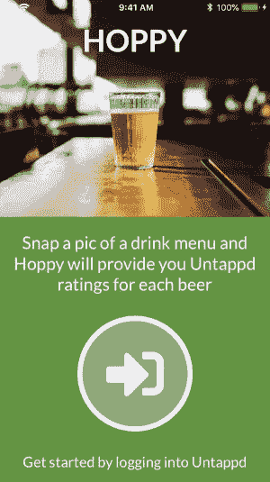
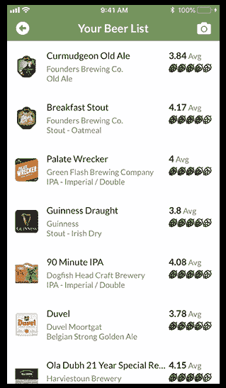
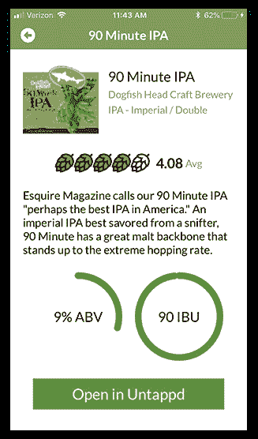

# 使用 ML Kit for Firebase 挖掘啤酒评级

> 原文：<https://dev.to/progress/using-ml-kit-for-firebase-to-tap-into-beer-ratings-2894>

在过去的一年里，机器学习已经成为主流。我们是怎么知道的？当我们让[计算机创造颜料颜色](https://arstechnica.com/information-technology/2017/05/an-ai-invented-a-bunch-of-new-paint-colors-that-are-hilariously-wrong/)时:

[](https://res.cloudinary.com/practicaldev/image/fetch/s--IDmVIj_a--/c_limit%2Cf_auto%2Cfl_progressive%2Cq_auto%2Cw_880/https://raw.githubusercontent.com/rdlauer/articles/master/nativescript/firebase-mlkit/paint-colors.png)

就像增强现实一样，我们仍然在共同努力开发最实用的 ML 应用。但是任何新技术的最佳应用都是解决现存的现实世界的问题。对我来说,(第一世界)最大的问题是决定喝哪种啤酒。

有多少次你走进餐馆或酒吧，被琳琅满目的啤酒菜单所包围，其中大约 5%你听说过？

[](https://res.cloudinary.com/practicaldev/image/fetch/s--N5QdBPLp--/c_limit%2Cf_auto%2Cfl_progressive%2Cq_auto%2Cw_880/https://raw.githubusercontent.com/rdlauer/articles/master/nativescript/firebase-mlkit/beer-menu.png)

我认为创建一个移动应用程序最符合我的兴趣，它可以让我利用:

*   [NativeScript](https://www.nativescript.org/) 用 JavaScript 创建原生跨平台移动 app
*   [ML Kit for Firebase](https://firebase.google.com/docs/ml-kit/) 读取菜单并返回啤酒名称；
*   [un tapd](https://untappd.com/)提供详细的啤酒信息和评级。

## 为什么是 NativeScript？

NativeScript 是一个免费的开源框架，允许您从一个代码库为 iOS 和 Android 创建真正的原生移动应用程序。您可以使用已经掌握的 web 技能(JavaScript/TypeScript/Angular/vue . js、CSS 和一种类似 HTML 的标记语言)来创建高性能应用程序。

> 如果你听说过 React Native，你可以认为 NativeScript 是 React Native，但对于 Angular 或 Vue.js

我是技能重用的忠实粉丝(现在没人有时间做 Swift 和 Java 开发了！)而且我还是一个 JavaScript 纯粹主义者，所以 NativeScript 很适合我。

举个简单的例子，您可以看到 NativeScript 的标记语法如何让您通过一种一致的标记语言来利用本机 UI 元素:

```
 <Page loaded="pageLoaded">
        <Label text="Hello ML Kit!" class="content" />
        <Button text="OK!" />
    </Page> 
```

Enter fullscreen mode Exit fullscreen mode

...CSS 也是如此:

```
 Button {
        font-size: 32;
        color: orange;
    }

    .content {
        font-family: Lato;
        background-color: purple;
    } 
```

Enter fullscreen mode Exit fullscreen mode

## 为什么要 ML 套件？

尽管机器学习仍处于起步阶段，但我们已经学会相信谷歌在尖端技术方面的无限智慧。NativeScript 有一个[健壮的 Firebase 插件](https://market.nativescript.org/plugins/nativescript-plugin-firebase)，包括[对 ML 套件的支持](https://github.com/EddyVerbruggen/nativescript-plugin-firebase/blob/master/docs/ML_KIT.md)，这并没有坏处！

[](https://res.cloudinary.com/practicaldev/image/fetch/s--TrqHdOUJ--/c_limit%2Cf_auto%2Cfl_progressive%2Cq_auto%2Cw_880/https://raw.githubusercontent.com/rdlauer/articles/master/nativescript/firebase-mlkit/nativescript-firebase.png)

如果你不熟悉 [ML Kit](https://firebase.google.com/docs/ml-kit/) ，它是一个 SDK，将谷歌的机器学习能力释放到移动应用程序中。它相对容易集成，并且不需要神经网络知识。

作为一个专注于移动的机器学习 SDK，ML Kit 支持基于设备和基于云的数据模型，在需要时提供简单的离线功能。

## 为什么不使用 pd？

选择有助于你实现技术目标的框架和服务当然很好，但是现在没有数据的应用什么都不是。因此，当我们查看检索啤酒相关数据时，我们在 [RateBeer](https://www.ratebeer.com/) 、 [BeerAdvocate](https://www.beeradvocate.com/) 和[un tapd](https://untappd.com/)中有一些选择。

经过一点分析，unset PD 是显而易见的选择。这不仅是一个非常受欢迎的啤酒评论服务，而且它有一个记录良好的(免费的)API 。🍻

## App 如何工作

对于这个应用程序，我们将利用 ML Kit 的[文本识别 API](https://firebase.google.com/docs/ml-kit/recognize-text)。是的，这有点像 OCR，但更酷，因为我们可以说我们正在使用机器学习！

> 如果你对我即将向你展示的应用程序的完整源代码感兴趣，你可以[查阅这个 GitHub repo](https://github.com/rdlauer/hoppy) 。

*app 的简化流程为:*

拍照- > ML 工具包处理图片->从未开发的 pd 获取啤酒信息

*我们先来看看它在 iOS 上的运行:*

[](https://res.cloudinary.com/practicaldev/image/fetch/s--0s1PE758--/c_limit%2Cf_auto%2Cfl_progressive%2Cq_66%2Cw_880/https://raw.githubusercontent.com/rdlauer/articles/master/nativescript/firebase-mlkit/hoppy-example.gif)

> 请注意，啤酒识别很大程度上取决于给定菜单上文本的清晰度和样式！如果你在大多数菜单上只找到 30-40%的匹配，不要惊讶...

## 步步为营

### 用 NativeScript 拍照

我们将使用 NativeScript [相机模块](https://docs.nativescript.org/hardware/camera)拍摄一张啤酒菜单的照片。您可以将 NativeScript 模块视为对原生 iOS 和 Android APIs 的抽象。

```
 import { Image } from "ui/image";

    camera.takePicture().
        then((imageAsset) => {
            console.log("Result is an image asset instance");
            var image = new Image();
            image.src = imageAsset;
        }).catch((err) => {
            console.log("Error -> " + err.message);
        }); 
```

Enter fullscreen mode Exit fullscreen mode

### 调用 ML 套件文本识别 API

一旦我们捕获了图像，我们需要将图像文件发送到 Firebase 进行文本识别分析。下面是我们如何在应用程序中处理这个问题:

```
 export function takePicture() {
      camera
        .takePicture()
        .then(imageAsset => {

          const source = new imageSourceModule.ImageSource();

          source.fromAsset(imageAsset).then(imageSource => {
            firebase.mlkit.textrecognition
              .recognizeTextCloud({
                image: imageSource,
                modelType: 'latest', // default "stable"
                maxResults: 10 // default 10
              })
              .then(function(result) {
                // `result` is a line-by-line output of text
                // in the app we use some regex here to filter out prices and other invalid responses

                let beers = result.split('\n');

                for (let i = 0; i < beers.length; i++) {
                  // hit the Untappd API here!
                }
              })
              .catch(function(errorMessage) {
                // log the ML Kit error to Crashlytics
                console.log('MLKIT ERROR: ' + errorMessage);
                firebase.sendCrashLog({
                  message: 'Error with ML Kit: ' + errorMessage,
                  showInConsole: true
                });
              });
          });
        })
        .catch(function(err) {
          // show a native alert to the user
          alert({
            title: 'Camera Issue!',
            message: err.message,
            okButtonText: 'OK',
            cancelable: false
          });
        });
    } 
```

Enter fullscreen mode Exit fullscreen mode

> 敏锐的眼睛会注意到我们也在使用 [Firebase Crashlytics](https://firebase.google.com/docs/crashlytics/) 进行错误记录。 [NativeScript Firebase 插件](https://github.com/EddyVerbruggen/nativescript-plugin-firebase/blob/master/docs/CRASHREPORTING.md)也支持 Crashlytics。

如前所述，ML Kit 允许我们使用设备上或基于云的文本识别。在本例中，我们使用的是`recognizeTextCloud`，但是您也可以换入`recognizeTextOnDevice`。您甚至可以使用 NativeScript 的[连接模块](https://docs.nativescript.org/ns-framework-modules/connectivity)来确定您的用户是否在线，从而使用适当的 ML 套件文本识别 API:

```
 const connectionType = connectivityModule.getConnectionType();

    switch (connectionType) {
        case connectivityModule.connectionType.none:
            // Use recognizeTextOnDevice
            break;
        case connectivityModule.connectionType.wifi || connectivityModule.connectionType.mobile:
            // Use recognizeTextCloud
            break;
        default:
            break;
    } 
```

Enter fullscreen mode Exit fullscreen mode

除了*文本*，ML Kit 还返回*边界多边形*数据，向您显示它在图像上识别文本的位置。潜在的增强现实应用任何人！？

### 调用未开发的 API

为了避免上面荒谬的代码量，我确实在使用 unset PD API 的地方放了一个注释占位符。这些 API 调用相对简单。

首先，我们需要执行啤酒搜索，看看从 ML Kit 返回的文本是否实际上是啤酒名称:

```
https://api.untappd.com/v4/search/beer/?q=" + beer + "&client_id=<CLIENT_ID>&client_secret=<CLIENT_SECRET>&access_token=" + access_token 
```

Enter fullscreen mode Exit fullscreen mode

为了澄清起见，`beer`是我们要检查的啤酒名称，`client_id`和`client_secret`是您在向 unset PD 注册应用程序后获得的密钥，`access_token`是您的用户登录 unset PD 时提供的身份验证令牌。

> **注意:**你可以选择*不*验证你的终端用户，但是 API 调用被限制在 100/app/小时。

如果 API 调用返回一个结果，那么我们必须再调用*另一个* API 来获取更多关于啤酒的详细信息:

```
 https://api.untappd.com/v4/beer/info/" + result.bid + "?compact=true&client_id=<CLIENT_ID>&client_secret=<CLIENT_SECRET>&access_token=" + access_token 
```

Enter fullscreen mode Exit fullscreen mode

同样，在这种情况下,`result.bid`只是从我们的第一个 API 调用返回的啤酒 id。

这将为我们返回一个很好的 JSON 格式的 resultset 来填充我们的 UI(为了便于阅读，下面是一个高度浓缩的版本)。

斑点牛是威斯康辛州微酿啤酒中最受欢迎的品种！🍺🐄

```
 {  
      "beer":{  
         "bid":3770,
         "beer_name":"Spotted Cow",
         "beer_label":"https:\/\/untappd.akamaized.net\/site\/beer_logos\/beer-SpottedCow_3770.jpeg",
         "beer_abv":4.8,
         "beer_ibu":18,
         "beer_description":"You know you're in Wisconsin when you see the Spotted Cow.",
         "beer_style":"Saison \/ Farmhouse Ale",
         "rating_count":139674,
         "rating_score":3.8887,
         "stats":{  
            "total_count":349790,
            "monthly_count":3107,
            "total_user_count":156283,
            "user_count":0
         },
        "brewery": {
          "brewery_id": 907,
          "brewery_name": "New Glarus Brewing Company",
          "brewery_type": "Micro Brewery",
          "brewery_label": "https://untappd.akamaized.net/site/brewery_logos/brewery-NewGlarusBrewingCompany_907.jpeg",
          "brewery_description": "Welcome to our quaint little brewery nestled on the outskirts of New Glarus, Wisconsin."
        }
      }
    } 
```

Enter fullscreen mode Exit fullscreen mode

然后，我们将结果集绑定到一个 [NativeScript ListView](https://docs.nativescript.org/ui/list-view) 以提供一个本地滚动列表(这里没有显示类属性以提高可读性)。

```
 <ListView items="{{ myBeers }}" itemTap="beerTap">
        <ListView.itemTemplate>
            <GridLayout rows="auto" columns="auto, *, auto">
                <Image row="0" col="0" src="{{ image }}" />
                <StackLayout row="0" col="1" >
                    <Label text="{{ name }}" />
                    <Label text="{{ brewery }}" />
                    <Label text="{{ style }}" />
                </StackLayout>
                <StackLayout row="0" col="2">
                    <StackLayout orientation="horizontal">
                        <Label text="{{ score }}" />
                        <Label text=" Avg" />
                    </StackLayout>
                    <StackLayout orientation="horizontal">
                        <!-- rating icons provided via background-image CSS property -->
                        <StackLayout class="{{ score_img_1 }}"></StackLayout>
                        <StackLayout class="{{ score_img_2 }}"></StackLayout>
                        <StackLayout class="{{ score_img_3 }}"></StackLayout>
                        <StackLayout class="{{ score_img_4 }}"></StackLayout>
                        <StackLayout class="{{ score_img_5 }}"></StackLayout>
                    </StackLayout>
                </StackLayout>
            </GridLayout>
        </ListView.itemTemplate>
    </ListView> 
```

Enter fullscreen mode Exit fullscreen mode

[](https://res.cloudinary.com/practicaldev/image/fetch/s--Crd0sp6X--/c_limit%2Cf_auto%2Cfl_progressive%2Cq_auto%2Cw_880/https://raw.githubusercontent.com/rdlauer/articles/master/nativescript/firebase-mlkit/listview-screen.png)

> NativeScript ListView 是对 Android 的 [android.widget.ListView](https://developer.android.com/reference/android/widget/ListView) 和 iOS 的 [UITableView](https://developer.apple.com/documentation/uikit/uitableview) 的抽象

您会注意到在`itemTap`上执行的`beerTap`方法。这将导航我们到一个新的视图，显示所选啤酒的更多细节:

```
 <StackLayout orientation="horizontal">
        <Image src="{{ image }}" />
        <StackLayout>
            <Label text="{{ name }}" textWrap="true" />
            <Label text="{{ brewery }}" textWrap="true"  />
            <Label text="{{ style }}" textWrap="true"  />
        </StackLayout>
    </StackLayout>
    <StackLayout orientation="horizontal">
        <!-- rating icons provided via background-image CSS property -->
        <StackLayout class="{{ score_img_1 }}"></StackLayout>
        <StackLayout class="{{ score_img_2 }}"></StackLayout>
        <StackLayout class="{{ score_img_3 }}"></StackLayout>
        <StackLayout class="{{ score_img_4 }}"></StackLayout>
        <StackLayout class="{{ score_img_5 }}"></StackLayout>
        <Label text="{{ score }}" />
        <Label text=" Avg" />
    </StackLayout>
    <Label text="{{ desc }}" textWrap="true" />
    <StackLayout orientation="horizontal">
        <!-- progress bars provided by NativeScript UI -->
        <circProgAbv:CircularProgressView id="cpAbv" />
        <circProgIbu:CircularProgressView id="cpIbu" />
    </StackLayout>
    <Button text="Open in Untappd" tap="openUntappd" /> 
```

Enter fullscreen mode Exit fullscreen mode

[](https://res.cloudinary.com/practicaldev/image/fetch/s--Ra5ASP-r--/c_limit%2Cf_auto%2Cfl_progressive%2Cq_auto%2Cw_880/https://raw.githubusercontent.com/rdlauer/articles/master/nativescript/firebase-mlkit/detail-screen.png)

## 结论

不能低估利用 NativeScript 和 [NativeScript-Firebase 插件](https://github.com/EddyVerbruggen/nativescript-plugin-firebase)的 Firebase 服务的力量。你可以从一个代码库为 iOS 和 Android 创建动态的、引人入胜的移动应用；节省时间、金钱和大量的麻烦。

您可以通过访问 [NativeScript Playground](https://play.nativescript.org/) 开始使用 NativeScript(无需在本地机器上安装任何东西)。建立一个[新的 Firebase 账户](https://console.firebase.google.com/)大约需要一分钟，并且有非常慷慨的免费服务。

你在这里看到的应用(Hoppy)是完全免费的，可以在 [iOS 应用商店](https://itunes.apple.com/us/app/hoppy-discover-beer-ratings/id1406526158?ls=1&mt=8)和 [Google Play](https://play.google.com/store/apps/details?id=org.nativescript.hoppy) 上下载。

干杯！🍻