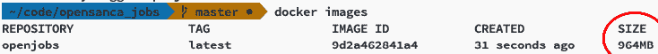
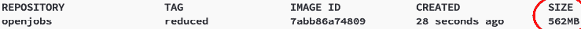
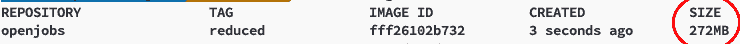
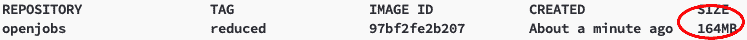

# 减少你的 Docker 图片(Ruby 的一个例子)

> 原文：<https://dev.to/caduribeiro/reduce-your-docker-images-an-example-with-ruby-30db>

[](https://res.cloudinary.com/practicaldev/image/fetch/s--vqAHuH1q--/c_limit%2Cf_auto%2Cfl_progressive%2Cq_auto%2Cw_880/https://cdn-images-1.medium.com/proxy/0%2AoZtQbUoanv_gIHLX.jpg)

在将 Docker 部署到产品中时，我们面临的一个大问题是图像大小。大型图像需要更长的下载时间，消耗大量的云网络流量配额，花费更多的钱存储在存储库中，并且不会带来任何好的价值。

在大多数情况下，当我们创建一个 Docker 映像时，我们会添加一些步骤和依赖项，这些步骤和依赖项有时并不需要出现在将在生产中运行的最终映像中。

我将用下面的应用程序作为例子:

【https://github.com/opensanca/opensanca_jobs】T2

这是生成我们的图像
的 docker 文件

```
FROM ruby:2.5.0-alpine
LABEL maintainer="[contato@opensanca.com.br](mailto:contato@opensanca.com.br)"
ARG rails\_env="development"
ARG build\_without=""
ENV SECRET\_KEY\_BASE=dumb
RUN apk update \
&& apk add \
openssl \
tar \
build-base \
tzdata \
postgresql-dev \
postgresql-client \
nodejs \
&& wget [https://yarnpkg.com/latest.tar.gz](https://yarnpkg.com/latest.tar.gz) \
&& mkdir -p /opt/yarn \
&& tar -xf latest.tar.gz -C /opt/yarn --strip 1 \
&& mkdir -p /var/app
ENV PATH="$PATH:/opt/yarn/bin" BUNDLE\_PATH="/gems" BUNDLE\_JOBS=2 RAILS\_ENV=${rails\_env} BUNDLE\_WITHOUT=${bundle\_without}
COPY . /var/app
WORKDIR /var/app
RUN bundle install && yarn && bundle exec rake assets:precompile
CMD rails s -b 0.0.0.0 
```

Enter fullscreen mode Exit fullscreen mode

以及用于构建它的命令:

```
docker build -t openjobs:latest --build-arg build\_without="development test" --build-arg rails\_env="production" . 
```

Enter fullscreen mode Exit fullscreen mode

[](https://res.cloudinary.com/practicaldev/image/fetch/s--wng8DfOF--/c_limit%2Cf_auto%2Cfl_progressive%2Cq_auto%2Cw_880/https://cdn-images-1.medium.com/proxy/1%2ARujRaeSrBXgUJHVNWjQMIg.png)

这个构建生成了一个差不多 1GB 的映像！！！😱。

这个映像有一些不必要的东西，比如 node but yarn(我们只需要它们预编译资产，而不需要它们执行应用程序本身)。

### 多阶段构建

Docker 在 17.05 版本中引入了[多阶段构建](https://docs.docker.com/develop/develop-images/multistage-build/)的概念。这种构建技术允许我们将 docker 文件分成几个语句。每个语句可以使用不同的基础图像，并且您可以将工件从一个阶段复制到另一个阶段，而不会在最终图像中引入您不想要的东西。我们的最终图像将只包含在最后阶段写的构建。

现在我们有一个分为两个阶段的 Dockerfile 文件。预构建和最终构建。

```
# pre-build stage
FROM ruby:2.5.0-alpine AS pre-builder
ARG rails\_env="development"
ARG build\_without=""
ENV SECRET\_KEY\_BASE=dumb
RUN apk add --update --no-cache \
openssl \
tar \
build-base \
tzdata \
postgresql-dev \
postgresql-client \
nodejs \
&& wget [https://yarnpkg.com/latest.tar.gz](https://yarnpkg.com/latest.tar.gz) \
&& mkdir -p /opt/yarn \
&& tar -xf latest.tar.gz -C /opt/yarn --strip 1 \
&& mkdir -p /var/app
ENV PATH="$PATH:/opt/yarn/bin" BUNDLE\_PATH="/gems" BUNDLE\_JOBS=2 RAILS\_ENV=${rails\_env} BUNDLE\_WITHOUT=${bundle\_without}
COPY . /var/app
WORKDIR /var/app
RUN bundle install && yarn && bundle exec rake assets:precompile

# final build stage
FROM ruby:2.5.0-alpine
LABEL maintainer="[contato@opensanca.com.br](mailto:contato@opensanca.com.br)"
RUN apk add --update --no-cache \
openssl \
tzdata \
postgresql-dev \
postgresql-client
COPY --from=pre-builder /gems/ /gems/
COPY --from=pre-builder /var/app /var/app
ENV RAILS\_LOG\_TO\_STDOUT true
WORKDIR /var/app
EXPOSE 3000
CMD rails s -b 0.0.0.0 
```

Enter fullscreen mode Exit fullscreen mode

在预构建阶段，我们安装 node 和 yarn、所有依赖项并预编译资产。在最后阶段，我们使用 alpine 映像(非常小)和 ruby，我们只安装运行应用程序所必需的依赖项，然后使用下面的命令复制构建阶段生成的库和资产:

```
COPY --from=pre-builder /gems/ /gems/
COPY --from=pre-builder /var/app /var/app 
```

Enter fullscreen mode Exit fullscreen mode

使用这个 docker 文件进行构建，我们现在有了一个 562MB 的映像。

[](https://res.cloudinary.com/practicaldev/image/fetch/s--yQE3sqc2--/c_limit%2Cf_auto%2Cfl_progressive%2Cq_auto%2Cw_880/https://cdn-images-1.medium.com/proxy/1%2AG7h0VTW1JD9tKZ7DHnqM9w.png)

我们已经缩小了几乎一半的图像尺寸，但是我们能进一步缩小它吗？？🤔

是的。我们可以采取一些行动来减少这种形象。

### 删除不必要的文件

我们可以从映像中删除不必要的文件，比如安装的库使用的缓存和临时文件。我们可以添加一个. dockerignore 文件，告诉构建不要向图像发送什么。

```
# build stage
FROM ruby:2.5.0-alpine AS pre-builder
ARG rails\_env="development"
ARG build\_without=""
ENV SECRET\_KEY\_BASE=dumb
RUN apk add --update --no-cache \
openssl \
tar \
build-base \
tzdata \
postgresql-dev \
postgresql-client \
nodejs \
&& wget [https://yarnpkg.com/latest.tar.gz](https://yarnpkg.com/latest.tar.gz) \
&& mkdir -p /opt/yarn \
&& tar -xf latest.tar.gz -C /opt/yarn --strip 1 \
&& mkdir -p /var/app
ENV PATH="$PATH:/opt/yarn/bin" BUNDLE\_PATH="/gems" BUNDLE\_JOBS=4 RAILS\_ENV=${rails\_env} BUNDLE\_WITHOUT=${bundle\_without}
COPY . /var/app
WORKDIR /var/app
RUN bundle install && yarn && bundle exec rake assets:precompile \
&& rm -rf /gems/cache/\*.gem \
&& find /gems/gems/ -name "\*.c" -delete \
&& find /gems/gems/ -name "\*.o" -delete

# final stage
FROM ruby:2.5.0-alpine
LABEL maintainer="[contato@opensanca.com.br](mailto:contato@opensanca.com.br)"
RUN apk add --update --no-cache \
openssl \
tzdata \
postgresql-dev \
postgresql-client
COPY --from=pre-builder /gems/ /gems/
COPY --from=pre-builder /var/app /var/app
ENV RAILS\_LOG\_TO\_STDOUT true
WORKDIR /var/app
EXPOSE 3000
CMD rails s -b 0.0.0.0 
```

Enter fullscreen mode Exit fullscreen mode

在这个新的 docker 文件中，我们添加了这个部分，删除了用于构建库的缓存和临时 C 文件:

```
&& rm -rf /gems/cache/\*.gem \
&& find /gems/gems/ -name "\*.c" -delete \
&& find /gems/gems/ -name "\*.o" -delete 
```

Enter fullscreen mode Exit fullscreen mode

我们还包括我们的。dockerignore 告诉构建过程我们不希望在映像中出现的文件:

```
.env\*
.git
.gitignore
.codeclimate.yml
.dockerignore
.gitlab-ci.yml
.hound.yml
.travis.yml
LICENSE.md
README.md
docker-compose.\*
Dockerfile
log/\*
node\_modules/\*
public/assets/\*
storage/\*
public/packs/\*
public/packs-test/\*
tmp/\* 
```

Enter fullscreen mode Exit fullscreen mode

经过这两步，现在我们的映像有 272MB。

[](https://res.cloudinary.com/practicaldev/image/fetch/s--EfdqRrYi--/c_limit%2Cf_auto%2Cfl_progressive%2Cq_auto%2Cw_880/https://cdn-images-1.medium.com/proxy/1%2AeZJTGWQQHJTdqKyvfyvFjw.png)

我们可以减少更多。对于生产，我们不需要测试文件夹、npm 原始文件夹(它们已经包含在资产管道中)，不需要预编译资产和缓存。

要删除这个文件，我们可以包含一个传递参数给 build 的策略(我们称之为:to_remove)

```
...
ARG to\_remove
...
RUN bundle install && yarn && bundle exec rake assets:precompile \
&& rm -rf /usr/local/bundle/cache/\*.gem \
 && find /usr/local/bundle/gems/ -name "\*.c" -delete \
 && find /usr/local/bundle/gems/ -name "\*.o" -delete \
 && rm -rf $to\_remove # Here we remove all files that we passed as an argument to the build.
... 
```

Enter fullscreen mode Exit fullscreen mode

在这个参数中，我们将传递所有我们在生产中不需要的文件:

```
docker build -t openjobs:reduced --build-arg build\_without="development test" --build-arg rails\_env="production" . --build-arg to\_remove="spec node\_modules app/assets vendor/assets lib/assets tmp/cache" 
```

Enter fullscreen mode Exit fullscreen mode

注意`— build-arg to_remove=”spec node_modules app/assets vendor/assets lib/assets tmp/cache”`。这些是我们希望从构建过程中删除的文件夹。我们不需要它们在生产中运行。

删除这些文件，现在我们有一个 164MB 的图像，几乎比原来的小 6 倍。

[](https://res.cloudinary.com/practicaldev/image/fetch/s--HosoG7uS--/c_limit%2Cf_auto%2Cfl_progressive%2Cq_auto%2Cw_880/https://cdn-images-1.medium.com/proxy/1%2AdOtqxq0ssllOzV6v_iVjmw.png)

[](https://res.cloudinary.com/practicaldev/image/fetch/s---S7B8xJT--/c_limit%2Cf_auto%2Cfl_progressive%2Cq_66%2Cw_880/https://cdn-images-1.medium.com/proxy/1%2ALt65Wab0jeBX6OSkgUFcAQ.gif)

如果你还不相信我，还想看看，这就是产生这种还原的 PR:[https://github.com/opensanca/opensanca_jobs/pull/164](https://github.com/opensanca/opensanca_jobs/pull/164)

[](https://res.cloudinary.com/practicaldev/image/fetch/s--ft3yupCX--/c_limit%2Cf_auto%2Cfl_progressive%2Cq_auto%2Cw_880/https://cdn-images-1.medium.com/proxy/1%2AeqsPaN0ft0DkhHczXD5vJA.png)

干杯🍻

* * *