# 登录 Salesforce 的营销云 API(使用 Python 或 Postman)

> 原文：<https://dev.to/katiekodes/logging-into-salesforces-marketing-cloud-api-w-python-52mo>

有时，仅仅从 API 获得登录确认就已经是使用它的一半了。

这里，用**截图**，是我*最后*如何登录 Salesforce Marketing Cloud 的 API。

我用的是 Python，但是大部分步骤和代码无关。

任何可以做 HTTPS 帖子请求的语言都可以。

## 背景

我的电子邮件专家同事和我将合作探索我们可以用“代码”模仿他的哪些“点击”

希望这将有助于我们在连接到二级 Salesforce“组织”*(数据库)*方面做更多的事情。

## 密码注意事项

为了让这个代码工作，你必须在你的代码中输入秘密信息**，这样就可以让**任何截取它的人**在营销云中模仿你。**

这不是一件好事。

1.  仅在您信任的计算机上运行此代码。
2.  仅通过您信任的网络连接运行此代码。
3.  如果您将这个 Python 脚本保存在一个文件中，请在文件名的开头键入“CONTAINS PASSWORD”，这样您就会记住，在关闭它之前，您必须清除这个文件中的“**客户端 Id** 、“**客户端秘密**”和“**认证基础 URI** ”。
4.  如果您使用的 IDE 将后续的“运行”按钮点击视为一个大型会话*(并缓存从“运行”到“运行”的变量值)*，利用这一点来帮助您记住从文件中清除您的“**客户端 Id** 、“**客户端秘密**和“**身份验证基础 URI** ”。运行几行代码，将其余的注释掉，以获取一个“访问令牌”，并将其保存到一个名为“`token`”的变量中然后注释掉“获取”代码，退格删除您的秘密信息，并键入单词“`SECRET_INFO_GOES_HERE`”，然后保存您的脚本。哒哒！现在，您可以不用担心是否在脚本内容中以纯文本的形式留下了秘密。
5.  如果您需要存储这个脚本并以任何自动化的方式运行它，您将不得不寻求专家的建议。在脚本本身的主体中键入秘密，然后把它留在那里，这根本不是一个选项。

## 1: Admin - >已安装软件包。

以管理员身份登录营销云的 web 控制台。

点击右上方你的名字旁边的下拉菜单。

在“设置”下，点击“**管理**”

[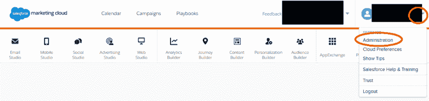](https://res.cloudinary.com/practicaldev/image/fetch/s--CxuI4WE8--/c_limit%2Cf_auto%2Cfl_progressive%2Cq_auto%2Cw_880/https://katiekodes.cimg/screenshot-marketingcloud-01-menu-admin.png)

在顶部导航中，将鼠标悬停在“**账户**上，然后点击“**已安装包**

[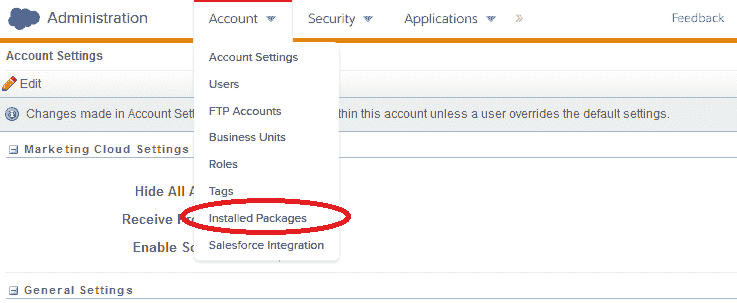](https://res.cloudinary.com/practicaldev/image/fetch/s--Up0JeGAA--/c_limit%2Cf_auto%2Cfl_progressive%2Cq_auto%2Cw_880/https://katiekodes.cimg/screenshot-marketingcloud-02-menu-installed-packages.png)

## 2:新建一个包。

点击**新建**按钮。

[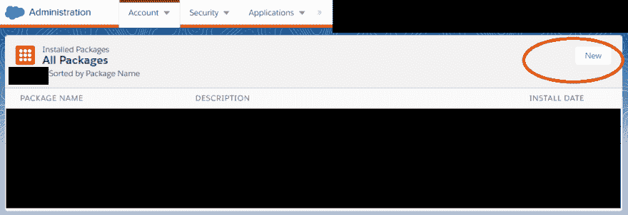](https://res.cloudinary.com/practicaldev/image/fetch/s--5A5RMqDv--/c_limit%2Cf_auto%2Cfl_progressive%2Cq_auto%2Cw_880/https://katiekodes.cimg/screenshot-marketingcloud-03-new-package.png)

给你的新包一个**名字**和**描述**。点击**保存**。

[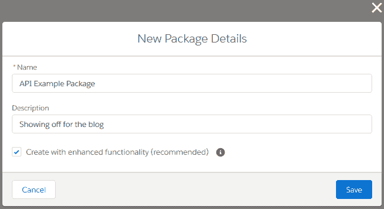](https://res.cloudinary.com/practicaldev/image/fetch/s--H8Q_gAwQ--/c_limit%2Cf_auto%2Cfl_progressive%2Cq_auto%2Cw_880/https://katiekodes.cimg/screenshot-marketingcloud-04-new-package.png)

你有一个新包裹！

在其“details”选项卡的下半部分，它将指示您的新包还没有任何组件。

在短暂的转移之后，请立即点击“**添加组件**”

[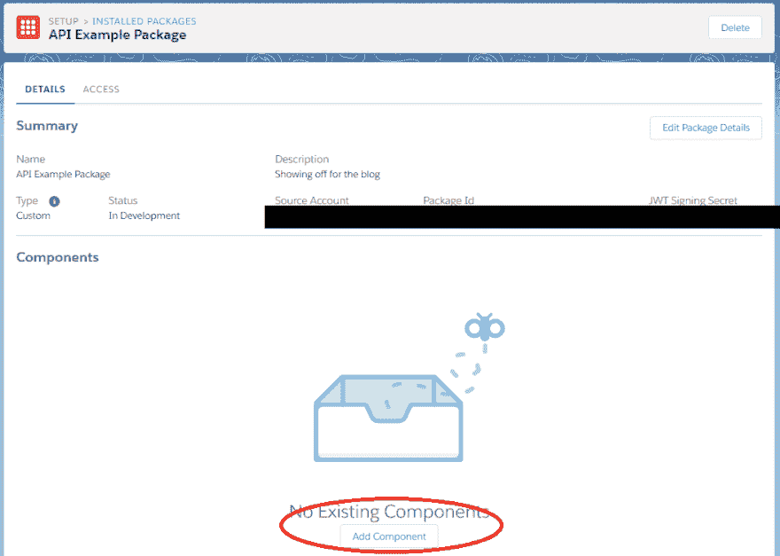](https://res.cloudinary.com/practicaldev/image/fetch/s--MWhbQKVm--/c_limit%2Cf_auto%2Cfl_progressive%2Cq_auto%2Cw_880/https://katiekodes.cimg/screenshot-marketingcloud-05-new-package.png)

### 分流:接入设置

如果您单击软件包的“**访问**”选项卡，您会注意到它仅适用于访问您登录营销云时正在查看的任何“业务部门”的数据。

我们以后有机会解决这个问题。

[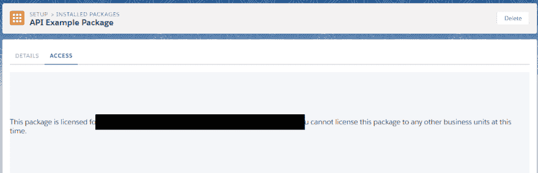](https://res.cloudinary.com/practicaldev/image/fetch/s--5DrJB1c---/c_limit%2Cf_auto%2Cfl_progressive%2Cq_auto%2Cw_880/https://katiekodes.cimg/screenshot-marketingcloud-06-package-access-warning.png)

## 3:新建一个组件。

在新包的“details”选项卡中点击“ **Add Component** ”按钮后，从选项的单选按钮菜单中选择“ **API Integration** ，然后点击“ **Next**

[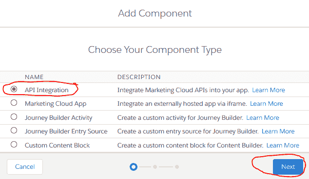](https://res.cloudinary.com/practicaldev/image/fetch/s--bOpwWH9C--/c_limit%2Cf_auto%2Cfl_progressive%2Cq_auto%2Cw_880/https://katiekodes.cimg/screenshot-marketingcloud-07-new-component.png)

从选项的单选按钮菜单中选择“**服务器到服务器**，然后点击“**下一步**

[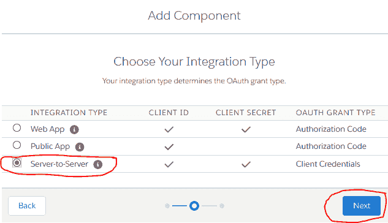](https://res.cloudinary.com/practicaldev/image/fetch/s--_83VQNGu--/c_limit%2Cf_auto%2Cfl_progressive%2Cq_auto%2Cw_880/https://katiekodes.cimg/screenshot-marketingcloud-08-new-component.png)

单击您希望能够读取代码的任何内容上的“**读取**”复选框，然后单击“**保存**”

我在所有的框里都选了“阅读”。

重要提示:请不要点击除了“**阅读**以外的任何东西。

你**真的不想成为删除营销云中所有数据**的人，因为你给了自己“**写**一个你甚至还没试过的 API 的权限，是吗？

[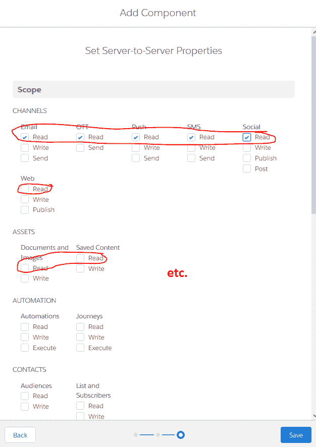](https://res.cloudinary.com/practicaldev/image/fetch/s--5VXfVzzL--/c_limit%2Cf_auto%2Cfl_progressive%2Cq_auto%2Cw_880/https://katiekodes.cimg/screenshot-marketingcloud-09-new-component.png)

### 分流:接入设置

现在，如果您点击软件包的“**访问**”选项卡，您将看到左侧导航列出了您的所有“业务部门”

单击其中一个，您可以打开或关闭 API 对该 BU 数据的访问。

[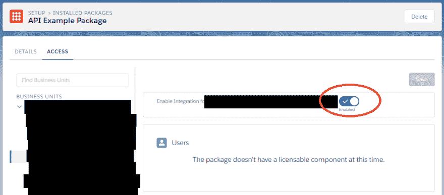](https://res.cloudinary.com/practicaldev/image/fetch/s--SvyKKhDK--/c_limit%2Cf_auto%2Cfl_progressive%2Cq_auto%2Cw_880/https://katiekodes.cimg/screenshot-marketingcloud-11-access-after.png)

## 【4:秘密】>【python】>就这样！

在你的包的“ **Details** ”标签中，在“Components”下面，“API Integration”下面，你会找到各种各样的秘密信息。

3 条关键信息是您的“**客户 Id** 、“**客户秘密**、“**认证基础 URI** ”

[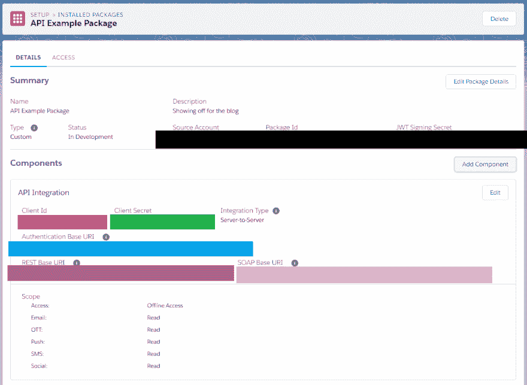](https://res.cloudinary.com/practicaldev/image/fetch/s--PhXAoQUE--/c_limit%2Cf_auto%2Cfl_progressive%2Cq_auto%2Cw_880/https://katiekodes.cimg/screenshot-marketingcloud-10-secrets.png)

打开一个 IDE，您可以在其中执行 Python 并运行以下脚本，对“`YOUR_CLIENT_ID`”、“`YOUR_CLIENT_SECRET`”和“`https://YOUR-AUTHENTICATION-URI.com`”、*(在 URL 的“`/v2/token`”部分之前)* :

```
import json, requests

client_Id = 'YOUR_CLIENT_ID'
client_Secret = 'YOUR_CLIENT_SECRET'

payload = {
    'client_id': client_Id,
    'client_secret': client_Secret,
    'grant_type': 'client_credentials'
}

url = 'https://YOUR-AUTHENTICATION-URI.com/v2/token';

r = requests.post(url,
    data=payload)

body = json.loads(r.content)
token = body['access_token']
expiresIn = body['expires_in']
print(token) 
```

如果一切顺利，`print(token)`应该会显示您刚刚生成的令牌。

如果事情进展不顺利，尝试在脚本中添加`print(r)`和`print(body)`并重新运行。您将获得关于 Python 刚刚代表您发出的 HTTPS 邮报请求的更详细的状态和错误响应。

在接下来的 20 分钟里，您将通过将这个“**令牌**值传递给营销云给您的另外两个 URL*(REST 或 SOAP)* 中的一个来证明您的身份。

这些 URL 实际上是用来从营销云获取数据的。

[这是《HTTPS 邮报》在 Salesforce 营销云](https://developer.salesforce.com/docs/atlas.en-us.mc-app-development.meta/mc-app-development/access-token-s2s.htm)上进行认证时需要制作的官方文档。

(注意:按照官方的说明，实际上包含一个“应用程序/json”的“内容类型”似乎有些棘手。对我没用。如果你遇到问题，试着把它从你的头脑中去掉。)

[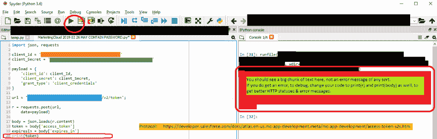](https://res.cloudinary.com/practicaldev/image/fetch/s--ut5hYEHv--/c_limit%2Cf_auto%2Cfl_progressive%2Cq_auto%2Cw_880/https://katiekodes.cimg/screenshot-marketingcloud-12-python-login.png)

快乐实验！

* * *

## 更新

### 管理员型事项

感谢评论员[约瑟夫·沃恩](https://disqus.com/by/disqus_CUnjGWCoLA/)指出:

> 有一件事让我困惑了一段时间。虽然我在营销云上有**管理员**权限，但这并没有附带一个叫做**营销云管理员**的东西，它给你所需的权限:**安装包|管理**。奇怪的是，即使您没有这个权限，这个界面也允许您安装这个包，但是您会得到一个错误，要求检查客户端 id、客户端密码是否准确，以及这个包“已经安装并启用”

本地营销云专家 [Kyle Griffin](https://www.linkedin.com/in/kyleggriffin) 澄清:

> *   The role of "administrator" is just the administrator of a "mailbox studio" *(the first product of Marketing Cloud)* .
> *   The "Marketing Cloud Administrator" role lets you manage the rest of the suite.

### UI 发生变化

自从我写这篇文章以来，MarketingCloud 改变了一切。要完成上面“1:管理->已安装的软件包”中的步骤:

1.  你点击你名字下面的**设置**而不是**管理**。
2.  现在导航在左边，而不是点击顶部导航的“帐户”来寻找“已安装的软件包”。在平台工具->应用程序下找到“已安装的软件包”。

### 一个有邮递员的肥皂你好世界

我给出了一个用 Python 进行连接的例子，但是如果您是连接 API 的新手，请先尝试用 Postman。

[Postman](https://www.getpostman.com/downloads/) 是一个图形用户界面工具，当针对 API 发出 HTTP 请求时，它可以很容易地确定“在哪里放什么”。当我在试验时，我发现这比用文本编程语言做任何事情都要容易得多。

在你的电脑上安装并打开 Postman。点击左上角的**导入**。然后点击第三个标签页**从链接**导入，粘贴[https://katiekodes . com/files/marketingcloudpostmancollectionforblog . JSON](https://katiekodes.com/files/MarketingCloudPostmanCollectionForBlog.json)，点击**导入**按钮。

在邮差*(没看到就全屏曝光)*的左边，你会在“收藏”标签中看到一个文件夹，名为“**凯蒂·柯德斯营销云**”

1.  **1 项。LOGIN - API v2** 是我上面提供的 Python 脚本的 Postman 等价物。
    *   双击它，在右边的新标签中打开它。
    *   在`POST`和**发送**按钮之间的 URL 中，将`https://YOUR_SUBDOMAIN.auth.marketingcloudapis.com/v2/token`更改为我之前解释过的同一个`https://YOUR-AUTHENTICATION-URI.com/v2/token`。*(这是相同的想法，我只是增加了一些 custom-to-your-org 的 URL，您会在之前看到。在我的邮递员例子中。)*
    *   在请求编辑器的“Body”选项卡中，用您的实际客户端 ID 替换`YOUR_CLIENT_ID`,用您的实际客户端密码替换`YOUR_CLIENT_SECRET`。
    *   点击**发送**，看看你在**响应**下面得到什么。
    *   对你的结果不满意？点击右上角的**示例(1)** 并点击 **1。登录- API v2 -选项列表中的示例响应**。
    *   看一看屏幕底部的示例响应。这就是我的样子，只有真实值在`YOUR_AUTH_KEY`、`https://YOUR_SUBDOMAIN.soap.marketingcloudapis.com/`和`https://YOUR_SUBDOMAIN.rest.marketingcloudapis.com/`处。
    *   在 HTTP 请求编辑器窗口的左侧，单击指向左侧的箭头“1。登录- API v2。
2.  **第二项。第一个 SOAP 调用——使用 V2 认证密钥查询所有数据扩展**”是让您在将一个值复制到剪贴板后进行尝试，这里的`YOUR_AUTH_KEY`应该出现在登录响应中。
    *   双击它，在右边的新标签中打开它。
    *   在`POST`和**发送**按钮之间的 URL 中，更改`https://YOUR_SUBDOMAIN.soap.marketingcloudapis.com/v2/token`中的`YOUR_SUBDOMAIN`，以匹配在响应登录到“`soap_instance_url`下的 MarketingCloud 时返回的值
    *   在请求编辑器的“Body”选项卡中，对其中包含的 XML 的`<a:To s:mustUnderstand="1">`和`</a:To>`标记进行同样的操作。
    *   同样在请求编辑器的“Body”选项卡中，替换
    *   `<RetrieveRequest>`的内容...`</RetrieveRequest>`是你告诉 MarketingCloud 你想要什么样的数据的地方。在这里，我选择下载我所有的**数据扩展**，并在下载中获得每个扩展的以下信息:`ObjectID`、`CustomerKey`、`Name`、`IsSendable`和`SendableSubscriberField.Name`。希望您也有数据扩展，否则这个“Hello World”的结果可能会有点乏味！
    *   点击**发送**，看看你在**响应**下面得到什么。
    *   对你的结果不满意？点击右上角的**示例(1)** ，点击 **2。第一次 SOAP 调用-使用 V2 身份验证密钥查询所有数据扩展-来自选项列表的示例响应**。
    *   看一看屏幕底部的示例响应。这就是我的样子，只是我有几十个真正的数据扩展，而不是 3 个假的。
    *   在 HTTP 请求编辑器窗口的左侧，单击指向左侧的箭头“2。第一次 SOAP 调用-使用 V2 身份验证密钥查询所有数据扩展。

一旦你开始运行并准备好更多，请查看安东尼·多森和他的团队的伟大的 Github 知识库"[SFMC-波兹曼](https://github.com/salesforce-marketingcloud/postman)"

那个库有一个 Postman“集合”，和我的一样，你可以把它导入到 Postman 中，一旦你有了第一个“获取你所有的数据扩展”，你就可以尝试很多例子。

将各种请求示例的主体分开，看看它们是如何表达相同的，以及它们是如何变化的。

请注意，许多这类请求的 XML 格式的正文被称为“SOAP 消息”或“SOAP 信封”在很大程度上，每个对 MarketingCloud 的“SOAP”API 的 HTTP 请求看起来都是一样的...只是这一小块文字会发生变化。但是你必须让它们**恰到好处，否则事情就会失败。老实说，我还没有从 GitHub 回购工作中得到超过 6 个例子*(尽管我没有必要)*。**

 **祝你好运，分享你的成果！**