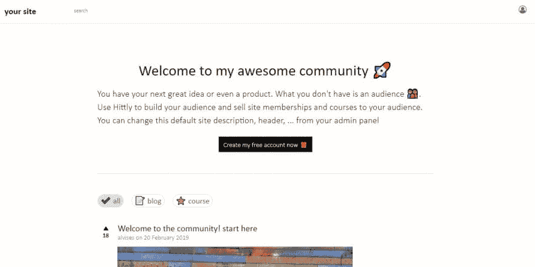

# 我如何构建一个简单的社区软件，如 dev.to

> 原文：<https://dev.to/npack/how-i-built-a-simple-community-software-like-devto-1ipk>

去年四月的某个时候，我想要一个社区软件，人们可以在那里分享他们的知识。大多数社区软件解决方案都是为提问而构建的，缺乏写出漂亮文章的功能。所以，我决定写我自己的，这被证明是一个昂贵的决定，因为它消耗了我的大部分时间。经过 8 个月的断断续续的努力，我有了一个漂亮的社区，我用它来运行我的两个网站。我还增加了一些通过销售网站会员和课程来赚钱的方法

一个月前，我有一个想法，为什么不把它转换成一个 SAAS 应用程序。经过三周的努力，这个社区变成了一个多租户应用。

我很乐意为你检查一次，并感谢任何改进的建议

[在线社区软件-首页](https://hittly.com)